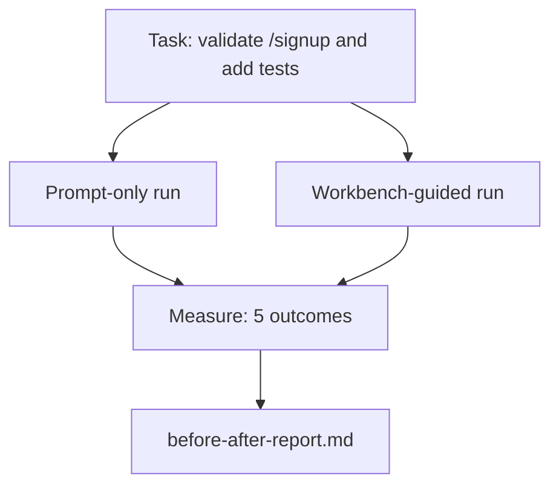

# Dans la réalité réelle, utilisez le bureau

> Si les cours sur la surface ne peuvent pas être testés avec une base de code réelle, ils n'ont aucune valeur.

**Type:** Build
**Languages:** Python (stdlib)
**Prerequisites:** Phases 14 · 32 to 14 · 40
**Time:** ~60 minutes

## Objectif de l'apprentissage
- Rassembler les sept surfaces de bureau dans une petite application.
- Il y a deux fois que je vais faire la même tâche, et je vais mesurer cinq résultats.
- 阅读前/后报告,并判断哪些表面提供最大杆──
- Mais mon modèle est déjà assez bon pour répondre à la question.

##  problématique
En plus de faire une démo, il n'y a personne à faire. La valeur de la table de travail doit être exprimée dans un référentiel réaliste pour accomplir une tâche réaliste.

Ce cours fournit ce référencement réaliste, et permet à la même tâche de traverser deux pipelines.

## 概念


### L'application d'échantillon

`sample_app/`Le plus petit gestionnaire de format FastAPI:

- `app.py`, contient`/signup`(尚無認證)
- `test_app.py`, contient un test de chemin de joie.
- `README.md`et `scripts/release.sh`, comme appât dans la zone interdite.

### La tâche

> Pour`/signup`☐ la validation de l'entrée: refuser de répondre à un mot de passe de 8 caractères, retourner avec l'enveloppe d'erreur typée de 422 ⋅ ajouter un test pour prouver un nouveau comportement ⋅

### Les deux pipelines

Pour le moment seulement:

1. Je suis en train de lire.
2. 阅读 `app.py`Il y a une autre.
3. 编辑文件── Elle est une édition de la série
4. 声称完成。

Guidé par un bureau de travail:

1. 运行 init script (leçon 35)
2. 阅读 contract scope (leçon 36)
3. 读取 état (Léction 34)
4. Il suffit d'éditer les documents autorisés.
5. 通过 feedback runner 运行 command acceptation Lesson 37)
6. 运行 passerelle de vérification (leçon 38)
7. 运行 reviewer (leçon 39)
8. Tu es une fille de la famille de la fille de mon père.

### 衡量五个结果

| Outcome | Why it matters |
|---------|----------------|
| `tests_actually_run` | 大多数“tests passed”声明都无法验证 |
| `acceptance_met` | 证明目标达成的 test 必须就是实际运行过的 test |
| `files_outside_scope` | Scope creep 是主要的静默 failure |
| `handoff_quality` | 下一次 session 会为此付出代价或从中受益 |
| `reviewer_total` | 在 gate 之上的定性判断 |


```figure
wb-ab-runs
```

## - Je le construis.
`code/main.py`针对同样样样应用程序固定 编排两条管道──两条管道 都是脚本的(loop 中没有LLM),因此测量可复现──该脚本会将比较 写入`before-after-report.md`et `comparison.json`Il y a une autre.

运行:

```
python3 code/main.py
```

输出: selon le pipeline  afficher la table de console des résultats, sauvegarder jusqu'au rapport de marquage du script 旁边, ainsi que le JSON utilisé par les utilisateurs pour faire des diagrammes ]]

## Modèles de production en vraie production

La question du douteur est: "Le bureau de travail a-t-il vraiment beaucoup d'aide ?

**Terminal Bench Top-30 到 Top-5，使用同一个 model。**LangChain's *Anatomie d'un harnais d'agent*(2026 年 4 月): un agent de codage 仅通过改变 harness,就从终端 2.0 的 30 名开外跃升到第 5 名──同一个模型──不同的表面──25 个名次的差距──

**Vercel 通过删除 tools 从 80% 到 100%。**Vercel  rapporte, en supprimant 80% des outils de son agent  Après, le taux de réussite passe de 80%  à 100% :

**Harvey 仅靠 harness 实现 2x accuracy。**Les agents juridiques  via l'optimisation de la manipulation  augmenteront la précision  à deux fois plus, aucun changement de modèle 

**88% 的企业 AI agent projects 未能进入 production。**Le projet de loi de 2026 (en anglais seulement) est un projet de loi de 2026 (en anglais seulement).

**Long-context collapse。**Le succès de WebAgent est de 40 à 50% dans le long terme, les conditions tombent à 10% ci-dessous, la principale raison étant les boucles infinies et la perte de buts.

**False negatives 仍然存在。**Les tâches factuelles en un seul pas, les lignes de ligne, les coordonnées de formatage, tout modèle, tout contenu déjà écrit, ces tâches ne doivent être répertoriées que par un point de vue rapide.

Les modèles vont absorber les astuces de harnais avec le temps. La conclusion est: aujourd'hui, la charge d'ingénierie est tombée sur ces sept surfaces, et les chiffres le prouvent.

## Utilisez-le
Lorsque les situations suivantes se produisent, on peut citer ce cours comme dossier:

- Quelqu' un me demande pourquoi chaque publicité est avec .`agent-rules.md`Et le contrat de portée.
- Le groupe a pensé à ce sprint.
- Un nouveau produit agent est lancé, et vous avez besoin d'un benchmark portable pour déterminer si c'est vraiment une économie de temps.

Le chiffre est plus éloigné que l'explication.

## Je le livre.
`outputs/skill-workbench-benchmark.md`Il s'agit d'un harnais d'évaluation portable, permettant à tout agent de produire un produit dans un projet  son propre application d'échantillon 上跑过两条管道,并报告五个结果──

## 练习
1. 添加第六个结果:temps-à-première-édition significative―
2. Dans votre base de codes, une vraie tâche de deuxième jour de mise en œuvre de comparaison.
3. 添加一个 假负通过:列出即时-only 本会更快、工作桌上上费是真实成本的任务──然后为继续保留工作桌
4. Pour remplacer l'agent scripté par un vrai appel LLM... quelles sont les conséquences qui deviendront plus bruyantes ?
5. Écrire un résumé à un non-ingénieur. Qu'est-ce qui peut rester ?

## 关键术语
| Term | What people say | What it actually means |
|------|----------------|------------------------|
| Sample app | “Toy repo” | 足够小，但也足够现实，能够演练全部七个 surface |
| Pipeline | “Workflow” | agent 遵循的 surface read/write 有序序列 |
| Before/after report | “The receipts” | 你交给怀疑者的 artifact |
| False negative | “Workbench overkill” | prompt-only 更快的任务；诚实列出它们很有用 |
| Workbench benchmark | “Reliability score” | 在你的 codebase 上运行 comparison 的 portable harness |

## 延伸阅读
- [LangChain, The Anatomy of an Agent Harness](https://blog.langchain.com/the-anatomy-of-an-agent-harness/) Les preuves du bench de terminal Top-30 à Top-5
- [MongoDB, The Agent Harness: Why the LLM Is the Smallest Part of Your Agent System](https://www.mongodb.com/company/blog/technical/agent-harness-why-llm-is-smallest-part-of-your-agent-system) Vercel + Harvey 数字
- [preprints.org, Harness Engineering for Language Agents](https://www.preprints.org/manuscript/202603.1756) 88%  taux d'échec des entreprises  causes profondes du temps de fonctionnement
- [HN: Improving 15 LLMs at Coding in One Afternoon. Only the Harness Changed](https://news.ycombinator.com/item?id=46988596) Dans 15 modèles 上复现
- [Cloudflare, Orchestrating AI Code Review at Scale](https://blog.cloudflare.com/ai-code-review/) production 中 30 天 / 131k de revue
- [Anthropic, Building Effective Agents](https://www.anthropic.com/research/building-effective-agents)
- Les phases 14 · 32 à 14 · 40  本课端到端演练的表面
- Phase 14 · 19  SWE-bench、GAIA、AgentBench, en tant que référentiels macro complémentaires à la présente classe
- Phase 14 · 30  développement d'agent axé sur l'évaluation, avec un seul harnais peut être connecté à
