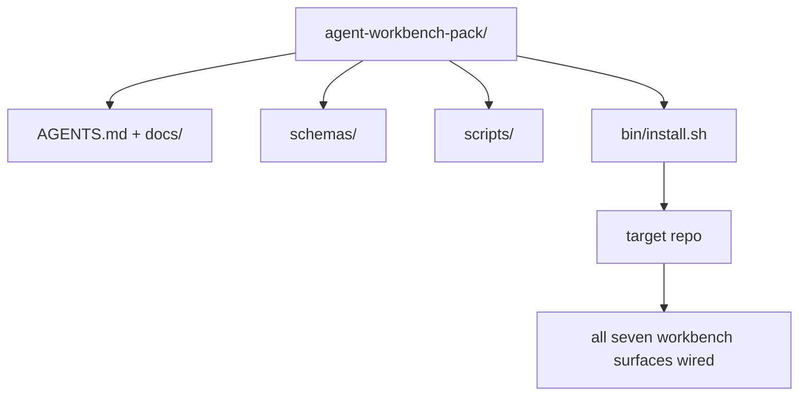

# Capstone: livrer un pack de travail d' agent réutilisable

> Cette mini-track est une que vous pouvez mettre dans n'importe quel paquet de repos.`cp -r`Le lendemain matin, on fait travailler l'agent. C'est le véritable objet de la formation.

**类型：**Construire
**语言：**Python (stdlib)
**前置要求：**Les phases 14 · 31 à 14 · 41
**时间：**- 75 minutes

## Objectif de l'apprentissage

- Envelopper sept surfaces de bureau en un catalogue directement intégrable.
- Fixed schema、script 和 template, faire un nouveau repo  obtenir une base de référence disponible déjà
- Ajouter un script d'installation, en utilisant la même façon de placer ce pack.
- Décider du contenu qui reste dans l'emballage, du contenu qui reste à l'extérieur, et pour chacun prendre en compte le débat.

##  problématique

Un Workbench qui existe dans Google Doc, Chat History et trois scripts qui ne sont que mal mémorisés, un Workbench qui sera reconstruit chaque trimestre. La solution est un pack avec une version: un référentiel ou un catalogue, qui contient une surface, un schéma, un script, ainsi qu'un installeur opérationnel.

À la fin de la classe, vous serez livré sur le disque.`outputs/agent-workbench-pack/`, et un qui peut le mettre dans n'importe quel repo.`bin/install.sh`Il y a une autre.

## 概念



### L' aménagement du paquet

```
outputs/agent-workbench-pack/
├── AGENTS.md
├── docs/
│   ├── agent-rules.md
│   ├── reliability-policy.md
│   ├── handoff-protocol.md
│   └── reviewer-rubric.md
├── schemas/
│   ├── agent_state.schema.json
│   ├── task_board.schema.json
│   └── scope_contract.schema.json
├── scripts/
│   ├── init_agent.py
│   ├── run_with_feedback.py
│   ├── verify_agent.py
│   └── generate_handoff.py
├── bin/
│   └── install.sh
└── README.md
```

### Qu'est-ce qui est laissé, qu'est-ce qui est mis dehors ?

Je suis là.

- Le schéma de surface... ils sont des contrats...
- Les quatre scénarios ci-dessus.
- Les quatre documents sont la règle et la rubrique.

 mettre à l'extérieur:

- 项目特定任务──任务 appartient au conseil d'administration de l'objectif répo, ne fait pas partie du paquet──
- 供应商 SDK 调用──这个包与框架 无关──
- Onboarding 文案── ce paquet  mettre le team déjà onboarding 旁边, plutôt que de le mettre dedans──

### Installateur

Une courte histoire.`bin/install.sh`(ou `bin/install.py`):

1. Il n' y a pas de`--force`时, refuser de couvrir l'installation jusqu'à ce qu'il y ait un emballage.
2. Il va emballer et répéter dans l'objectif.
3. Si il y en a`.github/workflows/`, alors entre dans le CI.
4. 打印后续步骤: remplir le tableau de bord 设置接受命令 运行 init script

### 版本管理

Cette meute , elle est avec toi .`VERSION`文件──需要迁移的 schema bump 和脚本 变更会跳大──仅 doc 的变更会跳补──目标 repo 的 `agent_state.json`记录它初始化时对应的包版──


```figure
wb-pack-install
```

## - Je le construis.

`code/main.py`Je vais mettre la valise à côté de la classe.`outputs/agent-workbench-pack/`En milieu, utilisez ce mini-track comme un schéma et un script du cours précédent, ainsi que le document que vous avez déjà écrit.

Je vais le faire.

```
python3 code/main.py
```

Ce script va copier et fixer la surface, écrire dans README, imprimer l'arbre de pack, puis à zéro 退出──重复运行是等的──

## Mode de production réelle

Un paquet ne vaut que lorsqu'il est capable de supporter une fourchette, une mise à jour et un manque d'amitié en amont.

**`VERSION` 是 contract，不是 marketing。**Les boulots majeurs nécessitent une migration d'état. Les boulots mineurs nécessitent une refonte du contrôleur. Les boulots de patch sont utilisés uniquement pour le document.`.workbench-version`写入目标 repo; si le but de verrouillage et de pack `VERSION`non conciliant,`lint_pack.py`Il refuse de me livrer.`npm`- Je suis là.`Cargo`et `pyproject.toml`能经受 10 years churn's method;agent ne changera pas ces règles.

**跨工具分发的单一来源。**Nx  fournir un `nx ai-setup`, à partir d' un seul configuration  placer `AGENTS.md`- Je suis là.`CLAUDE.md`- Je suis là.`.cursor/rules/`- Je suis là.`.github/copilot-instructions.md`Et un serveur MCP. Ce pack devrait aussi le faire.`ln -s AGENTS.md CLAUDE.md`), faire un simple fait de source de diffusion à chaque agent de codage. Pour soutenir un outil ou une fourchette, ce pack est un mode d'échec.

**`uninstall.sh` 会在存在非平凡 state 时拒绝执行。** Décharger ce paquet Impossible de supprimer l' utilisateur `agent_state.json`- Je suis là.`task_board.json`Ou `outputs/`❖ L'installateur va supprimer le schéma, le script, le document et`AGENTS.md`(带 `--keep-agents-md`opt-out), et si le fichier d'état a des modifications non soumises, on refuse de continuer.

**Skill-as-publishable。SkillKit-style 分发。**Ce pack                                                                                                                                                                                                                                                                                                                                                                                                                                                                                                                            `skillkit install agent-workbench-pack`La répartition de l'emballage est la source de la réalité. Le verrouillage du vendeur disparaît.

## Utilisez-le

Les colis seront livrés dans trois endroits:

- **作为一个你放进 repo 的目录。** `cp -r outputs/agent-workbench-pack /path/to/repo`Il y a une autre.
- **作为一个公开 template repo。**Forge et personnalisation,并用 `VERSION`- Je ne peux pas.
- **作为一个 SkillKit skill。**Envoyez votre agent, faites-lui un ordre.

L'emballage est une recette.

## Je le livre.

`outputs/skill-workbench-pack.md`La mise en place d'un ensemble de règles de référencement de projets sera plus claire, la portée globale sera plus étroite, la dimension rubrique sera plus large dans un domaine spécifique.

## 练习

1. Décider quel document de choix le 5ème mérite d'être promulgué dans le cadre canonique.
2. Utilisez Python pour réécrire l'installateur,并添加 `--dry-run`La marque de la marque est un modèle de marque de marque.
3. - Je suis là.`bin/uninstall.sh`Il a été refusé de le faire.
4. - Je suis là.`lint_pack.py`, enveloppé   `VERSION`时失败──把它连接到包──自备备的CI──
5. Écrire un manuel de travail à partir de la table de travail  Mettre en place ce pack  Quels sont les processus d'opération qui peuvent minimiser les temps d'arrêt ?

## 关键术语

| 术语 | 人们常说 | 它实际含义 |
|------|----------------|------------------------|
| Workbench pack | “starter kit” | 一个带版本的目录，携带全部七个 surface |
| Installer | “Setup script” | 以幂等方式放置 pack 的 `bin/install.sh` |
| Pack version | “VERSION” | schema/script 变更使用 major bump，仅 doc 变更使用 patch |
| Drop-in pack | “cp -r and go” | Pack 在第一天无需按 repo 定制即可工作 |
| Forkable template | “GitHub template” | GitHub 的 “Use this template” 可以从中 clone 的公开 repo |

## 延伸阅读

- Les phases 14 · 31 à 14 · 41  Cette boîte 打包 de chaque surface
- [SkillKit](https://github.com/rohitg00/skillkit) Dans 32 agents d' IA installent cette compétence
- [Nx Blog, Teach Your AI Agent How to Work in a Monorepo](https://nx.dev/blog/nx-ai-agent-skills) 跨六种工具的单一来源发电机
- [agents.md — the open spec](https://agents.md/) Le routeur de votre paquet  doit mettre en œuvre le contenu
- [HKUDS/OpenHarness](https://github.com/HKUDS/OpenHarness) réalisation de référence équivalent de pack
- [andrewgarst/agentic_harness](https://github.com/andrewgarst/agentic_harness) 带 eval suite de Redes-supporté  référence réalisation
- [Augment Code, A good AGENTS.md is a model upgrade](https://www.augmentcode.com/blog/how-to-write-good-agents-dot-md-files) emballage de documents
- [Anthropic, Effective harnesses for long-running agents](https://www.anthropic.com/engineering/effective-harnesses-for-long-running-agents)
- [Anthropic, Harness design for long-running application development](https://www.anthropic.com/engineering/harness-design-long-running-apps)
- Phase 14 · 30  消费这个包的验证门的评估驱动代理开发
- Phase 14 · 41  Ce paquet doit être amélioré avant/après référence
