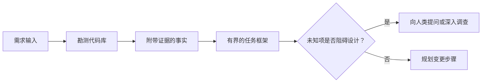

# Dans l' agent 写代码前框定任务

> 编码智能体(Coding Agent) peut très rapidement réaliser une tâche claire― il peut également très rapidement réaliser une tâche floue― les deux sont à la même vitesse, mais le prix est très différent―

**Type:** Learn + Build
**Languages:** Python (stdlib)
**Prerequisites:** Phase 14 第 31 课与第 36 课
**Time:** ~60 分钟

## Objectif de l'apprentissage

- Avant de modifier le code, le besoin initial sera transformé en un cadre de tâches avec une limite claire.
- Les questions de la base de code sont clairement définies.
- Il est également possible de modifier les voies de contact et de recevoir des preuves de conformité.
- 判断何时代码勘测(Récognition) est déjà suffisamment, il est possible de mener officiellement le travail。

## 代价高昂的失败

 augmenter la répétion de la protection des boîtes de réception  semble très clair, mais en réalité ce n'est pas le cas . Cette expérience unique devrait-elle être placée à l'API layer  service layer du domaine ou la base de données layer?

Un corps intelligent très puissant peut utiliser des choix raisonnables pour combler ces vides. C'est la situation la plus dangereuse: son code peut être entièrement optimisé, mais il ne s'adapte pas à l'ensemble du système.

Ainsi, la première unité du code intelligent n'est pas nécessairement la modification directe du code, mais la création d'un cadre de tâches qui est soutenu par la véritable preuve de la bibliothèque de code.

## 任务框架(Quadro de tâches)

Un cadre de tâches pratiques comprend six éléments fondamentaux:

| 字段 | 核心问题 |
|---|---|
| 目标（Goal） | 必须改变哪些可观测的行为？ |
| 代码库事实（Repository facts） | 你在代码、测试、配置或历史提交中验证了什么？ |
| 允许修改路径（Allowed paths） | 变更允许落在哪些位置？ |
| 禁止触碰路径（Forbidden paths） | 哪些文件与目录必须保持原样？ |
| 验收证据（Acceptance evidence） | 哪些具体命令或观测现象能证明目标已达成？ |
| 未知项（Unknowns） | 哪些决策仍需补充证据或依赖人类判断？ |

Les faits doivent être accompagnés de certificats de validité. Les reçus sont disponibles. Les résultats de l'exécution des commandes sont plus stables.



## 勘测旨在寻找约束

Ne pas essayer de lire l'ensemble du code. Vous devriez rechercher des surfaces qui peuvent résoudre les différents confins de ce changement.

1. Les comportements actuels et leur utilisation.
2. Les plus récents cas de test existants:
3. ¦ ¦ ¦ ¦ ¦ ¦ ¦ ¦ ¦ ¦ ¦ ¦ ¦ ¦ ¦ ¦ ¦ ¦ ¦ ¦ ¦ ¦ ¦ ¦ ¦ ¦ ¦ ¦ ¦ ¦ ¦ ¦ ¦ ¦ ¦ ¦ ¦ ¦ ¦ ¦ ¦ ¦ ¦ ¦ ¦ ¦ ¦ ¦ ¦ ¦ ¦ ¦ ¦ ¦ ¦ ¦ ¦ ¦ ¦ ¦ ¦ ¦ ¦ ¦ ¦ ¦ ¦ ¦ ¦ ¦ ¦ ¦ ¦ ¦ ¦ ¦ ¦ ¦ ¦ ¦ ¦ ¦ ¦ ¦ ¦ ¦ ¦ ¦ ¦ ¦ ¦ ¦ ¦ ¦ ¦ ¦ ¦ ¦ ¦ ¦ ¦ ¦ ¦ ¦ ¦ ¦ ¦ ¦ ¦ ¦ ¦ ¦ ¦ ¦ ¦ ¦ ¦ ¦ ¦ ¦ ¦ ¦ ¦ ¦ ¦ ¦ ¦ ¦ ¦ ¦ ¦ ¦ ¦ ¦ ¦ ¦   ¦                                                                                                                                                                                                                                          
4. Règlement et instructions du projet de la direction de ce cheminement
5. 构建与验证命令──
6. Les changements similaires réalisés précédemment, à partir du modèle de code local de la mise au point de la technique.

Lorsque chaque décision du plan a déjà une preuve objective, une décision d'agent ou une décision autorisée ou classée comme un projet inconnu, le dépistage est interrompu.

## Une erreur de travail

Les hypothèses inconnues sont des informations contrôlées; les hypothèses non vérifiées sont des hypothèses contrôlées sur ces informations.

Pour chaque élément inconnu:

- **可探查的（Discoverable）：**Le code-bibliothèque lui-même ou le système en cours de fonctionnement peut donner une réponse.
- **可自决的（Decidable）：**Le mandat de la société a été accordé à l'intelligent le droit de choisir lui-même.
- **需人类判断的（Human）：**Le choix modifiera le comportement du produit, le coût, le risque du système ou la compatibilité externe.
- **延后处理的（Deferred）：**Le choix dépasse la portée de la pièce précédente, appartient à des non-objectifs (non-objectifs)

Les êtres intelligents doivent traiter de manière autonome les choses inconnues explorables et autorisées à décider; mais lorsqu'ils rencontrent des choses inconnues qui nécessitent un jugement humain, ils doivent interrompre et confirmer activement la décision avant qu'elle ne soit fixée au code.

## 实现之前先定验收 critères

Avant de rédiger un supplément, il faut d'abord rédiger une attestation de réalisation.

- Un ordre de test individuel ou d'essai intégré ciblé;
- Un processus d'exploitation du navigateur de bout en bout de l'interface visuelle spécifiée et de l'état prévu;
- Une demande en ligne et un accord de réponse entièrement conforme;
- une mesure de performance atteignant une valeur spécifique;
- Une vérification de la portée des modifications de documents confirmés sans lien avec le document.

 Test passée  n'est pas un programme de preuve valide  doit préciser clairement l'utilisation de test ayant le droit de décision et la preuve de ses principales préoccupations

## - Je le construis.

L'expérience de ce cours créera une.`TaskFrame`Les données de référence sont fournies par les autorités compétentes.`outputs/task-frame.md`Il y a une autre.

Dans le cadre de la formation, les cours suivants sont suivants:

```bash
python3 code/main.py
python3 -m unittest discover code/tests -v
```

尝试通过四种方式故意破坏示例: 删除目标、删除事实凭证、制造允许路径与禁止路径的重叠,以及 删除验收命令──校验器应针对不同原因分别拒绝这些任务框架──

## Dans la vraie code

Dans le cadre de la mise en œuvre de la loi sur les droits de l'homme,

1. L'objectif est d'exprimer un comportement spécifique, et non une modification de document.
2. 记录两到三条带有确凭证的代码库事实──
3. 指定最小的允许修改路径集合──
4. 明确写出禁止触碰的负空间 (négatif)
5. 编写能够宣告任务闭环的验证命令或观测手段──
6. 列出你目前未查清且没有决定权的决策项──

Le cadre de tâches doit être présenté en intégralité à l'intérieur d'une écran. Si la tâche dépasse une écran, il est probable qu'elle contient plusieurs modifications qui peuvent être vérifiées indépendamment, elle doit être décomposée.

## 练习

1. Pour vous, le vrai bug dans une base de code est un cadre de tâches, et le processus ne propose aucune solution spécifique.
2. 找出任务框架中的一条实际上只是主观假设的主张, remplacé par des preuves objectives.
3. L'augmentation d'un accord public extérieur qui modifiera les décisions humaines doit donc être déterminée par des éléments inconnus.
4. La répartition d'un ensemble de routes de sécurité minimale permet de modifier un chemin de plus grande étendue.
5. Dans le cadre de la réception, ajouter un titre de réception pour la révision des limites de la protection des données (Réception de champ)

## 延伸阅读

- [Nuseibeh and Easterbrook, Requirements Engineering: A Roadmap](https://www.cs.toronto.edu/~sme/papers/2000/ICSE2000.pdf): explorer comment le logiciel peut être réalisé en fonction des objectifs du monde réel et des conditions de l'évolution continue.
- [Yang et al., SWE-agent: Agent-Computer Interfaces Enable Automated Software Engineering](https://arxiv.org/abs/2405.15793): prouve que les interfaces et les liaisons autour du système de code intelligible ont un impact déterminant sur la performance de son travail.

## 交付物与沉

S' il vous plaît bien conserver généré`outputs/task-frame.md`Il s'agit d'une entrée directe dans la section suivante, où le cadre sera transformé en un plan d'exécution fondé sur des preuves.
