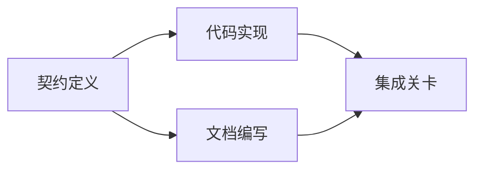

# Construire un plan d'exécution fondé sur des preuves

> Le plan n'est pas une liste d'attente plus belle (à faire) ⋅ c'est une liste de dépendances: chaque modification a une raison, chaque terminal a une preuve de validation claire ⋅

**Type:** Learn + Build
**Languages:** Python (stdlib)
**Prerequisites:** Phase 14 第 43 课
**Time:** ~65 分钟

## Objectif de l'apprentissage

- Le cadre de mission sera transformé en un projet de travail avec des preuves objectives et des preuves de validation.
- L'exécution de l'ordre de construction dépendra de la figure, et non des étapes de ligne de la description.
- Avant de modifier le code, vérifier les faits, les dépendances inconnues et les dépendances en cycle.
- 区分哪些步骤可以并行执行, quels sont les étapes qui doivent être attendues en ordre.

## Pourquoi les plans de l'intelligent échouent-ils toujours ?

Le plan vulnérable est simplement de répéter les besoins des utilisateurs à l'avenir:

1. 更新API♪
2. Il y a une autre question.
3. Je suis en train de faire une nouvelle histoire.

Cette liste ne précise pas ce qu'est le code, pourquoi ces modifications sont correctes, quelles sont les priorités, ni quelles sont les tâches à effectuer.

Un plan établi a été mis en place pour chaque poste de travail et a pris cinq engagements:

| 承诺要素 | 核心作用 |
|---|---|
| 标识符（Identifier） | 用于依赖声明与会话交接（Handoff）的稳定引用 |
| 变更内容（Change） | 最小颗粒度的行为或契约改动 |
| 事实证据（Evidence） | 证明该变更合情合理且必要据实的代码库证据 |
| 前置依赖（Dependencies） | 必须率先完成并成立的前置工作项 |
| 验收证明（Proof） | 能够确凿宣告该工作项闭环的检查手段 |

## Dans le cadre de la mise en œuvre concrète, prévoir un accord

Lorsque plusieurs codes différents sont sur la surface dépendants d'un même comportement, il faut donner la priorité à la définition du même comportement. Ainsi, les tests, les réalisations, les archives et les réalisations collectives peuvent partager le même accord, plutôt que de créer quatre versions incompatibles.



Cette carte de dépendance révèle clairement la possibilité d'une évolue de sécurité: après le fixation du contrat, la mise en œuvre du code et la rédaction du document peuvent être poursuivies en même temps, tandis que la phase finale d'intégration attend les deux.

## Les faits doivent être en mesure de modifier le plan.

La facture de code bibliothèque est absolument inexistante, elle doit être capable d'avoir un effet réel sur la planification du travail:

-  trouver des fonctions de soutien existantes, afin d'éliminer les stratagèmes abstraits du projet original de construction.
- L'existence de tests de compatibilité implique que le plan doit augmenter la migration des données à un niveau plus élevé.
- La mise en œuvre de l'environnement, le modèle, le schéma, le changement de structure et la répartition en une autre tâche indépendante.
- Le format du type de réponse publique, modifié le code réalisé avec l'ordre précédent de l'écriture du document.

Si une soi-disant preuve ne peut pas changer votre plan, elle n'est probablement pas une preuve valable de cette décision.

## 面向会话中断而设计

Un programme possédant une résilience réalisable, son travail suffisamment détaillé pour que l'autre session puisse immédiatement juger:

- 哪项工作已完成;
- 哪项验收证明已经走通;
- 哪些产品文件已修改;
- 哪些 dependance projects have already been lifted blocked;
- Le prochain projet de travail que nous pouvons effectuer est quoi ?

Ne pas mettre l'état d'exécution dans le cadre de la discussion dans la fenêtre de discussion.

## 计划有效性校验

Lorsqu'il est officiellement exécuté, les situations suivantes devraient être directement rejetées:

- existence d'un identifiant de travail de répéter;
-  un projet de travail manque de preuves de faits;
- 某工作项缺乏验收证;
- En fonction d'un projet qui n'existe pas;
- En fonction de l'image, il existe un cycle de dépendance;
- Avant que l'incertitude ne soit éliminée, la première opération irréversible a été organisée.

Les cinq premiers contrôles peuvent être effectués automatiquement par voie de processus mécanisés; les derniers nécessitent une capacité de jugement technique, qui doit être clairement soulignée lors de l'évaluation.

## - Je le construis.

`code/main.py`建模了工作项,校验其证凭证,通过拓排序计算执行波次(Execution Waves),并将结果写入 `outputs/evidence-plan.json`Il y a une autre.

运行命令:

```bash
python3 code/main.py
python3 -m unittest discover code/tests -v
```

Dans cet exemple, trois opérations sont effectuées: d'abord, une définition de la convention; ensuite, un code est réalisé et un document est écrit et un processus est effectué; enfin, un processus est effectué.

## 配合编码智能体使用

Avant de permettre à l'intelligent de modifier le code du fichier, il est nécessaire qu'il expose le plan.

1. Chaque approche et chaque comportement est déterminé par le fait qu'il y ait un code spécifique.
2. Chaque projet de travail a-t-il une preuve claire de son échéance ?
3. Selon le plan, le travail sera-t-il coûteux ou irréversible, retardé jusqu'à l'élimination de l'incertitude de sa dépendance.

L'approbation est un plan concret et clair, et non une phrase vide.

## 练习

1. Ajouter un projet de migration de base de données qui nécessite une explicite approbation humaine.
2.  Construire un cycle de dépendance, et expliquer les différences de produits cachés derrière elle.
3. 拆分一个包含两条不同证明命令的工作项──
4. Ajouter un qui peut fonctionner à la deuxième vague sans toucher à aucun des travaux déjà effectués.
5. Le programme sera présenté sous le format Markdown, tout en conservant JSON comme source unique de faits.

## 延伸阅读

- [Nuseibeh and Easterbrook, Requirements Engineering: A Roadmap](https://www.cs.toronto.edu/~sme/papers/2000/ICSE2000.pdf): explorer les liens entre l'objectif, la norme, le consensus et l'évolution.
- [Barry Boehm, A Spiral Model of Software Development and Enhancement](https://dl.acm.org/doi/10.1145/12944.12948)Il est également possible de décrire comment organiser le processus de R&D en fonction des séquences de formation et de développement.

## 交付物与沉

S' il vous plaît bien conserver généré`outputs/evidence-plan.json`Il sera utilisé comme base de contrat de mission de la classe suivante.
