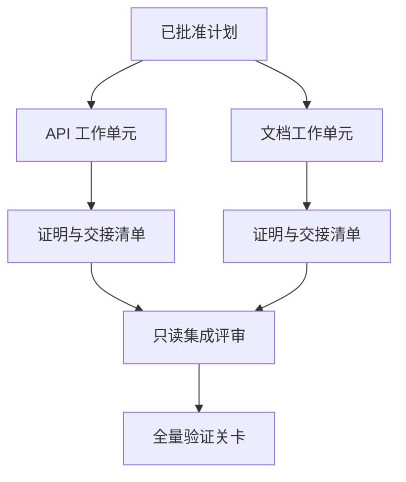

# 带隔离与合并契约的代理委托

> Les corps intelligents ne peuvent économiser de temps physique que lorsqu'ils travaillent vraiment indépendamment les uns des autres. Sinon, ils ne font qu'envoyer une tâche claire en coordonnées plus coûteuses, plus rapide à la défaite et plus rapide à la catastrophe.

**Type:** Learn + Build
**Languages:** Python (stdlib)
**Prerequisites:** Phase 14 第 39 课与第 44 课
**Time:** ~70 分钟

## Objectif de l'apprentissage

- Selon la réelle indépendance du jugement, la responsabilité de la commission et de la co-exécution est raisonnable.
- Pour chaque unité de travail, le travailleur est autorisé à modifier son dossier et à obtenir une attestation de réalisation manifeste.
- 基于依赖关系计算安全的执行波次 (en anglais seulement)
- Conception de contrats de fusion (contrat de fusion) pour assurer la fusion de plusieurs produits de travail intelligents.

## Normes de contrôle

Ne pas seulement parce qu'il y a plus de corps intelligents disponibles pour effectuer des tâches aveugles.

- ∆oules enquêtes peuvent résoudre indépendamment des questions inconnues différentes;
- ¢ deux codes permettant de réaliser des interfaces de fichiers et de documents qui ne se superposent pas les uns aux autres;
- 评审智能体(Reviewer) être en mesure de procéder à des inspections indépendamment sur la base du produit non modifié;
- Les contrôles extérieurs plus longs peuvent être effectués sur place tout en continuant à fonctionner à l'arrière.

Lorsque plusieurs organismes intelligents doivent modifier le même document, dépendant d'une décision non résolue ou d'un environnement variable, ils doivent rester en file d'exécution.

## 工作单元就是一份契约

Chaque unité de travail chargée doit être spécifiée:

| 字段 | 含义 |
|---|---|
| 目标（Goal） | 单一可观测的结果 |
| 负责人（Owner） | 单一负责执行的工作智能体 |
| 路径（Paths） | 排他的写入所有权 |
| 前置依赖（Dependencies） | 启动前必须已完工的前置单元 |
| 证明（Proof） | 返回给集成者的确凿验证证据 |
| 交接清单（Handoff） | 已修改的文件、已做出的决策以及残留风险 |

 traitement 后端逻辑不是合格的工作单元──在 `app/accounts.py`En effet, les unités de travail qualifiées sont les seules à être testées et testées en fonction des besoins des comptes.

## 隔离的三层体系

1. **文件系统隔离（Filesystem isolation）：**独立工作树 (Travail arbres) ou boîte, pour prévenir des accidents
2. **所有权隔离（Ownership isolation）：**严格的契约限制, empêcher deux êtres intelligents de modifier délibérément la même voie.
3. **状态隔离（State isolation）：**独立日志和输出目录, empêcher un corps intelligent de couvrir un autre corps intelligent de preuve de détention.

Les deux arbres de travail peuvent toujours résulter de conceptions structurelles en conflit.



## 集成者不负责重构代码

Les responsabilités de l'intégrateur doivent être:

1. ¢ confirmer que chaque communication a été réalisée dans la strictement intégrée de sa distribution;
2. 认真审查验证证的输出, et non seulement le résumé de l'œuvre de l'intelligence qui a été écrite par l'homme aveugle;
3. 根据依赖关系的时间序依次合并改动;
4. 运行覆盖跨单元的全量验证关卡;
5.  résolument rejeter toute extension de la couverture;
6. En outre, les autorités locales ont décidé de mettre en place des mesures de résiliation des conflits pour les mettre en œuvre.

Si la phase d'intégration nécessite de réécrire la majeure partie du produit de code d'un work intelligence, expliquer que la décomposition initiale de la tâche elle-même est erronée.

## Le rôle de l'homme et de l'intelligence

La mise en œuvre des tâches ne signifie pas abandonner le pouvoir de jugement humain. L'homme est toujours en mesure de prendre des décisions fondamentales qui modifient le comportement externe du système, les niveaux de risque, les limites de sécurité ou entraînent des coûts irréversibles.

C'est comme ça.**校准型自主（Calibrated Autonomy）**Le système donne à l'organisme intelligent une grande liberté, dans des conditions très critiques, en ce qui concerne la mise en place d'un système de contrôle humain.

## - Je le construis.

Le programme expérimental de cette classe examinera les routes de superposition, les dépendances de vérification, les opérations de sécurité du calcul et les résultats seront produits.`outputs/delegation-plan.json`Il y a une autre.

运行命令:

```bash
python3 code/main.py
python3 -m unittest discover code/tests -v
```

尝试修改文档单元, laissez-la posséder `app/`Actualités et droits de propriété. Étant donné que les unités de route et d'API sont superposées, le programme doit être intercepté et reporté automatiquement.

## 练习

1. Le réel business est divisé en deux unités indépendantes et un rôle d'intégrateur.
2. - trouver un schéma apparemment indépendant mais en réalité unifié, en précisant clairement les décisions de confidentialité qu'ils partagent.
3. 增加一个只读的研究型智能体 (en anglais seulement) Research Worker), dont le produit est une réaction factuelle.
4. 增加一个合并关卡(Merge Gate),对照所有工作单元契约检查最终修改的文件集合──
5. Pour une unité de travail définie la règle de l'élimination: lorsque sa mise en avant dépend de l'échec,及时停止后续执行──

## 延伸阅读

- [Reid Smith, The Contract Net Protocol](https://doi.org/10.1109/TC.1980.1675516): étude classique de la répartition des tâches distribuées et des résultats du rapport
- [Eric Horvitz, Principles of Mixed-Initiative User Interfaces](https://dl.acm.org/doi/10.1145/302979.303030): explorer les mécanismes d'automatisation quand ils devraient agir de manière autonome, quand ils devraient remettre le contrôle à l'homme.

## 交付物与沉

S' il vous plaît bien conserver généré`outputs/delegation-plan.json`Il a documenté pourquoi le programme de décomposition est sûr, comment chaque chemin de retour est propriétaire et comment l'intégration doit accepter des preuves.
