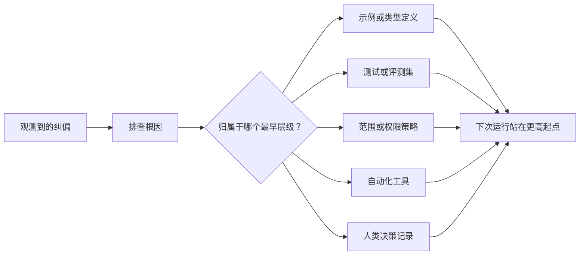

# Pour chaque agent, il faut se transformer en améliorateur du système.

> Il est possible de modifier les corrections de l'enregistrement de chat uniquement pour la première fois. En se fondant sur les tests, les stratégies de bordure, les exemples ou les mécanismes de contrôle des outils, il est possible de faire mieux chaque opération ultérieure.

**Type:** Learn + Build
**Languages:** Python (stdlib)
**Prerequisites:** Phase 14 第 37 至 41 课
**Time:** ~65 分钟

## Objectif de l'apprentissage

- La transformation temporaire des corrections et des retombées des organes intelligents en mécanismes de contrôle systémiques durables.
- La mise en place de chaque mécanisme de contrôle permettra de prévenir la réapparition des problèmes au plus tôt.
- Utilisation de caractéristiques de l'empreinte de l'empreinte de l'apprentissage à répéter.
- 及时退役那些不再应对现实风险的旧控制规则──

## La correction en elle-même est une preuve précieuse .

Lorsque vous dites à un être intelligent de ne pas modifier ce fichier, vous avez en fait constaté: la limite de portée existante (limitation de portée) manque de contraintes exécutables. Lorsque vous remarquez que cette sortie de format est une erreur, vous avez en fait constaté une absence d'exemples standard ou de tests d'automatisation. Lorsque la configuration environnementale est à nouveau une erreur, vous vous rendez compte que les connaissances environnementales initiales doivent être intégrées dans le script d'automatisation.

Il faut considérer les corrections des organes intelligents comme des observations de la faille du système de travail lui-même, plutôt que des erreurs de langage simples de la rédaction rapide.

## 提升沉到最早有效级别

 suivent les priorités suivantes:

| 频发故障类型 | 长效沉淀去处 |
|---|---|
| 错误计算结果或代码回归 | 自动化测试或评测集（Test / Evaluation） |
| 超范围越界或不安全操作 | 范围契约或权限策略（Scope / Permission Policy） |
| 重复出现的环境配置或命令错误 | 自动化脚本或专用工具（Automation / Tool） |
| 重复出现的输出格式错误 | 标准规范示例外加数据校验器（Canonical Example + Validator） |
| 模糊不清的本地工程惯例 | 附带具体场景检查的指令（Instruction + Scenario Check） |
| 产品层面的分歧与争议 | 人类决策记录（Human Decision Record） |

Le coût du mécanisme de contrôle plus tôt en vigueur est plus bas. Une définition de type à l'échelle du type système complètement inefficace est plus ferme que les critiques lors de l'examen du code suivant.



## Le record du ratchet

完整的记录应包含:

- • une réaction de la part de l'autre membre du corps;
- 根因分析(la cause racine);
- 造成的后果(Consequence);
- 重复出现次数 (numéro de récurrents);
- Mécanisme de contrôle choisi;
- La méthode de vérification du mécanisme de contrôle (Verification);
- 责任人(propriétaire);
- 审查或退役日期(Révision / date de retraite)

Ne pas définir chaque préférence individuelle temporaire comme une fixation permanente. Seule la fréquence de réapparition ou la gravité des conséquences potentielles du problème suffisent à prouver une augmentation de la rationalité de la complexité de maintenance à long terme, et ne peut être améliorée en tant que mécanisme de contrôle permanent.

## 区分根因与表象

 L'intelligence modifie le README  seulement l'apparence.

- 任务框架 permet de modifier l'ensemble du code de base;
- Les documents sont généralement considérés comme éditables en toute sécurité;
- Le plan d'exécution sera réalisé en fonction d'une mise en œuvre de la rédaction du document;
- 两个工作智能体 existent en propriété de documents superposés.

Si l'interdiction d'écrire une seule et même copie d'un élément apparaît de manière mécanique, le système continuera de manquer une fois de plus, la prochaine fois que le même problème apparaîtra sous une forme légèrement modifiée.

##                                                                                                                                                                                                                                                                                                                                                                                                                                                                                                                              

Les règles de contrôle anciennes provoquent des conflits, s'élargissent sur les fenêtres des textes suivants, et consolident les vieux systèmes qui n'existent plus. Chaque article de la règle qui a été élaboré nécessite un contrôle régulier. Dans les cas suivants, il faut décider de supprimer ou de réécrire:

- La structure de base a été modifiée;
- Il a été remplacé par un mécanisme de contrôle exécutable plus puissant;
- Dans une période assez longue, le défaut ne se reproduit jamais.
- Les obstacles et les frottements posés par la règle dépassent les risques qu'elle peut entraîner.

L'objectif de l'ingénierie n'est pas de rédiger les documents de commande les plus longs, mais de préserver les jugements techniques les plus difficiles en utilisant un mécanisme systémique minimisé.

## - Je le construis.

Le programme expérimental de cette classe sera de classement des corrections, de leur mise en place en tant que mécanisme de contrôle, de la production de traits d'empreintes pour les projets de répétion et de l'écriture des résultats.`outputs/feedback-ratchet.json`Il y a une autre.

运行命令:

```bash
python3 code/main.py
python3 -m unittest discover code/tests -v
```

尝试输入两条表述不同但根源相同的纠偏记录――持续优化归化逻辑,直到它们能够合并为一个统一的控制机制,同时又不错合并无关故障――

## 练习

1. Dans les dernières séances de rédaction, on a choisi cinq articles qui ont été modifiés et analysés pour les intégrer dans le cadre de leur réel développement.
2. Récépondre un texte de règles de texte en essayant de l'automatiser.
3. 增加后果权重 (augmenter le poids des conséquences) évaluer, de sorte que des erreurs graves de haut risque peuvent également être immédiatement améliorées pour être contrôlées en permanence.
4. En période de production expérimentale, le responsable de chaque mécanisme de contrôle est remplacé par le responsable de la période de retrait de service.
5. ¢ examiner une directive existante sur les organismes intelligents et la supprimer sous prétexte de démontrer l'existence d'un mécanisme de contrôle plus fort.

## 延伸阅读

- [Basili, Caldiera, and Rombach, The Goal Question Metric Approach](https://www.cs.toronto.edu/~sme/CSC444F/handouts/GQM-paper.pdf): explorer comment transformer les objectifs de haut niveau en problèmes et en indicateurs de mesure exploitables
- [Shinn et al., Reflexion](https://arxiv.org/abs/2303.11366)Le modèle de suivi est un modèle de suivi de la qualité des décisions et de la qualité des décisions.
- [Madaan et al., Self-Refine](https://arxiv.org/abs/2303.17651): dans la mise en œuvre de la mise en œuvre de la réforme et de la modification de soi.

## 交付物与沉

S' il vous plaît bien conserver généré`outputs/feedback-ratchet.json`Il s'agit d'un résultat final et long de la voie de l'ingénierie assistée par l'intelligence, et d'un autre élément central de l'évolution future du Workbench.
