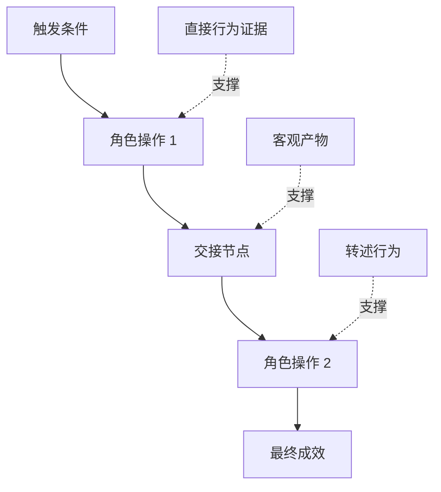

# 发掘人们真正执行的工作流

> Les vrais besoins ne seront jamais vraiment vieux assis dans les salles de réunion comme vous venez à les rassembler. Ils se dispersent dans les mouvements réels des gens, les moyens de changement, les archives historiques et les divers divisions.

**Type:** Learn + Build
**Languages:** Python (stdlib)
**Prerequisites:** Phase 14 第 47 课
**Time:** ~70 分钟

## Objectif de l'apprentissage

- La mise en œuvre de la procédure de construction des travaux existants est basée sur la séquence de démonstrations.
-  strictement distinguer l'observation directe des faits et le comportement des faits ou des conclusions.
- La réaction de l'équipe de la direction de l'équipe de formation est de savoir si la direction de l'équipe de formation est la même.
-  maintenir l'incertitude de la visibilité de la proposition, mais pas facilement la transformer directement en demande de dureté

## D'un système existant

切勿一开始就问用户想要什么功能──你应该做的是回原现在究竟发生了什么──

¢ pour chaque étape du processus de travail, enregistrer les sections suivantes:

| 字段 | 示例 |
|---|---|
| 执行角色（Actor） | 值班工程师 |
| 触发条件（Trigger） | 生产环境告警到达 |
| 具体操作（Action） | 打开告警详情，随后在监控看板中搜索 |
| 输入信息（Input） | 告警 Payload 与发布记录 |
| 产出结果（Output） | 疑似故障服务及责任人 |
| 摩擦阻力（Friction） | 在三个不同运维工具之间来回切换上下文 |
| 审批权限（Authority） | 事故指挥官批准执行写入操作 |
| 支撑证据（Evidence） | 屏幕录像、事故复盘日志、运维手册 |

Le vrai flux de travail est plus large que l'interface vue à l'écran. Il comprend le temps d'attente, la copie des collages, la communication privée, le processus d'approbation, la récupération des erreurs, ainsi que les mouvements délicats auxquels les gens sont habitués et même pas attentifs.

## Les preuves sont de faibles niveaux.

建立简单的证据阶梯(L'échelle des preuves):

1. **直接行为（Direct behavior）：**现场观测、系统调用追踪(Trace) 、屏幕录屏或系统事件日志。
2. **客观产物（Artifact）：**工单记录、运维手册、审计日志、表单或已完成成果文件──
3. **转述行为（Reported behavior）：**Les gens décrivent ce qu'ils font habituellement.
4. **主观推断（Inference）：**L'équipe a conclu que la probabilité était grande.

Ces quatre sources d'information ont une valeur, mais seules les deux premières peuvent confirmer directement les comportements actuels.



## 重点搜寻四大要素

- **摩擦阻力（Friction）：**Répéter le travail difficile, attendre inutilement, retarder, réécrire les données ou récupérer les défaillances du travail difficile.
- **隐性状态（Hidden state）：**                                                                                                                                                                                                                                                              
- **审批权限（Authority）：**Le droit de prendre des décisions importantes et à des conséquences importantes pour les personnes concernées ou les systèmes de contrôle.
- **异常分支（Exceptions）：**Le processus normal est interrompu, il ne fonctionne plus selon les circonstances de l'exploitation du travail.

La fonctionnalité de l'IA est souvent en rupture avec le traitement des anomalies, souvent parce qu'au début, elle a été conçue uniquement pour le chemin idéal de tout ce qui se passe bien.

## 切勿通过 求平均 抹杀分歧

Les deux utilisateurs adoptent des processus d'exploitation très différents, souvent pour des raisons très justifiées. Avant de comprendre pleinement les causes profondes de ces différents processus, ils doivent conserver complètement ces différentes variantes, car elles peuvent représenter:

- rôles et responsabilités organisationnels différents;
- Les niveaux de tolérance au risque différents;
- Le changement entre l'ancien et le nouveau processus;
-  différence entre l'expérience professionnelle et la compétence;
- La stratégie et la gestion sont en désaccord.

Un flux de travail en moyenne, souvent incapable de décrire une personne réelle.

## - Je le construis.

Le programme expérimental de cette classe est composé de la documentation de chaque étape du processus de travail, de l'ordre et de la confiance de l'exécution de l'expérience, du calcul du ratio de preuve directe à preuve directe, et des résultats seront écrits.`outputs/workflow-evidence.json`Il y a une autre.

运行命令:

```bash
python3 code/main.py
python3 -m unittest discover code/tests -v
```

尝试增加一条部署记录缺失的异常分支路径──保持主流程顺序不变,并清晰记录该分支的起点位置──

## 练习

1. Ne pas interviewer n'importe qui, seulement avec un système de fonctionnement de journaux de récupération d'un flux de travail complet.
2. 面谈一位真实用户,标注出其主张中所有仍缺乏直接客观证支的陈述──
3. 增加一处权限审批边界(Limitation de l'autorité)
4.  à la même situation, deux variantes de processus différentes sont élaborées sans les forcer à se combiner.
5.  trouver une nouvelle fonction de la proposition: elle élimine en surface une opération visible, mais ne touche pas complètement à la fonction cachée derrière elle.

## 延伸阅读

- [Nuseibeh and Easterbrook, Requirements Engineering: A Roadmap](https://www.cs.toronto.edu/~sme/papers/2000/ICSE2000.pdf)Leur importance est particulièrement grande en ce qui concerne l'obtention de données, et non pas en ce qui concerne la simple saisie d'informations.
- [Gotel and Finkelstein, An Analysis of the Requirements Traceability Problem](https://doi.org/10.1109/ICRE.1994.292398): analyser les défis majeurs liés au suivi des besoins de maintenance et de la dépendance à la source.

## 交付物与沉

S' il vous plaît bien conserver généré`outputs/workflow-evidence.json`Dans la section suivante, il se traduira par une carte hypothétique de la résistance et de l'incertitude de frottement observées.
