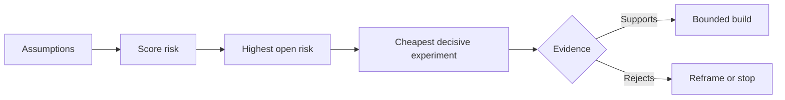

# 理假设并优先化解最高风险

> Le modèle de la carte routière (produit route) est souvent caché dans la liste des fonctions; le modèle de la carte présomptive (Assumption Map) révèle: avant que ces fonctions soient construites, il faut d'abord vérifier quelles conditions préalables sont établies.

**Type:** Learn + Build
**Languages:** Python (stdlib)
**Prerequisites:** Phase 14 lesson 48
**Time:** ~65 minutes

## Objectif de l'apprentissage

- Le travail proposé sera démantelé et transformé en hypothèses explicites.
- Résumé: Les résultats de la recherche ont été évalués à l'échelle de l'industrie.
- 风险排序选择下一个实验, et non pas avec le principe de la chaleur.
- Utilisation de la preuve et des conclusions de décision déterminées pour remplacer les hypothèses déjà testées.

## Chaque construction est en fait un pari.

Un ensemble d'outils de recherche de failles (Incident Tool) de valeur, peut dépendre de la validité totale de chaque hypothèse préalable de la liste suivante:

- ฀l'avertissement ci-dessous contient suffisamment d'informations pour identifier le service de défaillance;
- Les résultats de la recommandation des ingénieurs ne sont pas directement transmis;
- Le temps de réponse prévu est essentiel au niveau du transport;
- Les données requises peuvent être consultées sous la prémisse d'une autorité non sécurisée;
- Le taux de fréquence de ces flux de travail est suffisamment élevé pour prouver que le coût de maintenance du système est raisonnable.

Ces tâches ne sont pas simplement des tâches de code pour la réalisation de tâches de mise en œuvre, mais des conditions préalables à la construction de devenir précieuse (valeur) ‒ utilisable (utilité) ‒ utilisable (factibilité) ‒ et sûre (sécurité).

## 假设的类别

| 类别 | 核心问题 |
|---|---|
| 价值（Value） | 产出的最终结果是否足够重要？ |
| 可用性（Usability） | 用户能否理解并据此采取行动？ |
| 可行性（Feasibility） | 现有系统能否利用可获取的数据和约束产出该结果？ |
| 存续性（Viability） | 组织能否长期承受其成本、归属权与运维负担？ |
| 安全性（Safety） | 系统出现故障时是否不会造成无法接受的后果？ |

La supposition est une hypothèse qui peut être traduite par des déclarations falsifiables. Elle est une hypothèse qui peut être démentie par des faits observés explicites. Elle est très utile et ne peut pas être testée.

## 风险并非单一维度的数字

Cette expérience de 1 à 5 minutes évalue trois dimensions:

- **影响（Impact）：**Si cette hypothèse n'est pas fondée, le degré de dégradation causée au système ou à l'entreprise.
- **不确定性（Uncertainty）：**La faiblesse de la preuve de la détention de la preuve.
- **不可逆性（Irreversibility）：**Les coûts de retour ne sont pas détectés correctement avant de s'engager ou de s'engager dans des engagements importants.

Le nombre de références est un nombre de fois plus élevé que le nombre de références.



## design experiments, et non pas les cérémonies de confirmation

Une expérience vraiment précieuse a les éléments suivants:

- Une possibilité d'être falsifiée;
- échantillons réels ou représentatifs;
- Un résultat objectif observable;
- La valeur de l'évaluation préalablement déterminée;
-  à travers 、 échec et la preuve de la maladresse de leur propre cheminement de décision de la prochaine étape ⋅

 éviter de concevoir ce type de test de confirmation rituel qui sert uniquement à démontrer que l'équipe est capable de faire cette idée

## 可逆性会改变构建顺序

Les résultats de sélection sérieux et irréversibles nécessitent un soutien plus rapide.

Le rythme de progression de la construction du système doit être en accord avec le rythme de la résolution de l'incertitude.

## 动手实现

Cette expérience a permis de classer les hypothèses, de distinguer les affirmations éprouvées et les affirmations non éprouvées, de choisir les hypothèses non éprouvées les plus à risque, et de générer des`outputs/assumption-map.json`Il y a une autre.

```bash
python3 code/main.py
python3 -m unittest discover code/tests -v
```

 Modifier l'état des preuves sur l'hypothèse de risque le plus élevé, observer système recommandé de la prochaine expérience

## 课后练习

1. Pour que vous soyez prêt à construire une fonction, écrivez cinq hypothèses clés.
2. 补充一条您原本的功能列表中遗漏的安全假设──
3. Déterminer une chose qui vous fera décider de mettre fin à cette construction.
4. Remplacer une expérience de test d'origine vaste par un test moins coûteux et décisif.
5. Pour la priorité des risques par rapport aux priorités de la route des produits originaux, expliquer pourquoi il existe des erreurs.

## 延伸阅读

- [Barry Boehm, A Spiral Model of Software Development and Enhancement](https://dl.acm.org/doi/10.1145/12944.12948), explorer les cycles de développement à risque de déploiement plus profond avant de résoudre l'incertitude.
- [Dardenne, van Lamsweerde, and Fickas, Goal-Directed Requirements Acquisition](https://doi.org/10.1016/0167-6423(93)90021-G), explorer les objectifs du système d'élaboration en même temps que les obstacles et les liens de l'exposition progressive.

## 交付物沉

Garder à l' écoute`outputs/assumption-map.json` Le choix du document permettra de produire le plus petit morceau de preuve décisive.
