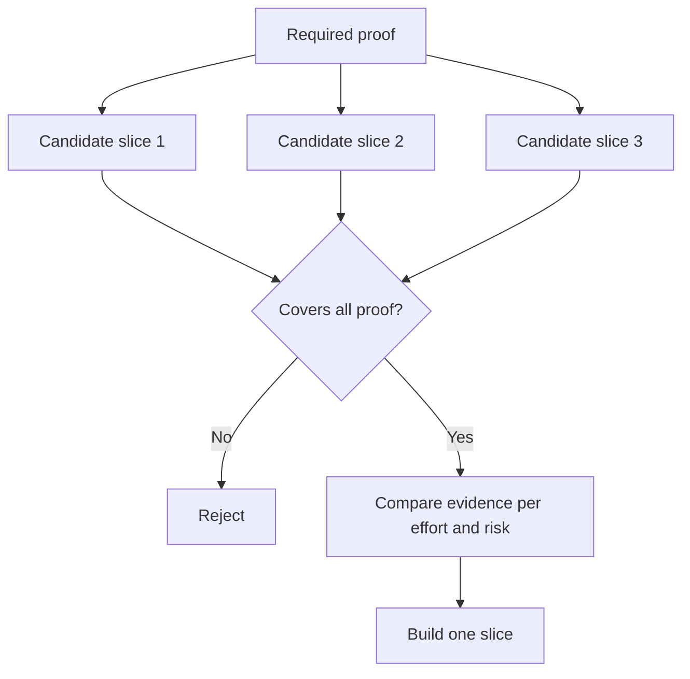

# 选择能够改变决策的最小片片

>                                                                                                                                                                                                                                                               

**Type:** Learn + Build
**Languages:** Python (stdlib)
**Prerequisites:** Phase 14 lesson 49
**Time:** ~65 minutes

## Objectif de l'apprentissage

- Selon le principe central de la pièce, il est possible de définir la pièce.
- 权衡结果价值(Résultat Value) 、 incertainty化解、研发投入与潜在后果──
-  priorités choisir des preuves concrètes, plutôt que de faire des promesses environnementales de naissance prématurée―
- Décision ou décision de ceux qui ont décidé de ne pas travailler

## Le coup vertical signifie la preuve de fin à fin

垂直切片 (→ Vertical Slice) est le flux de travail le plus petit nécessaire à un certain résultat de l'observation. Il peut être très étroit en termes de nombre d'utilisateurs, de taille de données, de cycle de fonctionnement et de fonctionnalité, mais il ne peut absolument pas être exclu dans le but de le voler et de déduire l'incertitude centrale du test.

Pour le cas:

- 基于 10 起真故障的只读重放 (en lecture seulement) ), capable de vérifier la précision du service et la confiance de l'opérateur.
- Une table d'outils élaborée sur la base de données synthétiques peut peut-être tester la compréhension de l'interface, mais ne peut pas tester la faisabilité de l'obtention des données.
- Les réparateurs automatiques de failles dans l'environnement de production, essayant de tester toutes les parties de la production une seule fois, ont entraîné un risque de dégâts insupportable.

## Précédent nécessaire

提取风险最高的未决假设,将将其转化为必要证据集 (需证据集) ──片选片只有在完全覆盖该证据集时,才具备入选资格 (合格) ──

Une évaluation comparative a ensuite été effectuée entre les morceaux qualifiés:

| 评估维度 | 期望方向 |
|---|---|
| 产出价值（Outcome value） | 越大越好 |
| 化解的不确定性（Uncertainty reduced） | 越多越好 |
| 研发投入（Effort） | 越小越好 |
| 潜在后果（Consequence） | 越轻越好 |
| 可逆性（Reversibility） | 越高越好 |

Le modèle d'évaluation utilisé dans cette expérience est destiné à rester simple, car la porte d'éligibilité est plus importante que le calcul numérique lui-même.



## 常见的伪极小值陷

- **纯界面极小值（UI-only minimum）：**Œuvrer à éviter l'accès et le transport des données les plus essentielles Œuvrer à l'incertitude Œuvrer à l'accès et à l'accès aux données Œuvrer à l'accès aux données Œuvrer à l'accès aux données Œuvrer à l'accès aux données Œuvrer à l'accès aux données Œuvrer à l'accès aux données Œuvrer à l'accès aux données Œuvrer à l'accès aux données Œuvrer Œuvrer Œuvrer Œuvrer Œuvrer Œuvrer Œuvrer Œuvrer Œuvrer Œuvrer Œuvrer Œuvrer Œuvrer Œuvrer Œuvrer Œuvrer Œuvrer Œuvrer Œuvrer Œuvrer Œuvrer Œuvrer Œuvrer Œuvrer Œuvrer Œuvrer Œuvrer Œu Œuvrer Œu Œu Œuvrer Œu Œu Œu Œu Œu Œu Œu Œu Œu Œu Œu Œu Œu Œu Œu Œu Œu Œu Œu Œu   Œu           Œu                                                                                                                                                
- **纯基础设施极小值（Infrastructure-only minimum）：**☐ la valeur de l'utilisateur est vérifiée.
- **纯顺境极小值（Happy-path minimum）：**刻意省略构成大部分风险的异常边界处理.
- **演示极小值（Demo minimum）：**Les résultats de la recherche ont été très convaincants, mais ne peuvent pas fournir une évaluation quantitative réalisable.
- **平台化极小值（Platform minimum）：**Dans le cadre d'un seul processus de travail, la construction de composants à usage répété général est précoce, avant que sa valeur ne soit confirmée.

##  précédence définir la règle de cessation

Avant de commencer à réaliser, il faut prévoir la méthode de mise en œuvre de la règle de stop si le test échoue:

-  abandonner le résultat prévu;
- modifier le groupe d'utilisateurs ou le cadre d'activité visé;
- 测试替代的技术机制;
-  collectent des preuves de niveau inférieur de qualité supérieure;
-  le pouvoir d'exécution du système de plus en plus restreint

Si chaque test a été réalisé, ce n'est pas une expérience réelle.

## 动手实现

Cette expérience a été réalisée sur la base de preuves nécessaires.`outputs/slice-decision.json`Il y a une autre.

```bash
python3 code/main.py
python3 -m unittest discover code/tests -v
```

☐ la valeur totale de l'interdiction est très élevée, pourquoi elle est toujours directement éligible à l'interdiction de l'interception ?

## 课后练习

1.  à la même échelle de résultats attendus, trois échantillons de certificats ont été conçus pour répondre à différents résultats.
2. Avant de passer le bilan des candidats, une liste claire des preuves nécessaires est établie.
3. 尝试裁减一项功能, tout en veillant à pouvoir conserver des preuves décisionnelles clés.
4. Pour le programme de test compléter un article de règles de cessation de pratique réelle.
5.  trouver une raison de retarder la vérification des pièces après le redémarrage du composant de la plateforme générale

## 延伸阅读

- [Barry Boehm, A Spiral Model of Software Development and Enhancement](https://dl.acm.org/doi/10.1145/12944.12948)Il s'agit de rechercher comment adapter chaque cycle de développement aux risques qui doivent être résolus.
- [Lenarduzzi and Taibi, MVP Explained: A Systematic Mapping Study on the Definitions of Minimal Viable Product](https://arxiv.org/abs/1609.07592)En ce qui concerne la définition de la définition minimale et la définition de la définition de la définition de la définition minimale dans la pratique du génie des logiciels.

## 交付物沉

Garder à l' écoute`outputs/slice-decision.json`Le document enregistre les motifs de la décision, en fonction des preuves, de la moindre moindre partie.
