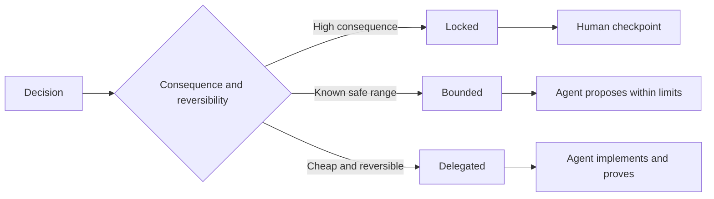

#  édition du Règlement sur les tâches de conservation du droit de décision autonome

> Les normes de valeur doivent être fixées en fonction de l'immutabilité et de la preuve, tout en restant ouvertes à la possibilité de réaliser des changements inversés.

**Type:** Learn + Build
**Languages:** Python (stdlib)
**Prerequisites:** Phase 14 lesson 50
**Time:** ~75 minutes

## Objectif de l'apprentissage

- Le taux de change est de 0,5% pour les entreprises de l'Union européenne.
- Le processus de décision est de définir les modalités de la décision.
- Dans le choix d'un secteur à faible coût et à fort risque, le droit de décision autonome de l'agent est pleinement conservé.
- Dans les cas de graves conséquences ou de perturbations des comportements publics, la mise en place de points de contrôle d'audit artificiel doit être obligatoire.

## Les deux extrémités de la vie

规范不足 (Undetermined) du rôle impose à l'agent 凭空猜测系统行为; alors que le surplus de规范 (Over specified) du rôle permet à l'agent 机械照抄可能本身存在缺陷的具体设计──

Le programme de réduction efficace est**可执行契约（Executable Contract）**- Le numéro de la liste:

| 规范要素 | 核心作用 |
|---|---|
| 预期产出（Outcome） | 可直接观测的最终交付结果 |
| 不变量（Invariants） | 必须始终严格成立的前置与后置约束 |
| 范例（Examples） | 能够直观展现真实意图的具体用例 |
| 非目标（Non-goals） | 明确刻意排除在外的周边行为 |
| 决策策略（Decision policy） | 标明哪些选择属于锁定、受限或完全委派 |
| 验证证据（Proof） | 任务验收前必须提供的测试或观测实据 |

## 3 modes de décision

- **锁定（Locked）：**严禁代理 擅自选择;; applicable à la compatibilité publique, à la rédaction des droits, à la sécurité, au coût non réversible ou à l'engagement de produits de base;;
- **受限（Bounded）：**允许 l'agent à choisir de manière autonome dans une zone de sécurité définiée.
- **委派（Delegated）：** Octroi de l'autorité de l'agent                                                                                                                                                                                                                                                                                                                                                                                                                                                                                                                  



##  par des comportements spécifiques

Il est possible de faire passer des exemples spécifiques, bien plus efficaces que des exemples de conception.

范例不能替代不变量: cas d'utilisation réussie, pas de preuve de la sécurité générale est garantie.

## Les preuves de validation doivent correspondre au niveau de déclaration

- 单元测试(Unit Test) est utilisé pour démontrer la fonction locale契约。
- 传输协议测试 (Wire Test) est utilisé pour prouver la séquestration et le comportement de la communication en ligne.
- 浏览器旅程(Browser Journey) est utilisé pour démontrer le chemin de l'interface utilisateur du terminal à l'autre.
- 重放测试集(Replay Set) est utilisé pour démontrer le système dans une représentation de la situation.
- 审计日志(Log d'audit) est utilisé pour la démontre des limites des limites du système de contrôle.

Il ne faut pas considérer les tests de niveau inférieur comme des preuves de l'acceptation des déclarations de niveau supérieur.

## 刻意保留合理的未知空间

La réglementation peut être clairement déclarée:  concrétiser la réalisation de la tâche de complémentation des budgets en lisant uniquement les sources de données. Cette définition n'est pas définitive, mais une décision de commission explicite avec des limites claires et des restrictions de preuve.

Avec l'accumulation de preuves de connaissance, les normes doivent être adaptées au temps. Les données sont bloquées et les raisons de la sélection restreinte sont restreintes.

## 动手实现

Cette expérience a permis de vérifier la légitimité du modèle de décision, et de générer des`outputs/executable-specification.json`Il y a une autre.

```bash
python3 code/main.py
python3 -m unittest discover code/tests -v
```

L'analyse des données est possible à travers l'expérience, mais le contrôle des risques au niveau du produit ne permet pas de tels changements.

## 课后练习

1. La transition d'un seul acte à l'exécution d'un seul acte est transmise à six dimensions du Règlement.
2. Utilisez une règle de l'imvariabilité et deux exemples typiques, en remplacement de trois instructions de description.
3. Chaque décision de la tâche de marquage est motivée par une explication de choix de chaque lieu de mise en place ou de restriction.
4. Pour chaque article de la norme, le complément est complété par le certificat de validation de la réponse.
5. 找出一条既无实证支又不论根据的冗余约束并将其删除──

## 延伸阅读

- [Nuseibeh and Easterbrook, Requirements Engineering: A Roadmap](https://www.cs.toronto.edu/~sme/papers/2000/ICSE2000.pdf), évoquer les objectifs, préciser les règles, vérifier les relations entre les évolutions et les processus de consensus.
- [Zave and Jackson, Four Dark Corners of Requirements Engineering](https://doi.org/10.1145/237432.237434), analyse en profondeur les hypothèses environnementales, les besoins systémiques et les spécifications techniques,
- [Gotel and Finkelstein, An Analysis of the Requirements Traceability Problem](https://doi.org/10.1109/ICRE.1994.292398), explorer comment conserver les causes et la traçabilité de la demande.

## 交付物沉

Garder à l' écoute`outputs/executable-specification.json`Il sera un accord de coopération qui sera suivi en commun par les agents de codage et les évaluateurs humains.
