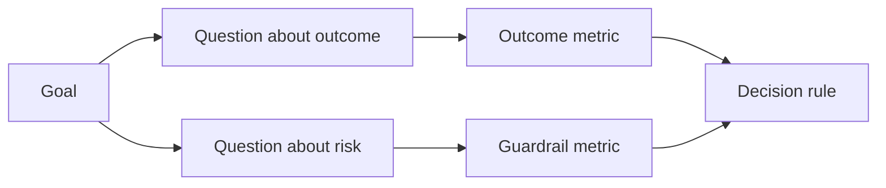

# Indicateur de réussite de conception

> Les indicateurs de mesure doivent servir à la prise de décision, et non seulement à la décoration du tableau de bord.

**Type:** Learn + Build
**Languages:** Python (stdlib)
**Prerequisites:** Phase 14 lessons 47 and 51
**Time:** ~70 minutes

## Objectif de l'apprentissage

- Les objectifs de résultats attendus débouchent sur des problèmes de base et des indicateurs de mesure.
- Avant d'observer les résultats concrets, préconisez la valeur, la fenêtre de temps, la source de données et l'optimisation des directions.
- Les produits de la production et de la protection des indicateurs de protection des produits de la production et de la protection des indicateurs de protection des produits de la production et de la protection des produits de la production et de la protection des produits de la production et de la protection des produits de la production et de la protection des produits de la production et de la protection des produits de la production et de la protection des produits de la production et de la protection des produits de la production et de la protection des produits de la production et de la protection des produits de la production et de la protection des produits de la production et de la protection des produits de la production et de la protection des produits de la production et de la protection des produits de la production.
- Pour que les preuves d'évaluation soient adaptées aux décisions concrètes prises pour financer la construction de la construction.

## 目標、問題與指标 (objectif 问题与指标)

De l'objectif (objectif) émission:

> réduire le temps nécessaire au service de positionnement affecté, sans augmenter aucune opération dangereuse

推导出问题:

- La vitesse du service est-elle rapide ?
- Le taux de précision des services de délocalisation est-il élevé ?
- Le processus de diagnostic est-il toujours purement et simplement lu ?
- Le flux de travail a-t-il entraîné une négligence fréquente des alertes ou une charge accrue de l'opérateur?

                                                                                                                                                                                                                                                                                                                                                                                                            



## Chaque indicateur a besoin d'un accord de réglementation

Chaque indicateur doit être équipé de:

| 契约字段 | 示例 |
|---|---|
| 指标名称（Name） | `median_identification_seconds` |
| 方向（Direction） | 至多不超过（at most） |
| 阈值（Threshold） | 120 |
| 窗口（Window） | 10 次故障事件重放 |
| 数据源（Source） | 重放事件日志 |
| 统计样本（Population） | 参与试点的在岗工程师 |
| 类别（Kind） | 成果指标（outcome）或护栏指标（guardrail） |

Si les sources de données et les fenêtres statistiques manquent, aucun chiffre ne peut être reproduit; si les prévisions sont manquantes, les indicateurs ne peuvent pas entraîner de décisions précises.

## Indicateur de résultats, indice de protection et indice de mesure

- **成果指标（Outcome metric）：**L'espérance d'amélioration est-elle réellement améliorée?
- **护栏指标（Guardrail）：**Les conditions de sécurité et de contrainte sont-elles toujours respectées ?
- **制衡指标（Counter-metric）：**L'optimisation locale transférera-t-elle les coûts ou les dégâts cachés à d'autres secteurs?

Pour les flux de travail de dépannage, la lumière est insuffisante. Le taux de précision, le taux de production, l'interception des opérations, le taux de charge de travail et de défaillance des alertes des opérateurs constituent un obstacle à la sécurité pour prévenir la conclusion rapide d'erreurs catastrophiques.

## Les données de référence

离线重放(Offline Replay) très adapté à l'examen de la réalité et de la couverture des scènes de bord;受控试点(Bunded Pilot)

始终选择能够支现前决策的最低成本证据――绝不能仅仅因为代码已经写好就商然将真实用户暴露于未知风险――

## Préparation de mesures

Avant de voir les résultats statistiques, il faut d'abord définir par écrit le chemin d'action dans le cadre de la situation de défaillance et de confusion.

Pour les autres:

- 通过(Pass): service position准确率 ne dépasse pas 0,9, et le temps de position ne dépasse pas 120 secondes;
- 失败(Fail): toute opération de production illégale ou un taux de positionnement inférieur à 0,75;
- 模糊(Ambigue): les performances, bien qu'améliorées de manière modeste, sont très grandes, nécessitant une réévaluation de la taille et de la taille du groupe de test.

## 动手实现

Cette expérience a permis d'évaluer la complétude du plan de mesure de l'expérience, de comprendre la valeur de la limite, de consigner les indicateurs de défaillance, de faire des émissions.`outputs/measurement-report.json`Il y a une autre.

```bash
python3 code/main.py
python3 -m unittest discover code/tests -v
```

尝试删除护指标在度量计划中, observe pourquoi même si les indicateurs de résultats sont toujours présents, l'ensemble du plan sera toujours jugé illégal par le système.

## 课后练习

1. Le même objectif de réalisation émerge, en déduisant trois questions de grande importance.
2. 补充一条 capture des indicateurs de balance qui entraînent une augmentation du fardeau des autres rôles en raison de l'optimisation actuelle.
3. Pour chaque indicateur, définissez sa source de données, les échantillons statistiques et la fenêtre de temps.
4. Avant de générer une valeur réelle, préécrivez la décision de la situation à travers le défaut et l'imagination.
5.  trouver un indicateur de la côte de la décision, mais pas de modifier la statistique, et le déduire 

## 延伸阅读

- [Basili, Software Modeling and Measurement: The Goal/Question/Metric Paradigm](https://drum.lib.umd.edu/items/8119803a-362b-42ec-b6ce-2311713e7236), présentation de la façon dont l'objectif de la mise en œuvre de la MQG est déterminé.
- [Basili, Caldiera, and Rombach, The Goal Question Metric Approach](https://www.cs.toronto.edu/~sme/CSC444F/handouts/GQM-paper.pdf)Il est également possible de décrire la pratique de la méthode comme une pratique de la résistance à la réforme continue du système.

## 交付物沉

Garder à l' écoute`outputs/measurement-report.json`Il sera introduit dans le type de prototype, le test ou la production.
