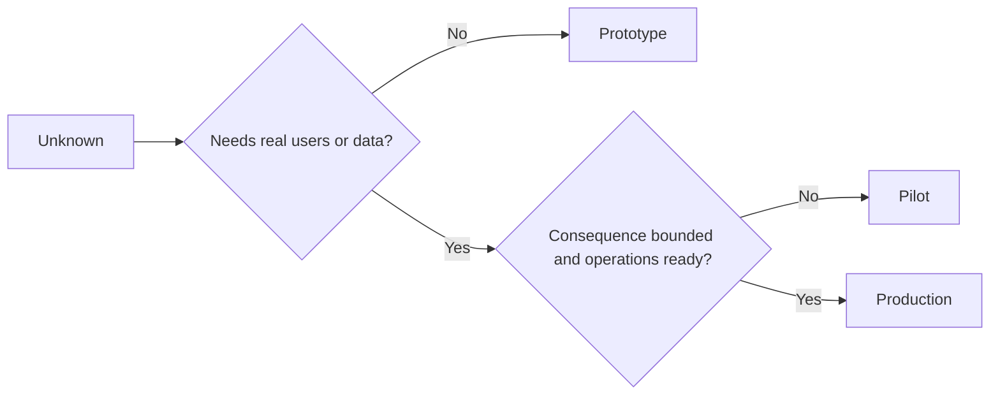

# 审慎择原型、试点还是生产

> Elles représentent un environnement cognitif nettement différent, et non une simple différence de précision.

**Type:** Learn + Build
**Languages:** Python (stdlib)
**Prerequisites:** Phase 14 lessons 50 to 52
**Time:** ~70 minutes

## Objectif de l'apprentissage

- Selon le type inconnu, la portée du public, la sensibilité des données, la pérennité des conséquences et la maturité du transport, la prudence choisit la phase de construction.
-  élaborer des mesures de contrôle spécialisées à chaque étape  contrôles  et règles de sortie  Critères de sortie 
-  empêcher le système d'origine de se transformer en système de production sans responsabilité humaine
- Dans le cadre de la mise en œuvre de la politique de sécurité et de sécurité, le gouvernement a décidé de mettre en place un système de sécurité et de sécurité sociale.

## Trois problèmes fondamentaux

| 阶段 | 核心问题 |
|---|---|
| 原型（Prototype） | 该技术机制到底能不能产生预期的实证结果？ |
| 试点（Pilot） | 在受控真实受众与真实工况下，它能否安全稳定运行？ |
| 生产（Production） | 组织能否按照既定的可靠性与风险承诺，持续对该系统承担长期责任？ |

Un prototype technique extrêmement complet peut encore être conçu pour des déchets post-abandonnés; un essai peut utiliser des données de production réelles, mais sa taille et ses pouvoirs d'exploitation doivent être strictement limités; et seulement lorsque l'organisation prend officiellement le contrôle et assume une responsabilité de longue durée, la phase de production ne peut vraiment commencer.

## Première phase

Lorsque vous avez besoin de résoudre des hypothèses inconnues sans introduire de données d'utilisateur ou de production réelles, utilisez la phase originale.

- 随时可废弃 (à éliminer);
- 严格隔离 (Isolaté);
- 功能边界狭窄 (à étroite portée);
- 核心验证问题显式明确 (explication explicite sur la question de l'apprentissage);
- Il ne fait pas de faux engagements de stabilité.

Le mécanisme lui-même n'a pas encore prouvé sa valeur avant d'entrer dans la phase suivante, ne pas optimiser trop tôt l'architecture globale du système.

## 试点阶段

Lorsque l'hypothèse inconnue doit être basée sur des comportements d'opération réels, des données réelles ou des flux de travail réels pour vérifier, mais que la dégradation des résultats ou la maturité du fonctionnement est encore insuffisante pour soutenir une publication complète, l'adoption de la phase de test.

Un essai qualifié doit être:

- déterminé pour les participants;
- 明确 responsable de l'humanité;
-  périodes de fonctionnement et de fonctionnement strictement limitées;
- Œuvre de suivi et de réouverture rapide;
- indice de résultats et de valeur des indices de protection;
- Il est clair que les règles de retrait visées à l'expansion, à la modification ou à la fin définitive de la procédure de retrait sont en vigueur.

## Étapes de production

La production de la phase n'est pas seulement égale à la mise en œuvre du code:

- 明确的服务等级目标(SLO);
- Responsable du traitement des événements de faillite et de décès;
- Sécurité et confidentialité;
- Contrôle de la capacité de production et de la capacité de débit;
- mecanisme de récupération de la réaction et de la capacité;
- 7x24 小时全天候监控;
- 清晰的退役与下线路径──



## 阶段漂移陷

Lorsque le code original, dans le cas où un système de gestion et de gestion de la responsabilité n'a pas encore été établi, obtient les droits d'exploitation de l'utilisateur réel, des données sensibles ou du cœur, il devient extrêmement dangereux.**阶段漂移（Stage Drift）** Il faut imposer une limite de rigidité entre le type de test et le type de test dans les documents de construction et dans les paramètres de configuration du système, de contrôle des autorisations et de la mesure de distance.

Les phases de fonctionnement du système doivent être directement observées et testées dans l'état de fonctionnement du système lui-même.

## 动手实现

Cette expérience, basée sur la décision, a été proposée automatiquement pour les étapes appropriées, et a permis de revenir à chaque étape des mesures de contrôle nécessaires, et de produire des résultats.`outputs/stage-decisions.json`Il y a une autre.

```bash
python3 code/main.py
python3 -m unittest discover code/tests -v
```

Il est nécessaire de compléter les preuves de la connaissance, pour prouver qu'il est capable de promouvoir officiellement la production de phases.

## 课后练习

1. 根据认知探索阶段 (en lieu et place du simple code deployment status), les trois projets existants de votre tête doivent être reclassés.
2.  éditer un document contenant des règles de retrait de la décision
3.  augmenter une mesure de contrôle technique, de façon à empêcher fondamentalement le code d'origine de toucher les données environnementales de production 
4. ¢ trouver le premier élément qui marque la véritable transition du système vers la responsabilité de la production et de la gestion de la production ¢
5. Pour un test limité, une série de permis de roulement complète est conçue.

## 延伸阅读

- [Barry Boehm, A Spiral Model of Software Development and Enhancement](https://dl.acm.org/doi/10.1145/12944.12948)Il s'agit de rechercher comment faire correspondre les investissements de ressources de chaque génération au niveau des risques déjà émis.
- [Fagerholm et al., Building Blocks for Continuous Experimentation](https://doi.org/10.1145/2601248.2601276), la recherche continue de la réalisation des expériences d'ingénierie nécessaires aux processus et aux pré-réalisations techniques de l'organisation.

## 交付物沉

Garder à l' écoute`outputs/stage-decisions.json`Il a enregistré les raisons de choisir les étapes et les mesures de contrôle qui doivent être mises en œuvre avant d'entrer dans la phase suivante.
