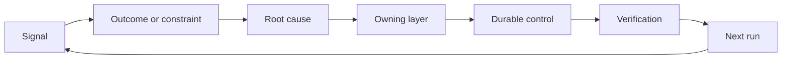

#  la formation d'un mécanisme d'intégration et de démission

> La publication du code met fin au cycle de construction de la période actuelle, tout en ouvrant un cycle d'apprentissage à long terme.

**Type:** Learn + Build
**Languages:** Python (stdlib)
**Prerequisites:** Phase 14 lessons 46 and 53
**Time:** ~75 minutes

## Objectif de l'apprentissage

- Les événements de défaillance, les données d'évaluation, les comportements des utilisateurs et les corrections sont transformés en actions qui sont responsables.
- Les différents signaux doivent être précisés par le réseau de communication, les systèmes de surveillance et les systèmes de surveillance.
- La priorité est de classer les risques de réapparition en fonction de la gravité et du nombre de fois où ils se produisent.
- Pour chaque système de contrôle, un mécanisme de contrôle définit des conditions de retrait de service.

## Il s'agit aussi d'une infrastructure.

Une équipe peut recueillir une grande quantité de chaînes de systèmes de suivi des traces, des enregistrements d'évaluation, des supports de travail et des journaux de problèmes, mais sans tirer aucune leçon de cognition.**晋级通道（Promotion）**Le système de validation des preuves est un système de validation qui change de façon fixe.

Le dernier cycle de l'enquête est le suivant:

1. 观测到具体实测信号;
2. Leur relation avec les résultats de production prévus, les conditions de conditionnement ou les hypothèses de préposition;
3. Identifier les niveaux systémiques les plus bas de la responsabilité de l'incitation à l'appartenance;
4. 实施受控的持久化改进;
5. 验证 la probabilité de rechute de cette maladie a été réduite;
6. Le mécanisme de contrôle doit-il être maintenu en vigueur ?

## 精准路由至应对责任层级

| 信号类型 | 归属目的地 |
|---|---|
| 误报、功能倒退、错误输出结果 | 评测集（Evaluation）或自动化测试 |
| 上下文缺失、重复劳动、过时事实 | 上下文数据源或检索路由策略 |
| 不安全操作或越权漏洞 | 安全策略（Policy）或权限硬边界 |
| 超时、重试风暴、依赖服务不可用 | 运行时控制（Runtime Control） |
| 新的产品需求或尚未决断的权衡取舍 | 经过规范成型（Shaped）的待办项 |

Lorsque les limites de test automatisé ou de dureté suffisent à rendre complètement impossible l'erreur, ne pas ajouter un autre paragraphe de la formule dans le prompt.



## La responsabilité de l'appartenance elle-même fait partie du mécanisme de contrôle.

Chaque action en rotation doit être spécifiquement:

- 唯一的人类责任人(propriétaire);
- ), les priorités établies sur la base de l'évaluation globale des effets de la dégradation et de la fréquence de réapparition;
- 拟修改的目标系统组件 (Artifact)
- provisionner le programme de vérification de la modification et de l'effet réel;
- la fenêtre de révision ou de défaillance automatique;
- 明确的退役条件(Condition de retraite)

Un programme de réforme sans précédent, dont la quantité est simplement une partie de la version de l'observation.

## Décision de l'ancien mécanisme de contrôle

Les règles de contrôle et de contrôle peuvent être contradictoires et coûteuses. Dans les cas suivants, un mécanisme de contrôle et de contrôle doit être activement révisé et retiré:

- Les changements fondamentaux ont eu lieu dans l'architecture systémique ou le flux de travail des entreprises;
- Le mécanisme de l'invariabilité du niveau inférieur a complètement remplacé l'ordre écrit du niveau supérieur;
- Dans la fenêtre de temps prévue, les défaillances de prévention ne sont jamais réapparues;
- Les règles de contrôle entravent la fréquence de la promotion normale des activités, dépassant les bénéfices qu'elles apportent en matière de prévention des risques.

Les contrôles de retrait nécessitent également des preuves, mais ne peuvent pas être supprimés à la main simplement parce qu'ils semblent trop longs.

## 打通 produits de construction et de codeur de l'agent

Un mécanisme de rotation difficile peut servir simultanément les deux voies de développement des activités de produits et de développement de l'intelligence:

-  le développement d'un cadre de production prévue, d'un schéma de hypothèses, d'un plan de taille ou de coupe minimale;
- Optimisation du scénario ou du mécanisme de communication automatisé de l'agent de codage;
- Les problèmes réels sur la ligne peuvent aussi favoriser la régulation des limites des fonctions du produit, ou encore favoriser la consolidation de l'agent.

C'est pourquoi le cadre de tâches ne se situe pas avant la phase de déclenchement du code, mais au cours de chaque changement accepté par le système.

## 动手实现

Cette expérience a été menée par le groupe de recherche et de recherche, qui a été créé par le groupe de recherche et de recherche.`outputs/feedback-backlog.json`Il y a une autre.

```bash
python3 code/main.py
python3 -m unittest discover code/tests -v
```

尝试添加一个运行时超时信号,验证它将被正确路由至运行时控制层,而不是泛化混入通用需求待机列表.

## 课后练习

1. Les problèmes de réaction et les réclamations réelles des utilisateurs seront transformés en actions concrètes.
2. L'indication de pouvoir empêcher de nouveau sa reprise à partir de la base des niveaux systémiques les plus basses.
3. Pour les expériences de production d'actions complétées par des commandes ou des indicateurs d'observation de vérification automatisées réalisables.
4. Pour une réglementation de la stratégie de sécurité existante, des conditions de démission claires sont établies.
5. En effet, les techniques de recherche et de recherche sont les plus efficaces pour les développeurs de l'information.

## 延伸阅读

- [Basili, Caldiera, and Rombach, The Goal Question Metric Approach](https://www.cs.toronto.edu/~sme/CSC444F/handouts/GQM-paper.pdf), explorer comment réaliser la perception continue au niveau de l'organisation par le biais de mécanismes de mesure orientés vers l'objectif.
- [Fagerholm et al., Building Blocks for Continuous Experimentation](https://doi.org/10.1145/2601248.2601276), la recherche et l'analyse des données probantes et des résultats de recherche et développement continu des produits et des technologies et des organisations.
- [Nuseibeh and Easterbrook, Requirements Engineering: A Roadmap](https://www.cs.toronto.edu/~sme/papers/2000/ICSE2000.pdf), expliquer les besoins en termes de conception de l'évolution des dynamiques du cycle de vie de l'ensemble du système.

## 交付物沉

Garder à l' écoute`outputs/feedback-backlog.json` It is  product judgment and delivery  Product Judgment and Delivery  Learning pathway  est un processus de production et de livraison de produits, qui ouvre également un prochain processus de production prévue.
