# 通信协议

> Les métiers qui parlent le même langage ne sont pas un groupe. Ils sont des étrangers qui crient à l'air vide.

**Type:** Build
**Languages:** TypeScript
**Prerequisites:** 第 14 阶段（代理工程），第 16.01 课（为什么使用多代理）
**Time:** ~120 分钟

## Objectif de l'apprentissage

- réalisation des outils de détection et de modification des MCP, afin que les agents puissent utiliser des outils ouverts à des serveurs externes
- Construire A2A Agent Card et tâche terminal, permettre à un agent via HTTP de confier le travail à un autre agent
- Comparer MCP (outils de consultation)  A2A (agent contre agent)  ACP (entreprise)  audit (ou audit) et ANP (decentréisation de la confiance)  expliquer quel type de protocole résoudre quel type de problème
- Connecter plusieurs protocoles à un système, agissant à travers MCP découvrir les outils et passer par A2A  déléguer les tâches

##  problématique

Vous allez diviser le système en plusieurs agents. Les chercheurs, les éditeurs, les réviseurs. Ils sont très bons dans leur travail personnel. Mais maintenant, vous avez besoin qu'ils se parlent réellement.

您的第一次尝试很明显:传递字符串──研究人员回归一团文本,编码器尽可能解析它──它一直有效,直到编码员误解研究摘要,或者两个代理陷入等待对方的局,或者你需要由不同团队构建的代理进行合作──突然,只传递字符串就崩──

C'est le problème du protocole de communication. Sans un accord de partage sur la façon dont les agents échangent des informations, le système multi-agent est fragile et non vérifiable et ne peut pas être étendu à une minorité d'agents que vous écrivez personnellement.

L'écosystème intelligent artificiel a déjà répondu à quatre protocoles, chacun résolvant différentes parties du problème:

- **MCP**Utilisé pour les visites
- **A2A**Utilisé pour la collaboration
- **ACP**Pour l'entreprise auditable
- **ANP**Pour décentraliser l'identité et la confiance

Ce cours est très profonde. Vous apprendrez de chaque norme un véritable format de lignes, construire des travaux et réaliser tous les quatre connexions dans un système unifié.

## 概念

### 协议格局

Pour les quatre protocoles, chacun de ces niveaux doit résoudre différents problèmes:

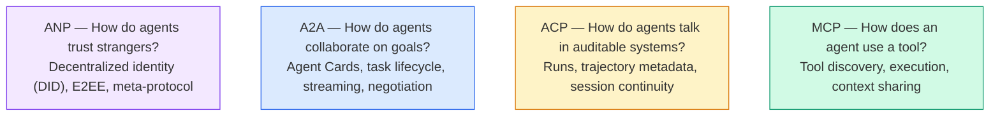

Ils ne sont pas des concurrents. Ils résolvent des problèmes différents à différents niveaux.

### MCP(回顾)

MCP a mené une étude approfondie à la 13e étape.**客户端-服务器**协议,代理(客户端) trouvé并调用服务器公开的工具──

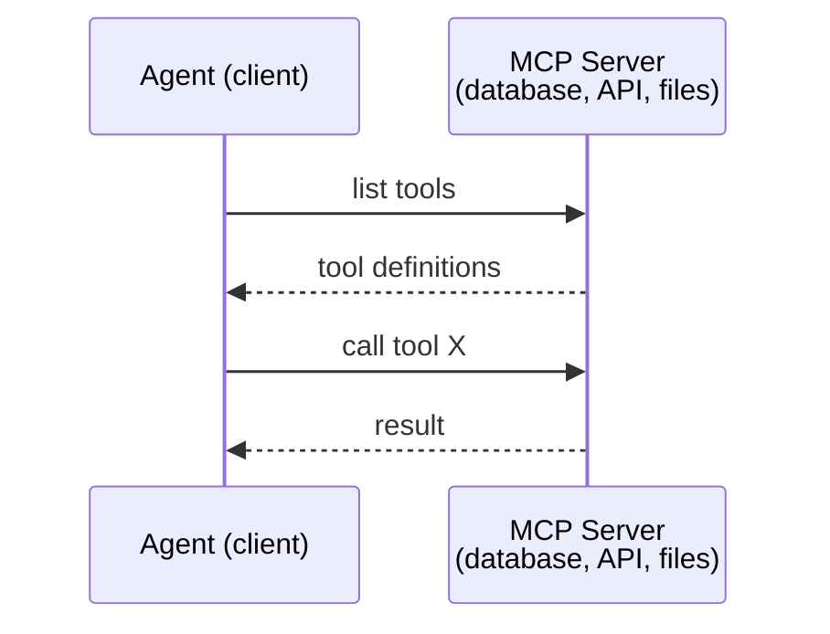

MCP est**代理到工具**Il n'aide pas les agents à s'entretenir.

### A2A(Agent2Agent 协议)

**创建者：**Google est maintenant affilié à Linux 基金会, nommé `lf.a2a.v1`)
**规格版本：**1.0.0
**问题：**Comment les agents autonomes peuvent-ils coopérer, négocier et déléguer des tâches ?

A2A est**点对点代理协作**Le MCP va connecter l'agent à l'outil, tandis qu'A2A va connecter l'agent à l'autre agent.**代理卡**Les autres agents le trouveront, en consultation avec lui et en délégueront les tâches de leur commission.

#### A2A

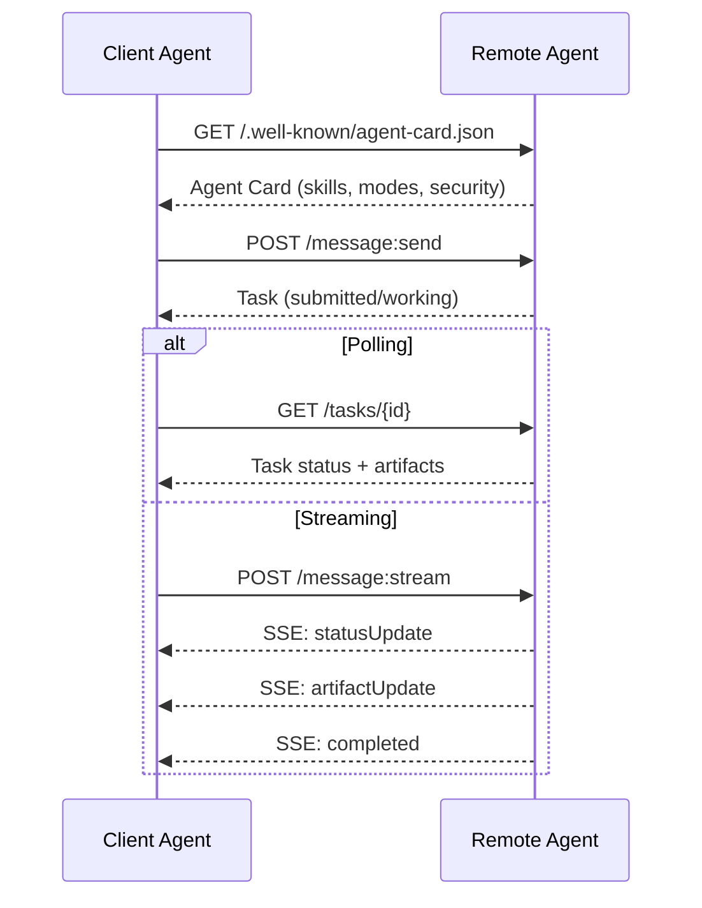

#### Une vraie carte de crédit

C'est le modèle de la carte A2A.`GET /.well-known/agent-card.json`- Le numéro de la liste:

```json
{
  "name": "Research Agent",
  "description": "Searches documentation and summarizes findings",
  "version": "1.0.0",
  "supportedInterfaces": [
    {
      "url": "https://research-agent.example.com/a2a/v1",
      "protocolBinding": "JSONRPC",
      "protocolVersion": "1.0"
    },
    {
      "url": "https://research-agent.example.com/a2a/rest",
      "protocolBinding": "HTTP+JSON",
      "protocolVersion": "1.0"
    }
  ],
  "provider": {
    "organization": "Your Company",
    "url": "https://example.com"
  },
  "capabilities": {
    "streaming": true,
    "pushNotifications": false
  },
  "defaultInputModes": ["text/plain", "application/json"],
  "defaultOutputModes": ["text/plain", "application/json"],
  "skills": [
    {
      "id": "web-research",
      "name": "Web Research",
      "description": "Searches the web and synthesizes findings",
      "tags": ["research", "search", "summarization"],
      "examples": ["Research the latest changes in React 19"]
    },
    {
      "id": "doc-analysis",
      "name": "Documentation Analysis",
      "description": "Reads and analyzes technical documentation",
      "tags": ["docs", "analysis"],
      "inputModes": ["text/plain", "application/pdf"],
      "outputModes": ["application/json"]
    }
  ],
  "securitySchemes": {
    "bearer": {
      "httpAuthSecurityScheme": {
        "scheme": "Bearer",
        "bearerFormat": "JWT"
      }
    }
  },
  "security": [{ "bearer": [] }]
}
```

需要注意的关键事项:
- **技能**C'est ce que le client peut faire. Chacun a un ID, un étiquette et un type MIME d'entrée/sortie supporté. C'est ainsi que l'agent client décide si l'agent à distance peut traiter sa demande.
- **supportedInterfaces**列出多个协议绑定;; un seul agent peut utiliser simultanément JSON-RPC、REST 和 gRPC;;
- **安全**Le client a besoin d'un certificat d'identité avant de faire une seule demande.

#### 任务生命周期

任务是 A2A's core work units. Elles traversent un état défini:

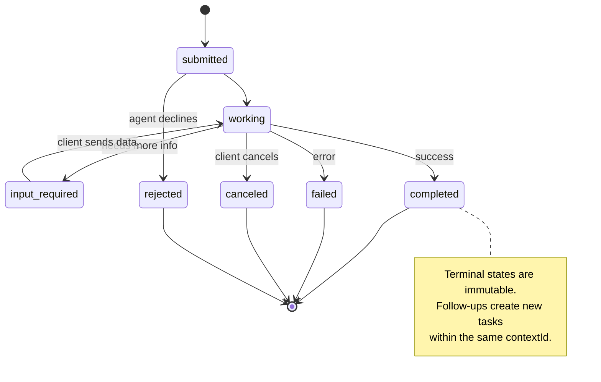

Toutes les 8 états sont définis dans la réglementation.`UNSPECIFIED`作为哨兵, ici省略):

|状态|终端？ |意义|
|---|---|---|
| `TASK_STATE_SUBMITTED` |没有 |已确认，尚未处理 |
| `TASK_STATE_WORKING` |没有 |正在积极处理中 |
| `TASK_STATE_INPUT_REQUIRED` |没有 |代理需要客户提供更多信息 |
| `TASK_STATE_AUTH_REQUIRED` |没有 |需要认证 |
| `TASK_STATE_COMPLETED` |是的 |顺利完成 |
| `TASK_STATE_FAILED` |是的 |已完成但有错误 |
| `TASK_STATE_CANCELED` |是的 |完成前取消 |
| `TASK_STATE_REJECTED` |是的 |特工拒绝了任务|

Une fois que la tâche atteint son état final, elle est invariable.`contextId`Je vais créer une nouvelle mission.

#### Il y a une ligne

A2A utilise JSON-RPC 2.0... le véritable échange de messages est comme suit:

**客户端发送任务：**
```json
{
  "jsonrpc": "2.0",
  "id": 1,
  "method": "SendMessage",
  "params": {
    "message": {
      "messageId": "msg-001",
      "role": "ROLE_USER",
      "parts": [{ "text": "Research React 19 compiler features" }]
    },
    "configuration": {
      "acceptedOutputModes": ["text/plain", "application/json"],
      "historyLength": 10
    }
  }
}
```

**代理响应任务：**
```json
{
  "jsonrpc": "2.0",
  "id": 1,
  "result": {
    "task": {
      "id": "task-abc-123",
      "contextId": "ctx-xyz-789",
      "status": {
        "state": "TASK_STATE_COMPLETED",
        "timestamp": "2026-03-27T10:30:00Z"
      },
      "artifacts": [
        {
          "artifactId": "art-001",
          "name": "research-results",
          "parts": [{
            "data": {
              "findings": [
                "React 19 compiler auto-memoizes components",
                "No more manual useMemo/useCallback needed",
                "Compiler runs at build time, not runtime"
              ]
            },
            "mediaType": "application/json"
          }]
        }
      ]
    }
  }
}
```

**通过 SSE 流式传输：**
```text
POST /message:stream HTTP/1.1
Content-Type: application/json
A2A-Version: 1.0

data: {"task":{"id":"task-123","status":{"state":"TASK_STATE_WORKING"}}}

data: {"statusUpdate":{"taskId":"task-123","status":{"state":"TASK_STATE_WORKING","message":{"role":"ROLE_AGENT","parts":[{"text":"Searching documentation..."}]}}}}

data: {"artifactUpdate":{"taskId":"task-123","artifact":{"artifactId":"art-1","parts":[{"text":"partial findings..."}]},"append":true,"lastChunk":false}}

data: {"statusUpdate":{"taskId":"task-123","status":{"state":"TASK_STATE_COMPLETED"}}}
```

### ACP (accord de communication par l'intermédiaire de l'ACP)

**创建者：**IBM / BeeAI
**规范版本：**Les données de l'application doivent être fournies à l'utilisateur.
**状态：**合并到Linux 基金会 sous le nom de A2A
**问题：**Comment les agents peuvent-ils communiquer en toute vérification, en toute continuité et en toute trace de traces ?

ACP est**企业协议** Contrairement à de nombreuses affirmations, ACP **不**Utilisez JSON-LD. Il est défini par OpenAPI en utilisant une simple REST/JSON API.**TrajectoryMetadata**Chaque réponse peut être portée avec elle pour la générer.

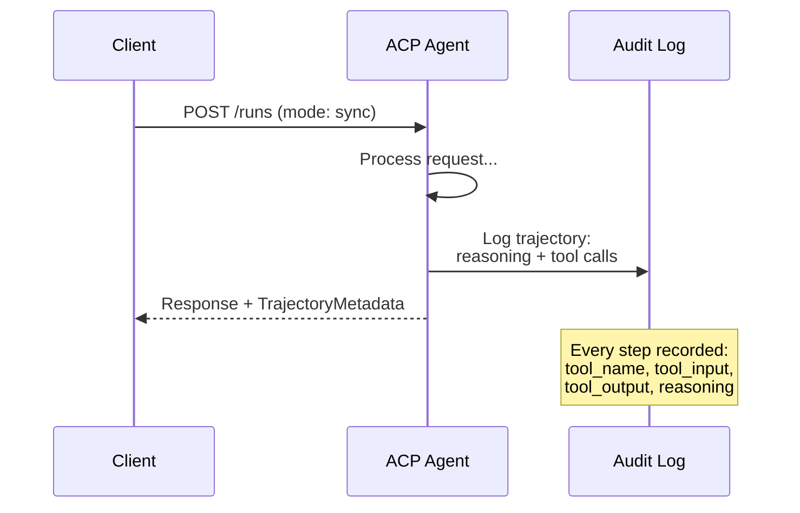

#### Découverte des agents actifs au sein de l'ACP

L'ACP a défini quatre méthodes de découverte:

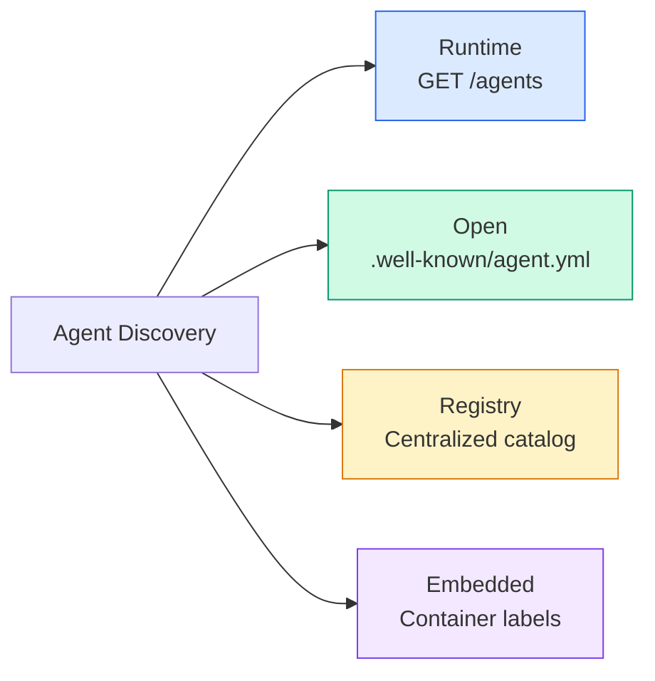

**AgentManifest**Plus simple que le compte d'A2A:

```json
{
  "name": "summarizer",
  "description": "Summarizes documents with source citations",
  "input_content_types": ["text/plain", "application/pdf"],
  "output_content_types": ["text/plain", "application/json"],
  "metadata": {
    "tags": ["summarization", "RAG"],
    "framework": "BeeAI",
    "capabilities": [
      {
        "name": "Document Summarization",
        "description": "Condenses long documents into key points"
      }
    ],
    "recommended_models": ["llama3.3:70b-instruct-fp16"],
    "license": "Apache-2.0",
    "programming_language": "Python"
  }
}
```

#### 运行 cycle de vie

Utilisation ACP 运行 plutôt que 任务──Run est une exécution par voie de trois modes:

|模式|行为 |
|---|---|
| `sync` |阻塞。响应包含完整的结果。 |
| `async` |立即返回 202。轮询 `GET /runs/{id}` 的状态。 |
| `stream` | SSE 流。事件在代理工作时触发。 |

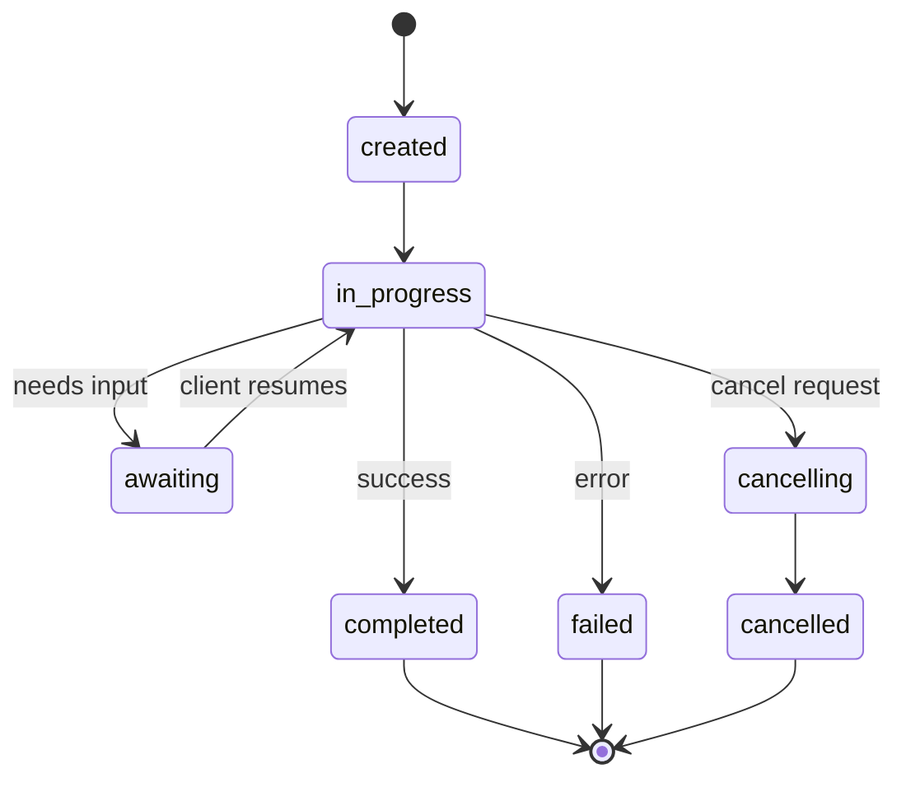

#### TrajectorieMéta-données (la mise en œuvre de l'enquête)

C'est un facteur clé de différenciation de l'ACP. Chaque partie du message peut contenir des données précises sur les opérations effectuées par les agents:

```json
{
  "role": "agent/researcher",
  "parts": [
    {
      "content_type": "text/plain",
      "content": "The weather in San Francisco is 72F and sunny.",
      "metadata": {
        "kind": "trajectory",
        "message": "I need to check the weather for this location",
        "tool_name": "weather_api",
        "tool_input": { "location": "San Francisco, CA" },
        "tool_output": { "temperature": 72, "condition": "sunny" }
      }
    }
  ]
}
```

Pour les industries réglementées, c'est de l'or. Chaque réponse est dotée d'une chaîne de raisonnement éprouvable: quels outils ont été utilisés, quels types d'entrées ont été utilisés, quels types de sorties ont été reçus.

ACP et soutien**CitationMetadata** pour obtenir des résultats:

```json
{
  "kind": "citation",
  "start_index": 0,
  "end_index": 47,
  "url": "https://weather.gov/sf",
  "title": "NWS San Francisco Forecast"
}
```

### ANP(prothèque de réseau)

**创建者：**开源社区(常高伟创办)
**仓库：** [github.com/agent-network-protocol/AgentNetworkProtocol](https://github.com/agent-network-protocol/AgentNetworkProtocol)
**问题：**Comment les agents de différentes organisations peuvent-ils se faire confiance sans autorité centrale ?

ANP est**去中心化身份协议** Il utilise le W3C Décentralisé Identifiant (DID) et le cryptage de bout en bout pour établir la confiance.

ANP分为三层:

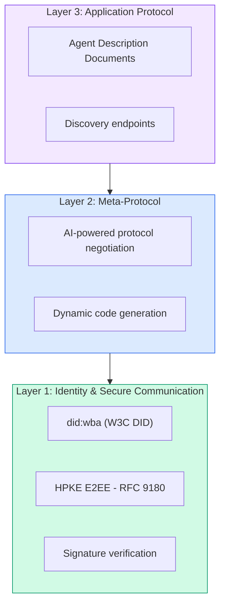

#### Il y a une autre structure.

ANP 使用名为 `did:wba`(basé sur le Web 代理)`did:wba:example.com:user:alice`解析为 `https://example.com/user/alice/did.json`- Le numéro de la liste:

```json
{
  "@context": [
    "https://www.w3.org/ns/did/v1",
    "https://w3id.org/security/suites/jws-2020/v1",
    "https://w3id.org/security/suites/secp256k1-2019/v1"
  ],
  "id": "did:wba:example.com:user:alice",
  "verificationMethod": [
    {
      "id": "did:wba:example.com:user:alice#key-1",
      "type": "EcdsaSecp256k1VerificationKey2019",
      "controller": "did:wba:example.com:user:alice",
      "publicKeyJwk": {
        "crv": "secp256k1",
        "x": "NtngWpJUr-rlNNbs0u-Aa8e16OwSJu6UiFf0Rdo1oJ4",
        "y": "qN1jKupJlFsPFc1UkWinqljv4YE0mq_Ickwnjgasvmo",
        "kty": "EC"
      }
    },
    {
      "id": "did:wba:example.com:user:alice#key-x25519-1",
      "type": "X25519KeyAgreementKey2019",
      "controller": "did:wba:example.com:user:alice",
      "publicKeyMultibase": "z9hFgmPVfmBZwRvFEyniQDBkz9LmV7gDEqytWyGZLmDXE"
    }
  ],
  "authentication": [
    "did:wba:example.com:user:alice#key-1"
  ],
  "keyAgreement": [
    "did:wba:example.com:user:alice#key-x25519-1"
  ],
  "humanAuthorization": [
    "did:wba:example.com:user:alice#key-1"
  ],
  "service": [
    {
      "id": "did:wba:example.com:user:alice#agent-description",
      "type": "AgentDescription",
      "serviceEndpoint": "https://example.com/agents/alice/ad.json"
    }
  ]
}
```

需要注意的关键事项:
- 强制执行**密钥分离** la clé de signature (secp256k1) et la clé de mise en valeur (X25519) sont séparées.
- **`humanAuthorization`**Les opérations de transfert de fonds et autres opérations de risque sont effectuées par ce chemin.
- **`keyAgreement`**密钥用于 HPKE 端到端加密 (RFC 9180)
- **服务**部分链接到代理描述文档──

#### 信任在 ANP 中如何运作

ANP **不**La confiance est bilatérale et chaque interaction est vécue:

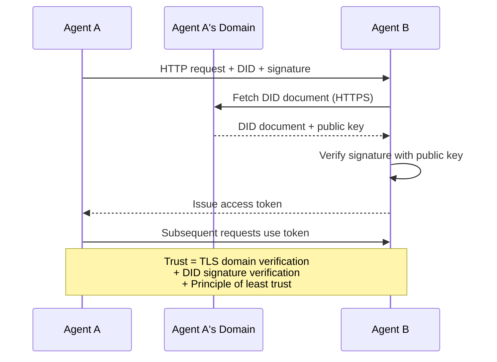

信任来自三个来源:
1. **域级 TLS**验证 DID 文档主机
2. **DID加密签名**验证代理身份
3. **最小信任原则** Seuls les pouvoirs minimaux sont accordés

 n'est pas basé sur la diffusion de la confiance ou PageRank 评分.

#### 元协议协商 Le débat est

C'est la dernière fonction de l'ANP. Lorsqu'il rencontre deux agents d'écosystèmes différents, ils n'ont pas besoin d'un format de données préalablement convenu.

```json
{
  "action": "protocolNegotiation",
  "sequenceId": 0,
  "candidateProtocols": "I can communicate using:\n1. JSON-RPC with hotel booking schema\n2. REST with OpenAPI 3.1 spec\n3. Natural language over HTTP",
  "modificationSummary": "Initial proposal",
  "status": "negotiating"
}
```

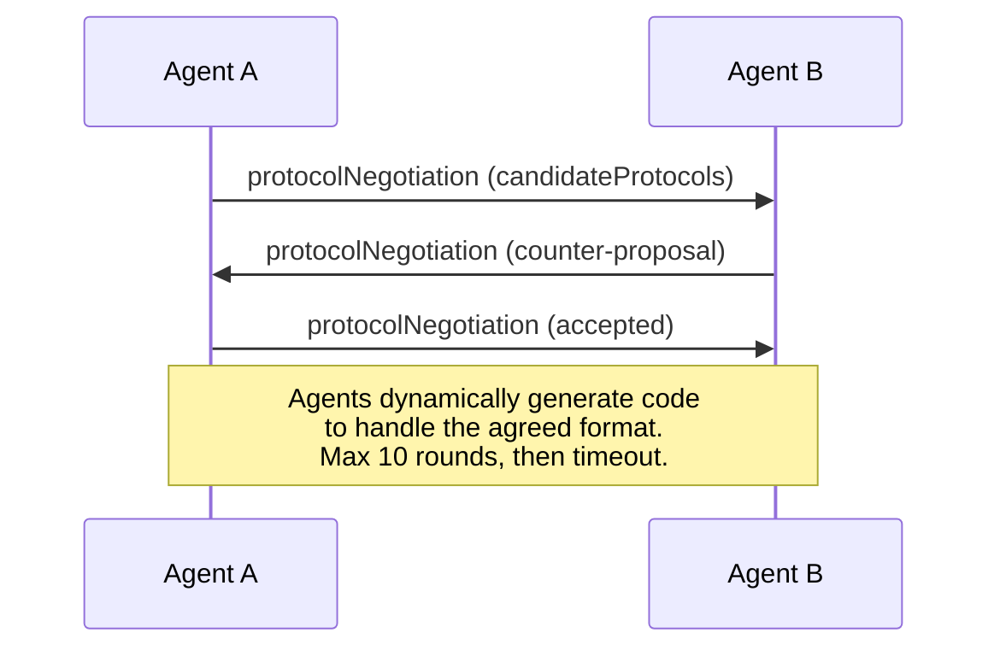

代理来回 (maximum 10 r) jusqu'à ce que le format soit convenu, puis le mode génère le code pour le traiter.`negotiating`- Je suis là.`rejected`- Je suis là.`accepted`- Je suis là.`timeout`Il y a une autre.

Cela signifie que deux agents qui ne se sont jamais vus auparavant peuvent comprendre comment communiquer sans que personne définisse à l'avance le mode de partage.

### Pour le coup, je suis là.

| | MCP| A2A |非加太 |心钠素 |
|---|---|---|---|---|
| **创建者** |人择 |谷歌/Linux基金会| IBM/BeeAI |社区 |
| **规格格式** | JSON-RPC | JSON-RPC / REST / gRPC | OpenAPI 3.1（休息）| JSON-RPC |
| **主要用途** |代理到工具 |代理对代理|代理对代理|代理对代理|
| **发现** |工具清单 | `/.well-known/agent-card.json` | `GET /agents`、`/.well-known/agent.yml` | `/.well-known/agent-descriptions`，DID服务端点|
| **身份** |隐式（本地）|安全方案（OAuth、mTLS）|服务器级| W3C DID (`did:wba`) 与 E2EE |
| **审计追踪** |不适用 |基本（任务历史记录）| TrajectoryMetadata（工具调用、推理） |未正式指定 |
| **状态机** |不适用 | 9 种任务状态 | 7 种运行状态 |不适用 |
| **流媒体** |不适用 |上交所 |上交所 |与传输无关 |
| **独特的功能** |工具模式|特工卡+技能|轨迹审计追踪|元协议协商|
| **最适合** |工具和数据|动态协作 |受监管行业 |跨组织信任 |
| **状态** |稳定|稳定（v1.0）|合并到A2A |积极发展|

### Comment ils coopèrent

Ces accords ne se sont pas mutuellement exclus.

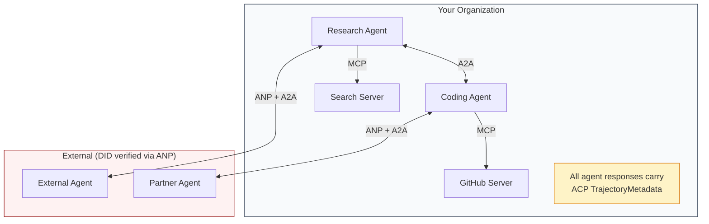

- **MCP**Chaque agent sera connecté à son outil
- **A2A**处理代理之间的协作(内部和外部)
- **ACP**Réponse à l'emballage dans les données de la trajectoire pour atteindre l'audit
- **ANP**Pour vous rendre compte de l'identité de votre agent que vous ne pouvez pas contrôler


```figure
swarm-message-bus
```

## - Je le construis.

### Section 1 - type de message central

Chaque système multi-agent est basé sur le format de message.

```typescript
import crypto from "node:crypto";

type MessageRole = "user" | "agent";

type MessagePart =
  | { kind: "text"; text: string }
  | { kind: "data"; data: unknown; mediaType: string }
  | { kind: "file"; name: string; url: string; mediaType: string };

type TrajectoryEntry = {
  reasoning: string;
  toolName?: string;
  toolInput?: unknown;
  toolOutput?: unknown;
  timestamp: number;
};

type AgentMessage = {
  id: string;
  role: MessageRole;
  parts: MessagePart[];
  trajectory?: TrajectoryEntry[];
  replyTo?: string;
  timestamp: number;
};

function createMessage(
  role: MessageRole,
  parts: MessagePart[],
  replyTo?: string
): AgentMessage {
  return {
    id: crypto.randomUUID(),
    role,
    parts,
    replyTo,
    timestamp: Date.now(),
  };
}

function textMessage(role: MessageRole, text: string): AgentMessage {
  return createMessage(role, [{ kind: "text", text }]);
}
```

Attention !`MessagePart`Il existe de nombreux modèles de données structurées, tels que les réels A2A et ACP.`TrajectoryEntry` capturer la chaîne de calcul, correspondre à la trajectoire des ACP

### Deuxième étape: A2A 代理卡和注册

Construire conforme à la réelle A2A 规范的代理发现:

```typescript
type Skill = {
  id: string;
  name: string;
  description: string;
  tags: string[];
  inputModes: string[];
  outputModes: string[];
};

type AgentCard = {
  name: string;
  description: string;
  version: string;
  url: string;
  capabilities: {
    streaming: boolean;
    pushNotifications: boolean;
  };
  defaultInputModes: string[];
  defaultOutputModes: string[];
  skills: Skill[];
};

class AgentRegistry {
  private cards: Map<string, AgentCard> = new Map();

  register(card: AgentCard) {
    this.cards.set(card.name, card);
  }

  discoverBySkillTag(tag: string): AgentCard[] {
    return [...this.cards.values()].filter((card) =>
      card.skills.some((skill) => skill.tags.includes(tag))
    );
  }

  discoverByInputMode(mimeType: string): AgentCard[] {
    return [...this.cards.values()].filter(
      (card) =>
        card.defaultInputModes.includes(mimeType) ||
        card.skills.some((skill) => skill.inputModes.includes(mimeType))
    );
  }

  resolve(name: string): AgentCard | undefined {
    return this.cards.get(name);
  }

  listAll(): AgentCard[] {
    return [...this.cards.values()];
  }
}
```

Vous pouvez trouver un agent par le biais de la saisie de la fonctionnalité de la marque de compétences, de la type MIME ou du nom de l'agent, comme le fait le vrai A2A.

### 步骤 3: A2A  cycle de vie de l'opération

构建完整的任务状态机:

```typescript
type TaskState =
  | "submitted"
  | "working"
  | "input-required"
  | "auth-required"
  | "completed"
  | "failed"
  | "canceled"
  | "rejected";

const TERMINAL_STATES: TaskState[] = [
  "completed",
  "failed",
  "canceled",
  "rejected",
];

type TaskStatus = {
  state: TaskState;
  message?: AgentMessage;
  timestamp: number;
};

type Artifact = {
  id: string;
  name: string;
  parts: MessagePart[];
};

type Task = {
  id: string;
  contextId: string;
  status: TaskStatus;
  artifacts: Artifact[];
  history: AgentMessage[];
};

type TaskEvent =
  | { kind: "statusUpdate"; taskId: string; status: TaskStatus }
  | {
      kind: "artifactUpdate";
      taskId: string;
      artifact: Artifact;
      append: boolean;
      lastChunk: boolean;
    };

type TaskHandler = (
  task: Task,
  message: AgentMessage
) => AsyncGenerator<TaskEvent>;

class TaskManager {
  private tasks: Map<string, Task> = new Map();
  private handlers: Map<string, TaskHandler> = new Map();
  private listeners: Map<string, ((event: TaskEvent) => void)[]> = new Map();

  registerHandler(agentName: string, handler: TaskHandler) {
    this.handlers.set(agentName, handler);
  }

  subscribe(taskId: string, listener: (event: TaskEvent) => void) {
    const existing = this.listeners.get(taskId) ?? [];
    existing.push(listener);
    this.listeners.set(taskId, existing);
  }

  async sendMessage(
    agentName: string,
    message: AgentMessage,
    contextId?: string
  ): Promise<Task> {
    const handler = this.handlers.get(agentName);
    if (!handler) {
      const task = this.createTask(contextId);
      task.status = {
        state: "rejected",
        timestamp: Date.now(),
        message: textMessage("agent", `No handler for ${agentName}`),
      };
      return task;
    }

    const task = this.createTask(contextId);
    task.history.push(message);
    task.status = { state: "submitted", timestamp: Date.now() };

    this.processTask(task, handler, message).catch((err) => {
      task.status = {
        state: "failed",
        timestamp: Date.now(),
        message: textMessage("agent", String(err)),
      };
    });
    return task;
  }

  getTask(taskId: string): Task | undefined {
    return this.tasks.get(taskId);
  }

  cancelTask(taskId: string): boolean {
    const task = this.tasks.get(taskId);
    if (!task || TERMINAL_STATES.includes(task.status.state)) return false;
    task.status = { state: "canceled", timestamp: Date.now() };
    this.emit(taskId, {
      kind: "statusUpdate",
      taskId,
      status: task.status,
    });
    return true;
  }

  private createTask(contextId?: string): Task {
    const task: Task = {
      id: crypto.randomUUID(),
      contextId: contextId ?? crypto.randomUUID(),
      status: { state: "submitted", timestamp: Date.now() },
      artifacts: [],
      history: [],
    };
    this.tasks.set(task.id, task);
    return task;
  }

  private async processTask(
    task: Task,
    handler: TaskHandler,
    message: AgentMessage
  ) {
    task.status = { state: "working", timestamp: Date.now() };
    this.emit(task.id, {
      kind: "statusUpdate",
      taskId: task.id,
      status: task.status,
    });

    try {
      for await (const event of handler(task, message)) {
        if (TERMINAL_STATES.includes(task.status.state)) break;

        if (event.kind === "statusUpdate") {
          task.status = event.status;
        }
        if (event.kind === "artifactUpdate") {
          const existing = task.artifacts.find(
            (a) => a.id === event.artifact.id
          );
          if (existing && event.append) {
            existing.parts.push(...event.artifact.parts);
          } else {
            task.artifacts.push(event.artifact);
          }
        }
        this.emit(task.id, event);
      }
    } catch (err) {
      task.status = {
        state: "failed",
        timestamp: Date.now(),
        message: textMessage("agent", String(err)),
      };
      this.emit(task.id, {
        kind: "statusUpdate",
        taskId: task.id,
        status: task.status,
      });
    }
  }

  private emit(taskId: string, event: TaskEvent) {
    for (const listener of this.listeners.get(taskId) ?? []) {
      listener(event);
    }
  }
}
```

Il a réalisé un véritable cycle de vie de tâche A2A: déjà soumis, en cours de travail, nécessaire à l'entrée, état final. Le processus de traitement est un générateur de phases différentes, pouvant être généré avec des événements correspondants au modèle SSE.

### 步骤 4: suivi de l'audit de l'ACP

通过轨迹跟踪包裹通信:

```typescript
type AuditEntry = {
  runId: string;
  agentName: string;
  input: AgentMessage[];
  output: AgentMessage[];
  trajectory: TrajectoryEntry[];
  status: "created" | "in-progress" | "completed" | "failed" | "awaiting";
  startedAt: number;
  completedAt?: number;
  sessionId?: string;
};

class AuditableRunner {
  private log: AuditEntry[] = [];
  private handlers: Map<
    string,
    (input: AgentMessage[]) => Promise<{
      output: AgentMessage[];
      trajectory: TrajectoryEntry[];
    }>
  > = new Map();

  registerAgent(
    name: string,
    handler: (input: AgentMessage[]) => Promise<{
      output: AgentMessage[];
      trajectory: TrajectoryEntry[];
    }>
  ) {
    this.handlers.set(name, handler);
  }

  async run(
    agentName: string,
    input: AgentMessage[],
    sessionId?: string
  ): Promise<AuditEntry> {
    const entry: AuditEntry = {
      runId: crypto.randomUUID(),
      agentName,
      input: structuredClone(input),
      output: [],
      trajectory: [],
      status: "created",
      startedAt: Date.now(),
      sessionId,
    };
    this.log.push(entry);

    const handler = this.handlers.get(agentName);
    if (!handler) {
      entry.status = "failed";
      return entry;
    }

    entry.status = "in-progress";
    try {
      const result = await handler(input);
      entry.output = structuredClone(result.output);
      entry.trajectory = structuredClone(result.trajectory);
      entry.status = "completed";
      entry.completedAt = Date.now();
    } catch (err) {
      entry.status = "failed";
      entry.trajectory.push({
        reasoning: `Error: ${String(err)}`,
        timestamp: Date.now(),
      });
      entry.completedAt = Date.now();
    }
    return entry;
  }

  getFullAuditLog(): AuditEntry[] {
    return structuredClone(this.log);
  }

  getAuditLogForAgent(agentName: string): AuditEntry[] {
    return structuredClone(
      this.log.filter((e) => e.agentName === agentName)
    );
  }

  getAuditLogForSession(sessionId: string): AuditEntry[] {
    return structuredClone(
      this.log.filter((e) => e.sessionId === sessionId)
    );
  }

  getTrajectoryForRun(runId: string): TrajectoryEntry[] {
    const entry = this.log.find((e) => e.runId === runId);
    return entry ? structuredClone(entry.trajectory) : [];
  }
}
```

Chaque fois que l'agent exécute une enquête, il est possible de procéder à une enquête en tant qu'agent, en tant que consultant ou en tant que fonctionnaire.

### 步骤 5: Certificat d'identité de l'ANP

Construire une base d'identité et d'authentification de l'IDD:

```typescript
type VerificationMethod = {
  id: string;
  type: string;
  controller: string;
  publicKeyDer: string;
};

type DIDDocument = {
  id: string;
  verificationMethod: VerificationMethod[];
  authentication: string[];
  keyAgreement: string[];
  humanAuthorization: string[];
  service: { id: string; type: string; serviceEndpoint: string }[];
};

type AgentIdentity = {
  did: string;
  document: DIDDocument;
  privateKey: crypto.KeyObject;
  publicKey: crypto.KeyObject;
};

class IdentityRegistry {
  private documents: Map<string, DIDDocument> = new Map();

  publish(doc: DIDDocument) {
    this.documents.set(doc.id, doc);
  }

  resolve(did: string): DIDDocument | undefined {
    return this.documents.get(did);
  }

  verify(did: string, signature: string, payload: string): boolean {
    const doc = this.documents.get(did);
    if (!doc) return false;

    const authKeyIds = doc.authentication;
    const authKeys = doc.verificationMethod.filter((vm) =>
      authKeyIds.includes(vm.id)
    );

    for (const key of authKeys) {
      const publicKey = crypto.createPublicKey({
        key: Buffer.from(key.publicKeyDer, "base64"),
        format: "der",
        type: "spki",
      });
      const isValid = crypto.verify(
        null,
        Buffer.from(payload),
        publicKey,
        Buffer.from(signature, "hex")
      );
      if (isValid) return true;
    }
    return false;
  }

  requiresHumanAuth(did: string, operationKeyId: string): boolean {
    const doc = this.documents.get(did);
    if (!doc) return false;
    return doc.humanAuthorization.includes(operationKeyId);
  }
}

function createIdentity(domain: string, agentName: string): AgentIdentity {
  const did = `did:wba:${domain}:agent:${agentName}`;
  const { publicKey, privateKey } = crypto.generateKeyPairSync("ed25519");

  const publicKeyDer = publicKey
    .export({ format: "der", type: "spki" })
    .toString("base64");

  const keyId = `${did}#key-1`;
  const encKeyId = `${did}#key-x25519-1`;

  const document: DIDDocument = {
    id: did,
    verificationMethod: [
      {
        id: keyId,
        type: "Ed25519VerificationKey2020",
        controller: did,
        publicKeyDer,
      },
      {
        id: encKeyId,
        type: "X25519KeyAgreementKey2019",
        controller: did,
        publicKeyDer,
      },
    ],
    authentication: [keyId],
    keyAgreement: [encKeyId],
    humanAuthorization: [],
    service: [
      {
        id: `${did}#agent-description`,
        type: "AgentDescription",
        serviceEndpoint: `https://${domain}/agents/${agentName}/ad.json`,
      },
    ],
  };

  return { did, document, privateKey, publicKey };
}

function signPayload(identity: AgentIdentity, payload: string): string {
  return crypto
    .sign(null, Buffer.from(payload), identity.privateKey)
    .toString("hex");
}
```

Cela reflète le véritable modèle d'identité de l'ANP: l'agent possède un document DID avec une vérification d'identité unique, des clés consultées et des clés autorisées artificiellement.`IdentityRegistry`模拟 DID 解析 (en production, ce sera une prise HTTP pour le domaine de l'intermédiaire)

### 步骤 6: protocole de connexion

Connecter tous les quatre protocoles dans un système unifié:

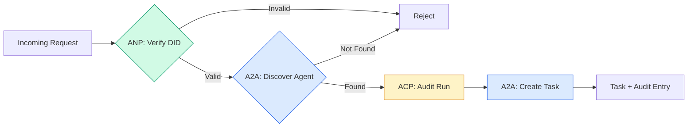

```typescript
class ProtocolGateway {
  private registry: AgentRegistry;
  private taskManager: TaskManager;
  private auditRunner: AuditableRunner;
  private identityRegistry: IdentityRegistry;

  constructor(
    registry: AgentRegistry,
    taskManager: TaskManager,
    auditRunner: AuditableRunner,
    identityRegistry: IdentityRegistry
  ) {
    this.registry = registry;
    this.taskManager = taskManager;
    this.auditRunner = auditRunner;
    this.identityRegistry = identityRegistry;
  }

  async delegateTask(
    fromDid: string,
    signature: string,
    targetAgent: string,
    message: AgentMessage,
    sessionId?: string
  ): Promise<{ task: Task; audit: AuditEntry } | { error: string }> {
    if (!this.identityRegistry.verify(fromDid, signature, message.id)) {
      return { error: "Identity verification failed" };
    }

    const card = this.registry.resolve(targetAgent);
    if (!card) {
      return { error: `Agent ${targetAgent} not found in registry` };
    }

    const audit = await this.auditRunner.run(
      targetAgent,
      [message],
      sessionId
    );
    const task = await this.taskManager.sendMessage(targetAgent, message);

    return { task, audit };
  }

  discoverAndDelegate(
    fromDid: string,
    signature: string,
    skillTag: string,
    message: AgentMessage
  ): Promise<{ task: Task; audit: AuditEntry } | { error: string }> {
    const candidates = this.registry.discoverBySkillTag(skillTag);
    if (candidates.length === 0) {
      return Promise.resolve({
        error: `No agents found with skill tag: ${skillTag}`,
      });
    }
    return this.delegateTask(
      fromDid,
      signature,
      candidates[0].name,
      message
    );
  }
}
```

网关在一次调用中完成四件事:
1. **ANP**: par le biais de la DID signé验证呼叫者身份
2. **A2A**: trouver objectif de l'agent并检查能力
3. **ACP**: exécuter le couvercle dans le cadre du suivi de l'audit de la trajet
4. **A2A**Créer des missions de suivi de tout cycle de vie

### Section 7 étape: les connecter ensemble

```typescript
async function protocolDemo() {
  const registry = new AgentRegistry();
  registry.register({
    name: "researcher",
    description: "Searches and summarizes findings",
    version: "1.0.0",
    url: "https://researcher.local/a2a/v1",
    capabilities: { streaming: true, pushNotifications: false },
    defaultInputModes: ["text/plain"],
    defaultOutputModes: ["text/plain", "application/json"],
    skills: [
      {
        id: "web-research",
        name: "Web Research",
        description: "Searches the web",
        tags: ["research", "search", "summarization"],
        inputModes: ["text/plain"],
        outputModes: ["application/json"],
      },
    ],
  });
  registry.register({
    name: "coder",
    description: "Writes code from specs",
    version: "1.0.0",
    url: "https://coder.local/a2a/v1",
    capabilities: { streaming: false, pushNotifications: false },
    defaultInputModes: ["text/plain", "application/json"],
    defaultOutputModes: ["text/plain"],
    skills: [
      {
        id: "code-gen",
        name: "Code Generation",
        description: "Generates code",
        tags: ["coding", "generation"],
        inputModes: ["text/plain", "application/json"],
        outputModes: ["text/plain"],
      },
    ],
  });

  const taskManager = new TaskManager();
  const auditRunner = new AuditableRunner();

  const researchTrajectory: TrajectoryEntry[] = [];

  taskManager.registerHandler(
    "researcher",
    async function* (task, message) {
      yield {
        kind: "statusUpdate" as const,
        taskId: task.id,
        status: { state: "working" as const, timestamp: Date.now() },
      };

      researchTrajectory.push({
        reasoning: "Searching for React 19 documentation",
        toolName: "web_search",
        toolInput: { query: "React 19 compiler features" },
        toolOutput: {
          results: ["react.dev/blog/react-19", "github.com/react/react"],
        },
        timestamp: Date.now(),
      });

      researchTrajectory.push({
        reasoning: "Extracting key findings from search results",
        toolName: "doc_analysis",
        toolInput: { url: "react.dev/blog/react-19" },
        toolOutput: {
          summary:
            "React 19 compiler auto-memoizes, no manual useMemo needed",
        },
        timestamp: Date.now(),
      });

      yield {
        kind: "artifactUpdate" as const,
        taskId: task.id,
        artifact: {
          id: crypto.randomUUID(),
          name: "research-results",
          parts: [
            {
              kind: "data" as const,
              data: {
                findings: [
                  "React 19 compiler auto-memoizes components",
                  "No more manual useMemo/useCallback needed",
                  "Compiler runs at build time, not runtime",
                ],
                sources: ["react.dev/blog/react-19"],
              },
              mediaType: "application/json",
            },
          ],
        },
        append: false,
        lastChunk: true,
      };

      yield {
        kind: "statusUpdate" as const,
        taskId: task.id,
        status: { state: "completed" as const, timestamp: Date.now() },
      };
    }
  );

  auditRunner.registerAgent("researcher", async () => ({
    output: [
      textMessage("agent", "React 19 compiler auto-memoizes components"),
    ],
    trajectory: researchTrajectory,
  }));

  const identityRegistry = new IdentityRegistry();

  const coderIdentity = createIdentity("coder.local", "coder");
  const researcherIdentity = createIdentity("researcher.local", "researcher");

  identityRegistry.publish(coderIdentity.document);
  identityRegistry.publish(researcherIdentity.document);

  const gateway = new ProtocolGateway(
    registry,
    taskManager,
    auditRunner,
    identityRegistry
  );

  console.log("=== Protocol Demo ===\n");

  console.log("1. Agent Discovery (A2A)");
  const researchAgents = registry.discoverBySkillTag("research");
  console.log(
    `   Found ${researchAgents.length} agent(s):`,
    researchAgents.map((a) => a.name)
  );

  console.log("\n2. Identity Verification (ANP)");
  const message = textMessage("user", "Research React 19 compiler features");
  const signature = signPayload(coderIdentity, message.id);
  const verified = identityRegistry.verify(
    coderIdentity.did,
    signature,
    message.id
  );
  console.log(`   Coder DID: ${coderIdentity.did}`);
  console.log(`   Signature verified: ${verified}`);

  console.log("\n3. Task Delegation (A2A + ACP + ANP)");
  const result = await gateway.delegateTask(
    coderIdentity.did,
    signature,
    "researcher",
    message,
    "session-001"
  );

  if ("error" in result) {
    console.log(`   Error: ${result.error}`);
    return;
  }

  console.log(`   Task ID: ${result.task.id}`);
  console.log(`   Task state: ${result.task.status.state}`);
  console.log(`   Artifacts: ${result.task.artifacts.length}`);

  console.log("\n4. Audit Trail (ACP)");
  console.log(`   Run ID: ${result.audit.runId}`);
  console.log(`   Status: ${result.audit.status}`);
  console.log(`   Trajectory steps: ${result.audit.trajectory.length}`);
  for (const step of result.audit.trajectory) {
    console.log(`     - ${step.reasoning}`);
    if (step.toolName) {
      console.log(`       Tool: ${step.toolName}`);
    }
  }

  console.log("\n5. Full Audit Log");
  const fullLog = auditRunner.getFullAuditLog();
  console.log(`   Total runs: ${fullLog.length}`);
  for (const entry of fullLog) {
    const duration = entry.completedAt
      ? `${entry.completedAt - entry.startedAt}ms`
      : "in-progress";
    console.log(`   ${entry.agentName}: ${entry.status} (${duration})`);
  }
}

protocolDemo().catch((err) => {
  console.error("Protocol demo failed:", err);
  process.exitCode = 1;
});
```

## Quel est le problème ?

Le protocole a résolu le chemin du bonheur.

**架构漂移。**代理 A 发布代理卡广告 `application/json`输出── mais la structure JSON varie entre les versions. 代理 B 解析旧形式并得到垃圾──修复:`version`Il y a une autre.

**状态机违规。**                                                                                                                                                                                                                                                                                                                                                                                                                                                                                                                             `completed`事件, puis essayez de générer plus de pièces. La tâche est inchangée.`TaskManager`Dans l' état de fin d' usage `break`Il est obligatoire d'exécuter cette opération.

**信任解析失败。**代理 A 尝试验证代理 B's DID, mais le domaine d'agent B est fermé.

**轨迹膨胀。**Les activités de l'ACP 轨迹记录功能强大,但价格昂贵.

**发现惊群。**50 agents en cours de mise en œuvre`GET /agents` Modification: utilisation de TTL 缓存代理卡、错开发现间隔或 utilisation basée sur l'enregistrement de la soumission plutôt que sur la demande de renseignements 

## Utilisez-le

###  réalisation concrète

**A2A**C'est le plus mature de Google.[官方spec](https://github.com/google/A2A)Si votre agent a besoin de détection et de collaboration dynamiques, commencez ici.

**ACP**Il est en train de se connecter à A2A.[BeeAI 项目](https://github.com/i-am-bee/acp) Créer ACP  comme alternative prioritaire à REST  mais le concept de données de trajectoires est en train d'être absorbé dans les systèmes de transport A2A .

**ANP**C'est le plus expérimental.[社区 repo](https://github.com/agent-network-protocol/AgentNetworkProtocol)Il existe un SDK Python (AgentConnect) ⋅concept de négociation de protocoles est vraiment nouveau ⋅ mérite d'être pris en compte ⋅

**MCP**已在第13 阶段涵盖──如果您希望代理使用工具,MCP是标准──

### 选择正确的协议

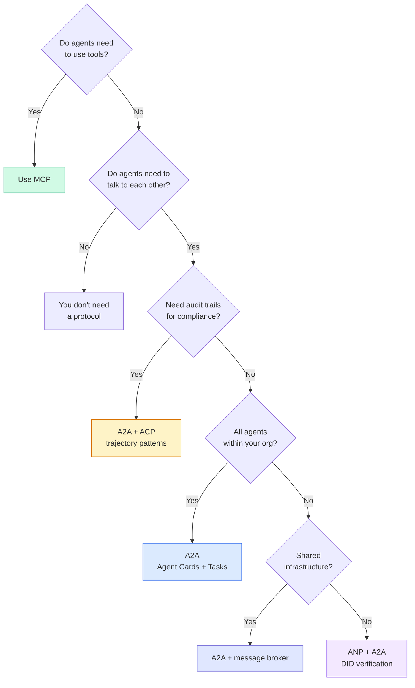

## 发货

本课产生:
- `code/main.ts`-- la réalisation complète de tous les quatre protocoles
- `outputs/prompt-protocol-selector.md` vous aider pour le système de sélection de protocole de conseils

## 练习

1. **多跳任务委托。**扩展 `TaskManager`Le chercheur reçoit une tâche, la recherche et le résumé de la tâche sont confiés à deux agents spécialistes, attendent que les deux soient achevés, puis les résultats sont combinés dans leur propre travail.

2. **流式审计跟踪。**修改`AuditableRunner`Il n'est pas nécessaire d'attendre le résultat complet, mais de mettre à jour la production en ajoutant des trajets à l'ordre du jour.`AuditEntry`◊ utiliser générer l'audit de rapidissement de l'analyse de l'analyse de l'analyse de l'analyse de l'analyse de l'analyse de l'analyse de l'analyse de l'analyse de l'analyse de l'analyse de l'analyse de l'analyse de l'analyse de l'analyse de l'analyse de l'analyse de l'analyse de l'analyse de l'analyse de l'analyse de l'analyse de l'analyse de l'analyse de l'analyse de l'analyse de l'analyse de l'analyse de l'analyse de l'analyse de l'analyse de l'analyse de l'analyse de l'analyse de l'analyse de l'analyse de l'analyse de l'analyse de l'analyse de l'analyse de l'analyse de l'analyse de l'analyse de l'analyse de l'analyse de l'analyse de l'analyse de l'analyse de l'analyse de l'analyse de l'analyse de l'analyse de l'analyse de l'analyse de l'analyse de l'analyse de l'analyse de l'analyse de l'analyse de l'analyse de la

3. **DID 轮换。**Pour changer de clé`IdentityRegistry` L'agent devrait pouvoir publier un nouveau document DID avec une clé de détection, tout en le conservant.`previousDid`引用── le vérificateur doit accepter la signature de la clé actuelle et de la clé antérieure dans un délai de grande durée──

4. **协议协商。**实施ANP的元协议概念── deux agents en échange de candidatures `protocolNegotiation`消息(, par exemple,我可以讲 JSON-RPC与我更喜欢 REST) .`TaskManager`Ou `AuditableRunner`Il y a une autre.

5. **速率限制发现。**添加 `RateLimitedRegistry`L'emballage, l'emballage utilise le TTL configurable 缓存代理卡查找,并限制每代理每秒的发现查询──模拟100代理在启动时发现彼此的惊群并测量差异──

## 关键术语

|术语 |人们怎么说|它实际上意味着什么 |
|------|----------------|----------------------|
| MCP| “人工智能工具协议”|供代理发现和使用工具的客户端-服务器协议。代理到工具，而不是代理到代理。 |
| A2A | 《Google 的代理协议》| Linux 基金会下用于代理协作的点对点协议。通过代理卡进行发现，9 状态任务生命周期，通过 SSE 进行流式传输。支持 JSON-RPC、REST 和 gRPC 绑定。 |
|非加太 | 《企业代理消息传递》 | IBM/BeeAI 的代理 REST API 与 TrajectoryMetadata 一起运行：每个响应都携带完整的推理和工具调用链。合并到A2A。 |
|心钠素 | “去中心化代理身份”|使用 `did:wba` (DID) 进行加密身份的社区协议、用于 E2EE 的 HPKE 以及用于从未见过对方的代理的人工智能元协议协商。 |
|代理卡| 《代理人的名片》| `/.well-known/agent-card.json` 上的 JSON 文档描述了技能、支持的 MIME 类型、安全方案和协议绑定。 |
|确实 | “去中心化ID” |用于在代理自己的域上托管的可加密验证身份的 W3C 标准。 ANP使用`did:wba`方法。 |
|轨迹元数据 | “审计收据”| ACP 的机制，用于将推理步骤、工具调用及其输入/输出附加到每个代理响应。 |
|元协议| “代理人谈判如何交谈”| ANP 的方法是，代理使用自然语言动态地就数据格式达成一致，然后生成代码来处理它们。 |
|任务| “一个工作单元” | A2A 的状态对象跟踪工作从提交到完成。一旦终端就不可变。 |

##  ultérieur

- [Google A2A 规范](https://github.com/google/A2A)-- 官方规范和 SDK(v1.0.0,Linux 基金会)
- [IBM/BeeAI ACP 规范](https://github.com/i-am-bee/acp)-- Les règles de l'OpenAPI 3.1 pour les opérations et les données de trajet
- [代理网络协议](https://github.com/agent-network-protocol/AgentNetworkProtocol)-- basé sur l'identité de la DID, E2EE,
- [模型上下文协议 docs](https://modelcontextprotocol.io/)-- MCP de l' anthropologie 规范(第 13 阶段涵盖)
- [W3C 去中心化标识符](https://www.w3.org/TR/did-core/)支 ANP's身份标准
- [RFC 9180 (HPKE)](https://www.rfc-editor.org/rfc/rfc9180)-- ANP utilisé pour le schéma de cryptage E2EE
- [FIPA代理通信语言](http://www.fipa.org/specs/fipa00061/SC00061G.html)现代代理协议的学术先驱
