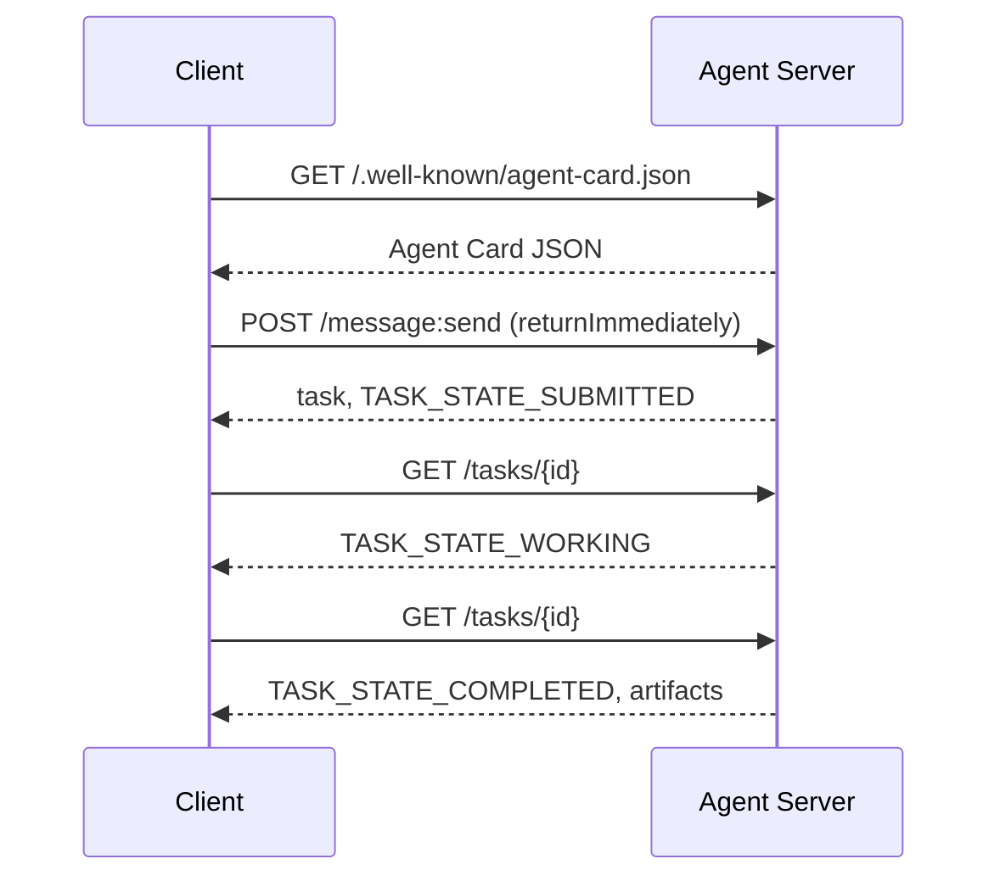

# A2A  智能体间通信协议(Protocol agent à agent)

> Google a publié A2A en avril 2025; jusqu'en avril 2026, les normes officielles ont été développées à 1.0.1, et ont obtenu le soutien de plus de 150 organisations, y compris AWS, Microsoft, Salesforce, etc. A2A est le protocole de complément horizontal du MCP: MCP 聚焦纵向 (MCP  Tools), tandis que A2A 聚焦横向点对点 (MCP  Agent)  A2A est utilisé pour détecter les tâches  Transporter des documents structurés  多模多媒体)                                                                                                                                                                                             

**Type:** Learn + Build
**Languages:** Python (stdlib, `http.server`, `json`)
**Prerequisites:** Phase 16 · 04（原语模型）
**Time:** ~75 分钟

## 问题背景

Lorsque votre agent a besoin de faire appel à un agent déployé dans un autre système ou une autre organisation, comment communiquer ? Vous pouvez définir un terminal HTTP spécialisé, définir un schéma JSON personnalisé et vous attendre à ce que les autres utilisent vos règles.

A2A pour ce type de transition offre un protocole de ligne communément utilisé (PROTOCOL) ⋅ Il définit la norme de service de découverte ‒ l'extraction de tâches standard ‒ la norme de liaison de transmission ainsi que les produits de sortie standard, tels que la base HTTP+REST qui est personnalisée pour les organismes intelligents ⋅

## 核心概念

### Quatre éléments principaux

**Agent Card（智能体名片）。**- Je le garde .`/.well-known/agent-card.json`Les données de l'Agence sont définies comme étant les données de l'Agence.`supportedInterfaces`(端点 URL、协议绑定、协议版本) 、默认输入和输出媒体类型, ainsi que les exigences de reconnaissance du droit de diffusion`securitySchemes`Avec `securityRequirements`••••••••••••••••••••••••••••••••••••••••••••••••••••••••••••••••••••••••••••••••••••••••••••••••••••••••••••••••••••••••••••••••••••••••••••••••••••••••••••••••••••••••••••••••••••••••••••••••••••••••••••••••••••••••••••••••••••••••••••••••••••••••••••••••••••••••••••••••••••••••••••••••••••••••••••••••••••••••••••••••••••••••••••••••••••••••••••••••••••••••••••••••••••••••••••••••••••••••••••••••••••••••••••••••••••••••••••••••••••••••••••••••••••••••••••••••••••••••••••••••••••••••••••••••••••••••••••••

```http
GET /.well-known/agent-card.json HTTP/1.1
Host: agent.example.com
```

```json
{
  "name": "code-review-agent",
  "description": "审查 Python 与 TypeScript 代码。",
  "version": "1.0.0",
  "supportedInterfaces": [
    {
      "url": "https://agent.example.com",
      "protocolBinding": "HTTP+JSON",
      "protocolVersion": "1.0"
    }
  ],
  "capabilities": {"streaming": false, "pushNotifications": false},
  "securitySchemes": {
    "bearer": {"httpAuthSecurityScheme": {"scheme": "Bearer"}}
  },
  "securityRequirements": [{"schemes": {"bearer": {"list": []}}}],
  "defaultInputModes": ["text/plain", "application/json"],
  "defaultOutputModes": ["application/json"],
  "skills": [
    {
      "id": "review-python",
      "name": "审查 Python 代码",
      "description": "审查传入的 Python 源码并给出改进建议。",
      "tags": ["code-review", "python"]
    },
    {
      "id": "review-typescript",
      "name": "审查 TypeScript 代码",
      "description": "审查传入的 TypeScript 源码并给出类型与逻辑改进建议。",
      "tags": ["code-review", "typescript"]
    }
  ]
}
```

**Task（任务）。**Unité de travail de base. Un objet en état différent ayant un cycle de vie:`TASK_STATE_SUBMITTED`- Je suis là.`TASK_STATE_WORKING`- Je suis là.`TASK_STATE_COMPLETED`- Je suis là .`TASK_STATE_FAILED`- Je suis là .`TASK_STATE_CANCELED` Client 发送消息,Server 创建任务,随后客户端 通过轮询或流式订阅获取更新──

**Artifact（产物）。**Les travaux sont réalisés en fonction de la structure des éléments de la structure de l'art.`text`- Je suis là.`raw`- Je suis là.`url`Ou `data`之一并可指明其 `mediaType`Il y a une autre.

**不透明生命周期（Opaque Lifecycle）。**A2A 绝不规定远程代理 *内部*如何完成任务──客户 仅观察状态转换与最终产品;被调用方完全自由选择任何底层模型和框架──

### MCP et A2A

- **MCP**:Agent  Outil。Agent 借助 JSON-RPC 读写工具 Server,核心完全无状态。
- **A2A**:Agent  Agent。 contre et par rapport à l'accord de coopération, les deux parties de la communication sont tous des êtres intelligents dotés d'une capacité de raisonnement indépendante。

Dans la production de systèmes multi-intelligents, les deux sont associés: A2A pour le terminal à côté de lui-même pour utiliser des outils MCP de configuration locale.

### 发现与调用时序



Les routes ci-dessus suivent les règles de liaison HTTP+JSON et chaque requête est portée.`A2A-Version: 1.0`En cas de requête.`SendMessage`L'interrogatoire sera suspendu jusqu'à la fin de la tâche, donc le mode de consultation du client est mis en place.`configuration.returnImmediately`Pour obtenir immédiatement l'objet de la mission.

Pour le flux de transmission:`POST /message:stream`返回 Événements envoyés par le serveur `task`, puis lancé .`statusUpdate`Avec `artifactUpdate`事件), et `/tasks/{id}:subscribe`则用于重新附加到运行中的任务――流在任务进入终态时正常关闭,报文中不包含单独的 `final`Le signe.

### Identification et sécurité de l'auteur

A2A Origins Support trois modes de sécurité principaux:

- **Bearer Token**:OAuth2 ou non transparent Token`httpAuthSecurityScheme`Ou `oauth2SecurityScheme`)。
- **mTLS**: Double vers TLS 认证, organisation间强证明身份(`mtlsSecurityScheme`)。
- **API Key**: located request head、URL 查询参数 ou clé du cookie`apiKeySecurityScheme`)。

认证规则在 证券中公布:`securitySchemes`- nom de l'établissement,`securityRequirements`Les exigences de la réglementation doivent être satisfaites.

```figure
sw-agent-card-discovery
```

## 动手实践

`code/main.py` Basé sur A2A 1.0 HTTP+JSON  Binding Protocol, purement en utilisant Python  Standard库 `http.server`Avec `json`实现极简的A2A Server与 Client──Server 功能包括:

-  exposé `/.well-known/agent-card.json`Le dépôt de la commission
-  accepté `POST /message:send`调用;
- 管理 Tasque  état机转换;
- Dans le`GET /tasks/{id}`À retour de la production.

Les fonctions du client comprennent:

- 拉取并解析 Carte de l'agent;
-  Envoyer avec `returnImmediately`Les activités de formation des programmes de formation
- 持续轮询直至任务完成;
- 读取并验证最终 Artifact。

运行命令:

```bash
python3 code/main.py
```

Le script lancera le serveur dans le dernier fil, puis le client le configurera pour le démarrer, montrant directement le processus de découverte, de soumission, de consultation et d'obtention du produit.

## 交付物

本课交付 `outputs/skill-a2a-integrator.md` Pour la planification de la conception complète de l'A2A intégration des programmes: contenu de la carte d'agent Tâche                                                                                                                                                                                                                                                                                                                                                                                                                                                                                        

## 核心专业术语

| 术语 | 规范定义 |
|------|---------|
| A2A | 跨系统异构智能体间互相调用的对等开放协议 |
| Agent Card | 暴露于 `/.well-known/agent-card.json` 的元数据卡片，声明技能、端点与鉴权要求 |
| Task | 具备明确生命周期、完成时生成产物的异步工作单元 |
| Artifact | 任务产出的具名、带类型结果（文本、结构化 JSON、音视频媒体等） |
| 不透明生命周期 (Opaque lifecycle) | 内部解决过程对调用方隐藏，仅对外暴露状态流转与产物 |
| 服务发现 (Discovery) | 通过发起 `GET /.well-known/agent-card.json` 获取名片并了解支持能力 |
| MCP 对比 A2A | MCP 属于垂直的 Agent 与工具交互，A2A 属于水平的 Agent 间对等协作 |

## 延伸阅读

- [A2A 规范主站](https://a2a-protocol.org/latest/specification/) 官方权威规范
- [A2A v1.0.1 源码发布](https://github.com/a2aproject/A2A/tree/v1.0.1) Le code de conduite de ce cours
- [Google Developers Blog — A2A 发布说明](https://developers.googleblog.com/en/a2a-a-new-era-of-agent-interoperability/) 官方设计背景
