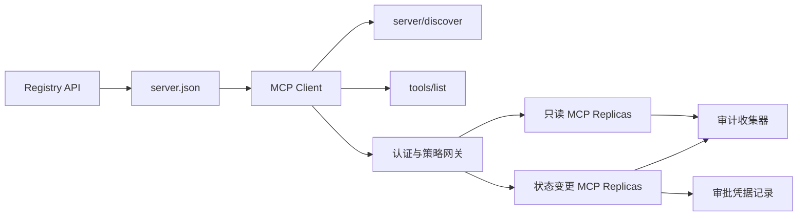

# 综合实战项目 13:带 Registre et administration sans état serveur MCP

> Le MCP de niveau de production n'est pas un processus de serveur simple. Il s'agit d'un ensemble de protocoles: données de base disponibles à publier, services de détection en temps réel, demande de dépôt, enveloppe, identité et autorisation, décision de stratégie de détail, certificat d'audit et certificat de déploiement.

**Type:** Capstone
**Languages:** Python 与 TypeScript 参考模型；支持任何生产级编程语言
**Prerequisites:** Phase 11, Phase 13, Phase 14, Phase 17 与 Phase 18
**必修 MCP 进阶课：** [Lesson 28: Tool Contracts](../../../13-tools-and-protocols/28-mcp-tool-contracts-and-content/docs/en.md)- Je suis là .[Lesson 29: 可靠性与流控](../../../13-tools-and-protocols/29-mcp-reliability-cancellation-and-flow-control/docs/en.md)- Je suis là .[Lesson 30: Registry 供应链](../../../13-tools-and-protocols/30-mcp-registry-supply-chain-and-drift/docs/en.md), 及 [Lesson 31: 一致性工程](../../../13-tools-and-protocols/31-mcp-conformance-versioning-and-operations/docs/en.md)
**目标协议规范：**MCP `2026-07-28`
**Time:** ~25 小时

## Objectif de l'apprentissage

- 实现合规的无状态 MCP Demande et résultat Enveloppe
- Le registre Statistical currency data et le protocole en temps réel de fonctionnement sont très différents.
- construire un système de recherche d'outils dotés de la séquence de la détermination et de la perception du caché.
- Pour chaque outil, il est nécessaire de mettre en œuvre des stratégies d'évaluation et de réception.
- 部署无 Session 亲和性绑定 流向 HTTP 集群──
- En ligne, les autorités compétentes fournissent des preuves d'ingénierie complètes à la frontière entre le registre et l'audit.

## MCP avant mise en route

Avant de concevoir ce projet en vue de sa production, il faut suivre le programme de quatre étapes de la phase 13:

1. [Lesson 28](../../../13-tools-and-protocols/28-mcp-tool-contracts-and-content/docs/en.md): définir ce serveur  doit être exposé  Tool、 Schema、 structuré contenu、 pages  auto-réparation、 routes  err err err errations                                                                                                                                                                                                                                                                                                                                                                                                                                                                                        
2. [Lesson 29](../../../13-tools-and-protocols/29-mcp-reliability-cancellation-and-flow-control/docs/en.md)Le défi de la répartition des données est de définir les conditions de répartition des données.
3. [Lesson 30](../../../13-tools-and-protocols/30-mcp-registry-supply-chain-and-drift/docs/en.md): définition nommées espaces de propriété, source de suivi, accès à la localisation, registre, état, déménagement, contrôle, enregistrement et déménagement
4. [Lesson 31](../../../13-tools-and-protocols/31-mcp-conformance-versioning-and-operations/docs/en.md)Les résultats de la recherche ont été publiés en ligne en ligne en ligne en ligne en ligne en ligne en ligne en ligne en ligne en ligne en ligne en ligne en ligne en ligne en ligne en ligne en ligne en ligne en ligne en ligne en ligne en ligne en ligne en ligne en ligne en ligne en ligne en ligne en ligne en ligne en ligne en ligne en ligne en ligne en ligne en ligne en ligne en ligne en ligne en ligne en ligne en ligne en ligne en ligne en ligne en ligne en ligne en ligne en ligne en ligne en ligne en ligne en ligne en ligne en ligne en ligne en ligne en ligne en ligne en ligne en ligne en ligne en ligne en ligne en ligne en ligne en ligne en ligne en ligne en ligne en ligne en ligne en ligne en ligne en ligne en ligne en ligne en ligne en ligne en ligne en ligne en ligne en ligne en ligne en ligne en ligne en ligne en ligne en ligne en ligne en ligne en ligne en ligne en ligne en ligne en ligne en ligne en ligne en ligne en ligne en ligne en ligne en ligne en ligne en ligne en ligne en ligne en ligne en ligne en ligne en ligne en ligne en ligne en ligne en ligne en ligne en ligne en ligne en ligne en ligne en ligne en ligne en ligne en ligne en ligne en ligne en ligne en ligne en ligne en ligne en ligne en ligne en ligne en ligne en ligne en ligne en ligne en ligne en ligne en ligne en ligne en ligne en ligne en ligne en ligne en ligne en ligne en ligne en ligne en ligne en ligne en ligne en ligne en ligne en ligne en ligne en ligne en ligne en ligne en ligne en ligne en ligne en ligne en ligne en ligne en ligne en ligne en ligne en ligne en ligne en ligne en ligne en ligne en ligne en ligne en ligne en ligne en ligne en ligne en ligne en ligne en ligne en ligne en ligne en ligne en ligne en ligne en ligne en ligne en ligne en ligne en ligne en ligne en ligne en ligne en ligne en ligne en ligne en ligne en ligne en ligne en ligne en ligne en ligne en ligne en ligne en ligne en ligne en ligne en ligne en ligne en ligne en ligne en ligne en ligne en ligne en ligne en ligne en ligne en ligne en ligne en ligne en ligne en ligne en ligne en ligne en ligne en ligne en ligne en ligne en ligne en ligne en ligne en ligne en ligne en ligne en ligne en ligne en ligne en ligne en ligne en ligne en ligne en ligne en ligne en ligne en ligne en ligne en ligne en ligne en

Ce projet est chargé de rassembler ces éléments de production, qui ne peuvent être déployés à l'aide d'un seul test SDK simple.

## 问题背景

 Les plateformes internes d'entreprise nécessitent un ensemble d'outils de lecture de données et une petite quantité d'outils d'écriture qui ont la capacité de modifier l'état.  Les développeurs doivent être en mesure de trouver le serveur  de comprendre comment se connecter  de vérifier sa capacité de fonctionnement en temps réel, et ne peuvent utiliser que ses opérations d'accès autorisées explicitement 

La vraie difficulté n'est pas d'écrire une fonction Python, mais de faire en sorte que les six sources de vérité suivantes restent cohérentes:

1. `server.json`déclaré le serveur où installé ou par quel réseau terminal visité;
2. `server/discover`▌déclarer la capacité de soutien réel au processus en cours de fonctionnement;
3. Chaque requête spécifiquement indique la version de protocole utilisée et la déclaration de capacité du client;
4. 授权系统将调用方与合法的签发者、资源指示器(Ressource Indicator) et Scope 绑定;
5.  la détermination indépendante de l'opération et de la transmission des éléments de stratégie;
6. 审计日志忠实记录跨界的每次交往,绝不泄露敏感载荷或凭证密钥──

 toute connexion se déplace, la plateforme peut démontrer un serveur orphelin incapable de se connecter  un client inadmissible  un token émis par un autre ressource ou une opération dangereuse non autorisée 

## Les deux couches de découverte

Le serveur MCP réel répond à une question de dimension complètement différente:

| 发现层次 | 交互契约 | 回答的核心问题 |
|---|---|---|
| 发布层 (Publication) | `server.json` 与 Registry API | 该 Server 是什么？其代码包或远程网络端点在哪里？如何进行配置？ |
| 运行时 (Runtime) | `server/discover` | 该运行进程当前实际支持哪些协议版本、能力特性、扩展及 Server 身份？ |

官方 Registry 采用带版本控制的 `server.json`Schéma。 Un fichier à distance peut être déclaré Streamable HTTP 地址:

```json
{
  "$schema": "https://static.modelcontextprotocol.io/schemas/2025-12-11/server.schema.json",
  "name": "com.example/internal-readonly",
  "title": "Internal Read-Only Tools",
  "description": "Read-only incident and data lookup tools.",
  "version": "1.0.0",
  "remotes": [
    {
      "type": "streamable-http",
      "url": "https://mcp.internal.example.com/readonly"
    }
  ]
}
```

Le Registre Schema  version avec MCP 协议 version est complètement indépendant, ne pas être confondu pour un seul mot.

具備合规 Schema 不代表拥有命名空间所有权──对 `example.com`完成验证的发行者使用反向 DNS 命名空间 `com.example/*`Ou son nom est "Space".

Le serveur doit être mis en œuvre`server/discover`Le client peut l'utiliser activement avant de démarrer son entreprise:

```json
{
  "resultType": "complete",
  "supportedVersions": ["2026-07-28"],
  "capabilities": {
    "tools": {
      "listChanged": false
    }
  },
  "_meta": {
    "io.modelcontextprotocol/serverInfo": {
      "name": "com.example/internal-readonly",
      "version": "1.0.0"
    }
  },
  "ttlMs": 3600000,
  "cacheScope": "public"
}
```

## 无状态 MCP 核心(Cœur de MCP sans état)

MCP `2026-07-28`- Le protocole a été complètement supprimé.`initialize`La main avec la main`Mcp-Session-Id`                                                                                                                                                                                                                                                              `params._meta`Le texte suivant:

```json
{
  "io.modelcontextprotocol/protocolVersion": "2026-07-28",
  "io.modelcontextprotocol/clientCapabilities": {},
  "io.modelcontextprotocol/clientInfo": {
    "name": "internal-platform-client",
    "version": "1.0.0"
  }
}
```

L'équilibrage de charge peut sans soucis être une requête continue à envoyer à une réplique en bonne santé différente, car toute réplique peut être entièrement vérifiée et traitée à partir du texte lui-même.

常规成功结果返回 `resultType: "complete"`, et le serveur 应在 `_meta.io.modelcontextprotocol/serverInfo`中标明身份──协议版本Illegal return Invalid Params 错误码 `-32602`; pour la version légale mais non soutenue, retour `-32022`Il n' y a pas de données précises`supported`Avec `requested`Il y a une autre.

### Réservation du service

`tools/list`必須保证确定性排序, ses résultats comprennent:

- `ttlMs`: face à la demande du client;
- `cacheScope`- Le numéro de la liste:`public`(publicité) ou `private`(à la suite de la déclaration);
-  strictement stable, permettant à la même liste de pouvoir utiliser rapidement le cache du modèle;
- `resultType: "complete"`Avec les données du serveur.

 contrôles des droits d'utilisateur spécifiques, généralement devraient être exportés `cacheScope: "private"`, ne peut pas définir la visibilité des outils réservés à l'utilisateur dans la réserve publique partagée.

## Transmission HTTP par le flux

面向网络的服务器 暴露单一的 POST 端点──每个 JSON-RPC requête ou notification sont classés comme POSTs indépendants──

 pour la demande, le serveur  retourner une réponse JSON unique  ou pour la demande de démarrage de la demande  SSE 流──长周期的变更通知通过 `subscriptions/listen`- Je suis en train de faire une petite conversation.

La requête doit être spécifiée par HTTP

- `MCP-Protocol-Version`: correspondant à la demande de données;
- `Mcp-Method`: avec JSON-RPC 方法名一致;
- `Mcp-Name`: en调用 `tools/call`Également, le nombre d'outils;
- `Accept: application/json, text/event-stream`Il y a une autre.

头部与请求体不一致时立即回归 `-32020`错误码――校验 `Origin`defense DNS 重绑定,并将请求作用域 SSE 流的动作断视为请求取消──



```figure
cf-mcp-gate
```

## 认证与策略决策

Les données de la transmission ne sont pas égales à des permis de certification.

1. 动态发现受保护资源元数据;
2. Pour le choix des ressources et la réponse au serveur autorisé;
3. 优先使用 Client ID Metadata Documents(CIMD)
4. Indicateur de ressources dans le processus de délivrance de l'autorisation;
5. 验证返回 `iss`Si oui et si non, le serveur d'enregistrement est autorisé;
6. 按 Émetteur 隔离存储 Client 凭据,绝不跨 Émetteur 复用;
7. Dans le MCP Server 侧验证 Token 的签发者、受众、过期时间与 Scope;
8. Deuxième stratégie de décision pour les noms et les paramètres réels des outils spécifiques:

### L'approbation artificielle est un document de preuve, et non un champ de compétence magique.

status变更调用需要一个结构化的人工审批凭证 (en anglais: Structured Humanitarian Approval Diploma)  Approval Record),与操作者、工具名、规范化参数哈希值 (en anglais:                                                                                                                                                                                                                                  

Python 模型 va réglementer la classification des clés JSON 计算哈希,并将该 Digest与代币主体、工具名、服务器URL 和过期时间签名绑定──改哪怕一个参数段,该审批记录均不能重放──审批记录是独立证证证证,而不是直接进入代币的范围──

## 动手构建步骤

1. **建模发布元数据**:编写并验证 `server.json`, s'assurer que le nom de l'espace est conforme à la réglementation DNS.
2. **实现实时服务发现**: dans le traitement de toute entreprise RPC priorité réalisée`server/discover`Il y a une autre.
3. **实现无状态 Envelope**: chaque requête doit être remplie version avec capacités de données, déplacement de tous les niveaux de session  état。
4. **构建工具集**: fournir des outils de changement de statut, préparer des schèmes JSON et des instructions précises
5. **支持缓存感知的工具列表**:输出确定性排序的工具列表,并配置 `ttlMs`Avec `cacheScope`Il y a une autre.
6. **接入认证与策略网关**: Token d'approuvation et de réception de la première épreuve de réémission.
7. **分离静态 Registry 与运行时校验**: contre `server.json`Avec le temps réel`server/discover`,及时上报漂移──
8. **接入脱敏审计日志**: complet record sur le texte ci-dessous, et pour les paramètres sensibles de l'exécution
9. **验证水平扩展**: en charge équilibreur après avoir chargé deux réplices sans état, émis et envoyé une demande de vérification sans dépendance et sans dépendance sexuelle.
10. **真实网络验证**: à travers des requêtes de capture de réels réseaux avec des JSON, vérifier divers cas d'utilisation de la droite et de la reverse.

## Il est nécessaire de fournir des informations sur les données à caractère personnel.

Le code soumis doit être accompagné des cinq types de certificats d'ingénierie suivants:

| 证据类别 | 最低验证标准 | 来源课程 |
|---|---|---|
| 网络线路 (Wire) | 正反向用例中脱敏的原始 HTTP 头与 JSON-RPC 体，覆盖类型错误、头不匹配、不支持版本等 | [Lesson 31](../../../13-tools-and-protocols/31-mcp-conformance-versioning-and-operations/docs/en.md) |
| 代理网络 (Proxy) | 直连与经过代理转发的报文对比，证明协议错误未被粗暴折叠为 500 且流式传输未被缓冲 | [Lessons 29](../../../13-tools-and-protocols/29-mcp-reliability-cancellation-and-flow-control/docs/en.md) 与 [31](../../../13-tools-and-protocols/31-mcp-conformance-versioning-and-operations/docs/en.md) |
| 准入管理 (Admission) | 已验证的发布者命名空间、不可变 Registry 记录哈希、实时 `server/discover` 观察凭证与准入账本事件 | [Lesson 30](../../../13-tools-and-protocols/30-mcp-registry-supply-chain-and-drift/docs/en.md) |
| 重试与取消 (Retry) | 取消与完成的竞态测试、显式超时、安全只读重试、写操作幂等键、重连刷新机制 | [Lesson 29](../../../13-tools-and-protocols/29-mcp-reliability-cancellation-and-flow-control/docs/en.md) |
| 发布回滚 (Rollback) | 明确的先前版本哈希、描述符锁定、健康检查窗口、路由平滑切换结果与决策证据 | [Lessons 30](../../../13-tools-and-protocols/30-mcp-registry-supply-chain-and-drift/docs/en.md) 与 [31](../../../13-tools-and-protocols/31-mcp-conformance-versioning-and-operations/docs/en.md) |

## 本地参考模型运行

Le modèle Python a démontré, en l'absence d'ouverture de liens externes, la réalisation de l'essai de nomenclature, de la découverte en temps réel, de la liste de détermination, des demandes de vérification des données, des droits de reconnaissance des tokens, des certificats d'approbation et des processus d'audit basés sur le hash:

```bash
cd phases/19-capstone-projects/13-mcp-server-with-registry
python3 code/main.py
python3 -m unittest discover -s code/tests -v
```

TypeScript  projet a montré dans le cas de non-demandant SDK MCP externe, via stdio original  exposé sans état JSON-RPC  interface et retour à paramètres illégaux `isError: true`- Le numéro de la liste:

```bash
cd phases/19-capstone-projects/13-mcp-server-with-registry/code/ts
npm install
npm run typecheck
npm test
npm run demo
```

## 线路协议报文范例

```http
POST /mcp HTTP/1.1
Host: mcp.internal.example.com
Content-Type: application/json
Accept: application/json, text/event-stream
MCP-Protocol-Version: 2026-07-28
Mcp-Method: tools/call
Mcp-Name: postgres.readonly
Authorization: Bearer REDACTED

{
  "jsonrpc": "2.0",
  "id": 42,
  "method": "tools/call",
  "params": {
    "name": "postgres.readonly",
    "arguments": {"sql": "SELECT 1"},
    "_meta": {
      "io.modelcontextprotocol/protocolVersion": "2026-07-28",
      "io.modelcontextprotocol/clientCapabilities": {},
      "io.modelcontextprotocol/clientInfo": {
        "name": "internal-platform-client",
        "version": "1.0.0"
      }
    }
  }
}
```

## 核心专业术语

| 术语 | 行业俗称 | 规范真实定义 |
|---|---|---|
| 无状态 MCP (Stateless MCP) | “到处都没有状态” | 协议层不存在 Session；跨调用状态属于显式传递且由业务服务端持久化管理 |
| `server.json` | “工具清单清单” | Registry 静态元数据，用于定义发布命名、代码打包、配置项与传输端点 |
| `server/discover` | “传统握手” | 强制实现的常规业务 RPC，用于获取实时支持的版本与能力，而非建立会话 |
| 缓存作用域 (Cache scope) | “能不能缓存？” | 标识可缓存结果是否可以被跨上下文公共复用（`public`）或仅限当前上下文（`private`） |
| 策略决策 (Policy decision) | “Token 允许就能调” | 针对调用者主体、工具、操作目标、参数载荷及外部上下文的细粒度二次判定 |
| 审批凭证 (Approval record) | “人工在群里点了同意” | 绑定至具体操作者、确切参数哈希与过期时间的强防篡改凭据证据 |
| 显式句柄 (Explicit handle) | “Session ID” | 业务层具名状态的普通应用标识符，绝非底层传输连接会话 |

## 延伸阅读

- [MCP 2026-07-28 核心变更](https://modelcontextprotocol.io/specification/2026-07-28/changelog)
- [Streamable HTTP 传输规范](https://modelcontextprotocol.io/specification/2026-07-28/basic/transports/streamable-http)
- [MCP 服务发现](https://modelcontextprotocol.io/specification/2026-07-28/server/discover)
- [MCP 鉴权与授权规范](https://modelcontextprotocol.io/specification/2026-07-28/basic/authorization)
- [官方 Registry server.json 要求](https://github.com/modelcontextprotocol/registry/blob/main/docs/reference/server-json/official-registry-requirements.md)
