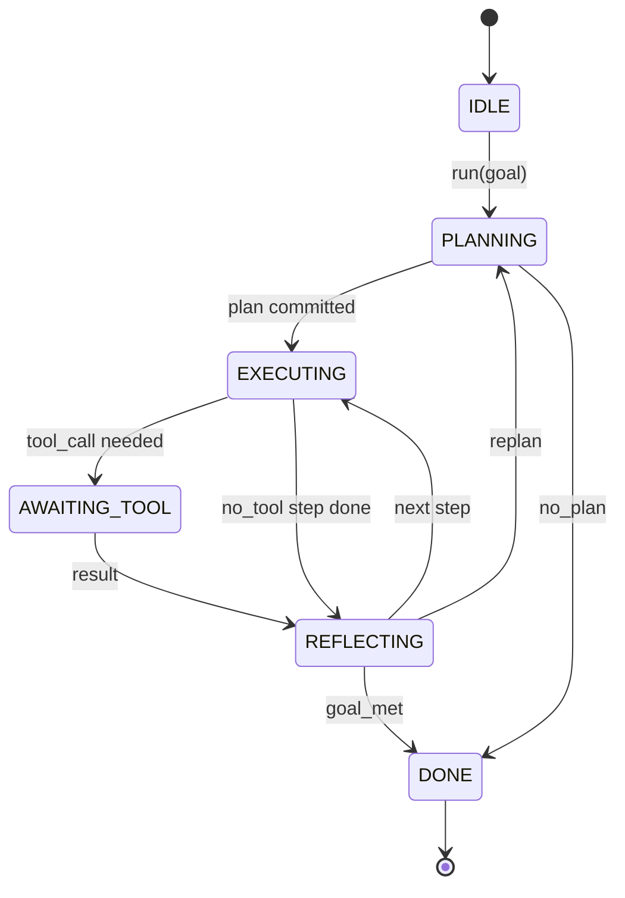

# Contract de boucle d'agent Harness

> Le modèle est un coprocesseur. Vous pouvez entrer dans le contrat de boucle de tout modèle.

**Type:** Build
**Languages:** Python
**Prerequisites:** Phase 13 lessons 01-07, Phase 14 lesson 01
**Time:** ~90 minutes

## Objectifs d'apprentissage


```figure
cf-loop-contract
```
- La machine à l'état de détermination de l'agent avec des transitions évidentes est régie par la loi.
- En effet, les opérateurs peuvent intégrer la politique, la télémétrie et les barreaux.
- Définir deux points de tirage, boucle dans ces positions, remettre le contrôle à l'appelant et récupérer la nouvelle entrée.
- 强制执行 per session budgets (turns, appels à l'outil, horloges murales), tout en ne faisant pas émerger un état partiel dans le temps de l'extrême-limitation
- 发发含十一种事件类型的类型类型类型类型类型类型类型类型类型类型类型类型类型类型类型类型类型类型类型类型类型类型类型类型类型类型类型类型类型类型类型类型类型类型类型类型类型类型类型类型类型类型类型类型类型类型类型类型类型类型类型类型类型类型类型类型类型类型类型类型类型类型类型类型类型类型类型类型类型类型类型类型类型类型类型类型类型类型类型类型类型类型类型类型类型类型类型类型类型类型类型类型类型类型类型类型类型类型类型类型类型类型类型类型类型类型类型类型类型类型类型类型类型类型类型类型类型类型类型类型类型类型类型类型类型类型类型类型类型类型类型类型类型类型类型类型类型类型类型类型类型类型类型类型类型类型类型类型类型类型类型类型类型类型类型类型类型类型类型类型类型类型类型类型类型类型类型类型类型类型类型类型类型类型类型类型类型类型类型类型类型类型类型类型类型类型类型类型类型类型类型类型类型类型类型类型类型类型类型类型类型类型类型类型类型类型类型类型类型类型类型类型类型类型类型类型类型类型类型类型类型类型类型类型类型类型类型类型类型类型类型类型类型类型类型类型类型类型类型类型类型类型类型类型类型类型类型类型类型类

## 框架

Un agent de codage sans personne qui fonctionne à quatre-vingts roues n'est pas un boucle de chat. C'est une machine d'état, l'opérateur peut intercepter ses nœuds, ou vérifier ses bords. Une fois que vous écrivez un contrat, vous changez de modèle, outils ou politiques.

Ce contrat est la construction de ce cours. Nous allons nommer six États, dix sujets, deux points de tirage, dix types d'événements, ainsi qu'un enveloppe budgétaire.

## États

Il y a six états. Cinq sont actifs.



`IDLE`C'est le seul point d'entrée légal.`DONE`C'est la seule exportation légale.`AWAITING_TOOL`C'est le seul état qui produira un point de traction. Toutes les autres transitions sont internes.

Cette machine d'état est déterminante. Donnée à un même journal d'événements, la connexion sera réintégrée dans le même état. Cette nature vous permet de refaire des séances pour tester, sans avoir à réutiliser le modèle.

## les sujets de crochet

Hooks est l'opérateur 接入循环的接口──harness 会触发十个话题──每个话题可接受任意数量的订阅者──订阅者 按注册 顺序触发──一个订阅者可变用载荷、升起来中止 当前转,或返回一个哨兵跳过下一步──

```text
before_plan         after_plan
before_tool_call    after_tool_call
before_step         after_step
on_error
on_pause
on_budget_exceeded
on_complete
```

Cette forme a reflété le modèle de Claude Code, Cursor et OpenCode jusqu'à la mi-2025.`rm -rf`Le crochet est mis .`before_tool_call` Envoyer le crochet de la durée de la télémetrie ouverte  mettre `after_step`◊ Pendant la séance de pause                                                                                                                                                                                                                                                                                                                                                                                                                                                                                                                      `on_pause`Il y a une autre.

## points de tirage

La première fois, c'est dans le`AWAITING_TOOL`Si elle ne produit pas de résultats, on ne peut pas continuer à avancer.`on_pause`, quand le budget est épuisé, ou un crochet 明确要求人评

Le point de tirage n'est pas une exception. C'est un retour. L'appelant vérifie l'état de l'harnais, obtient l'harnais.`resume(payload)` Le harness 会从停止的位置继续── ceci est la même forme que le générateur Python── point de tirage du transport par votre choix── dans TUI, c'est la clé-pressure── via MCP 时它是`tools/call`C'est un sondage de poste.

## flux d'événements

Le flux est uniquement ajouté, les abonnés peuvent effectuer des répétitions de compensation à partir de leur choix.

- `session.start` 调用 `run(goal)`Une fois de plus
- `plan.draft` planificateur  retour au projet de plan 时发出
- `plan.commit` Projet soumis au plan actif 后发发
- `step.start` Chaque étape d' exécution 开始时发出
- `step.end` Chaque étape d' exécution 结束时发出
- `tool.call` 需要工具的步骤将控制权交给调用人 发发出 时发出
- `tool.result` Utilisation de l'outil résultat 恢复时发出
- `tool.error` Utilisation d'erreur 恢复时, ou accroche annuler l'appel 时发出
- `budget.warn`  atteindre la limite budgétaire 时发出
- `session.pause` boucle en pause (budget ou crochet)
- `session.complete`La boucle est arrivée.`DONE`Une fois de plus

Les événements sont des événements observationnels, enregistrés, réalisés, les voyant se voir les uns les autres.

## enveloppe budgétaire

Une session 携带三个限制──转数、工具调控数、墙钟秒──每个转会让转加一──每个工具调控 会让工具调控 加一──每次状态转变都会检查墙钟──一旦达到任意限度,循环 会触发`on_budget_exceeded`, émission `budget.warn`Puis dans le prochain point de tirage , la transition vers le haut .`IDLE`,并附带预算 dépassé raison。

Le budget n'est pas un commutateur de mort. C'est un résultat.

## 本课不做什么

Il ne fera pas appel à un modèle. Il ne fera pas l'enregistrement de vrais outils. Il ne réalisera pas de transport.

`main.py`Le planificateur déterministe central est un substitut. Il retourne à un plan de trois étapes hardcodé, dont deux étapes nécessitent un résultat d'outil.

## Comment lire la code

`HarnessLoop`Il est de type principal. Il a un état.`Budget`Avec les limites.`Event`Il y a une enveloppe de type de la rivière.`HookRegistry`C'est une table de dépêche.`_transition`C'est la seule fonction qui change l'état, donc les invariants de la machine d'état sont concentrés dans un seul endroit.

De haut en bas`main.py`✿ puis lire `code/tests/test_loop.py`Les tests vont fixer chaque transition et chaque ordre de tir du crochet.

## Continuez à l'intérieur

Dans l'environnement de production, le plus difficile n'est pas de construire un harnais de machine d'état, mais de faire exécuter un contrat. Ce contrat doit supporter un chargement chaud du planificateur. Il doit supporter le retour d'un outil JSON malformé.`before_tool_call`Les tests de cette classe couvrent ces modes d'échec.

La première classe sera ajoutée au registre des outils. La deuxième classe sera le transport JSON-RPC. La deuxième classe sera le dépêcheur.
