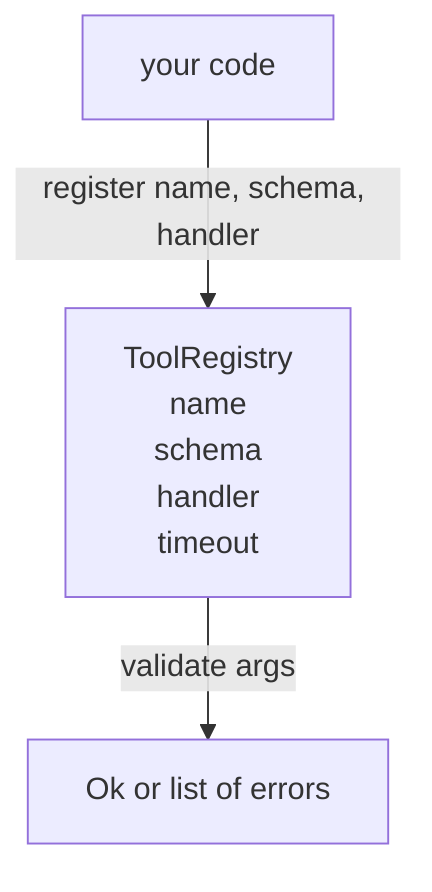

# 带 Schema Validation de l' outil de répertoire

> agent 无法验证的工具,就是 agent 无法调用的工具――先构建注册和方案检查器,再构建工具――

**Type:** Build
**Languages:** Python
**Prerequisites:** Phase 13 lessons 01-07, Phase 14 lesson 01
**Time:** ~90 minutes

## Objectifs d'apprentissage


```figure
cf-registry-validate
```
-  possède un type de registre, nom de l'outil de cartographie → schéma → gestionnaire, faire un dépêcheur juste besoin de demander une fois, puis 
- 实现 JSON Schema 2020-12 的一个子集,覆盖百分之九十的工具调用 实际使用的关键字──
- 返回精确的、形如 json-pointer 错路, faire le modèle peut être corrigé en une seule fois
- En l'absence de suppression manifeste, le refus de réinscription, parce que la silence est la raison de la délocalisation des catalogues d'outils de production.
- 保持 validator 纯净(无I/O、无时间、无全球), de sorte qu'il peut être utilisé à nouveau dans le journal de lecture.

## Pourquoi le registre doit être d'abord l'outil

Un modèle peut être placé dans une seule fenêtre de contexte. Un harnais inhabituel enregistrera deux cents outils et en exposera dix à quarante à un tour. Le registre est la seule source de vérité de ces questions: quels outils existent ?

Nous devons éviter les erreurs, soit de publier des manipulateurs sans schéma, soit de publier des schéma sans validation. Les deux sont très fréquents.

## enregistrement d' outils 长什么样

```text
ToolRecord
  name        : str          (unique, lowercase alphanumeric and underscore segments separated by dots, e.g., snake_case.segment.case)
  description : str          (one line, shown to the model)
  schema      : dict         (JSON Schema 2020-12 subset)
  handler     : Callable     (async or sync, returns Any)
  idempotent  : bool         (dispatcher uses this for retry decisions)
  timeout_ms  : int          (override per-tool dispatcher default)
```

Le schéma est le validateur 唯一 qui touchera les segments ▌le manipulateur est opaque ▌nous avons délibérément divisé les deux ▌le schéma est le données ▌le manipulateur est le code ▌en les mélangeant, vous inciterez à mettre la logique de validation ▌dans le manipulateur, et c'est exactement ce que nous allons bloquer ▌

## Schéma JSON 2020-12 子集

La spécification complète de 2020-12 est un article.

```text
type           string / number / integer / boolean / object / array / null
properties     map of property name -> schema
required       list of property names
enum           list of allowed primitive values
minLength      integer, applies to strings
maxLength      integer, applies to strings
pattern        ECMA-262-compatible regex, applies to strings
items          schema applied to every array element
```

Ceci suffit à couvrir l'outil API  réellement besoin de contenu. Nous n'avons pas ajouté de mots clés (oneOf, anyOf, allOf, $ref, conditionnels) dans les schémas de production est valide, mais transformera le validateur en un marcheur d'arbre avec cycles. Nous construisons un registre, pas un moteur JSON Schema.

## Json pointeur  err err err err err err err err err

validation 失败时,validator 返回一个错误列表―― chaque erreur porte un point d'entrée 内部 json-pointer path――pointer est une séquence de l'inscription à l'inscription, composée de noms de propriétés et d'indices d'un tableau 组成――

```text
{"a": {"b": [1, 2, "x"]}}
                    ^
                    /a/b/2
```

modèle 读取错误 paths 的能力强于读取句子 的能力──如果 schema 要求 `args.user.email`, et le modèle 传入一个整数, erreur 应该是 `/user/email`, et avec`expected_type: string`◊ modèle 会在下一次调用中修正它, pas besoin d'une série de descriptions de langage naturel.

## Registration et annulation

`register(name, schema, handler, **opts)`默认拒绝重复注册──调用方必须传进 `override=True`才能替换── c'est une pratique de santé à l'échelle de l'opération── les deux parties du codebook sont enregistrées silencieusement avec le même nom d'outil, c'est le type de bug qui se retrouve pendant une semaine en production──

Le registre 暴露三个读取方法──`get(name)`Retour à l'enregistrement ou mise en évidence`validate(name, args)`Retournez à l' un`Ok`Ou une série d'erreurs.`names()`按注册顺序返回 les noms des outils

## validateur est quoi, n'est pas quoi

Il est une fois de plus à travers l'arbre de schéma. Il est une simple fonction. Il ne reçoit pas de manipulateurs.`"42"`Il ne passera pas par le schéma numérique.

Il n'est pas une frontière de sécurité. Il est possible de ne pas être un agent de sécurité.

## La forme



## Comment lire la code

`code/main.py` définit `ToolRegistry`- Je suis là.`ToolRecord`- Je suis là.`ValidationError`, ainsi que 8 fonctions de validateur ⋅ validateur ⋅`schema["type"]`Envoyer ou enlever`enum`处理) ⋅ chaque validateur de type ⋅ retourner à la liste, ⋅ retourner ⋅`ValidationError`列表──marcheur de haut niveau 会拼接 errors, et et se retourner vers le bas 列表──前置路段──

`code/tests/test_registry.py`覆盖登记,过渡,验证成功,带路径的验证失败, ainsi que chaque mot clé du groupe ∙

## Continuez à l'intérieur

Après cette partie, vous voudrez deux extensions:`$ref`La résolution, ainsi que les formes strictes`additionalProperties: false`◊ Les deux sont très petits. Avec le catalogue d'outils, il y en a plus de cinquante, nous les avons laissés en dehors de ce cours, afin que le document puisse être lu en une seule fois.

La première classe est de la formation de la formation en génie générique.
