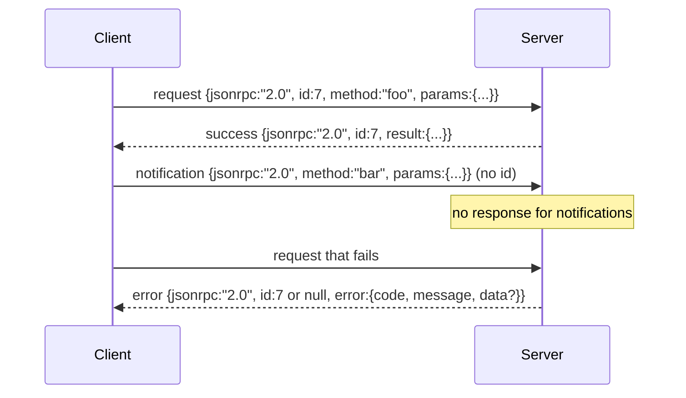

# Basé sur le JSON-RPC 2.0 de Newline-Delimited Stdio

> Le transport entre le client modèle et le serveur d'outils est basé sur le JSON-RPC de studio.

**Type:** Build
**Languages:** Python
**Prerequisites:** Phase 13 lessons 01-07, Phase 14 lesson 01
**Time:** ~90 minutes

## Objectifs d'apprentissage


```figure
cf-jsonrpc-frames
```
- Utilisation par stdin 和 stdout 上的 newline-delimited JSON framing of JSON-RPC 2.0 通信。
- 映射五个标准错误代码(-32700, -32600, -32601, -32602, -32603),并以正确语义暴露它们──
- 区分 requêtes, réponses, notifications et lots, sans développer de nouvelles clés d'enveloppe
- Chaque section traite une erreur de partage, la partie restante du flux de contamination ne se produit pas.
- Utilisez io.BytesIO  Construire une démo qui se terminera automatiquement, faire des cours sans avoir besoin de procréer le processus enfant 即可运行──

## Pourquoi JSON-RPC est toujours la langue officielle ?

En 2026, un agent de codage, en une seule session, peut utiliser 12 serveurs d'outils 通信。 chaque serveur est un processus indépendant ou un terminal à distance。 le format du fil est le même depuis 2013。 JSON-RPC 2.0 est une spécification de deux pages。 il peut survivre, c'est à cause d'un programme alternatif(gRPC、 chaque fois qu'il utilise un HTTP、 binaire auto-défini)

本课构建 stdio variant──Newline-delimited JSON──每一个请求是一行──每一个答案是一行──transport boundary是`\n`Il y a une autre.

## forme de fil

Il existe quatre formes d'enveloppe:



notification 没有 `id` le serveur n'a pas à répondre à la réponse  si le serveur répond à la notification  le client n'a aucun moyen de la connecter à un site d'appel  cette seule règle permet de garder le cadre mathématique simple 

L'ensemble est une série de requêtes ou de notifications JSON. Le serveur retourne une série de réponses, en ordre arbitral, chaque entrée non-notifiée à la réponse.

## 五个 erreur codes

```text
-32700  Parse error      JSON could not be parsed
-32600  Invalid Request  Envelope shape is wrong
-32601  Method not found
-32602  Invalid params
-32603  Internal error
```

Les codes entre -32000 et -32099  Gardez pour les erreurs définies par le serveur― tous les autres codes sont définies par l'application― les cours utilisent seulement ces cinq― si le gestionnaire  lance des anomalies, le transport le mettra en -32603, et il le mettra dans l'emballage`data.exception`Nom de classe d'exception

Une erreur de partage Il y a une règle spéciale.`id`Oui `null`, parce que la demande n'a pas encore été analysée jusqu'à ce que le niveau d'identification soit atteint.

## Le cadre de la nouvelle ligne et la démo de BytesIO

transport, une fois en cours, une ligne, jusqu'à ce qu'elle soit incluse.`\n`Si une ligne ne parse pas, le transport écrira dans une bande.`id: null`La réponse de -32700 et de continuer. Le flux ne sera pas contaminé.

Dans cette classe, on est ensemble.`io.BytesIO`包装成 stdin 和 stdout──server 读取 requêtes jusqu'à EOF, pour chaque requête 写入答案, puis retourner──client 再读回答案──没有过程 spawn──没有时间out──transport 行为与真实子进程管 完全相同,因为 Python 的`io`Interface  fourni la même `.readline()`et `.write()`Le contrat

## Métode d'expédition

Le transport ne sait pas quelles méthodes il existe. Il est disponible pour les services de transport.`handler(method, params)` traitement des résultats de retour ou de mise en évidence des anomalies.

```text
MethodNotFound -> -32601
InvalidParams  -> -32602
Anything else  -> -32603 with exception name in data
```

transport ne verra jamais le registre des outils. Le registre se trouve à l'arrière du gestionnaire. C'est exactement ce que nous voulons.

## erreurs de flux  comportement

```text
client writes              server reads             server writes
---------------            -----------              -------------
{...valid request...}      parses ok                {...response, id matches...}
{...broken json...         parse fails              {id:null, error: -32700}
{...valid request...}      parses ok                {...response, id matches...}
{...missing method...}     invalid envelope         {id:X, error: -32600}
```

Une ligne de JSON cassée ne cessera pas de boucler.`method`Le champ ne cessera pas de boucler, l'exception du manipulateur ne cessera pas de boucler, le transport continuera à se poursuivre jusqu'à l'EOF.

## Les flux de notifications et non-conformément

Notification est feu-et-oublier. Harness Utilisation des notifications Indiquer les événements de progrès, les signaux d'annulation et les lignes de journaux. Notifications.

本课实现一个出发通知助手,`write_notification` serveur dans la demande  effectuer en utilisant elle pour envoyer des progrès― démo  démontre ce modèle: une demande 进来, le gestionnaire 发发发两条进展通知, puis écrire dans la réponse finale―

## Comment lire la code

`code/main.py` définit `StdioTransport`、parse aide`parse_request`3) 、三个 auteurs`write_response`- Je suis là.`write_error`- Je suis là.`write_notification`), ainsi que la boucle d'expédition `serve`◊constantes de code d'erreur  situées dans la portée du module。

`code/tests/test_transport.py`覆盖五个错误码、通知(不写回应)、批量(array in, array out, 跳过 notifications)、broken JSON(parse error 后继续), ainsi que le processeur dans le mode de la rédaction de la notification ∼

## Continuez à l'intérieur

Ce transport 足以支后续课程──production transports 会添加三件事──一个能在转发后继续存在的相关性 id field你的`id`已是这个, mais dans le réseau, vous avez besoin d'un identifiant de trace externe.`$/cancelRequest`Les messages de notification, les appels en vol, les appels en ligne, les appels en ligne, les appels en ligne, les appels en ligne, les appels en ligne, les appels en ligne, les appels en vol, les appels en ligne, les appels en ligne, les appels en ligne, les appels en ligne, les appels en ligne, les appels en ligne, les appels en ligne, les appels en ligne, les appels en ligne, les appels en ligne, les appels en ligne, les appels en ligne, les appels en ligne, les appels en ligne, les appels en ligne, les appels en ligne, les appels en ligne, les appels en ligne, les appels en ligne, les appels en ligne, les appels en ligne, les appels en ligne, les appels en ligne, les appels en ligne, les appels en ligne, les appels en ligne, les appels en ligne, les appels en ligne, les appels en ligne, les appels en ligne et les appels en ligne, ainsi que vous pouvez utiliser, et les appels en ligne en ligne, et les appels en ligne, et les appels en ligne, et les appels en ligne, en ligne, et les appels en ligne, en ligne, en ligne, en ligne, en ligne, en ligne, en ligne, en ligne, en ligne, en ligne, en ligne, en ligne, en ligne, en ligne, en ligne, en ligne, en ligne, en ligne, en ligne, en ligne, en ligne, en ligne, en ligne, en ligne, en ligne, en ligne, en ligne, en ligne, en ligne, en ligne, en ligne, en ligne, en ligne, en ligne, en ligne, en ligne, en ligne, en ligne, en ligne, en ligne, en ligne, en ligne, en ligne, en ligne, en ligne, en ligne, en ligne, en ligne, en ligne, en ligne, en ligne, en ligne, en ligne, en ligne, en ligne, en ligne, en ligne, en ligne, en ligne, en ligne, en ligne, en ligne, en ligne, en ligne, en ligne, en ligne, en ligne, en ligne, en ligne, en ligne, en ligne, et en ligne, en ligne, en ligne, en ligne, en ligne
