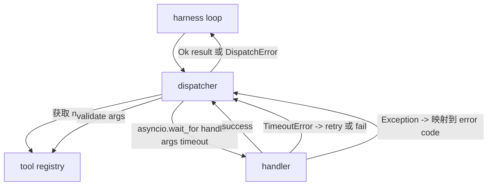
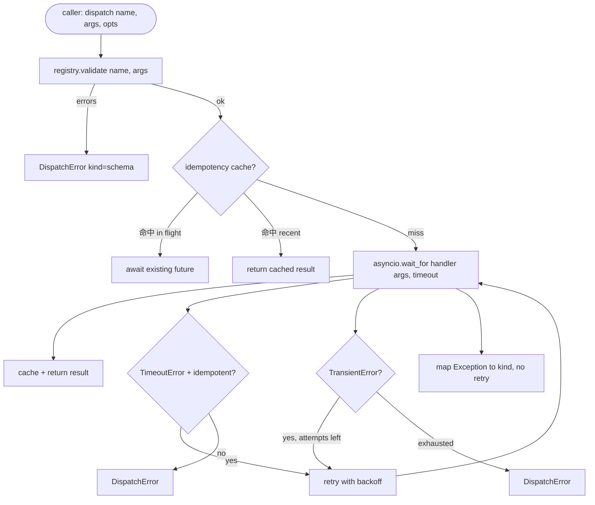

# Dispatcher d'appels de fonction

> Le dispatcher est le harnais pour le schéma de chaque engagement effectué à un seul endroit.

**Type:** Build
**Languages:** Python
**Prerequisites:** Phase 13 lessons 01-07, Phase 14 lesson 01
**Time:** ~90 minutes

## Objectifs d'apprentissage
- Utilisez le manipulateur d'outils de chargement pour récupérer l'erreur de typage, plutôt que de laisser la boucle s'accrocher.
- Application avec le plus grand nombre de tentatives de retrait exponentiel.
- 基于 idempotence key pour les retries de recharger, ainsi que avec l'appel d'origine lent 竞争的重复试 不会运行两次──
- Les exceptions du gestionnaire et les défauts de transport sont désormais comprises dans la seule enveloppe d'erreur.
- Utilisez la limite de concurrences pour envoyer en parallèle, éviter les appels de ventilateur à l'outil.


```figure
cf-dispatch-retry
```

## Où le dispatcher est assis

位于 harness loop(leçon vingt) et le registre des outils(leçon vingt et un) entre―transport(leçon vingt et deux) vers le circuit 输入―loop 把 tool call 交给 dispatcher。 dispatcher 调用 registry,运行处理器,并返回 result 或 JSON-RPC 形状的错误包──



Le dispatcher est le seul à savoir les temps, les retraites et les niveaux d'impuissance.

## Temps de réparation

Chaque outil a un délai de prescription.`timeout_ms` Lorsque le harnais 传入 per-call override 时, le dispatcher 会用它覆盖默认值──我们使用 `asyncio.wait_for` La fin du temps, la tâche du gestionnaire sera annulée, le dispatcher  Retour `DispatchError(kind="timeout")`Il y a une autre.

Pour les outils non idempotents, le temps de délais n'est pas une erreur réessayable.`db.write`Peut-être que vous avez déjà été envoyé, peut-être que vous n'avez pas été envoyé.`idempotent`Les outils idempotents seront réessayés. Les outils non idempotents seront réessayés.

## Retries avec une rétroaction exponentielle

La politique de retrait, la dernière tentative, est une tentative de retrait exponentiel.

```text
attempt 1  -> delay 0
attempt 2  -> delay 0.1s * (1 + random[0..0.5])
attempt 3  -> delay 0.4s * (1 + random[0..0.5])
```

- Je ne sais pas .`timeout`et `transient`Les erreurs seront réessayées.`schema`erreur`not_found`Ou `internal`Les erreurs de schéma sont déterminantes.

Retry loop Va respecter le budget de l'appelant Si le budget de l'appelant L'outil restant appelle à zéro, le dispatcher Va être rapidement défait lors de la première tentative,并返回`kind="budget_exceeded"`Il y a une autre.

## Déduction de la clé d'idempotence

Lorsque l'appel original still in flight 时触发 retry, c'est un vrai bug de production. La première fois que je l'ai utilisé, il est en 4 secondes.`payments.charge`Tu as déjà été pris deux fois.

le dispatcher  accepter可选的 `idempotency_key`Si un appel arrive avec la clé, le dispatcher attend le futur en vol et le résultat est retourné.

La clé est la responsabilité de l'appelant.`f"{step_id}:{tool_name}:{hash(args)}"`Le dispatcher ne va pas émettre la clé, parce que seulement des arguments la clé de sortie va faire deux appels différents de signification semblent les mêmes.

## Enveloppe d'erreur

失败的发送 返回单一形状──

```text
DispatchError
  kind        : "timeout" | "transient" | "schema" | "not_found" | "internal" | "budget_exceeded"
  message     : str
  attempts    : int
  jsonrpc_code: int   （-32601、-32602、-32603 之一）
```

boucle de harnais`kind`映射到下一个状态── Je suis en train de faire une vidéo.`schema`et `not_found` entrer `on_error`Il n'y a pas de plan de réinitialisation.`timeout`et `transient` entrer `on_error`, pourrait replan, pourrait pas, dépend des tentatives.`budget_exceeded`触发 `on_budget_exceeded`Il y a une autre.

## Limite de concurrence pour les émetteurs-fants

`gather(*calls)`Il y a 40 appels ouverts ou 40 sous-processus. La plupart des clients ne sont pas d'accord pour créer 40 connexions parallèles.

Dispatcher avec un sémaphore`gather` la limite de concurrence est 8  chaque appel  l'expédition  l'acquisition de la sémaphore, et le lancement  l'achèvement  la libération  l'appelant `gather`La production de forme, mais la planification réelle est de la nature.

## Flux pour un appel



## Comment lire le code

`code/main.py` définit `Dispatcher`- Je suis là.`DispatchError`et `TransientError` le dispatcher dans le registre de la construction et de la réception  la synchronisation `dispatch(name, args, ...)`C'est le seul point d'entrée.`_run_with_retries`En utilisant`asyncio.wait_for`En ligne 应用。`gather_bounded(calls)`Pour les expéditions en même temps, il y a une limite de convergence.

`code/tests/test_dispatcher.py`覆盖 timeout 触发、transient 上的重试、方案错上不重试、idempotency dedupe(两个带相同的键的同步调用 折叠为一次处理器调用), ainsi que limitation de la concurrence ((semaphore 生效) ⋅

Tests utilisés `asyncio.sleep(0)`Et basé sur la déterminisme`Counter`Les manipulateurs, ils seront terminés en quelques secondes, sans dépendre du timing du mur.

## On va plus loin

Les dispatchers de production vont ajouter deux élargissements. Premièrement, en chaque transition, effectuer une logerie structurée.`dispatch.attempt`et `dispatch.retry`Events)── Deuxièmement, interruptions de circuit: dans une fenêtre, après avoir échoué, l'outil entre dans une période de refroidissement, les envois sont immédiatement retournés `kind="circuit_open"`On peut les ajouter au dispatcher sans modifier le contrat.

Leçon 24 J'ai fait un dispatcher, je me suis attaché à un agent de planification et d'exécution, je t'ai fait voir quatre parties ensemble.
