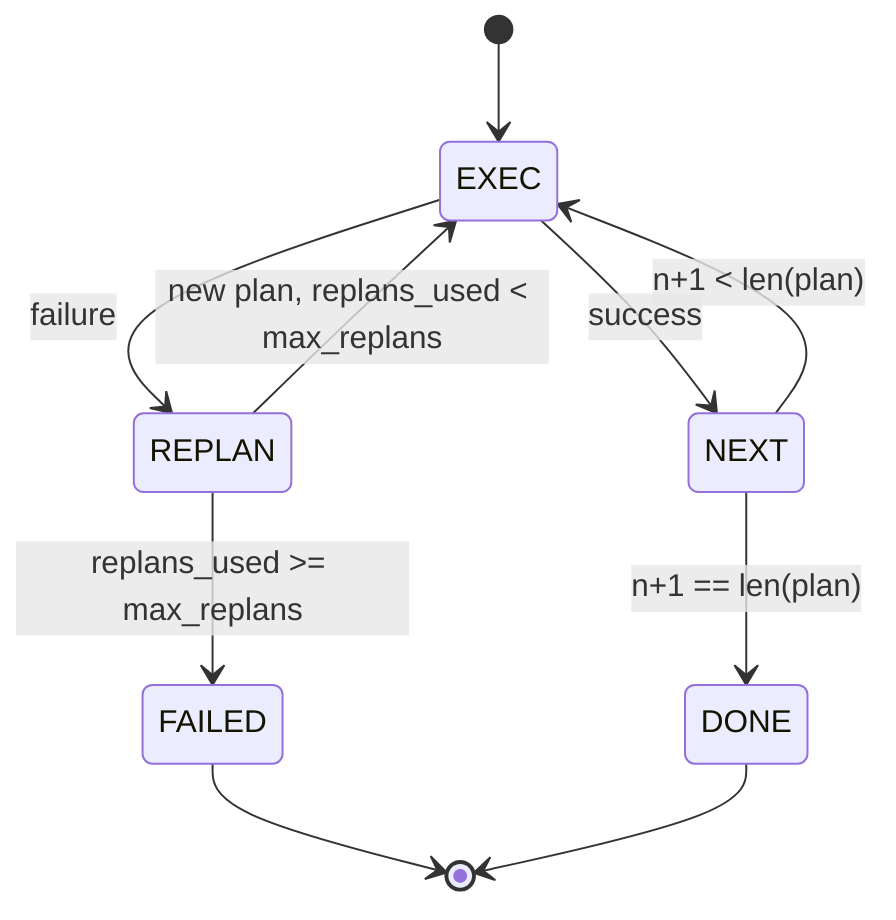

# Plan d'exécution du flux de contrôle

> Le plan de l'échec est un script.

**Type:** Build
**Languages:** Python
**Prerequisites:** Phase 13 lessons 01-07, Phase 14 lesson 01
**Time:** ~90 minutes

## Objectifs d'apprentissage


```figure
cg-plan-replan
```
- Pour exprimer le plan, une liste d'étapes typées permet à l'exécuteur de tenir compte du progrès et du résultat.
- 顺序执行 steps,并将失败 受控地转移 回规划者──
- De l'indicateur actuel  commencer à replaner, et dans le contexte avec une erreur antérieure, faire un plan suivant  更有信息──
- Chaque révision émet un plan différent, laissez un traceur de déplacement ou une interface utilisateur pour montrer le plan.
- 强制执行两个 budgets: plafond de la dureté et plafond de la dureté du replan­ment.

## Planifier et exécuter, plutôt que de penser en chaîne

L'agent de la chaîne de pensée va émettre des jetons,并让循环 猜测 tool call 在哪里结束──plan-and-execute agent d'abord émettre un plan structuré, puis détermination地执行每个步──plan 是利用可内视的数据──execution 是利用 通过发送器 运行这些数据──

两个部分──一个规划者 产生计划──一个执行者 运行计划──真正意义是执行者 遇到失败时发生什么──三个选项:

```text
1. Abort         （返回 failed，暴露 error）
2. Skip          （将 step 标记为 failed，继续剩余部分）
3. Replan        （把 error 交给 planner，从 cursor 获取新 plan）
```

Replan est de transformer le script en agent.

## La forme de l'étape

```text
Step
  id              : int           （在一个 plan revision 内单调递增）
  tool_name       : str
  args            : dict
  expected_outcome: str           （planner 声明的 success condition）
  result          : Any | None
  error           : str | None
```

`expected_outcome`Il a deux usages: réplanificateur dans le plan de révision  lors de la lecture; flux d'événements émettez-le, laissez le traceur  démontrer  Cette étape  devrait être faite   

## Forme de planificateur

```python
def planner(goal: str, history: list[Step], last_error: str | None) -> list[Step]:
    ...
```

Une fonction pure.`goal`C'est le but de l'utilisateur.`history`Les étapes déjà exécutées sont remplies avec des résultats et des erreurs.`last_error`Lors de la première mise en service, il n'y en a pas, et chaque mise en service après, il y a eu le dernier message d'échec.

Planner ne sait pas l'exécuteur. Il ne sait pas les tentatives. Il ne sait pas les délais. Il ne fait que créer un plan.

## Exécuteur

L'exécuteur est une petite machine d'état. Chaque étape passe par le dispatcher.`FAILED`Résultat de la séance



## Révision 时的计划 diff

Lorsque le planificateur, après avoir échoué, revient sur le nouveau plan, l'exécuteur émet une liste contenant trois phases.`plan.diff`événement

```text
removed: 旧 plan 中存在但新 plan 中不存在的 step ids 列表
added  : 新 plan 中存在但旧 plan 中不存在的 step ids 列表
revised: tool_name 或 args 已改变的 step ids 列表
```

Tracer ou UI peut être traduit par la mise en évidence des étapes supprimées, ainsi que les étapes ajoutées.

## ∆ deux budget

`max_steps`limitation de l'ensemble des étapes d'exécution de la session, y compris les réplans 默认是十二──一线性的五步计划, si le réplan 两次并每次增加三步, atteindra les 16 fois d'exécution, dépassant ainsi le budget──l'exécuteur 会拒绝该计划,并返回 FAILED──

`max_replans`限制第一次计划 后规划师 被调用次数──默认是五──这是更重要的限制──一个连续五次回归同一个破碎的计划规划师,否则会一直循环,直到步骤预算 抓获它──限制重规划会让失败更快发生,原因也更清楚──

## Planteur déterministe du cours

Cette leçon n'utilise pas de modèle.`last_error`Le plan de sélection.

```text
last_error is None    -> emit 一个 four-step plan
last_error matches X  -> emit 一个绕过 X 的 three-step plan
last_error matches Y  -> emit 一个优雅放弃的 two-step plan
otherwise             -> return []（表示没有内容可 replan）
```

Ceci suffit à tester l'exécuteur dans chaque passage de la voie de la transition.

## Forme du résultat

```text
SessionResult
  status      : "completed" | "failed"
  reason      : str     ("goal_met" | "step_budget" | "replan_budget" | "no_plan")
  history     : list[Step]
  revisions   : list[PlanDiff]
  events      : list[Event]
```

Lecteur de 23 Lecteur de 23 Lecteur de 23 Lecteur de 23 Lecteur de 23 Lecteur de 23 Lecteur de 23 Lecteur de 23 Lecteur de 23 Lecteur de 23 Lecteur de 23 Lecteur de 23 Lecteur de 23 Lecteur de 23 Lecteur de 23 Lecteur de 23 Lecteur de 23 Lecteur de 23 Lecteur de 23 Lecteur de 23 Lecteur de 23 Lecteur de 23 Lecteur de 23 Lecteur de 23 Lecteur de 23 Lecteur de 23 Lecteur de 23 Lecteur de 23 Lecteur de 23 Lecteur de 23 Lecteur de 23 Lecteur de 23 Lecteur de 23 Lecteur de 23 Lecteur de 23 Lecteur de 23 Lecteur de 23 Lecteur de 23 Lecteur de 23 Lecteur de 23 Lecteur de 23 Lecteur de 23 Lecteur de 23 Lecteur de 23 Lecteur de 23 Lecteur de 23 Lecteur de 23 Lecteur de 23 Lecteur de 23 Lecteur de 23 Lecteur de 23 Lecteur de 23 Lecteur de 23 Lecteur de 23 Lecteur de 23 Lecteur de 23 Lecteur de 23 Lecteur de 23 Lecteur de 23 Lecteur de 23 Lecteur de 23 Lecteur de 23 Lecteur de 23 Lecteur de 23 Lecteur de 23 Lecteur de 23 Lecteur de 23 Lecteur de 23 Lecteur de 23 Lecteur de 23 Lecteur de 23 Lecteur de 23 Lecteur de 23 Lecteur de 23 Lecteur de 23 Lecteur de 23 Lecteur de 23 Lecteur de 23 Lecteur de 23 Le Le Lecteur de 23 Le Lecteur de 23 Le Lecteur de 23 Le Le Lecteur de 23 Le Lecteur de 23 Lecteur de 23 Le Le Le Lecteur de 23 Le Le Lecteur de L'Expos de L'Exposant à La Lecteur de L'Exposant à La Le Client de L'Exposant à La Le Lecteur de L'Exposant à La Le Le Le Lecteur de L'Exposant

## Comment lire le code

`code/main.py` définit `PlanExecuteAgent`- Je suis là.`Step`- Je suis là.`PlanDiff`- Je suis là.`SessionResult`Et le planificateur déterministe et l'exécuteur est un seul.`run(goal)`méthode, retour `SessionResult`◊ plan diffère 通过比较步骤 id 和 `(tool_name, args)`Les doubles calculs.

`code/tests/test_agent.py`覆盖线性成功、一次中计划失败 后计划重新工作、回归 `failed:replan_budget`La réorganisation des plans, l'épuisement des budgets étape par étape, ainsi que le format des événements différent de plan,

## On va plus loin

连接到真实模型 后,你会需要两个扩展──第一,部分计划缓存:当一个计划的六个步骤 中前三个成功、后失败时,你不想重新运行前三个──执行者 已保留历史;planner 只需要读取它──第二,分支:当前执行者是严格序列的──发行独立分支(`gather_step`Au lieu de`next_step`Le programmeur peut effectuer deux appels d'outils simultanément via le dispatcher.

 Tous deux augmentent la vraie complexité                                                                                                                                                                                                                                                         
