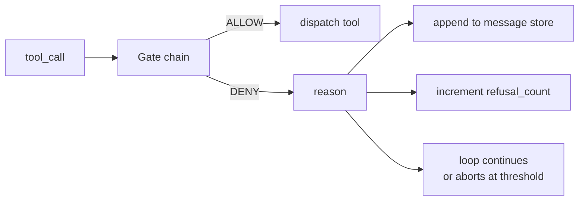
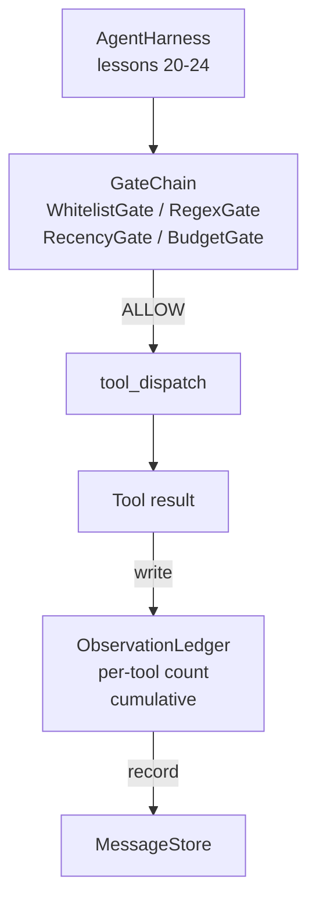

# Capstone 第 25 课: Ports de vérification et budget d'observation

> 无验证层的代理利用,只是披露外套的愿望. 本课会构建确定性门链,用来决定是否允许一次工具调用 触发、代理可以看到多少输出,以及当代理 已读取太多内容时循环 何时必须停止──这个链由小型、名字的门加上观察账号组成; ledger 会追踪已经显示给模型的每个代币──

**Type:** Build
**Languages:** Python (stdlib)
**Prerequisites:** Phase 19 · 20-24（Track A1：agent loop、tool registry、message store、prompt builder、model router），Phase 14 · 33（instructions as constraints），Phase 14 · 36（scope contracts），Phase 14 · 38（verification gates）
**Time:** ~90 minutes

## Objectifs d'apprentissage

- construction avec certitude `evaluate(call)`- Je suis un homme.`VerificationGate`Le protocole
- Les données de la liste des clients sont fournies par le système de gestion des données.
- 通过按工具和转 建索引的 `ObservationLedger` Suivre chaque observation 
- Lorsque le budget d'observation cumulé sera dépassé, refusez un appel à l'outil.
-  exposé structurée `GateDecision`enregistrement, pour la sous-observabilité

##  problématique

Lorsque l'agent utilise les outils, il y a trois types de bugs dans la première heure de l'utilisation réelle.

La première classe est l'observation sans limites. Pour une série de 20 000 réponses, on mettra 50 000 jetons en sortie dans la prochaine série.

Deuxième classe est la récente périmée. Une longue durée de fonctionnement des tâches accumulera 50 fois les appels à l'outil. Le modèle mettra le premier lecteur_fichier de la troisième série en cours de rééducation.

Troisième classe est le "privilège de la craquage".`web_search`Ça a commencé, puis ça a fonctionné.`shell`, parce que le modèle a créé un nom d'outil, et utilise 默认宽松──等有人读取痕迹 时,/tmp 里已经放入一个垃圾文件,并且一次卷 已经打到了私有API──

La porte de vérification est le harnais, qui est responsable de la composition.`(call, history, ledger)`La fonction de détermination, retourner AUTHOR ou DENY,并附带理由──reason 会被记录──模型会被告知──loop 会继续或停止──

## 概念



La porte est toute avec`evaluate(call, ctx) -> GateDecision`L'ordre est important: les portes structurelles bon marché seront précédées par les portes de comptage de jetons coûteuses.

本课提供四门门:

- `WhitelistGate`Les noms des outils autorisés sont un ensemble manifeste. Tout ce qui est en dehors de ce groupe sera refusé. C'est la porte la plus abordable, qui sera la première à fonctionner.
- `RegexGate`◊ Arguments d'outils 会与 regex 匹配──适合拒绝包含 `rm -rf`Les appels HTTP de l'IP interne sont liés à la charge utile de l'appel.
- `RecencyGate`◊ le modèle ne peut voir que les observations de N 轮 les plus récentes ◊ les observations plus anciennes seront obscurcées ◊ cette porte refusera ses résultats et étendra une fenêtre d'observation déjà expirée appel à l'outil ◊
- `BudgetGate` Modèle de jetons cumulés dans toute la session Il y a une limite supérieure. Lorsque le registre indique que la limite supérieure a été atteinte, chaque appel d'outil suivant sera refusé.

Le livre d'observation 负责记账―― chaque fois que l'outil réussit l'appel 城市写入一行:outil name、turn、tokens issued、cumulative。le livre répond à deux questions:模型总共看到了多少,以及它看到了多少的工具 X── budgétaire passerelle 读取第一──per-outil budget gate 是你的练习内容,它会读取第二个──


```figure
cg-gate-chain
```

## 架构



Harness 会询链──链 要么点头,要么拒绝──如果它点头,工具会运行, ledger 会计数,结果将被添加到消息商店──如果它拒绝,模型将以系统信息的形式获得拒绝,然后循环决定是重试还是停止──

## Tu vas construire quoi ?

                                                                                                                                                                                                                                                                                                                                                                                                                                                                                                                             `main.py`Les tests sont complets.

1. `Observation`et `ToolCall`Classes de données  définir les formes de fil。
2. `ObservationLedger` enregistrement `(turn, tool, tokens)`Les lignes,并回答 `cumulative()`et `per_tool(name)`Il y a une autre.
3. `GateDecision`- Je suis là.`(allow, reason, gate_name)`Il y a une autre.
4. `VerificationGate`C'est le protocole. Chaque porte est mise en œuvre.`evaluate(call, ctx)`Il y a une autre.
5. `GateChain`Il va appeler chaque porte, retourner la première déni; si toutes les portes sont passées, alors retourner autoriser.
6. Démo 运行一个很小的合成代理循环──三轮──第三轮触发预算门,循环 会报告一次干净的拒绝,并带有非零拒绝计量──

Le compteur de jetons est très grossier.`len(text) // 4`Le point de départ de la formation est la plomberie de porte, et non le tokenizer.

## Pourquoi la chaîne 顺序 est importante

Une fois de nier, une fois de laisser, c'est plus facile.`WhitelistGate`运行 O(1) recherche de hachage`RegexGate`运行 O(pattern * argv)`RecencyGate`读取 message store 的一个小片──`BudgetGate`读取整个账簿──你需要按成本升序排列它们,这样被拒绝的电话就能在执行昂贵的工作前短路──

Vous devez aussi respecter le rayon de déploiement 排序──Whitelist est le plus fort的主张:

## Comment ça se compose avec le reste de la piste A ?

 Le cours précédent vous a donné un boucle, un registre d'outils, un magasin de messages, un constructeur de protocoles et un routeur de modèles.  Le cours de base fournit une boîte à sable, lorsque la chaîne de portes reçoit l'autorisation.  Après le cours, le dispatcher fournit un appel à l'outil.  Le cours de base fournit un harnais d'évaluation, le compte de refus  en tant que signal de qualité.

## 运行方式

```bash
cd phases/19-capstone-projects/25-verification-gates-observation-budget
python3 code/main.py
python3 -m pytest code/tests/ -v
```

Les tests de démo seront imprimés à tour de rôle, y compris chaque décision de la porte, et ils seront effectués à zéro sortie.
