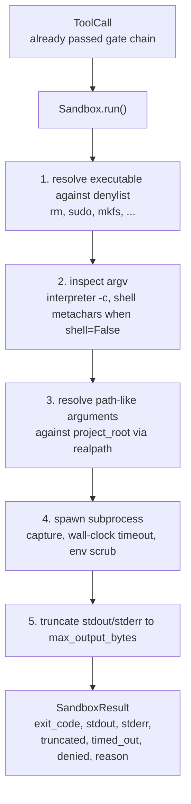
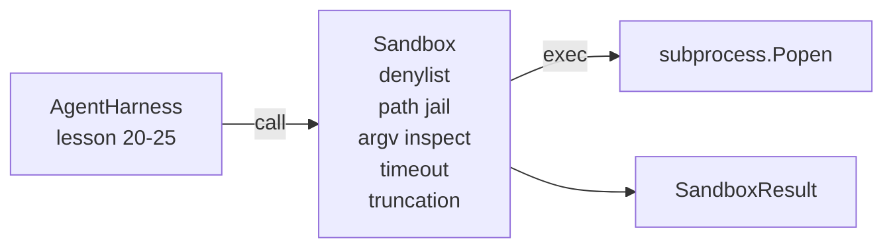

# Capstone 第 26 课:带 Denylist 与 Path Jail Sandbox Runner

> La porte de vérification décide une fois que l'appel à l'outil devrait être exécuté. Sandbox décide de ce qui se passera à son exécution.

**Type:** Build
**Languages:** Python (stdlib)
**Prerequisites:** Phase 19 · 25（verification gates and observation budget），Phase 14 · 33（instructions as constraints），Phase 14 · 38（verification gates）
**Time:** ~90 minutes

## Objectifs d'apprentissage

- Construire un emballage`subprocess.run``Sandbox`classe, avec un temps de répit, capture et troncage.
- 按名称通过 denylist、按结构通过 argv inspector 拒绝命令──
-  Rejeter tout argument de chemin hors de la racine du projet  de résoudre jusqu'à déclarer 
- En mode shell 关闭时拒绝 shell métacharacters。
-                                                                                                                                                                                                                                                                                                                                                                                                                                                                                                                              `SandboxResult`, pour la sous-observabilité et l'évaluation de l'utilisation

##  problématique

能够 shell out 能够 shell out 能够在一个转换内安装后门、外泄密钥、损坏开发人员笔记本电脑,并产生云账单――成本最低的防御是不给它 shell――成本第二低的是一个会对精确的模式列表说不的沙盒――

Les traces d'agents sont en train de se reproduire.

La première classe est les exécutables dangereux.`sudo`- Je suis là.`chmod -R 777`- Je suis là.`rm -rf`- Je suis là.`mkfs`- Je suis là.`dd` Toutes ces choses ne sont pas des agents de la course.

Deuxième catégorie est les astuces argv. Un défendeur ne peut pas utiliser le modèle de la coquille, passera par l'interprète.`python3 -c "import os; os.system('rm -rf /')"`- Je suis là.`bash -c '...'`- Je suis là.`node -e '...'`- Je suis là.`perl -e '...'`Sandbox, il faut savoir, tout ce qui est comme ça.`-c`L'interprète du drapeau est en fait un appel à l'appel à la fois.

Le troisième est l'évasion par le chemin.`./src/main.py`Je l'ai lu.`../../etc/passwd`La boîte à sable sera passée`os.path.realpath`解析 chaque argument de chemin,并断言其前, afin de les limiter en prison 内──

Cette boîte à sable n'est pas une limite de sécurité du système d'exploitation en un sens. Un attaquant déterminé qui exécute le code peut toujours s'échapper. Cette boîte à sable est une barrière de développement: elle rend les modes d'échec courants visibles et empêche l'agent de causer des dommages en raison de la simple erreur.

## 概念



Sandbox a quatre axes de refus: nom, argv, chemin, structure. Chaque axe est une pure fonction de l'appel, il n'y a pas encore de sous-processus.

`SandboxResult`Codes de sortie Utilisez la valeur habituelle: 0 pour indiquer le succès, non-zero pour indiquer l'échec, en plus il y a trois codes sentinelles: refusé (-100)、timé_out (-101) 和 tronqué(code de sortie est la valeur réelle, en même temps que le flag)。


```figure
cg-path-jail
```

## 架构



Denylist est un nom de base exécutable.`/bin/rm`- Je suis là.`/usr/bin/rm`)都会解析到相同的基名──argv inspector 了解解释器形状:任何 argv[0] 是解释器 且后续任一 arg 以 `-c`Ou `-e`开头的 argv 都会被拒绝──当电话 没有显然请求 shell 时,shell métacharacters(`;`- Je suis là.`|`- Je suis là.`&`- Je suis là.`>`- Je suis là.`<`Les coussinets`$()`) entraînera un refus.

La prison de chemin est la partie la plus délicate.`project_root`◊ tout ce qui ressemble à un argument de chemin`/`Ou correspondant à des documents existants)`os.path.realpath`归一化, puis comparer avec le vrai chemin de la racine du projet. Si le but de la résolution est non dans la racine, il est rejeté.

## Tu vas construire quoi ?

实现是 `main.py`Une autre test.

1. `SandboxResult`classe de données:exit_code、stdout、stderr、truncated、timed_out、denied、reason、duration_ms。
2. `SandboxConfig`classe de données:project_root、max_output_bytes、timeout_seconds、denylist、interprète_block。
3. `Sandbox`classe:`run(argv, *, shell=False, cwd=None)`Retour`SandboxResult`Il y a une autre.
4. 内部 aides au refus:`_check_executable_denylist`- Je suis là.`_check_argv_interpreter`- Je suis là.`_check_shell_metachars`- Je suis là.`_check_path_jail`Il y a une autre.
5. La réduction de la production,带清晰的 `truncated`Le drapeau et le courant capturé
6. 底部 демо:一系列合法与对抗的电话―― chaque appel ville montrera son résultat――

sandbox 默认使用 `subprocess.run`且 `shell=False`- Je suis là.`capture_output=True` Temps de mise en garde`timeout`argument;`TimeoutExpired`Le groupe de processus de tuerie de Sandbox a été créé en Sandbox Result.

## Pourquoi ce n' est pas une vraie boîte à sable ?

Le système de protection est structural: l'agent sera refusé d'exécuter les invocations de risque les plus courantes, et le refus évident entrera dans l'observabilité, plutôt que dans la pratique silencieuse.

Pour les agents de production, vous devez les superposer: dans un conteneur Docker non privilégié, dans un microVM, dans un microVM, dans des capacités de dépôt, dans un projet, dans un projet, dans un contenu, dans un contenu, dans un contenu, dans un contenu, dans un contenu, dans un contenu, dans un contenu, dans un contenu, dans un contenu, dans un contenu, dans un contenu, dans un contenu, dans un contenu, dans un contenu, dans un contenu, dans un contenu, dans un contenu, dans un contenu, dans un contenu, dans un contenu, dans un contenu, dans un contenu, dans un contenu, dans un contenu, dans un contenu, dans un contenu, dans un contenu, dans un contenu, dans un contenu, dans un contenu, dans un contenu, dans un contenu, dans un contenu, dans un contenu, dans un contenu, dans un contenu, dans un contenu, dans un contenu, dans un contenu, dans un contenu, dans un contenu, dans un contenu, dans un contenu, dans un contenu, dans un contenu, dans un contenu, dans un contenu, dans un contenu, dans un contenu, dans un contenu, dans un contenu, dans un contenu, dans un contenu, dans un contenu, dans un contenu, dans un contenu, dans un contenu, dans un contenu, dans un contenu, dans un contenu, dans un contenu, dans un contenu, dans un contenu, dans un contenu, dans un contenu, dans un contenu, dans un contenu, dans un contenu, dans un contenu, dans un contenu, dans un contenu, dans un contenu, dans un contenu, dans un contenu, dans un contenu, contenu, contenu, dans un contenu, contenu, contenu, contenu, contenu, contenu, contenu, contenu, contenu, contenu, contenu, contenu, contenu, contenu, contenu, contenu, contenu, contenu, contenu, contenu, contenu, contenu, contenu, contenu, contenu

## 运行方式

```bash
cd phases/19-capstone-projects/26-sandbox-runner-denylist
python3 code/main.py
python3 -m pytest code/tests/ -v
```

Démo créer un répertoire temporaire, mettre dans un fichier propre, puis exécuter un groupe d'appels.`denied=True`Et la raison de la SandboxRésultat:`timed_out=True`❖ La mise en place de la tronçage`truncated=True`◊demo 会印结果的JSON table,并以零退出──

## Comment ça se compose avec le reste de la piste A ?

Le programme de mise à jour de la mise en œuvre de la mise en œuvre de la mise en œuvre de la mise en œuvre de la mise en œuvre de la mise en œuvre de la mise en œuvre de la mise en œuvre de la mise en œuvre de la mise en œuvre de la mise en œuvre de la mise en œuvre de la mise en œuvre de la mise en œuvre de la mise en œuvre de la mise en œuvre de la mise en œuvre de la mise en œuvre de la mise en œuvre de la mise en œuvre de la mise en œuvre de la mise en œuvre de la mise en œuvre de la mise en œuvre de la mise en œuvre de la mise en œuvre de la mise en œuvre de la mise en œuvre de la mise en œuvre de la mise en œuvre de la mise en œuvre de la mise en œuvre de la mise en œuvre de la mise en œuvre de la mise en œuvre de la mise en œuvre de la mise en œuvre de la mise en œuvre de la mise en œuvre de la mise en œuvre de la mise en œuvre de la mise en œuvre de la mise en œuvre de la mise en œuvre de la mise en œuvre de la mise en œuvre de la mise en œuvre de la mise en œuvre de la mise en œuvre de la mise en œuvre de la mise en œuvre de la mise en œuvre de la mise en œuvre de la mise en œuvre de la mise en œuvre de la mise en œuvre de la mise en œuvre de la mise en œuvre de la mise en œuvre de la mise en œuvre de la mise en œuvre de la mise en œuvre de la mise en œuvre de la mise en œuvre de la mise en œuvre de la mise en œuvre de la mise en œuvre de la mise en œuvre de la mise en œuvre de la mise en œuvre de la mise en œuvre de la mise en mise en mise en mise en mise en mise en mise en mise en mise en mise en mise en mise en mise en mise en mise en mise en mise en mise en mise en mise en mise en mise en mise en mise en mise en mise en mise en mise en mise en mise en mise en mise en mise en mise en mise en mise en mise en mise en mise en mise en mise en mise en mise en mise en mise en mise en mise en mise en mise en mise en mise en mise en mise en mise en mise en mise en mise en mise en mise en mise en mise en mise en mise en mise en mise en mise en mise en mise en mise en mise en mise en mise en mise en mise`Sandbox.run`调用发发出一个 `gen_ai.tool.execution`Dans la dernière partie de la démo, un vrai codeur est connecté à ces deux niveaux.
