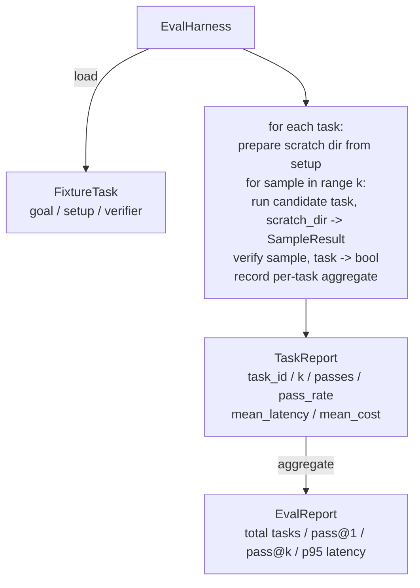

# Leçon 27: Le harnais égal des tâches de fixation

> Le niveau d'un agent de codage dépend du fait que vous l'utilisez pour mesurer son ensemble de tâches. Le cours construit un harnais d'évaluation: il reçoit une tâche fixe.

**Type:** Build
**Languages:** Python (stdlib)
**Prerequisites:** Phase 19 · 25 (verification gates), Phase 19 · 26 (sandbox runner), Phase 14 · 30 (eval-driven agent development), Phase 14 · 19 (SWE-bench and GAIA benchmarks)
**Time:** ~90 minutes

## Objectifs d'apprentissage

- Pour définir la tâche de fixation comme objectif, configuration et vérificateur,
- Pour chaque tâche, plusieurs échantillons de course 打分,并计算 pass@1 和 pass@k。
- La latence et le coût sont combinés en moyenne avec les métriques de 95e percentile.
- Les vérificateurs de détermination de fichiers diffèrent, le code de sortie correspond à la régéx)
- 输出 structurée rapport JSON, pour le script de suivi de régression 摄取──

## Le problème

 sans évaluation  sur les critères de référence des agents de construction,  rencontrer trois types de défaillance 

La première classe est un passage inexpérimenté. L'agent dit qu'il a corrigé le bug, l'homme est différent à un coup de vue, il a mis le kit en marque verte, trois semaines plus tard le test de régression a été exposé.

Le second type est la régression non découverte. Une modification du modèle de la mise en œuvre rapide, permet à l'agent de monter 4% sur les tâches visibles, mais de baisser 14% sur les tâches calmes.

Le troisième type est le déploiement par tâche. Le premier utilise 100 tâches, le deuxième utilise seulement 95 de celles-ci, car on a renommé 5 fixtures.

Harness est un processus qui transforme ces échecs en faits. Il fonctionne chaque fois en ordre réétablis, et utilise un vérificateur, en fonction de la certitude, le contrôle retourne vrai ou faux.

## Le concept

```mermaid
flowchart LR
  F1[fixtures/task_001/<br/>task.json + expected/] --> Harness
  F2[fixtures/task_002/<br/>...] --> Harness
  Harness[Harness<br/>for each task:<br/>setup / run agent k samples /<br/>verify each sample /<br/>record latency, cost]
  Harness --> Report[EvalReport<br/>pass@1 / pass@k<br/>mean ms / p95 ms<br/>mean cost]
```

`FixtureTask`C'est un petit fichier JSON, plus un optionnel.`expected/`À présent, j'ai été envoyé à la police.`id`- Je suis là.`goal`(给代理的提示)`setup`块(要放入 划分 dir 的文件) ainsi que `verifier`块──verifier 块指定 harness 块指定 harness 块指定 harness 块指定 harness 块指定 harness 块指定 harness 块指定 harness 块指定 harness 块──verifier 块──verifier 块──verifier 块──verifier 块──verifier 块──verifier 块──verifier 块──verifier 块──verifier 块──verifier 块──verifier 块──verifier 块──verifier 块──verifier 块──verifier 块──verifier 块──verifier 块──verifier 块──verifier 块──verifier 块──verifier 块──verifier 块──verifier 块──verifier 块──verifier 块──verifier 块──verifier 块──verifier 块──verifier 块──verifier 块──verifier 块──verifier 块──verifier 块──verifier 块──verifier 块──verifier verifier 块──verifier verifier verifier 块──verifier verifier verifier verifier verifier verifier verifier verifier verifier verifier verifier verifier verifier verifier verifier verifier verifier verifier verifier verifier verifier verifier verifier verifier verifier verifier verifier verifier verifier verifier verifier verifier verifier verifier verifier verifier verifier verifier verifier verifier verifier verifier verifier verifier verifier verifier verifier verifier verifier verifier verifier verifier verifier verifier verifier verifier verifier veri verifier veri veri verifier verifier veri verifier verifier veri verifier veri veri verifier veri veri verifier veri veri veri veri veri veri veri veri veri veri veri veri veri veri veri veri veri veri veri veri veri veri veri veri veri veri veri veri

形态覆盖大多数有用任务──

La première est:`file_equals`◊ agent  après la mise en œuvre, le fichier spécifié sera comparé au contenu attendu .

La deuxième est:`regex_match`                                                                                                                                                                                                                                                              

La troisième est:`shell_exit_zero` Harness 运行一个 shell command (en passant par la leçon 26 de sandbox), seulement lorsque l'ordre est à zéro 退出时才让任务通过──

Harness va chaque tâche fonctionner `k`Il y a une autre chose.`1 - (1 - p)^k`, dont p est le taux de réussite de l'expérience;harness également rapport des nombres bruts, facilité pour vous de trouver la variance;;la latence est le mur-horloge de chaque échantillon;;Cost est l'agent

## Architecture



Le candidat est un appelable:`Callable[[FixtureTask, str], SampleResult]` Le harness       `tempfile.mkdtemp()`创建草图目录,并把其路径作为普通字符串传入──harness 不关心候选人 如何工作──候选人 可以是确定性的补丁申请人(对harness自测测很有用)、真实LLM agent、fuzzer──契约是 SampleResult──

## Ce que vous allez construire

`main.py`提供:

1. `FixtureTask`classe de données
2. `SampleResult`classe de données:success_self_reported、latency_ms、cost_units、edits。
3. 带 `to_dict()``TaskReport`- Je suis là.`EvalReport`les classes de données;;
4. Le nom du vérificateur 映射到函数 的`VerifierRegistry` vérificateurs de mise en place:files_equals、régex_match、shell_exit_zero。
5. `EvalHarness`classe。 avec un candidat 运行一个任务目录。返回EvalReport。
6. Je suis en train de me faire une idée .`tasks/`Les cinq tâches de fixation:
   - `fizzbuzz`Le centre de l'off-par-un
   - `factorial`Retour en défaut
   - Message d'erreur
   - 空 corps de fonction
   - traversée de liste liée 中的
7. Un candidat de référence à la détermination`apply_known_fixes`),harness utilisée pour démontrer le passage de la nette@1 = 1,0。
8. Demo 打印 EvalReport JSON et non à zéro 退出。

tâches de fixation 以 `tasks/`Le format JSON du fichier est lié, et il est complété.`tasks/<id>/buggy/`et `tasks/<id>/expected/`Le code de la carte est le code de la carte de la carte de la carte de la carte de la carte de la carte de la carte de la carte de la carte de la carte de la carte de la carte de la carte de la carte de la carte de la carte de la carte de la carte de la carte de la carte de la carte de la carte de la carte de la carte de la carte de la carte de la carte de la carte de la carte de la carte de la carte de la carte de la carte de la carte de la carte de la carte de la carte de la carte de la carte de la carte de la carte de la carte de la carte de la carte de la carte de la carte de la carte de la carte de la carte de la carte de la carte de la carte de la carte de la carte de la carte de la carte de la carte de la carte de la carte de la carte de la carte de la carte de la carte de la carte de la carte de la carte de la carte de la carte de la carte de la carte de la carte de la carte de la carte de la carte de la carte de la carte de la carte de la carte de la carte de la carte de la carte de la carte de la carte de la carte de la carte de la carte de la carte de la carte de la carte de la carte de la carte de la carte de la carte de la carte de la carte de la carte de la carte de la carte de la carte de la carte de la carte de la carte de la carte de la carte de la carte de la carte de la carte de la carte de la carte de la carte de la carte de la carte de la carte de la carte de la carte de la carte de la carte de la carte de la carte de la carte de la carte de la carte de la carte de la carte de la carte de la carte de la carte de la carte de la carte de la carte de la carte de la carte de la carte de la carte de la carte de la carte de la carte de la carte de la carte de la carte de la carte de la carte de la carte de la carte de la carte de la carte de la carte de la carte de la carte de la carte de la carte de la carte de la carte de la carte de la carte de la carte de la carte de la carte de la carte de la carte de la carte de la carte de la carte de la carte de la carte de la carte de la carte de

## Pourquoi utiliser pas@k, et pas simplement pas@1

Les vrais agents de LLM sont des agents de l'occasion. Passe@1 pour 0.6 semble échouer. Passe@5 pour 0.95 indiquent que l'agent la plupart des temps peut obtenir la bonne réponse, mais dans les premiers échantillons, la méthode de révision est le prélèvement et le classement, sans que cela soit toujours plus de formation. Passe@k 让这一点可见──

Pass@k 会和 pass@1 一起报告,因为 pass@k 会掩盖真失败: si le modèle 二十次里只一次得到正确答案,你没有一个有用的代理――harness 会同时展示两者――

## Comment ça se compose avec le reste de la piste A ?

Leçon 25 产出门链──Leçon 26 产出沙盒──harness contre n'importe quoi`shell_exit_zero`vérificateur Utilisation de la boîte à sable. Leçon 28 会把每次 Harness run 包进 OTel trace. Leçon 29 针对其中一个捆绑装置 运行端到端演示,并断言参考候选人的 pass@1 = 1.0。

## 运行方式

```bash
cd phases/19-capstone-projects/27-eval-harness-fixture-tasks
python3 code/main.py
python3 -m pytest code/tests/ -v
```

Démo et JSON 打印 EvalReport, comprenant pass@1、pass@5、média latence 和逐任务 breakdown。exit code 为零──tests 覆盖验证器功能、pass@k math、fixture loading, ainsi que l'utilisation 针对捆绑参考候选人的端到端 行为──

```figure
pass-at-k
```
