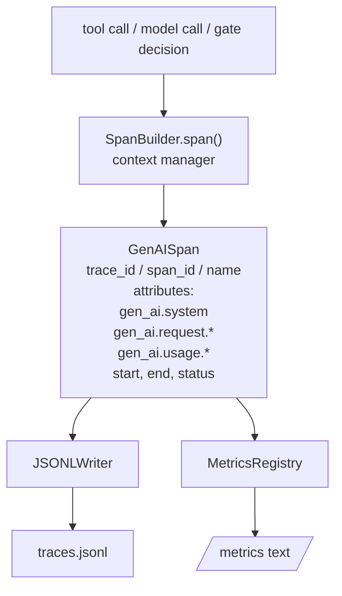
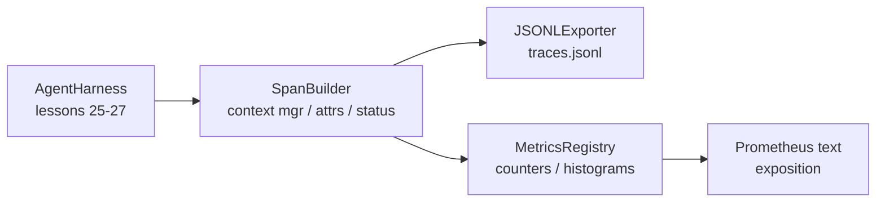

# Capstone Leçon 28: Utiliser OTel GenAI Spans et Prometheus Metrics  réaliser l'observabilité

> 无可观察的代理harness 是一个会花钱的黑盒──本课会手写一个跨度构建器,发发出符合OpenTelemetry GenAI的语义公约的记录,把它们写在JSON-Lines文件,每行一个跨度,并以Prometheus文格格式 暴露计和 histograms──整个实现都是Stdlib Python,并且可离线运行──

**Type:** Build
**Languages:** Python (stdlib)
**Prerequisites:** Phase 19 · 25 (verification gates), Phase 19 · 26 (sandbox), Phase 19 · 27 (eval harness), Phase 13 · 20 (OpenTelemetry GenAI), Phase 14 · 23 (OTel GenAI conventions)
**Time:** ~90 minutes

## Objectifs d'apprentissage

- 构建一个符合OpenTelemetry GenAI conventions sémantiques 形态的跨度数据类──
- 实现 un exportateur JSONL, chaque ligne écrit dans une période de contenu automatique.
- 构建带标签 和 Prometheus text-format exposition de compteurs et histogrammes。
- Utilisation de l'administrateur de contexte de durée 包装 arbitrary callable, durée de l'enregistrement、état et exceptions。
- Les émissions de test peuvent être effectuées`json.loads`Voyage en rond,并匹配 spec forme

## Le problème

Chaque cycle de production produit trois types d'artefacts: une fois appel de modèle, une fois exécution d'outil, ainsi qu'une décision de passerelle de vérification, sans télémétrie structurée, sans aucun usage.

Le premier type de défaillance est le manque de traces. Le seul enregistrement est un journal de chat de 500 pages.

Deuxième catégorie: le modèle de défaite est un traceur imperceptible. Harness a écrit des spans, mais utilise ses propres noms de champ ad hoc. Grafana, Honeycomb, Jaeger ou CLI locales sont tous perdus. Tout outil existant dans la pile de l'équipe est gaspillé, car les spans sont non standardisés.

Vous pouvez voir une fois un appel d'outil très lent dans la trace, mais ne pouvez pas répondre à la latence de p95 des appels de lecture_fichier de la dernière heure.

Les conventions sémantiques de la génération OpenTelemetry existent pour cela. Elles définissent un petit groupe d'attributs standard, pour les émetteurs de spans de différents cadres LLM.

## Le concept



chaque opération dans le harnais produira une durée.`gen_ai.chat`- Je suis là.`gen_ai.tool.execution`)、 suivre les attributs des conventions de GenAI、début et fin de temps, ainsi que le statut

Les conventions de la GenAI ont normalisé ces clés d'attribut:`gen_ai.system`(qui est le fournisseur, par exemple `anthropic`- Je suis là.`openai`)`gen_ai.request.model`(identifiant du modèle)`gen_ai.request.max_tokens`- Je suis là.`gen_ai.usage.input_tokens`- Je suis là.`gen_ai.usage.output_tokens`- Je suis là.`gen_ai.response.model`- Je suis là.`gen_ai.response.id`- Je suis là.`gen_ai.operation.name`, ainsi que des clés spécifiques à l'outil `gen_ai.tool.name`et `gen_ai.tool.call.id`Il y a une autre.

Exportateur 写 JSONL──每行一个 JSON对象──这是下游工具 可以流、抓和进口的最简单格式──真实OTel exporter 会使用OTLP gRPC;本课的JSONL exporter 是离线等价,并且在每个工作站上都以零退出──

Les métriques et les traces ne sont pas là. Chaque appel à l'outil met en avant un compteur:`tools_called_total{tool="read_file"}`◊histogramme 记录观察到的延迟:`tool_latency_ms{tool="read_file"}`◊ Les deux sont classés sous le format d'exposition de texte Prometheus, c'est le facteur de référence des métriques basées sur la traction.

## Architecture



Le constructeur de spans est une petite classe,带有 `span(name, attrs)`méthode, retourner à un gestionnaire de contexte;. gestionnaire de contexte, en entrant 时记录 start time, en sortant 时记录 end time, si vous avez laissé une exception, en ajoutant cette exception,并把

Le registre des métriques est deux dictes.`{(name, frozen_labels): int}`Les histogrammes seront conservés sur la liste des échantillons bruts et seront classés dans les épaves de l'histogramme Prométhée.

## Ce que vous allez construire

`main.py`提供:

1. `GenAISpan`Les données de classe:trace_id、span_id、parent_span_id、nom、attributs、start_unix_nano、end_unix_nano、status、status_message、événements。
2. 带 `span(name, attrs, parent=None)`gérant de contexte `SpanBuilder`classe.
3. 带 `export(span)``JSONLExporter`classe, ajouter à la ligne
4. `Counter`et `Histogram`classes, ainsi que `MetricsRegistry`Il y a une autre.
5. 生成 sortie de format texte `prometheus_exposition(registry)`Il y a une autre.
6. 发发发期并更新的指标 `wrap_tool_call(name)`décorateur
7. Démo: synthèse une fois entière invocation agent (outil spans 外层包 gen_ai.chat spans),写入 traces.jsonl,打印 Prometheus exposition,并以零 退出。

L'id de la durée et l'id de la trace sont des chaînes hexagonale de 16 octets, par `os.urandom`生成── ceci est conforme au contexte de trace W3C de OTel──exportateur 永不抛出; les erreurs IO 会被浮现, mais le harness 会继续运行──

Histogrammes avec un groupe de bouteilles fixes (Otel pour la latence de milliers de secondes): 5、10、25、50、100、250、500、1000、2500、5000、10000、+Inf)

## Pourquoi écrire à la main, plutôt que d'utiliser l'open-metry-sdk

Le SDK OTel Python est une vraie dépendance. Il a également des milliers de lignes de code, de plusieurs processus d'exportateur OTLP, ainsi que des coûts de fonctionnement de la partie budgétaire de la classe.

Les conventions sont stables. Le format de fil émis par le cours sera encore résolu jusqu'en 2030, car OTel ne détruira pas les noms d'attributs de la génération; ils ajouteront seulement de nouveaux noms.

## Comment ça se compose avec le reste de la piste A ?

Leçon 25 produit la chaîne de portes。Leçon 26 produit la boîte à sable。Leçon 27 produit le harnais d'évaluation。Leçon 28 让这三者都可观测。Leçon 29 会把端到端演示的每一步都包进跨度,并在最后打印Prometheus text。

## 运行方式

```bash
cd phases/19-capstone-projects/28-observability-otel-traces
python3 code/main.py
python3 -m pytest code/tests/ -v
```

Démo de réunion dans ce cours de travail dir en émettant un `traces.jsonl`(最后清理), puis imprimer trois échantillons de spans, reprendre des compteurs et des histogrammes de l'exposition Prometheus;; tests 验证 spans 可回行序列化、canonical GenAI attributs 存在、counter 正确递增, et l'exposition de l'histogramme 包含 les comptes de seau attendus。

```figure
trace-spans
```
