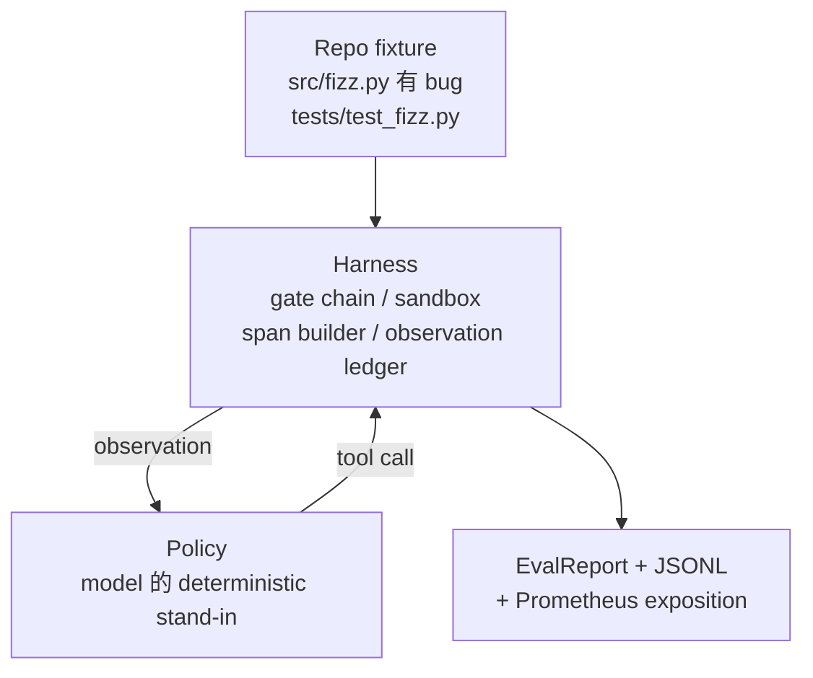
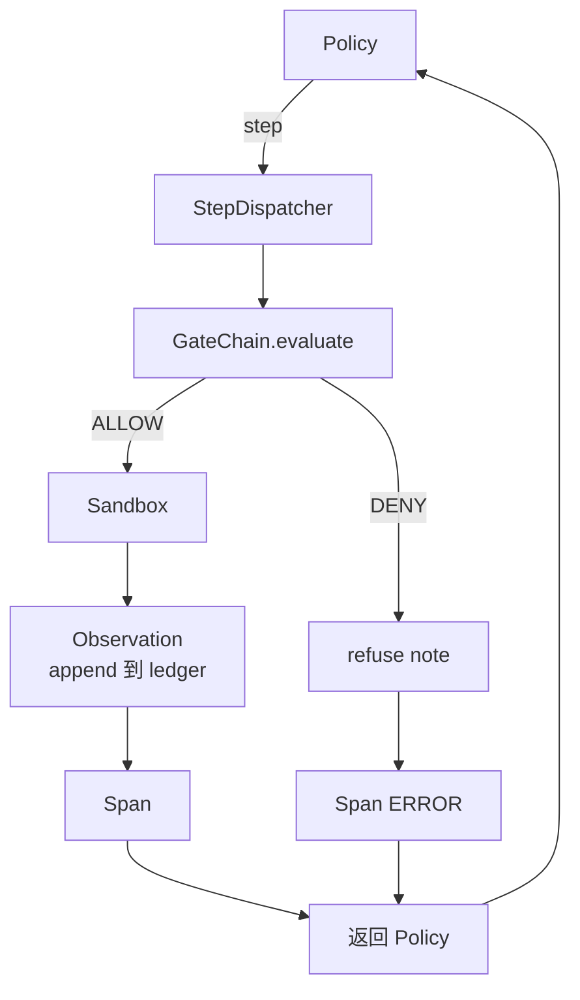

# Capstone  cours 29: Harness Up's End to End Agent de codage

> Trace A's résultats。 本课程把门链、砂盒、eval harness 和 OTel spans 串接成一个可工作的编码代理,用来修复一个多文件Python项目中真实的(小型固定规模)bug。

**Type:** Build
**Languages:** Python (stdlib)
**Prerequisites:** Phase 19 · 25 (verification gates), Phase 19 · 26 (sandbox), Phase 19 · 27 (eval harness), Phase 19 · 28 (observability), Phase 14 · 38 (verification gates), Phase 14 · 41 (workbench for real repos), Phase 14 · 42 (agent workbench capstone)
**Time:** ~90 minutes

## Objectifs d'apprentissage

- La chaîne de porte, la boîte à sable, le harnais éval et le constructeur de déploiement
- 实现一个使用读_文件、运行_测试 和 write_file 修复 fixture bug 的确定性政策──
- En effet, les données de la Commission ont été analysées dans le cadre de la mise en œuvre de la politique de sécurité et de la sécurité des services de sécurité.
- Pour le fonctionnement complet, émettez des traces complètes de l'OTEL GenAI et des métriques Prometheus.
- L'agent de vérification est en moins de 12 étapes dans la résolution du fichier, et il y a des outils légitimes.

## Le problème

La plupart des démo d'agents sont isolés: un seul sable, un seul harnais d'évaluation, un seul émetteur de durée.

La chaîne de porte  a donné l'autorisation, mais la boîte à sable Parce que la chaîne  n'a pas prévu de raison de rejet                                                                                                                                                                                                                                                                                                                                                                                                                                                                                          

Ce cours est un test d'intégration de toute la piste. L'agent doit effectuer en ordre quatre choses: lire le projet, exécuter les tests, éviter l'échec des tests, identifier les bugs, réécrire les fichiers, réexécuter les tests, puis arrêter.

## Le concept



La politique de l'agent est une machine d'État.

`SURVEY`:agent 读取 projet listing──下一个状态是RUN_TESTS──

`RUN_TESTS`Si les tests passent, la machine est mise en état de succès.

`INSPECT`:agent 读取失败的源文件──下一个状态是FIX──

`FIX`:agent 写入修正后的文件──下一个状态是 VERIFY──

`VERIFY`:agent Repeat operation test commandes。 si les tests passent, arrête le succès。 sinon arrête avec l'échec。

Chaque état a répondu à une seule appel d'outil. Chaque appel d'outil a traversé une chaîne de portes. Si une seule appel d'outil a été rejetée, l'agent sera suivi.

bug de l' appareil est `fizz.py`Le code de détection de la détection de la détection de la détection de la détection de la détection de la détection de la détection de la détection de la détection de la détection de la détection de la détection de la détection de la détection de la détection de la détection de la détection de la détection de la détection de la détection de la détection de la détection de la détection de la détection de la détection de la détection de la détection de la détection de la détection de la détection de la détection de la détection de la détection de la détection de la détection de la détection de la détection de la détection de la détection de la détection de la détection de la détection de la détection de la détection de la détection de la détection de la détection de la détection de la détection de détection de la détection de la détection de la détection de la détection de détection de détection de détection de détection de détection de détection de détection de détection de détection de détection de détection de détection de détection de détection de détection de détection de détection de détection de détection de détection de détection de détection de détection de détection de détection de détection de détection de détection de détection de détection de détection de détection de détection de détection de détection de détection de détection de détection de détection de détection de détection de détection de détection de détection de détection de détection de détection de détection de détection de détection de détection de détection de détection de détection de détection de détection de détection de détection de déte


```figure
cg-harness-weave
```

## Architecture



Ce cours est auto-contenu. Chaque cours préalable est primitif.`main.py`Les cours sont donc parfaitement conformes aux leçons 25-28, de sorte que le concept de cartographie est clair.

## Ce que vous allez construire

`main.py`提供:

1. Les derniers harnais primitifs, noms et leçons 25-28`GateChain`- Je suis là.`Sandbox`- Je suis là.`ObservationLedger`- Je suis là.`SpanBuilder`- Je suis là.`MetricsRegistry`Il y a une autre.
2. `CodingAgentPolicy`classe: contient cinq États de la machine d'État.
3. `Repo`Préparez un scratch dir, qui contient un ensemble de fixations de buggy.
4. `AgentRun`classe: politique de conduite, par envoi de harnais,并返回 `AgentRunReport`Il y a une autre.
5. Un ensemble de fixations`fixture_repo/`), comprennent src/fizz.py、tests/test_fizz.py, ainsi que l'arbre/l'arbre attendu/utilisé pour l'utilisation de l'évaluation.
6. Démo: politique de fonctionnement, imprimer des traces, des déclarations, des métriques,

Le programme de formation de l'équipe de recherche de l'équipe de recherche de l'équipe de recherche de l'équipe de recherche de l'équipe de recherche de l'équipe de recherche de l'équipe de recherche de l'équipe de recherche de l'équipe de recherche de l'équipe de recherche de l'équipe de recherche de l'équipe de recherche de l'équipe de recherche de l'équipe de recherche de l'équipe de recherche de l'équipe de recherche de l'équipe de recherche de l'équipe de recherche de l'équipe de recherche de l'équipe de recherche de l'équipe de recherche de l'équipe de recherche de l'équipe de recherche de l'équipe de recherche de l'équipe de recherche de l'équipe de recherche de l'équipe de recherche de l'équipe de recherche de l'équipe de recherche de l'équipe de recherche de l'équipe de recherche de l'équipe de recherche de recherche de l'équipe de recherche de recherche de l'équipe de recherche de recherche de l'équipe de recherche de recherche de l'équipe de recherche de recherche de recherche de l'équipe de recherche de recherche de recherche de l'équipe de recherche de recherche de l'équipe de recherche de recherche de recherche de l'équipe de recherche de recherche de recherche de l'équipe de recherche de recherche de l'équipe de recherche de recherche de l'équipe de recherche de recherche de l'équipe de recherche de recherche de l'équipe de recherche de recherche de l'équipe de recherche de l'équipe de recherche de l'équipe de recherche de recherche de recherche de recherche de l'équipe de recherche de l'équipe de recherche de l'équipe de recherche de l'équipe de recherche de recherche de l'équipe de recherche de l'équipe de recherche de l'équipe de recherche de recherche de recherche de recherche de l'équipe de recherche de l'équipe de l'équipe de recherche de l'équipe de recherche de l'équipe de recherche de l'équipe de recherche de l'équipe de l'équipe de recherche de l'équipe de recherche de l'équipe de la recherche de l'é

## Pourquoi la politique n'est pas LLM

En effet, le programme de formation en ligne nécessite une API clé, un appel à réseau, ainsi qu'une stochasticité indétectable.

La politique du cours est celle d'un agent de LLM qui fait des choses.

## démo 会断言什么

La démo de bout en bout, en sortant, déclare cinq choses, la suite de tests aussi les déclare de nouveau en programmation.

La politique est en moins de 12 étapes.

Le budget de l'observation 从未超出──

Les outils légitimes ont été refusés à zéro.

Traces.jsonl dans chaque étape ont une durée de traitement.

L' exposition de Prometheus contient un`tools_called_total{tool="read_file"}`Entrée et un`tool_latency_ms`histogramme

## Comment ça se compose avec le reste de la piste A ?

Leçon 25  écrivit la chaîne de passerelle。Léction 26  écrivit la sandbox。Léction 27  écrivit l'utilisation de l'évaluation。Léction 28  écrivit l'observabilité。Léction 29  prouve qu'ils sont un système 可以工作。

## 运行方式

```bash
cd phases/19-capstone-projects/29-end-to-end-coding-task-demo
python3 code/main.py
python3 -m pytest code/tests/ -v
```

Démo 会打印 par étape trace、rapport d'évaluation final 和 exposition Prometheus。退出码为零──tests 覆盖政策状态转变、synthétique tool calls 上的门拒绝、捆绑 fixture 上的端到端运行,以及阶段预算变量──
