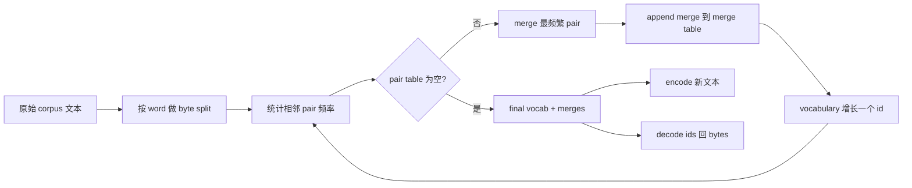
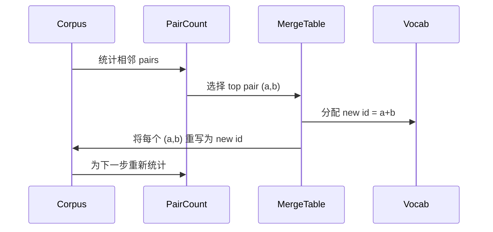

# De la conception à partir de zéro BPE Tokenizer

> 字节进, 出, 出, 字节 再返回相同字节──构建每个现代文本模型仍然起步于此的Tokenizer──

**Type:** Build
**Languages:** Python
**Prerequisites:** Phase 04 lessons, Phase 07 transformer lessons
**Time:** ~90 minutes

## Objectifs d'apprentissage
- 通过反复 merge 最频繁的相邻符号对,从原始文字体 训练 Byte-Pair Coding vocabulaire。
- 实现确定性融合表,并将其应用到新文本上, générer des ids de sous-parts 流──
- Pour obtenir des informations, vous devez utiliser des données de type UTF-8 pour les utiliser.
- 保留并保护 des jetons spéciaux`<|endoftext|>`- Je suis là.`<|pad|>`), les faire rester en forme et décoder 后不变──
- Pourquoi l'alphabet de niveau octet est la limite exacte du Tokenizer ?


```figure
cap-bpe-merge
```

## Le cadre

Le modèle de langage 永远看不到文本──它看到的是整数──把字符串 映射为整数列并再映射回来东西,就是Tokenizer──这个层做错了,训练运行中每条损失曲线都在衡量错误的东西──

Généralement, le mot "tokenizers" est utilisé pour la plupart des modèles de textes. Il est utilisé dans les modèles de formation de référence pour les mots "tokenizers".

Nous allons construire une variante au niveau des octets. L'alphabet est de 256 octets bruts, et non de points de code Unicode. Cette option permet au Tokenizer de traiter n'importe quelle entrée UTF-8, sans avoir à revenir à un Token inconnu.

## Le pipeline



Si vous changez l'ordre de fusion en inférence, vous décoderez différents identifiants 流。

## L'alphabet en octets

Avant 256 个IDs Gardez-les en octets bruts 0x00 à 0xFF。 Cela garantit que chaque chaîne d'entrée peut être exprimée dans le vocabulaire avant toute fusion 发生在任何合并之前──在字节区块后, nous conservons un petit échelon de champs  un cycle de formation 永远不会提出这些IDs 作为合并目标,因为我们将它们完全排除在预技术化流之外──

Pré-tokenizer 会在训练 见体 之前,按白空间 和点击界限 进行分化──如果没有这个分化,BPE merge step 会很乐意学习跨越词界限的合并,词库 会被常见整句短语填满──有这个分化,会留在词内,结果也更能泛化──

## Le cycle d'entraînement

Dans chaque étape de formation, il fait trois choses. Il traverse chaque mot du corpus, statistique de chaque paire de symboles voisins de la fréquence de la fréquence de la fréquence de la fréquence de la fréquence de la fréquence de la fréquence de la fréquence de la fréquence de la fréquence de la fréquence de la fréquence de la fréquence de la fréquence de la fréquence de la fréquence de la fréquence de la fréquence de la fréquence de la fréquence de la fréquence de la fréquence de la fréquence de la fréquence de la fréquence de la fréquence de la fréquence de la fréquence de la fréquence de la fréquence de la fréquence de la fréquence de la fréquence de la fréquence de la fréquence de la fréquence de la fréquence de la fréquence de la fréquence de la fréquence de la fréquence de la fréquence de la fréquence de la fréquence de la fréquence de la fréquence de la fréquence de la fréquence de la fréquence de la fréquence de la fréquence de la fréquence de la fréquence de la fréquence de la fréquence de la fréquence de la fréquence de la fréquence de la fréquence de la fréquence de la fréquence de la fréquence de la fréquence de la fréquence de la fréquence de la fréquence de la fréquence de la fréquence de la fréquence de la fréquence de la fréquence de la fréquence de la fréquence de la fréquence de la fréquence de la fréquence de la fréquence de la fréquence de la fréquence de la fréquence de la fréquence de la fréquence de la fréquence de la fréquence de la fréquence de la fréquence de la fréquence de la fréquence de la fréquence de la fréquence de la fréquence de la fréquence de la fréquence de la fréquence de la fréquence de la fréquence de la fréquence de la fréquence de la fréquence de la fréquence de la fréquence de la fréquence de la fréquence de la fréquence de la fréquence de la fréquence de la fréquence de la fréquence de la fréquence de la fréquence de la fréquence de la fréquence de la fréquence de la fréquence de la fréquence de la fréquence de la fréquence de la fréquence de la fréquence de la



Pour chaque étape, le coût et le corpus sont représentés dans la liste des séquences de symboles. Pour le vocabulaire cible de 1 million de mots et de 10 000 ids, le cycle est terminé en quelques secondes, car les séquences de symboles se raccourcissent avec la fusion.

## Enchanger du texte frais

inférence 不调用 merge counter──它按学习到的相同顺序应用 merge table──对于一个新词,encoder从字节分开 开始──它扫描当前序列,寻找排名 最低的 merge(最早学习到且可应用的那个)──它执行该 merge──然后再扫描──当前序列适用当前序列时,loop 结束──

按排序 排序 属性使编码确定性,并与训练在同一输入上的行为一致──最先学习到的结合 位于表顶部,并最先应用──如果两个结合都能在同一位置应用,则更低的结合出出──

## Tokens spéciaux

Les jetons spéciaux sont des jetons de bits  éternellement impossible de générer des ids ⋅ nous les conservons ⋅ dans ce cours deux sont suffisants ⋅

- `<|endoftext|>`Pendant la pré-entraînement, il sépare les documents. Il dit au modèle: Un nouveau document de ici à commencer, ne laissez pas le contexte du précédent document  fuir 
- `<|pad|>`Remplissez les séquences courtes, laissez le lot devenir un tensor rectangulaire. Perdre le masque le cache pendant l'entraînement.

Encodeur  accepter un drapeau, pour permettre l'entrée apparaître des jetons spéciaux ∞`<|endoftext|>`et `<|pad|>`会按拼写它们的字节来标签化. Lorsque le drapeau 打开时, les chaînes littérales 会映射到其保留 ids,并且不会参与任何合并.

## Garantissement de retour

Enchanger 后再解码 必须精确返回输入字节──decoder 会顺序拼接每个 id 的字节扩展──由于每个 id 要么是原字节,要么是两个以前已知 id 的连锁,复发式扩展 总会终止于原字节──decoding 随后返回这些字节 拼出的 UTF-8 string──

Cette suite de tests de ce cours se compose d'une phrase invisible, d'une phrase contenant un emojis Unicode, ainsi qu'une phrase contenant un mot-clé.`<|endoftext|>`La phrase du jeton 上检查这个属性──

## Ce que cette leçon ne fait pas

Il ne construit pas de prétokenizer de production de plus grande taille. Il est un petit espace blanc et une fraction de ponctuation. Il est suffisant pour produire des fusions raisonnables dans un petit corps de formation, et il est également lié à la partie suivante du cycle.

Il ne parallèlement pas le compteur de paires. Dans Python, le corpus de plusieurs milliers de mots est terminé en moins d'une seconde. Pour les plus grands corps, la pratique évidente est de faire le calcul de chaque paire de mots, puis de réduire.

## Comment lire le code

`main.py`Définir quatre objets.`BPETokenizer`持有词汇,组合表 和特殊标记表`train`C'est une boucle d'entraînement.`encode`C'est le chemin de l'inférence.`decode`Il est en train de créer un petit Tokenizer, de décoder une phrase, de décoder les ids, de les imprimer.`code/tests/test_bpe.py`Les tests ont déterminé la propriété de retour et retour, la réservation de jetons spéciaux et la commande de fusion.

运行 demo──然后把 demo 中的目标词汇大小从300 改成600,观察长度编码的句子 如何下降──那条曲线就是BPE compression curve──
