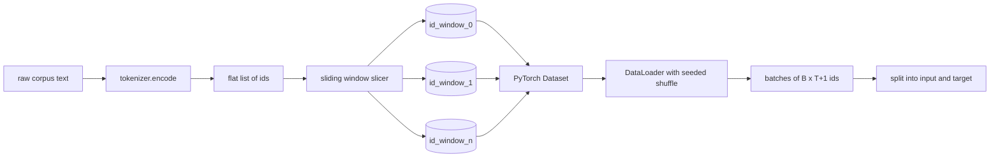
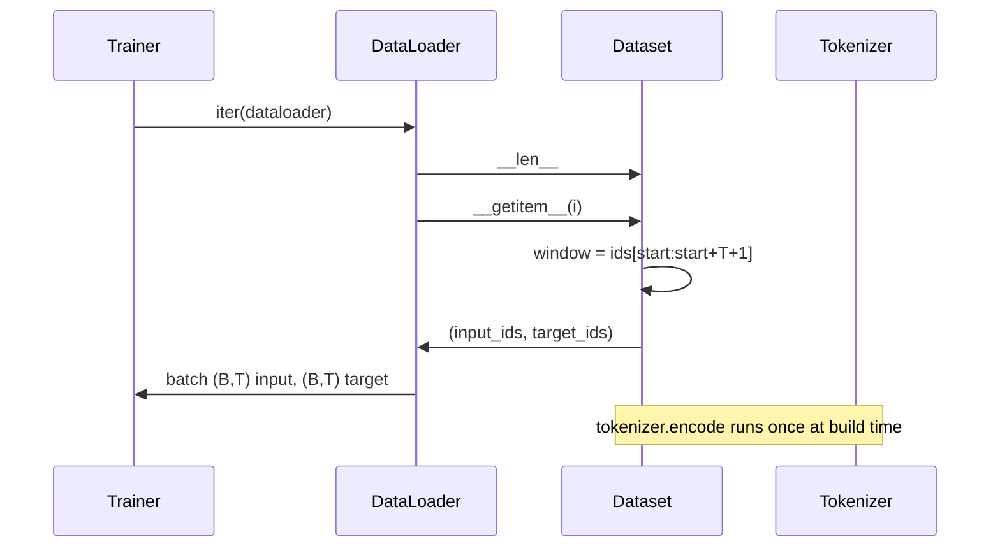

# Utiliser un ensemble de données sélectionnés

> Une formation préliminaire est effectuée en fonction de la fonction du jeton à la fonction du gradient.

**Type:** Build
**Languages:** Python
**Prerequisites:** Phase 04 lessons, Phase 07 transformer lessons, 本 phase 的 Lesson 30
**Time:** ~90 分钟

## Objectifs d'apprentissage


```figure
cap-sliding-window
```
- 通过只调用一次Tokenizer,把原始 corpus 转换为Token ids 流──
- Utilisez une étape de mise en place configurable, et transcrivez l'id 流切 into a fixed length window.
- Construire un ensemble de données PyTorch, pour la prédiction de la prochaine jeton  retour d'entrée et les tensors cibles。
- Utilisation de l'ensemble de données en utilisant le DataLoader,并使用按时 设定种子的决定性混──
- 推理 step、冗余和有效数据集大小 之间的权衡──

## 框架

Une formation préliminaire est effectuée par un groupe de symboles, et un modèle est mis à jour.`(B, T)`les identifiants d'entrée 和 `(B, T)`Les ids cibles, dont l'objectif est l'entrée de la pipeline de données, sont de possible nombre de Go dans le corpus du texte original, selon les besoins déterministes et réalisables pour produire ce contrat.

Le Tokenizer de la dernière classe va transformer le texte en une longue liste d'idées plates. Le Sliding Window va transformer cette liste en des exemples de formation.

## 形状 contrat

LM 消费形状为 `(B, T)`Les ids, parmi lesquels `B`est la taille du lot,`T`Il est longueur de contexte.`t`La cible est la position.`t+1`Il s'agit de chaque exemple de formation.`T+1`个原始 ids──window step 控制相邻例 之间有多少重叠──



Slicer ne traverse jamais les limites du corps. Si la dernière fenêtre ne contient pas assez d'identifiants, remplissez-le.`T+1`La place, le coupeur, la jettera.`<|pad|>`Le remplissage final est également un choix efficace, mais il va faire perdre le masque 变复杂──本课选择丢弃──

## Pourquoi utiliser la fenêtre coulissante

Le corpus de formation est un long ensemble d'idées. Si le modèle ne voit que des fenêtres non superposées, chaque exemple de formation sera le même.`T`个边界――调整步骤 会移动这些边界,让模型 看到更多这样的预测-next-token 任务――

pas à pas`T`Il y aura une fenêtre qui ne se repose pas.`T // 2`Il y aura une superposition de 50% et une mise en œuvre de l'ensemble de données.`1`L'ensemble de données est en train de s'accroître.`T`Le coût est de chaque époque, il faut plus de calcul. Les avantages sont la diversité des frontières plus élevés. La plupart des exercices de pré-entraînement utilisent des pas de longueur de contexte, car le corpus est beaucoup plus grand que le modèle.

## Classes de données

Les données PyTorch ont deux méthodes nécessaires.`__len__`返回 exemples 数量。`__getitem__`Le détail de l'échantillon de données est le même que celui de l'échantillon de données de l'échantillon de données de l'échantillon de données de l'échantillon de données de l'échantillon de données.



Le changement par un`__getitem__`内部──Data défini 返回 `(input, target)`, parmi lesquels `input = window[:-1]`- Je suis désolé .`target = window[1:]`Les deux sont des longs tensors PyTorch.

## Le mélange déterministe

Utilisation `shuffle=True`Le générateur aléatoire de PyTorch 读取──通过传入一个按时 设定种子的显式 `torch.Generator`, chaque fois que vous redémarrerez la fonctionnalité, vous obtiendrez le même mélange. Lorsque vous comparez deux hyperparamètres avec un seul paramètre, cette propriété est importante.

Le contrat de semence de cette classe est très simple.`epoch_seed = base_seed + epoch_index`◊ semence de base dans la construction ⋅ index de l'époque ⋅ index de l'époque ⋅ index de l'époque ⋅ index de l'époque ⋅ index de l'époque ⋅ index de l'époque ⋅ index de l'époque ⋅ index de l'époque ⋅ index de l'époque ⋅ index de l'époque ⋅ index de l'époque ⋅ index de l'époque ⋅ index de l'époque ⋅ index de l'époque ⋅ index de l'époque ⋅ index de l'époque ⋅ index de l'époque ⋅ index de l'époque ⋅ index de l'époque ⋅ index de l'époque ⋅ époque ⋅ époque ⋅ époque ⋅ époque ⋅ époque ⋅ époque ⋅ époque ⋅ époque ⋅ époque ⋅ époque ⋅ époque ⋅ époque ⋅ époque ⋅ époque ⋅ époque ⋅ époque ⋅ époque ⋅ époque ⋅ époque ⋅ époque ⋅ époque ⋅ époque ⋅ époque ⋅ époque ⋅ époque ⋅ époque ⋅ époque ⋅ époque ⋅ époque ⋅ époque ⋅ é é é é é é é é é é époque

## Pratiquateur de lot

Le modèle par défaut de PyTorch sera utilisé pour la sélection des indices.`B`La première`__getitem__`Il n'y a pas de résultat à mettre en place en un seul lot.

Le cours est simple à suivre.`num_workers=0` Dans la production et le fonctionnement, les travailleurs seront associés`__getitem__`Pour notre pipeline, c'est essentiellement un non-op, parce que le travail est juste pour faire une tranche de tensor en mémoire, mais avec une API de dataset, on peut facilement soutenir les travailleurs.

## 计算 des exemples

对于长度为 `N`La longueur du contexte`T`和 pas `S`,exemples numéros sont `max(0, 1 + (N - (T + 1)) // S)` Le cours de calcul est exposé à la méthode statique de l'ensemble de données, de sorte que le formateur peut passer par le processus de calcul de chaque époque.

## 本课不做什么

Il ne va pas de disque en streaming. Le corpus sera entièrement codé dans la mémoire, et il sera utilisé comme un seul tensor. Pour plusieurs millions d'id, il est inférieur à 100 Mo, mais il est également adapté à la forme du cours. Le disque en streaming est un autre point de préoccupation, il peut être remplacé par un stockage en connectant, tout en maintenant un contrat de dataset inchangé.

Il ne traite pas de documents multiples. Le corpus est considéré comme une série d'idées.`<|endoftext|>`Les ids pour coder la frontière du document suivant.

## Comment lire la code

`main.py`Il y a deux classes et un assistant.`SlidingWindowDataset`Il s'agit d'un ensemble de données PyTorch.`make_dataloader`Retournez à un DataLoader bien configuré, et avec un générateur semé.`_encode_corpus_to_ids`Il s'agit d'un appel Tokenizer unique.`code/tests/test_dataset.py`Les tests internes ont fixé la formule du nombre de vitres, la différence de type et de type.

运行 demo──然后把背景长度从16 改为32 ,观察每个时代的例子 数量如何下降──这个数字就是你的时代步骤预算──
