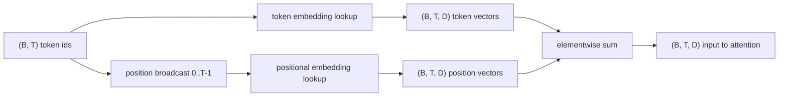
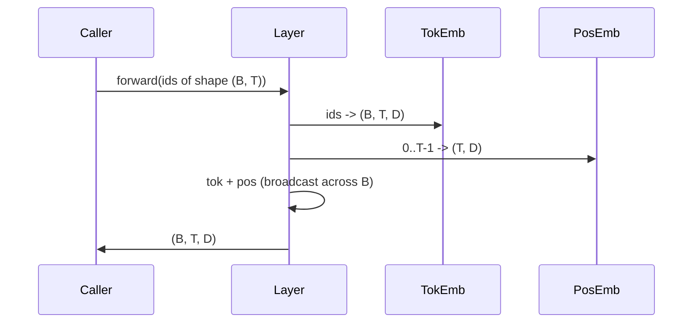

# Les embellissements de jetons et de positions

> Les ids sont des nombres entiers. Le modèle a besoin de vecteurs. Les tables de recherche sont situées entre les deux.

**Type:** Build
**Languages:** Python
**Prerequisites:** Phase 04 lessons, Phase 07 transformer lessons, 本 phase 的 Lessons 30 和 31
**Time:** ~90 分钟

## Objectifs d'apprentissage


```figure
cc-embedding-lookup
```
- Construire une table de recherche intégrée à des symboles, et mettre des ids de vocabulaire 映射到密集向量──
- Construire une table de recherche intégrée à la position apprise 
- Construire une intégration positionnelle sinusoïdale fixe sans paramètres
- Placez les jetons et les emblèmes positionnels 组合成 Entrée unique du bloc transformateur
- Par rapport à la comparaison apprise et les embrasements sinusoïdes en longueur généralisation et le nombre de paramètres

## 框架

Le premier contact avec le modèle et le code de jeton est effectué dans la matrice intégrée à jeton pour rechercher des lignes. Cette matrice Chaque ligne de vocabulaire d'id a une ligne, chaque dimension du modèle a une ligne.

Les symboles d'identification sont en train de se dérouler sans ordre. Le modèle a besoin d'un deuxième signal, indiquant que la position un n'est pas différente de la position dix-sept. Les deux types de choix principaux de ce signal sont l'intégration positionnelle apprise.`SinusoidalPositionalEmbedding`Je suis là.`max_context_length`预计算一张固定 table, de son `forward`Les deux modules sont donc obligatoires pour exécuter la longueur maximale du contexte. Même si la table est assez grande pour être indiquée, le modèle peut encore exécuter la longueur de l'entraînement.

Cette classe construira les deux, les intégrera à l'embedding de jetons et les compose en un seul input du bloc d'attention de la classe suivante.

## 形状 contrat

L'entrée de l'étape d'intégration est en forme`(B, T)`De même, le code de démarrage est de type`(B, T, D)`Le tensor, parmi eux.`D`Il s'agit de la dimension du modèle. Chaque élément de lot a la même longueur de contexte.`T` Chaque position a la même dimension vectorielle `D`Il y a une autre.



Le mode de composition est la somme, pas la concaténation.`D`Dans le réseau, le modèle est maintenu inchangé, et chaque fonctionnalité détermine la signification ou la position de chaque couche.

## Embedding de jeton Matrix

L' intégration de jetons est une forme`(V, D)`Le tensor de paramètre, parmi lesquels `V`C'est la taille du vocabulaire.`nn.Embedding(V, D)`暴露它──init 时入从一个小高斯的 中抽取, pour les modèles à l'échelle du transformateur, traditionnellement signifie 为零, déviation standard 约为`0.02`                                                                                                                                                                                                                                                              

Passer vers l'avant est une opération d'indexation.`(B, T)`int64 ids 映射为 `(B, T, D)`Les floats──pass en arrière  seulement seront placés dans les rangées touchées  passes en avant  deux rangées qui n'ont jamais été placées dans le lot  dans cette étape                                                                                                                                                                                                                                                                                                                                                                                                                                                                             

Une petite partie de la mise en place de jetons et la projection de sortie du modèle à la fin de la série partage souvent des poids communs.

## Embedding positionnel appris

Apprendre à intégrer la position est un deuxième.`nn.Embedding`, forme pour`(max_context_length, D)` voir par position id `0, 1, 2, ..., T-1`Comme clé... passe-avant...

Le modèle est un modèle de formation.`T-1`Il ne peut pas consulter la position.`T`那一行不存在──使用这种方案生产单独解码模型 会把最大的文本长度进入建筑,并拒绝处理更长输入──

## Emballage positionnel sinusodal

L'intégration positionnelle sinusoïdale est de la position à la fonction du vecteur.`p`et caractéristique `i` générer:

```python
angle = p / (10000 ** (2 * (i // 2) / D))
emb[p, 2k]     = sin(angle)
emb[p, 2k + 1] = cos(angle)
```

Cette fonction n'a pas de paramètres. Chaque position a un vecteur unique. La longueur d'onde traverse les dimensions des caractéristiques.

 由同时选择 `sin`et `cos`La nature de ce que tu as, la position.`p + k`处的矢量是 position `p`处 Vector's lineary function── ceci donne une couche d'attention  fournit un chemin simple d'apprentissage des compensations de position relative── modèle n'a pas besoin d'un paramètre unique pour exprimer vers le passé voir les cinq jetons──

Cette classe va calculer la table sinusoïdale complète en construisant une fois, et l'indiquer en avant.

## 组合 Le groupe

Le système de données de référence est le système de données de référence de la valeur de la valeur de la valeur de la valeur de la valeur de la valeur.



étape de somme 中的广播 会沿批量维度 复制 `(T, D)`Ténseur de position: PyTorch 会自動處理,因为位置 tensor 在未壓縮后形为`(1, T, D)`Il y a une autre.

## Pour l'analyse comparative

Ce cours se déroule sur les mêmes entrées, en utilisant deux variantes, et en imprimant deux diagnostics.

La première est le nombre de paramètres. La variante apprise augmentera en intégrant les symboles.`max_context_length * D`个 paramètres── une variante sinusoïdale 增加零个──

Deuxièmement, la similitude cosine entre les emplacements des positions adjacentes. La variante sinusoïdale a une diminution plane et prévisible, car la fonction est continuelle. La variante apprise a une similitude quasi-similar, car les lignes sont tirées indépendamment. Après l'entraînement, la variante apprise développe généralement une structure plane similaire, mais elle doit être trouvée dans les données.

## 本课不做什么

Il ne construit pas de codage positionnel rotatif (RoPE) ou AliBi. Ils sont la production de Transformers en Chine.`(B, T, D)`Les vecteurs de l'application  appliquer la transformation de la position), mais ils s'appliquent à l'étape de la projection d'attention, et non à l'entrée.

Il ne faut pas entraîner l'intégration. Il faut entraîner la perte.

## Comment lire la code

`main.py`定义了三个模块――`TokenEmbedding`包装 `nn.Embedding(V, D)`Il y a une autre.`LearnedPositionalEmbedding`包装 `nn.Embedding(L, D)`Il y a une autre.`SinusoidalPositionalEmbedding`预计算 table,并把它暴露为缓冲.`EmbeddingComposer`Mettre en place des symboles et des embellissements positionnels  liés ensemble.`code/tests/test_embeddings.py`Les tests ont déterminé la forme, le comportement de diffusion, le nombre de paramètres et la formule sinusoïdale.

运行 demo──然后把模型 dimension `D`De 64 改为 32, observer les bandes de longueur d'onde sinusoïdale 如何变化──
