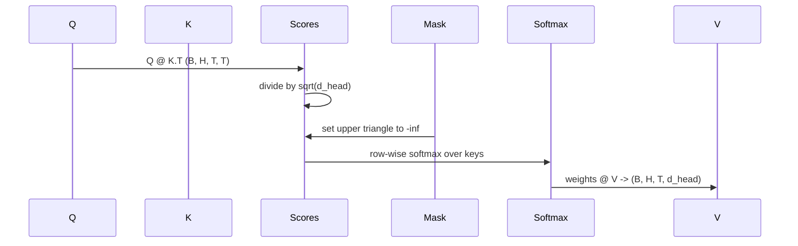

# Une attention personnelle à plusieurs têtes

> Une projection, trois images, une tête, un masque.

**Type:** Build
**Languages:** Python
**Prerequisites:** Phase 04 lessons, Phase 07 transformer lessons, Lessons 30 through 32 of this phase
**Time:** ~90 minutes

## Objectifs d'apprentissage
- Pour réaliser la projection en un niveau de l'échelle, le décompte est divisé en H.
- Utilisation de l'accès à la production de produits à l'échelle de l'attention de point
- Appliquer un masque de causalité pour empêcher une position de se concentrer sur une position future.
- 检查固定输入下 关注的内容,并推理每个头的关注内容.
- En jouet tâche 上训练一个小型注意区, observer Perte 随着各头 专门化而下降──


```figure
cap-multihead-attention
```

## Le cadre

L'attention est une fonction qui permet à un Token de représenter les autres Token de la même séquence de récupérer des informations. L'attention personnelle représente les requêtes, clés et valeurs provenant du même input.

Le mode de réalisation de haute efficacité consiste à utiliser une couche de ligne.`D`投影到 `3 * D`, puis le couper en trois images, puis le remodeler en tête, pour chaque gros`D // H`◊matmul、softmax 和加权求和都作为批量 tensor 操作执行, de sorte que chaque tête peut être cochée et cochée sur l'accélérateur.

Le cours construira ce bloc. Il s'intègre également au masque causale, permettant au même code de servir de modèle de langage décodeur uniquement.

## Le contrat de forme

输入是 `(B, T, D)`◊ Export est `(B, T, D)`Le masque est`(T, T)`, ou peut être diffusé jusqu'à elle. Dans le bloc, la forme du tensor intermédiaire est`(B, H, T, d_head)`, parmi lesquels `d_head = D // H`Les conditions de la vie sont:`D % H == 0`Il y a une autre.

```mermaid
flowchart LR
    A["(B, T, D) 输入"] --> B[Linear D -> 3D]
    B --> C["拆分为 Q, K, V"]
    C --> D["reshape 为 (B, H, T, d_head)"]
    D --> E["scores = Q @ K.T / sqrt(d_head)"]
    E --> F[应用 causal mask]
    F --> G[对 keys 做 softmax]
    G --> H["context = weights @ V"]
    H --> I["reshape 为 (B, T, D)"]
    I --> J[输出 Linear D -> D]
    J --> K["(B, T, D) 输出"]
```



两个线性层(QKV projection 和输出投影) est le seul paramètre du bloc.

## Le QKV est divisé

朴实实现会有三个独立线性层,分别用于Q、K和V──高效实现只有一个层,输出 `3 * D`个特征并分分结果──二者在数学上等价,因为三分别乘以 `(D, D)`Les multiplication de la matrice de poids, juste comme une fois multiplié par leur assemblage.`(3D, D)`权重的矩阵乘法──

La version plus rapide, car l'accélérateur ne démarre qu'une seule fois matmul, et non trois fois. Il est également plus facile de démarrer, car la matrice de trois fils se trouve dans le même tensor par paramètres, et peut être démarrée ensemble.

## La tête est remodelée

Après avoir été séparé, Q 、 K 、 V 、 V `(B, T, D)`Pour le faire devenir H 个 parallels Attention  problème, nous remodelons 为 `(B, T, H, d_head)`, re-transposer pour`(B, H, T, d_head)` tête 维度现在位于 lot 维度旁边, donc PyTorch 会把每头关注 视为跨 `B * H`个独立实例的批量操作: - une série de opérations de masse

`d_head`La taille reste en fin de compte, donc le score est matmul`Q @ K.transpose(-2, -1)`La taille de la taille est réduite.`(B, H, T, T)`Les scores de l'attention par tête

## Écalement

Les scores seront en douceur max avant de se déduire`sqrt(d_head)`Si ce n'est pas le cas, les produits de pointe vont suivre.`d_head`增大增大, 推软max 推到一种 quasi-totalité des qualités sont concentrées sur un seul élément 其他条目都接近消失的状态―― dans cet état Gradient 很小, learning will stagnate――除以`sqrt(d_head)`La différence de pointage peut être différente en taille de tête.

## Le masque de causalité

Le modèle de langage décoder seulement dans le précédent Token 时只能依赖过去.`(T, T)`Le score Matrice pour chaque élément au-dessus des cornes est remplacé par le négatif sans fin.



Nous avons mis le masque en place en construisant comme tampon, donc il sera situé sur le même appareil et ne fera pas partie du graphique de gradient.`(T, T)`La région

## La projection de sortie

 obtenir par tête vecteurs de contexte `(B, H, T, d_head)`后, nous avons transposé 回 `(B, T, H, d_head)`, refait pour`(B, T, D)`, et appliqué pour la dernière fois .`(D, D)`线性投影──output projection 让模型可以混合各个头――没有它,H个头只能通过后层重组,块会受到人为限制──

## Inspection du poids de l'attention

Le cours est en cours de passage.`return_weights=True`Après la mise en place du drapeau, le bloc sera de retour en forme à côté de la sortie.`(B, H, T, T)`Les poids d'attention de la tête, ainsi que les points d'attention de chaque position, sont à l'image de la carte de chaleur de la tête.

Dans un bon modèle d'entraînement, différentes têtes apprendront à différentes modes. Certaines têtes seront attentives à l'approche de l'autre. Certaines têtes seront attentives au début de la séquence. Certaines têtes seront attentives à l'ouverture de la séquence.

## La démonstration de l'entraînement

`main.py`La démo de basse partie va mettre l'attention à l'arrêt de la tête de LM très petite, et répéter la tâche de formation de l'ensemble du modèle. Chaque ligne de l'entrée est un id aléatoire, dans l'ensemble de la mise en page suivante. Le but est l'entrée de celui qui a déplacé le côté droit, de sorte que le modèle doit apprendre à suivre un Token par rapport à un Token précédent. La perte est une entropie croisée.`log(64) ~ 4.16`) à la baisse à la baisse`1.0`Il y a une autre.

Le but de la démo n'est pas de former un modèle utile. Il est de déterminer si le gradient peut traverser chaque partie du bloc, et si chaque tête peut apprendre quelque chose sur une question évidente.

## Ce que cette leçon ne fait pas

Il n'ajoute pas de blocage de flux à l'avant. La couche transformatrice du modèle réel est Attention 后接两层 MLP, et chaque partie entoure une connexion résiduelle 和 la norme de couche.

Il ne peut pas réaliser de codage rotatif ou positionnel AliBi. Les deux sont appliqués dans les étapes de projection QKV du même bloc, mais ils sont des unités de formation indépendantes.

Il ne réalisera pas d'inférence avec le cache KV. Les passages à l'avance 缓存键和值是让autoregressive decoding 变快的优化. Il modifiera le contrat de forme du tensor K 和 V, mais ne changera pas Q. Il appartient à l'inférence.

## Comment lire le code

`main.py` définit `MultiHeadSelfAttention` Cette classe 包含 deux lignes et un tampon de masque enregistré── passer en avant 会依次执行投影、重型、重型、重型、重型、重型、重型、重型、重型、重型、重型、重型、重型、重型、重型、重型、重型、重型、重型、重型、重型、重型、重型、重型、重型、重型、重型、重型、重型、重型、重型、重型、重型、重型、重型、重型、重型、重型、重型、重型、重型、重型、重型、重型、重型、重型、重型、重型、重型、重型、重型、重型、重型、重型、重型、重型、重型、重型、重型、重型、重型、重型、重型、重型、重型、重型、重型、重型、重型、重型、重型、重型、重型、重型、重型、重型、重型、重型、重型、重型、重型、重型、重型、重型、重型、重型、重型、重型、重型、重型、重型、重型、重型、重型、重型、重型、重型、重型、重型、重型、重型、重型、重型、重型、重型、重型、重型、重型、重型、重型、重型、重型、重型、重型、重型、重型、重型、重型、重型、重型`code/tests/test_attention.py`Le test de l'intérieur fixe la propriété de la forme contractée, de la causalité, de la propriété de la douceur max, de la propriété de la tête séparée et du flux gradient.

Je vais faire une démonstration.`n_heads`De 4  augmenter à 8                                                                                                                                                                                                                                                                                                                                                                                                                                                                                                                       `d_model=32`, donc `d_head=4`), observer la carte thermique 如何变化──
