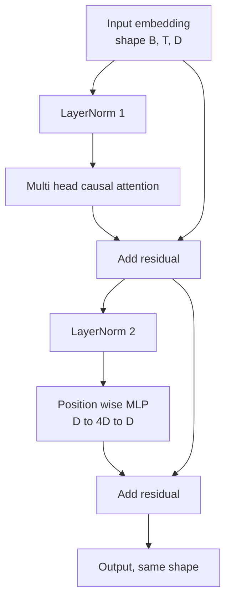
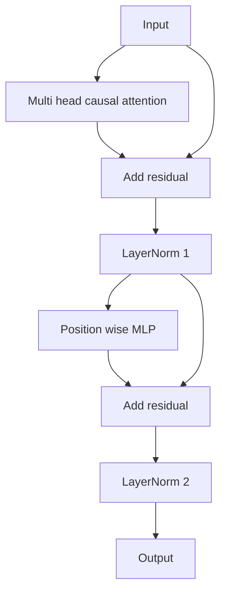

# À partir de zéro réaliser le bloc de transformateur

> Un bloc est la base de chaque décodeur moderne LLM. La norme de couche, l'attention à plusieurs niveaux, le résidu, le MLP, le résidu.

**Type:** Build
**Languages:** Python
**Prerequisites:** Phase 19 lessons 30 to 33 (tokenizer, embeddings, attention math, batched data loader)
**Time:** ~90 minutes

## Objectifs d'apprentissage

- De quatre éléments de mouvement construire un bloc transformateur en PyTorch:LayerNorm, attention causale à plusieurs têtes, connexions résiduelles, MLP à la position.
- Pour les autres, il est nécessaire de se préparer à la formation de la formation de la formation.
- Dans l'attention multi-tête dans la réalisation du masquage causal, faire Token `i`Je ne peux pas voir les jetons `j > i`Il y a une autre.
- Suivant la pile de 12 couches entre deux variables, le flux gradient ne dépend pas de la définition de la valeur.
- Dans le cas de GPT, considérez ce bloc comme un élément de rechange directement.

## Le problème

Le modèle que vous obtenez est soit dans la première époque, soit dans la première épisode, soit dans la première épisode, ou dans la deuxième épisode, il faut un coup de chaleur. Les deux types de défaites que vous verrez dans ce cours ne sont pas rares.

Une fois que vous avez bien compris, la réparation est mécanique. Ce bloc a deux chemins restants et deux positions de normalisation.

## Le concept

Chaque décodeur ne bloque que le transformateur.`(batch, sequence, embedding)`Le tensor de la structure est de la même forme.



C'est la connexion résiduelle de la pré-LN 变体──LayerNorm 位于 la branche résiduelle 内部, dans la sous-couche 之前──LayerNorm 位于 la branche résiduelle 内部, dans la sous-couche 之前──LayerNorm 位于 la branche résiduelle 内部, dans la sous-couche 之前──LayerNorm 位于 la sous-couche 之前──LayerNorm 位于 la sous-couche 之前

L'équipe de la formation de la formation de la formation de la formation de la formation de la formation de la formation de la formation de la formation de la formation de la formation de la formation de la formation de la formation de la formation de la formation de la formation de la formation de la formation de la formation de la formation de la formation de la formation de la formation de la formation de la formation de la formation de la formation de la formation de la formation de la formation de la formation de la formation de la formation de la formation de la formation de la formation de la formation de la formation de la formation de la formation de la formation de la formation de la formation de la formation de la formation de la formation de la formation de la formation de la formation de la formation de la formation de la formation de la formation de la formation de la formation de la formation de la formation de la formation de la formation de la formation de la formation de la formation de la formation de la formation de la formation de la formation de la formation de la formation de la formation de la formation de la formation de la formation de la formation de la formation de la formation de la formation de la formation de la formation de la formation de la formation de la formation de la formation de la formation de la formation de la formation de la formation de la formation de la formation de la formation de la formation de la formation de la formation de la formation de la formation de la formation de la formation de la formation de la formation de la formation de la formation de la formation de la formation de la formation de la formation de la formation de la formation de la formation de la formation de la formation de la formation de la formation de la formation de la formation de la formation de la formation de la formation de la formation de la formation de la formation de la formation de la formation de la formation de la formation de la formation de la formation de la formation de la formation de la formation de la formation de la formation de la formation de la formation de la formation de la formation de la formation de la formation de la formation de la formation de la formation de la formation de la formation de la formation de la formation de la formation de la formation de la formation de la formation de la formation de la formation de la formation de la formation de la formation de la formation de la formation de la formation de la formation de la formation de la formation de la formation de la formation de la formation de la formation de la formation de la.



La forme 完全相同── entraînement comportement n'est pas la même── utiliser post-LN 时, le long du chemin résiduel inversement flux  Gradient 必须 traverser LayerNorm──在十二层深度和学习率`3e-4`Le Gradient s'est réduit assez rapidement pour nécessiter un calendrier de réchauffement.

### Attention de plusieurs têtes

Attention sous-couche, il sera utilisé pour les projections de trois manières dans les tensors de clé, de valeur, chaque tensor est de`(B, T, D)`Retourner à`(B, H, T, D/H)`, parmi lesquels `H`                                                                                                                                                                                                                                                              `softmax(Q K^T / sqrt(d_k))`, mettre le masque sur le côté pour le côté, passer par le softmax, appliquer le masque, puis multiplier`V`Les têtes seront coupées en une seule.`(B, T, D)`Le masque est le seul élément du modèle à avoir des conséquences.

### Le MLP

La position sage MLP 会把同一个两层网络独立应用到每个代币──隐藏宽度是嵌入宽度的四倍,激活是 GELU,并且在第二线线性 后接落――MLP 内部没有代币相互交流──所有代币混合都发生在注意中──

### Les connexions résiduelles font deux choses.

Ils permettent à chaque bloc d'apprendre à se réformer sur la représentation de la fonction plutôt que de la remplacer complètement. Ces deux effets sont la raison pour laquelle le bloc peut se développer.


```figure
cc-transformer-block
```

## Faites-le

`code/main.py`实现:

- `class LayerNorm`,带可学习的规模 和 shift、biased eps,并应用到每个代币矢量──
- `class MultiHeadAttention`, avec`num_heads`- Je suis là.`head_dim = d_model // num_heads`、Fusion QKV projection、registré de masque de causalité、Attention de dérapagement 和 dérapagement résiduel。
- `class FeedForward`, contient deux couches de l'activation GELU et de la déconnexion.
- `class TransformerBlock`, avec`pre_ln`drapeau, utilisé pour le changement entre deux variables.
- Une démo, construire 6 couches pré-LN stack et 6 couches post-LN stack, utiliser la même entrée,并打印 (a) forme de sortie,(b) Un passage à l'arrière 后 Embedding 处的 Gradient norm。

Je vais le faire.

```bash
python3 code/main.py
```

输出: deux piles de contrôle de forme, ainsi que des normes de gradation. Dans le même rythme d'apprentissage, le degré d'intégration de la pile pré-LN par rapport à la pile post-LN est un niveau quantitatif, c'est le niveau de pré-LN 无需热升也能训练的实证信号。

## La pile

- `torch`Avec des mathématiques de tensors, des autogradations et des`nn.Module`- les plomberie
- Non utilisé `transformers`, ne pas utiliser des poids prétraînés.

## Modèles de production dans la nature

Trois modes vont transformer le bloc de la bibliothèque en quelque chose de livrable.

**Fused QKV projection.**Trois lignes indépendantes consomment trois lancements de noyau et trois matmuls.`3 * d_model`Le niveau de ligne peut être effectué le même travail lors d'un lancement, puis le long de l'axe final, le chemin fusionné sur chaque accélérateur est plus rapide et correspond aux mises en œuvre de référence de GPT-2、LLaMA et Mistral.

**Registered causal mask buffer.**Le masque ne dépend que du maximum de la longueur de la texture.`register_buffer`Partagez une fois, chaque fois que vous passez en avant, coupez la fenêtre active, et sautez sur chaque répartition utilisée. Si vous oubliez cela, le masque se transforme en point chaud de l'allocation.

**Dropout in two places, not three.**Le décrochage doit se situer après l'attention softmax, ainsi que le second décrochage linéaire de la MLP.

## Utilisez-le

- Le bloc de cette classe peut être modifié directement pour intégrer la leçon 35 de la formation de GPT.
- Le modèle de décodeur est un modèle de décodeur de type "L" et "L" est un modèle de décodeur de type "L" ou "L" ou "L" ou "L" ou "L" ou "L" ou "L" ou "L" ou "L" ou "L" ou "L" ou "L" ou "L" ou "L" ou "L" ou "L" ou "L" ou "L" ou "L" ou "L" ou "L" ou "L" ou "L" ou "L" ou "L" ou "L" ou "L" ou "L" ou "L" ou "L" ou "L" ou "L" ou "L" ou "L" ou "L" ou "L" ou "L" ou "L" ou "L" ou "L" ou "L" ou "L" ou "L" ou "L" ou "L" ou "L" ou "L" ou "L" ou "L" ou "L" ou "L" ou "L" ou "L" ou "L" ou "L" ou "L" ou "L" ou "L" ou "L" ou "L" ou "L" ou "L" ou "L" ou "L" ou "L" ou "L" ou "L" ou "L" ou "L" ou "L" ou "L" ou "L" ou "L" ou "L" ou " "L" ou " " " " ou " " " " " " " " ou " " " " ou " " " " " ou " " " " " " ou " " " " " " ou " " " " " " " " " " " " " " " " " " " " " " " " " " " " " " " " " " " " " " " " " " " " " " " " " " " " " " " " " " " " " " " " " " " " " " " " " " " " " " " " " " " " " " " " " " " " " " " " " " " " " " " " " " " " " " " " " " " " " " " " " " " " " " " " " " " " " " " " " " "
- Pour que le gel soit transformé en sileu, vous obtenez une activation de la série LLaMA. Pour que la LayerNorm soit transformée en RMSNorm, vous obtenez une normalisation de la série LLaMA.

## Exercices

1. 给 bloc 中每个线路 添加 `bias=False`Flag──Modern Open Weights LLM  édition  édition  édition  édition  édition  édition  édition  édition  édition  édition  édition  édition  édition  édition  édition  édition  édition  édition  édition  édition  édition  édition  édition  édition  édition  édition  édition  édition  édition  édition  édition  édition  édition  édition  édition  édition  édition  édition  édition  édition  édition  édition  édition  édition  édition  édition  édition  édition  édition  édition  édition  édition  édition  édition  édition  édition  édition  édition  édition  édition  édition  édition  édition  édition  édition  édition  édition  édition  édition  édition  édition  édition  édition  édition  édition  édition  édition édition  édition édition édition édition édition édition édition édition édition édition édition édition édition édition édition édition édition édition édition édition édition édition édition édition édition édition édition édition édition édition édition édition édition édition édition édition édition édition édition édition édition édition édition édition édition édition édition édition édition édition édition édition édition édition édition édition édition édition édition édition édition édition édition
2. Utilisation de la RMSNorm`nn.LayerNorm`,并验证 forme de sortie 不变──
3. 添加一旗, retourner à la première tête de Attention peses, comme `(B, T, T)`Tensor: ∞, et confirme la douceur de la valeur ∞.
4. Construire une vérification de la santé mentale,`(2, 16, 384)`Le tensor est en train de`H=6`Il y a deux variables, et il y a deux variables, et il y a deux variables, et il y a deux variables, et il y a deux variables, et il y a deux variables, et il y a deux variables, et il y a deux variables, et il y a deux variables, et il y a deux variables, et il y a deux variables, et il y a deux variables, et il y a deux variables, et il y a deux variables, et les variables sont différentes.`not torch.allclose`)。

## Les termes clés

| Term | What people say | What it actually means |
|------|-----------------|------------------------|
| Pre-LN | "Pre norm" | LayerNorm 位于 residual branch 内部，在每个 sublayer 之前；residual 携带未归一化的 signal |
| Post-LN | "Post norm" | LayerNorm 位于 residual add 之后；这是 2017 年论文发布的形式，并且需要 warmup |
| Causal mask | "Triangle mask" | Attention logits 的上三角被设为负无穷，因此当 j 大于 i 时，Token i 不能读取 Token j |
| Fused QKV | "Combined projection" | 一个宽度为 3D 的 linear，而不是三个宽度为 D 的 linears；一个 kernel，一次 matmul |
| Residual stream | "Skip connection" | 自上而下流过每个 block 的未归一化 tensor；也是每个 block 添加到的对象 |

## Pour en savoir plus

- La phase 7 de la leçon 02 ((auto-attention à partir de zéro), comprendre ce bloc de base de l'attention mathématique。
- Le leçon 5 de la phase 7 (transformateur complet), comprendre le décodeur d'encodeur de la même structure 版本。
- Le programme de formation est un programme de formation de formation de formation de formation.
- La phase 19 de la leçon 35 (cette piste), va mettre 12 blocs comme celui-ci en un modèle GPT.
