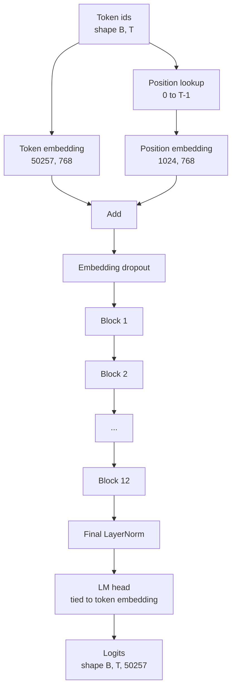
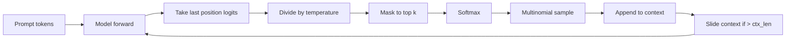

# GPT 模型组装

> 十二个块 堆叠, un Token Embedding, un learning get position Embedding, un LayerNorm final, ainsi qu'un modèle de langue à charge de charge. Ceci est un ensemble complet de 1,24 milliards de composants GPT 模型。

**Type:** Build
**Languages:** Python
**Prerequisites:** Phase 19 lessons 30 到 34
**Time:** ~90 分钟

## Objectifs d'apprentissage

- Le module de transformateur de l'article 34 est intégré à la page GPT:Token Embedding,Position Embedding,N 个 block,最终 LayerNorm,language model head.
- 复现 1.24 亿参数配置:vocab 50257 文本 1024 嵌入 768 十二个头,12层──
- En utilisant le modèle de langue, le chef de file se limite à l'intégration de jetons, et explique pourquoi cela peut être économisé à cette échelle environ 38 millions de paramètres.
- Utilisez l'échantillonnage multimodale, l'échelle de température et la troncation de haut en bas de la page, et ne pas utiliser la fenêtre coulissante pour maintenir la longueur du contexte.
- Pour l'analyse de la valeur de la valeur de l'objet, il est nécessaire de calculer la valeur de l'objet.

## Le problème

Vous devez transformer les symboles d'identification en vecteurs, les mettre dans des informations de position, les faire passer par la pile, les re projeter dans les logites du vocabulaire, et ne pas oublier n'importe quelle étape de ces quatre étapes, le modèle ne peut pas avancer, l'information de position ne peut pas déplacer, ne peut pas parler.

La forme du modèle est également importante. Les chiffres ci-dessus sont précisément divisés en 1,24 milliards de paramètres. Ces chiffres ne sont pas mystérieux. La vocabelle 50257 est une table de symboles. La position 1024 est une table de position. Chaque bloc comporte environ 700 millions de paramètres.

## Le concept



Les ids de jetons  se transforment en vecteurs de jetons。 Les ids de position  se transforment en vecteurs de position。 Les deux facettes sont ajoutées après être envoyées dans la pile。 Finalement, la LayerNorm est un composant de blocs externes, et est conservée dans chaque variante moderne。 LM tête 复用 Token Embedding Matrix, c'est la signification de la liaison de poids。

### Le poids de la liaison

Embedding de jeton de la forme est `(vocab, d_model)`◊ tête de modèle de langue 需要从 `d_model`投影回  réaction`vocab` Elles sont liées, ce qui signifie littéralement utiliser le même tensor de paramètre, en utilisant deux fois. Dans le vocabulaire 50257 et d_modèle 768, cette matrice a 3800 millions de paramètres.

### L'intégration de position est apprendre à obtenir, pas sinusoïdale

GPT-2 使用学习得到的位置嵌入式位置表是一个形状为`(1024, 768)`Le modèle est utilisé pour la recherche de la position 0 à T-1, et le résultat est ajouté à l'embedding de jetons.

### Génération: température, haut-k, multinomiale

La génération est autorégressive. À chaque étape, le modèle revient dans chaque position, le vocabulaire complet des logites.



La température est une distribution naturelle du modèle de l'avidité. La température est une distribution naturelle du modèle de l'avidité.


```figure
cc-gpt-assembly
```

## Faites-le

`code/main.py`实现:

- `class GPTConfig`classe de données, avec une valeur par défaut de 124 M:`vocab_size=50257`- Je suis là.`context_length=1024`- Je suis là.`d_model=768`- Je suis là.`num_heads=12`- Je suis là.`num_layers=12`- Je suis là.`mlp_expansion=4`- Je suis là.`dropout=0.1`- Je suis là.`use_bias=True`- Je suis là.`weight_tying=True`Il y a une autre.
- `class GPTModel`, contenant Embedding Token, Embedding Position, Embedding, Découpe de l'embedding, 12 `TransformerBlock`LayerNorm, ainsi que le lien vers le jeton Embedding`lm_head`Il y a une autre.
- `count_parameters`L'aide, retourne le seul paramètre de compte, donc la correction de poids est correcte.
- `generate`fonction, exécuter la température, le top-k, le multivitamin, le contexte de la fenêtre coulissante,
- Une démo, construire un modèle, imprimer le nombre de paramètres et les 124M de référence pour les modèles, puis de la demande fixe produire une courte séquence, montrant le pipeline de bout en bout.

Je vais le faire.

```bash
python3 code/main.py
```

输出:paramètre de compte avec 124M 参考值的对照、随机随机 生成的代码 id, ainsi que lors du liage 打开时 LM head 和 Token Embedding 共享存储的确认信息──

Pour faire la démo, je vais mettre en place une petite configuration.`d_model=64`- Je suis là.`num_layers=2`),并 inline 打印生成的代码序列──124M config 会被构建,但只执行参数计和一次前进传──

## La pile

- `torch`Utilisé pour les mathématiques de tensors, l'autogradation et la plomberie de modules.
- `code/main.py`Dans la réécration locale de la leçon 34, le même schéma de blocage.

## Modèles de production dans la nature

Trois modes décident si un modèle peut simplement courir ou peut vraiment livrer.

**把 residual projections 初始化得小一些。**La projection de sortie de l'attention et la deuxième ligne de MLP entrent directement dans l'addition résiduelle. Si l'on utilise des déviations standards similaires à celles des autres lignes, elles débutent, le flux résiduel augmentera avec la profondeur, et la LayerNorm finale sera introduite dans la zone trop chaude.`1 / sqrt(2 * num_layers)`缩放; flux résiduel 就能在十二层中保持合理范围──

**缓存 position id tensor，不要重复计算。** `torch.arange(T)`La répartition de la nouvelle mémoire est effectuée à chaque fois.`__init__`C'est le cas de la section "Connection" qui est décrite dans le tableau suivant:

**在 parameter 层面 tie weights，而不只是 copy。** mise en place `lm_head.weight = token_embedding.weight`Il faut aussi une accumulation. Si vous copiez, la tête de l'embedding 漂走, le poids de liaison 就没有任何收益──

## Utilisez-le

- La forme du modèle de cette classe est la même que celle de la classe suivante.
- L'implantation en RoPE, on peut obtenir la famille LLaMA, sans avoir besoin de modifier le bloc ou la tête.
- Pour remplacer GELU par SiLU, et remplacer LayerNorm par RMSNorm, on peut obtenir les autres variantes de la famille LLaMA.
- La fonction de génération peut être utilisée pour n'importe quel logement Source, non seulement limité à ce modèle. Vous pouvez en cours 37 à partir du fichier GPT-2 prétrainé 拉取 logits,并复用同一个世代循环──

## Exercices

1. 解除 LM head 与 Token Embedding 的绑定并重新统计参数──验证差值为 50257 乘以 768 = 3800 000 ⋅
2. L'implantation de la position sera remplacée par la table sinusoïdale du calcul de la construction.
3. Pour la génération 添加 `greedy=True`flag, saute à travers le prélèvement, 并选择 argmax── confirmer que la séquence de plusieurs opérations est déterministe──
4. 添加 `repetition_penalty`旋, avant softmax , va prompt ou généré dans l'histoire de logit de chaque jeton à l'exception d'un constant                                                                                                                                                                                                                                              
5. Dans le`top_k`旁边添加 `top_p`(nucleus) échantillonnage── avec deux pages de vérification confirmant la probabilité de conservation des jetons 之和超过 `top_p`Il y a une autre.

## Les termes clés

| Term | What people say | What it actually means |
|------|-----------------|------------------------|
| Weight tying | “Tied embeddings” | LM head 和 Token Embedding 共享同一个 parameter tensor；节省 vocab times d_model 参数，并匹配 GPT-2 参考模型 |
| Position embedding | “Learned positions” | 一个单独的 table，形状为 (context length, d_model)，加到 token vectors 上；端到端学习得到 |
| Sliding window context | “Context cap” | 当 prompt 加生成 tokens 超过 context length 时，丢弃最旧的 tokens，让 active window 能放下 |
| Top-k sampling | “K truncation” | 保留值最高的 K 个 logits，把其余 logits mask 成 negative infinity，并在剩余项上 softmax |
| Temperature | “Sampling temperature” | 在 softmax 前用 T 除以 logits；T 小于 1 会变尖锐，T 等于 1 保持自然 distribution，T 大于 1 会变平坦 |

## Pour en savoir plus

- La phase 19 leçon 34, comprendre le bloc de la mise en place du modèle.
- Leçon 36 de la phase 19, comprendre l'utilisation de la perte d'entropie croisée
- Leçon 37 de la phase 19, apprendre à transférer des poids GPT-2 prétrainés
- Le cours de phase 7 est la 7e phase de la GPT, la modélisation du langage de causalité, et il est nécessaire de comprendre la mathématiques de la prédiction des symboles suivants.
- Le cours de l'étape 10 04 (pre-entraînement mini GPT)
