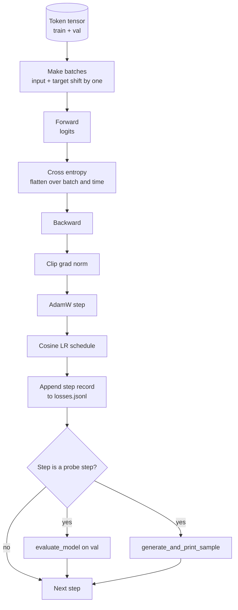

# Le cycle de formation et l'évaluation

> La formation de la formation du modèle GPT: avec la division de la perte de poids de AdamW、calentation加 cosine learning rate scheduler、`calc_loss_batch`aide ≈ ≈ ≈ ≈ ≈ ≈ ≈ ≈`evaluate_model`Passez chaque K pas de la même façon`generate_and_print_sample`La sonde de détermination, ainsi que le log de perte JSONL que vous pouvez dessiner après.

**Type:** Build
**Languages:** Python
**Prerequisites:** Phase 19 lessons 30 到 35
**Time:** ~90 分钟

## Objectifs d'apprentissage

- Construire une boucle de formation, pour la prochaine prédiction de jeton Utilisez correctement l'entrée et l'alignement cible pour calculer la perte d'entropie croisée.
-  configurer AdamW, faire une décomposition de poids 应用于重量, et non pas utiliser des tensors LayerNorm ou bias
- 实现带线性变暖和宇宙衰退的学习率时间表,并读取 LR 随时间的变化──
- Utilisation `evaluate_model`Dans la division de la valeur, la perte de valeur peut être comparée à la valeur de la valeur.
- Chaque étape`generate_and_print_sample`Il est possible de créer un échantillon de détermination afin de capturer la divergence dans la courbe de perte.
- Remplir chaque étape de perte perdurée à JSONL, afin de recharger 図, et de rendre le journal de formation  comme livrable 交付。

## Le problème

Un script d'entraînement imprimé seulement perd et tout ce que vous ne faites pas échoue dans trois aspects. Il ne peut pas vous dire si la perte est due à la raison exacte de la baisse. Le modèle peut-être juste surpassé dans le groupe d'entraînement, mais jamais vraiment apprendre. Il ne peut pas vous dire si la divergence commence.

Chaque étape de la formation est la perte de la formation. Chaque étape de la formation est la perte de la formation. Chaque étape de la formation est la perte de la formation.

## Le concept



La partie la plus évidente est l'alignement des pertes et la division de la décomposition d'AdamW.

### L'alignement des pertes

模型在每个位置预测下一个代币――si le lot d'entrée est des dépôts `[t0, t1, t2, t3]`Alors le lot cible doit être`[t1, t2, t3, t4]`◊ Entropie croisée en forme plate `(batch * seq, vocab)`上计算,并对照 cible plate `(batch * seq,)`◊ oublier le changement, on va faire de la formation du modèle une prédiction de soi; cela va gagner à zéro perte, mais on ne va pas apprendre à trouver quelque chose d'utile.

### Le décomposition d'AdamW

Décomposition du poids Va régulariser les tensors de poids, mais ne va pas régulariser les échelles de normalisation ou les biais. Va se décomposer à l'échelle de LayerNorm. Va se décomposer à l'échelle de la LayerNorm. Va se décomposer à l'échelle de la LayerNorm. Va se décomposer à l'échelle de la LayerNorm. Va se décomposer à l'échelle de la LayerNorm. Va se décomposer à l'échelle de la LayerNorm. Va se décomposer à l'échelle de la LayerNorm. Va se décomposer à l'échelle de la LayerNorm. Va se décomposer à l'échelle de la LayerNorm. Va se décomposer à l'échelle de la LayerNorm.

### Réchauffement plus calendrier cosine

Le réchauffement entraîne le taux d'apprentissage de la rampe à la valeur cible en quelques centaines de étapes, permettant à l'optimisateur d'avoir du temps pour se charger. Le déclin du cosine entraîne le taux d'apprentissage de la phase restante à la phase finale à la taille de la phase finale.

### Évaluation effectuée

`evaluate_model`Le nombre de séries de validation est divisé en deux parties, le nombre de séries est divisé en deux parties, le nombre de séries est divisé en deux parties, le nombre de séries est divisé en deux parties, le nombre de séries est divisé en deux parties, le nombre de séries est divisé en deux parties, le nombre de séries est divisé en deux parties, le nombre de séries est divisé en deux parties, le nombre de séries est divisé en deux parties, le nombre de séries est divisé en deux parties, le nombre de séries est divisé en deux parties, le nombre de séries est divisé en deux parties, le nombre de séries est divisé en deux parties, le nombre de séries est divisé en deux parties, le nombre de séries est divisé en deux parties, le nombre de séries est divisé en deux parties, le nombre de séries est divisé en deux parties, le nombre de séries est divisé en deux parties et le nombre de séries est divisé en deux parties.

### Prélèvement qualitatif comme signal précoce

Une perte de formation, une bonne baisse, mais les échantillons générés sont tous du même jeton. Le modèle est mauvais. Une courbe de perte semble plate, mais les échantillons générés deviennent progressivement un modèle de mots en continu.


```figure
cap-training-loop
```

## Faites-le

`code/main.py`实现:

- `make_batches(token_ids, batch_size, context_length)`, va faire une tranche de tensor de longs symboles 成 entrée et paires cibles.
- `calc_loss_batch(model, inputs, targets)`, effectuer l'entropie croisée scalaire, et la faire avancer,
- `evaluate_model(model, val_loader, max_batches)`, dans aucun diplôme, les lots de validation de la quantité fixe,并返回 mean loss。
- `generate_and_print_sample(model, prompt, max_new_tokens)`, dans le prompt fixe 上运行 leçon 35 de la fonction de génération 并印结果──
- `build_param_groups(model, weight_decay)`, genere两组 Liste des paramètres AdamW
- `cosine_with_warmup(step, warmup_steps, total_steps, max_lr, min_lr)`, retourner à l'étape déterminée de l'LR。
- `train(...)`, la boucle de fonctionnement, la durée `outputs/losses.jsonl`,并每 `eval_every`étapes 打印 évaluation de la perte 和 échantillon。
- Une démo, dans les données synthétiques, éduquer un petit modèle, en petits pas, écrire un journal JSONL, et en points de sonde imprimer une perte d'évaluation et un échantillon. Cette démo est en CPU en haut de loin inférieur à une minute.

Je vais le faire.

```bash
python3 code/main.py
```

输出: chaque étape de perte 行、 chaque étape de sonde de perte d'évaluation、 chaque étape de sonde de l'échantillon généré, ainsi que le final `outputs/losses.jsonl`Tu peux l' utiliser .`json.loads`Je suis en train de le faire.

## La pile

- `torch`Utilisé pour les modules Autograd, Optimiser et
- `main.py`Dans la rééducation de la leçon 35`GPTModel`Et les modules de support.

## Modèles de production dans la nature

Trois modes vont transformer le cycle de livres en quelque chose que l'on peut faire toute la nuit.

**Gradient norm clipping 不可协商。**Une série de données anormales, des pics de données, des limites de valeur, des résultats de formation en moyenne, peuvent être supprimés.`backward`Après,`step`之前调用 `torch.nn.utils.clip_grad_norm_(params, max_norm=1.0)`, , 可让优化器 保持在安全范围内;;clipping value is a free parameter;1 est la valeur par défaut de la plupart des paramètres.

**可恢复的 JSONL logging，而不是 pickled state。**Récords de perte de chaque étape  `{"step": int, "train_loss": float, "lr": float}`JSONL est résistant à tout accident, vous pouvez saisir, vous pouvez utiliser 30 lignes Python 绘图, vous pouvez également passer à la lecture de la dernière étape pour récupérer l'entraînement.

**Eval batches 来自固定 slice。**Les jetons de validation sont coupés en lots au moment du démarrage du script, plutôt que de générer des mouvements.

## Utilisez-le

- La boucle de ce cours est la même que celle du modèle 124M dans la formation sur les données réelles.`datasets`Le chargement de la boucle est en train de changer.
- JSONL log est de transformer la course de formation en preuve de livrabilité.
- La sonde de l'échantillon est une perte de la taille de l'échelle.

## Exercices

1. 添加 `weight_decay_groups()`Tests unitaires, confirmer l'échelle et les paramètres de biais 落入 no decay group, tandis que les poids linéaires et les poids intégrés 落入 decay group。
2. Utilisez un petit octet dans un fichier texte  remplacez des jetons aléatoires synthétiques, laissez la démo entraîner sur le contenu lisible ⋅ test généré échantillon ⋅ utilisez les caractères existants dans le fichier ⋅
3. Pour le calendrier cosine 添加一个 `min_lr`plancher, valeur`max_lr`Il y a aussi des répliques.
4. À l'exception du journal JSONL`eval_every`Passez à un point de contrôle.`resume_from`flag pour recharger l'état du modèle et l'état de l'optimisateur
5. Dans le même temps, il est possible de modifier le code de la page d'accueil en utilisant le code de la page d'accueil.

## Les termes clés

| Term | What people say | What it actually means |
|------|-----------------|------------------------|
| Loss alignment | “Shift by one” | Input tokens 位于 positions 0..T-1，target tokens 位于 positions 1..T；cross entropy 在 flattened shapes 上计算 |
| Decay split | “Two groups” | AdamW 接收带 weight decay 的 matrix shaped tensors，以及不带 decay 的 scale 或 bias tensors |
| Warmup | “Ramp” | learning rate 在固定步数内从零爬升到目标值，让 Optimizer state 可以填充 |
| Eval batches | “Held out batches” | validation token tensor 的一个固定 slice，在 script 启动时 slice 一次，并在每个 probe 中相同使用 |
| Qualitative probe | “Sample print” | 每 K steps 从固定 prompt 打印一次短 generation，用于捕捉单靠 loss 会隐藏的 failure modes |

## Pour en savoir plus

- La phase 19 leçon 35, comprendre cette boucle 驱动的模型──
- Leçon 37, de la phase 19, apprenez à mettre des poids prétraînés dans le même modèle.
- Le cours de la phase 10 04 (pre-entraînement mini GPT)
- Leur capacité à s'adapter à la situation actuelle est de 10 à 10 heures.
