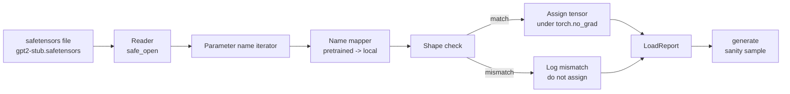

# Préentrainement des poids

> De zéro entraînement un modèle de 124 millions de paramètres est une décision budgétaire; charger un point de contrôle ouvert 则是日常操作。本课会将安全感器文件中预训练的GPT-2风格重量加载到课35的同一个建筑中,逐段讲解参数名称映射,并通过智能生成一个延续来证明加载成功──无网络、无第三方加载者、无不透明魔法──

**Type:** Build
**Languages:** Python
**Prerequisites:** Phase 19 lessons 30 to 36
**Time:** ~90 minutes

## Objectifs d'apprentissage

- Utilisation `safetensors`Bibliothèque Python 读取 file de séfétensors,并检查 tensor names 和 shapes。
- Pour chaque paramètre prétrainé, le nom de chaque paramètre est "Méager" à la leçon 35 du modèle GPT.
- 处理 publié GPT-2 poids et le modèle de la piste  entre deux différents sujets nomenclature约定:`wte/wpe/h.N.attn.c_attn/c_proj`et `mlp.c_fc/c_proj`, à l'origine nommé`tok_embed/pos_embed/blocks.N.attn.qkv/out_proj`et `mlp.fc1/fc2`Il y a une autre.
- Lors de toute assignation de poids, avant de se produire, le test ne refuse pas l'incohérence de forme, ne donne pas une erreur claire.
- Utilisez des poids chargés 生成一个短续航,并确认代币 来自加载分布,而不是随机初始分布──

## Le problème

Les poids publiés ne sont pas pour votre architecture 打包的. Ils portent le nom de l'utilisation initiale.`(2304, 768)``transformer.h.0.attn.c_attn.weight`; votre modèle 期望形 为 `(2304, 768)``blocks.0.attn.qkv.weight`(c'est la même Matrix, juste convention de mise en page différente), ou votre modèle utilise `nn.Linear`, il sera transféré sous forme de stockage Matrix. Le même paramètre apparaîtra avec trois petits caractères différents.

Le chargement de la copie aveugle va mettre le tensor correct dans une mauvaise position, obtenir un modèle de génération de mots sans ordre.`LoadReport`J'ai fait des erreurs et des défauts de forme, je peux vous aider à comprendre ce qui s'est passé.

## Le concept



Le nom de la carte est simplement une fonction de la chaîne à la chaîne.`torch.no_grad()`内部, donc l'autograd ne suivra pas le processus de chargement.

### La convention de nommage du GPT-2

Poids GPT-2 publié

| Pretrained name | Shape | Meaning |
|-----------------|-------|---------|
| `wte.weight` | (50257, 768) | Token Embedding |
| `wpe.weight` | (1024, 768) | Position Embedding |
| `h.N.ln_1.weight` | (768,) | block N 的 LayerNorm 1 scale |
| `h.N.ln_1.bias` | (768,) | block N 的 LayerNorm 1 shift |
| `h.N.attn.c_attn.weight` | (768, 2304) | 融合 QKV linear weight |
| `h.N.attn.c_attn.bias` | (2304,) | 融合 QKV linear bias |
| `h.N.attn.c_proj.weight` | (768, 768) | Attention output projection |
| `h.N.attn.c_proj.bias` | (768,) | Attention output projection bias |
| `h.N.ln_2.weight` | (768,) | LayerNorm 2 scale |
| `h.N.ln_2.bias` | (768,) | LayerNorm 2 shift |
| `h.N.mlp.c_fc.weight` | (768, 3072) | MLP fc1 weight |
| `h.N.mlp.c_fc.bias` | (3072,) | MLP fc1 bias |
| `h.N.mlp.c_proj.weight` | (3072, 768) | MLP fc2 weight |
| `h.N.mlp.c_proj.bias` | (768,) | MLP fc2 bias |
| `ln_f.weight` | (768,) | Final LayerNorm scale |
| `ln_f.bias` | (768,) | Final LayerNorm shift |

Il y a deux incidents qui doivent être traités.`c_attn`- Je suis là.`c_proj`- Je suis là.`c_fc`Les matrices de stockage de ces lignes sont en relation avec les lignes de stockage.`nn.Linear.weight`期望方式是转置的──Loader 会在任务时转置──LM head 完全不在文件中;model 模型 模型 模型 模型 模型 模型 模型 模型 模型 模型 模型 模型 模型 模型 模型 模型 模型 模型 模型 模型 模型 模型 模型 模型 模型 模型 模型 模型 模型 模型 模型 模型 模型 模型 模型 模型 模型 模型 模型 模型 模型 模型 模型 模型 模型 模型 模型 模型 模型 模型 模型 模型 模型 模型 模型 模型 模型 模型 模型 模型 模型 模型 模型 模型 模型 模型 模型 模型 模型 模型 模型 模型 模型 模型 模型 模型 模型 模型 模型 模型 模型 模型 模型 模型 模型 模型 模型 模型 模型 模型 模型 模型 模型 模型 模型 模型 模型 模型 模型 模型 模型 模型 模型 模型 模型 模型 模型 `wte`Le poids est lié, donc une fois.`wte`Je suis en train de vous dire que c'est une bonne idée.

### La convention locale de dénomination

本トラック のモデル 使用描述性名称:

| Local name | Meaning |
|------------|---------|
| `tok_embed.weight` | Token Embedding |
| `pos_embed.weight` | Position Embedding |
| `blocks.N.ln1.scale` | block N 的 LayerNorm 1 scale |
| `blocks.N.ln1.shift` | LayerNorm 1 shift |
| `blocks.N.attn.qkv.weight` | 融合 QKV |
| `blocks.N.attn.qkv.bias` | 融合 QKV bias |
| `blocks.N.attn.out_proj.weight` | Attention output projection |
| `blocks.N.attn.out_proj.bias` | Output projection bias |
| `blocks.N.ln2.scale` | LayerNorm 2 scale |
| `blocks.N.ln2.shift` | LayerNorm 2 shift |
| `blocks.N.mlp.fc1.weight` | MLP fc1 |
| `blocks.N.mlp.fc1.bias` | MLP fc1 bias |
| `blocks.N.mlp.fc2.weight` | MLP fc2 |
| `blocks.N.mlp.fc2.bias` | MLP fc2 bias |
| `final_ln.scale` | Final LayerNorm scale |
| `final_ln.shift` | Final LayerNorm shift |

Le cartographie est une fonction fixe.

### Le raccordement de la tige

Réel GPT-2 poids environ 0,5 GB。Demo ne les téléchargera pas; il générera une installation de séfétensors miniatures lors de la première utilisation, adoptera la même convention de nommage GPT-2, et utilisera des formes de 12 blocs modèle、d_model 192 au lieu de 768。 Cette installation a une structure correcte, peut toucher le chemin de chaque code du chargement.


```figure
cc-weight-remap
```

## Faites-le

`code/main.py`实现:

- Une leçon 35`GPTModel`Il y a aussi des petits moments où le cours se compose.
- `make_pretrained_to_local(num_layers)`,展开每层条目──
- `load_safetensors(model, path)`,代名字、映射名字、检查形、转置 conv1d-style weights, et `torch.no_grad()`La mission est de retour.`LoadReport`Il y a une autre.
- `make_stub_safetensors(path, cfg)`, générer un fichier fixe de convention de nommage prétrainée précisément.
- Une démo: la première fois que je l' ai fait`outputs/gpt2-stub.safetensors`, construire un nouveau modèle, capturer un début aléatoire 生成 une continuation, charger un stub, reprendre une autre continuation, imprimer,并验证两者不同(加载确实改变了模型)

运行:

```bash
python3 code/main.py
```

Résultats: chemin de fixation, nom de chaque log de charge,`LoadReport`résumé ‧chargement de la suite ‧chargement de la suite, ainsi que des mauvais tensors individuels intentionnellement insérés dans le fichier  provoquant une déséquilibre de forme, pour couvrir le chemin de l'échec―

## La pile

- `safetensors`Utilisé sur le format disque et le lecteur de streaming.
- `torch`Utilisé pour le modèle et les mathématiques de tâches.
- Non utilisé `transformers`,不使用 `huggingface_hub`, ne pas effectuer des appels réseau.

## Modèles de production dans la nature

Trois modèles permettent de faire un chargeur en face de vos poids non créés.

**始终在任何 assignment 前验证 file。**打开文件,列出每个子名称 及其dtype 和形状,运行完整映射和形状检查, seulement在成功后才开始分配──半加载模型 是静默失败机器──

**每次 assignment 都记录 source name 和 destination name。**Quand quelque chose semble mal, le logiciel vous dira quel tensor est arrivé où; le choix est de lire les hexdumps.`LoadReport`classe de données 会跟踪 `loaded`- Je suis là.`missing`- Je suis là.`unexpected`et `shape_mismatch`Les listes, et enfin imprimer le résumé.

**LM head 是 weight tying alias，不是单独 copy。**- Je suis là .`tok_embed`后设置 `model.lm_head.weight = model.tok_embed.weight`Il est réglementé comme modèle.`lm_head.weight`Paramètre 会破坏绑定,并让参数计数 翻倍──

## Utilisez-le

- Chargeur  adapté à tout usage de configurer le modèle de convention de nommage pré-entraîné.
- Une fois la carte de nom mise à jour, le même schéma peut être étendu à LLaMA、Mistral、Qwen poids。Checks de forme 和 rapport 保持不变。
- La génération de santé mentale post-chargement est une passerelle rapide: si les échantillons post-chargement ressemblent à des échantillons pré-chargement, indique que le chargement ne modifie pas le modèle, cela signifie également que la cartographie 静默漏掉了每个テンサー──

## Exercices

1. Pour le chargement 添加 `dtype`L'argument, dans l'affectation 时将每个色器投射到目标dtype(`bfloat16`- Je suis là.`float16`- Je suis là.`float32`)■ confirmer `float32`Le modèle peut être déprimé jusqu' à `bfloat16`Il ne peut pas encore générer.
2. 添加 `expected_layers`- Je ne veux pas.`h.N`Indices et modèle `num_layers`Point de contrôle non correspondant.
3. Placez le chargement 接入 leçon 35 fonction de génération,并生成 deux并排 échantillons: un vient d'initiation aléatoire, un vient d'installation chargée。
4. 添加出口路径: utiliser convention de nommage prétrainée 将当前模型状态 写入一个新的安全感器文件──圆路载体并确认报告 中形状不一致 为零──
5. 扩展 `NAME_MAP`以处理 LLaMA naming convention (((无偏见、RMSNorm、fused qkv layout), et dans le stub que vous avez généré LLaMA fixture 上重新运行 loader。

## Les termes clés

| Term | What people say | What it actually means |
|------|-----------------|------------------------|
| Name map | "Key remapping" | 从 pretrained tensor names 到 local parameter names 的 function；通常是一个 literal dict，每个 layer index 一个 entry，并在 loop 中展开 |
| Shape mismatch | "Bad shape" | Pretrained tensor 存在于 mapped name 下，但其 dimensions 与 local parameter 不一致；loader 会拒绝 assignment 并记录这对 name |
| Transpose-on-load | "Conv1d layout" | Published GPT-2 将 Attention 和 MLP projections 存储为 nn.Linear 期望形式的转置；loader 会在 assignment 时转置 |
| Weight tying alias | "Shared LM head" | 设置 model.lm_head.weight = model.tok_embed.weight，让 head 和 Embedding 共享 storage；正因为如此，head 不在 file 中 |
| Load report | "Coverage summary" | 一个小型 dataclass，跟踪 loaded、missing、unexpected 和 shape_mismatch lists；打印它可以判断加载是否成功 |

## Pour en savoir plus

- L'architecture de la phase 19 leçon 35:
- Leçon de la phase 19 36: cycle de formation de la génération du point de contrôle de même forme.
- Phase 10 leçon 11 ((quantification): mémoire 紧张时如何处理负载重量──
- L'éducation et la formation sont des facteurs qui ont une incidence sur la formation professionnelle.
