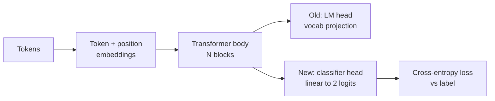
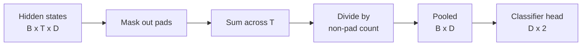
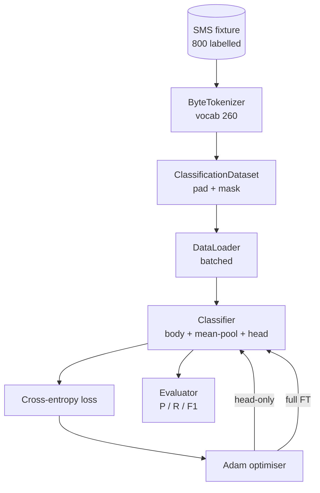

# Capstone Leçon 38: par le biais de la tête de swap  effectuer le classifiateur Fine-Tuning

> Le premier capstone de la piste B。 Le modèle de langage entraîné est un superposé de blocs d'auto-attention, le bout est la tête de prédiction de jetons。 lorsque vous voulez faire du spam contre le jambon 时, la tête est erronée, mais le corps 基本是对的。

**Type:** Build
**Languages:** Python (torch, numpy)
**Prerequisites:** Phase 19 lessons 30-37 (NLP LLM track: tokenizer, embedding table, attention block, transformer body, pre-training loop, checkpointing, generation, perplexity)
**Time:** ~90 minutes

## Objectifs d'apprentissage

- Dans le cas d'un corps non redémarré, remplacer la tête du modèle de langue par la tête de classification.
- 实现两种训练模式:body freeze (only head) et full fine tuning,并共享同一个训练循环──
- Construire un pipeline de données conscient du tokeniser, responsable du rembourrage, du rembourrage du masque, et de la mise en commun de la production Attention.
- De la logite brute  calcul de précision    rappeler  F1 和 matrice de confusion 
-                                                                                                                                                                                                                                                               

## Le problème

Vous êtes déjà dans le corpus générique en haut de la formation préalable  un petit transformateur。 Le chef de sortie va mettre l'état caché dernier  projeter jusqu'à 1000-tokens vocabulaire。 maintenant vous avez 800 articles marqués pour spam ou messages SMS de déchets, en espérant construire un classifiateur binaire。 ici il y a trois options。

错误选择是基于800 exemples de zéro entraînement un nouveau classifiateur.  Le corps du modèle entraîné a déjà codifié une structure utile: identité de mot, position, co-occurrence simple.  Le perdre est un gaspillage de construction et une computation de consommation.

两个正确选择是头交换 后结身体,以及头交换 后让身体可训练――头交换 后让身体可训练――头交换 后结身体,以及头交换 后让身体可训练――头交换 后结身体 可训练――头交换 后结身体 可训练――头交换 后结身体 可训练――头交换 后结身体 可训练――头交换 后结身体 可训练――头交换 后结身体 可训练――头交换 后结身体 可训练 可训练――头交换 后结身体 可训练――头交换 后结 后结身体,以及头交换 后结 后让身体 可训练――头交换 后练 可训练 可训练 快速,记忆 几乎免费,在这么少的数据上也太容易过适应――完全调整更慢,在小数据上上上上上可能过适应,但当下游域 偏离预训体时可以达到更高精度――

Cette classe construit en même temps les deux, vous permettant de comparer les deux en même temps.

## Le concept



Le modèle est une fonction:`f_theta(tokens) -> hidden_states`La tête est une fonction:`g_phi(hidden) -> logits`◊ Échange de tête signifie conservation `theta`Il a été remplacé`g_phi`Les paramètres du corps sont une partie coûteuse. La tête n'est qu'une couche linéaire.

Il y a deux groupes de paramètres entraînables  très important:

- `theta`Chaque bloc d'attention est composé de milliers de poids.
- `phi`(tête):`hidden_dim * num_classes`Les poids plus un biais.

En train de ne faire que la tête, tu es à la recherche de la`phi`计算 gradients,并让 `theta`Les gradients sont à zéro. PyTorch vous permet de passer par les paramètres du corps.`requires_grad=False`Pour le faire, optimiser, voir la tête, le corps, rester gelé.

Dans la mise à jour complète, vous permettez aux gradients de se déplacer à travers toute la pile. Les poids du corps se déplacent en fonction de l'objectif de classification.

## La question de l'établissement d'un groupe

Classificateur  nécessite chaque séquence un vecteur, plutôt que chaque jeton un vecteur──三种常见选择:

- **Mean pool**: selon le masque d'attention 加权, à la séquence 取平均
- **CLS pool**Il est utilisé pour la production de la marque.
- **Last-token pool**: utiliser le dernier jeton non-padding. C'est la pratique des classifiateurs de classe GPT.

Le poids moyen du poids du masque d'attention est le plus simple, il donne un signal stable à différentes longueurs de séquences, et ne nécessite pas de jeton CLS pré-entraînement.



## Les données

800 SMS, 400 spams et 400 jambons, tout le monde est là.`code/main.py`Générateur utilisant des graines fixes, sélectionnant des modèles et remplaçant les remplissants de fentes, en sortant des messages de longueur entre 5 à 25 jetons.

Les données 按 80/20 split:640 train,160 test。 Splits 使用 stratifié, donc le jeu de test 保持 50/50 balance。

## Les mesures

Classification binaire 中 classe 1 est la classe positive ((spam)。计数如下:

- `TP`: pré测为spam, en fait, c'est du spam.
- `FP`Pour le spam, en fait, c'est du ham.
- `FN`Pour le jambon, c'est du spam.
- `TN`Pour le jambon, en fait, c'est le jambon.

Trois indicateurs de la première ligne:

- `precision = TP / (TP + FP)`◊ Quelle est la proportion de messages qui sont marqués comme spam ?
- `recall = TP / (TP + FN)`Dans le spam réel, quelle est la proportion de modèles qui sont marqués ?
- `F1 = 2 * P * R / (P + R)`◊ la moyenne harmonieuse du second

Matrice de confusion 会把四个计数打印为2x2 grid。Demo 会把两种训练模式的结果都写到stdout。


```figure
cap-classifier-head-swap
```

## Architecture



Le corps est un transformateur très petit: vocab 260 ̊ caché 64 ̊ 4 têtes ̊ 2 blocs ̊ séquence max 32 ̊. Il est assez petit, il peut être utilisé sur la CPU en 90 secondes pour entraîner les deux régimes à la convergence ̊.`pretrain_quick`L'entraînement de l'ALM pendant cinq périodes permet au corps de se préparer à un début inhabituel.

## Ce que vous allez construire

La mise en œuvre est une`main.py`加一个测试模块(`code/tests/test_main.py`)。

1. `ByteTokenizer`:把字节 映射到 ids,并保留一个pad id──
2. `Block`Un bloc de transformateur de couche de charge et de transfert de la charge.
3. `LMBody`:Token + position Embeddings 加上一叠区块── retour à l'état caché──
4. `MeanPool`: à l'extrémité de l'axe de séquence faire une moyenne pondérée par masque。
5. `Classifier`Le corps est le même dans différents régimes.
6. `freeze_body`et `unfreeze_body`: changement de paramètres de corps`requires_grad`Il y a une autre.
7. `train_classifier`: un cycle de partage;. un modèle de réception 和 un groupe de paramètres entraînables pour le moment 配置的优化器。
8. `evaluate`: fonctionnement testé et retour`Metrics(precision, recall, f1, confusion)`Il y a une autre.
9. `run_demo`:先简短预训练 body, puis entraînement并评估-seulement,再训练并评估全, imprimer deux rapports,并以零 退出──

## Pourquoi la comparaison est importante

Le régime de tête seule est généralement plus rapide,并以更平滑的方式 subfit. En ce fichier, en train à tête seule, après vingt périodes, vous verrez généralement une précision approximative de 0,9 ‧reprise approximative de 0,85 ‧Tréduction complète approximative de trois fois, le résultat final va se déplacer en quelques points, en fonction de la semence aléatoire.

Le cours ne choisit pas de gagnant. Il vous apprend à comprendre les chiffres et le coût. Pour 800 exemples et un petit corps, dire que la tête seule est la bonne option. Pour 80 000 exemples et un corps plus grand, dire que la mise à jour complète vaut la peine d'être mise en œuvre.`train_classifier`La fonction 处理两种情况,together 只是一次调用──

## Des objectifs

- 添加第三种制度, just unfreeze 最后一个块── ceci est parfois appelé partiel fine-tuning── il est plus faible que le FT complet, moins élevé que le tête-uniquement.
- 添加学习率调节器──对头 用共体时间表,并对身体 使用更小的常率,是常见的生产设置──
- Utilisez le pool d'attention appris  remplacez le pooling moyen: un avec une requête apprise ⋅ petite couche d'attention ⋅ dans les séquences plus longues ⋅ il est généralement meilleur que le pool moyen ⋅

La mise en œuvre t'a donné des crochets. Les tests t'ont fixé un contrat.
