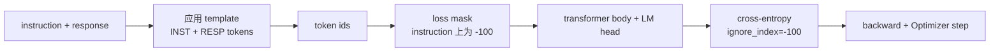
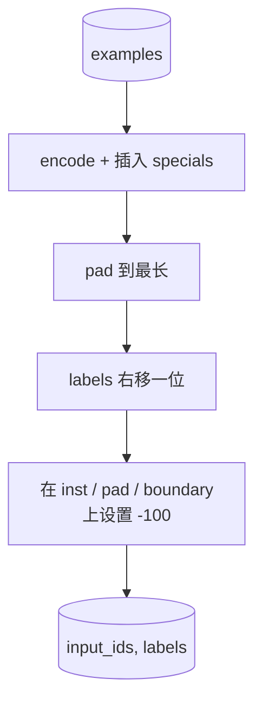
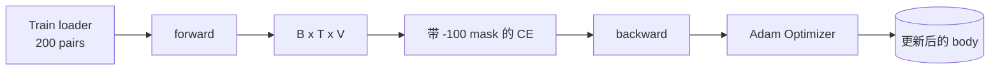

# Capstone  cours 39: Par le biais de l'écoute fine supervisée  effectuer l' écoute des instructions

> Le modèle de base prétrainé peut prolonger une séquence, mais ne peut pas suivre une instruction. Le réglage fin supervisé est la modification minimale de ce point: vers le modèle entrant par instruction 和 l'attente de réponse 配对组合的样本,并训练主体来预测响应代币.`ignore_index=-100`屏蔽 instruction tokens, dans 200 paires d'instructions-réponse 上訓練,并使用精準匹配 在持久的分分上评估──

**Type:** Build
**Languages:** Python (torch, numpy)
**Prerequisites:** Phase 19 lessons 30-37 (NLP LLM track: tokenizer, embedding table, attention block, transformer body, pre-training loop, checkpointing, generation, perplexity)
**Time:** ~90 minutes

## Objectifs d'apprentissage

- Les données d'instruction-réponse seront formalisées en une seule séquence causale avec des jetons de limite évidents.
- Construire une fonction de collage, éviter les jetons d'instruction, faire l'entropie croisée, calculer les jetons de réponse.
- Dans l'objectif SFT, entraînez un petit corps transformateur, et observez les changements de métriques d'évaluation.
- 实现 avide 和 génération échantillonnée par température,并 respecter la limite de réponse-début.
- Pour les résultats obtenus, calculer le parallèle exact.

## Le problème

Utilisez la prédiction de jeton suivant Le modèle de base de l'entraînement Je ne sais pas ce que c'est l'instruction.`"What is the capital of France?"`, il continuera ce problème, ou il construira une nouvelle phrase.

Le contrat SFT est un modèle de chaîne. Chaque exemple de formation devient une séquence unique de trois régions:

```text
<INST> What is the capital of France? <RESP> The capital of France is Paris.
```

Les jetons de bord sont des jetons spéciaux retenus pendant l'entraînement.`<RESP>` tout est ensuite une réponse, et la réponse  est seulement une partie de la part qui est évaluée                                                                                                                                                                                                                                                  

Mais il y a un piège. Si vous donnez à toute la séquence une perte d'entropie croisée normale, vous êtes également dans le modèle d'entraînement.

## Le concept



`ignore_index`Oui `torch.nn.functional.cross_entropy`Une fonction... n'importe quelle position cible est la même.`ignore_index`Les pratiques de la pyrothorte sont:`-100` La fonction de collage pour chaque cas est constituée de deux tensors:`input_ids`(rédaction complète)`labels`(le secteur de l'énergie)`input_ids`Les postes d'instruction sont couverts par`-100`)。

模型在前进传递 期间看整个序列;Attention 关注 关注 关注 关注 关注 关注 关注 关注 关注 关注 关注 关注 关注 关注 关注 关注 关注 关注 关注 关注 关注 关注 关注 关注 关注 关注 关注 关注 关注 关注 关注 关注 关注 关注 关注 关注 关注 关注 关注 关注 关注 关注 关注 关注 关注 关注 关注 关注 关注 关注 关注 关注 关注 关注 关注 关注 关注 关注 关注 关注 关注 关注 关注 关注 关注 关注 关注 关注 关注 关注 关注 关注 关注 关注 关注 关注 关注 关注 关注 关注 关注 关注 关注 关注 关注 关注 关注 关注 关注 关注 关注 关注 关注 关注 关注 关注 关注 关注 关注 关注 关注 关注 关注 关注 关注 关注 关注 关注 关注 关注 关注 关注 关注 关注 关注 关注 关注 关注 关注 关注 关注 关注 关注 关注 关注 关注 关注 关注 关注 关注 关注 关注 关注 关注 关注 关注 关注 关注 关注 关注 关注 关注 关注 关注 关注 关注 关注 关注 关注 关注 关注 关注 关注 关注 关注 关注 关注 关注 关注 关注 关注 关注 关注 关注 关注 关注 关注 关注 关注 关注 关注 关注 关注 关注 关注 关注 关注 关注 关注 关注 关注 关注 关注 关注 关注 关注 关注 关注 关注 关注 关注 关注 关注 关注 关注 关注 关注 关注 关注 关注 关注 关注 关注 关注 关注 关注 关注 关注 关注 关注 关注 关注 关注 关注 关注 关注 关注 关注 关注 关注 关注 关注 关注 关注 关注 关注 关注 关注 关注 关注 关注 关注 关注 关注 关注 关注 关注 关注 关注 关注 关注 关注 关注 关注 关注 关注 

## Les données

`main.py`Le centre de détermination a généré deux cents paires d'instructions-réponse.

- Une seule balle de fait
- l'arithmétique
- extraction de la liste
- résumé d'une phrase
- code(impression, tri)
- définition

Chaque tâche a une instruction templaire et une réponse déterministe. C'est un design simple.

Les classes sont divisées en 160 trains, 40 tests, un ensemble de tests couvrant les six types de tâches, afin de pouvoir rapporter un match exact par catégorie.

## Les symboles et les couches

Le tokeniser est à niveau octet, et a trois spécialités réservées:

- `INST_ID = 256`: 标记 instruction région 的开始──
- `RESP_ID = 257`: marque la frontière entre l'instruction et la réponse 
- `PAD_ID = 258`: utilise dans le rembourrage des lots de longueur variable

Le processus est`[INST] inst_bytes [RESP] resp_bytes [PAD]*` fonction de collage:

1. Les symboles de chaque cas.
2. Prendre chaque exemple de la série à la longueur de la plus longue séquence de cette série.
3.  Construction `labels`= droite移一位的 `input_ids`(objectif de LM de cause à effet), et:
   - 将 région d' instruction 替换为 `-100`Il y a une autre.
   - 将 région de rembourrage 替换为 `-100`Il y a une autre.
   - Il va`RESP_ID`position de limite 本身替换为 `-100`(你不训练模型预测 boundary token; il prévoit le contenu suivant)



Le changement est un truc de causalité standard:`input_ids`La position de`i`预测 position `i+1`, donc `labels[i] = input_ids[i+1]`(entrée 丢弃最终位置,target 丢弃第一位置)

## Formation



Le cycle est standard PyTorch SFT loop。Adam, taux d'apprentissage 约3e-4到1e-3, en ce fichier 上训练十到二十个时代,不使用安排器──模型足够小(隐藏 96、2 blocks、最大长度64),可以在两分钟内在CPU上训练到收──

Chaque 5 époques, le cycle se déroule dans un ensemble de cours, en cours d'évaluation et en imprimant un match exact.

## Génération

eval 时,模型获得 instruction préfixe `[INST] inst_bytes [RESP]`,并生成 tokens, jusqu'à ce que:

- La séquence atteint`max_len`, ou
- 模型触发一个特殊 stop heuristique:连续两个句子结束字节(`.`- Je suis là.`!`- Je suis là.`?`)。

Le cours fournit un décodeur avide,并附带一个可选温度样品器──精确匹配 使用贪,因为温度会让计变为 Stochastic──真实系统通常会样品,然后进行模糊判断;

## Évaluation de la correspondance exacte

La correspondance exacte est la mesure de texte la plus stricte. La chaîne de réponse prévue sera normalisée (minuscripts, espaces blancs à bande, espaces doubles à collapse), et la réponse de référence normalisée sera la même.

Les pipelines SFT réelles utilisent des jetons de niveau F1 ((leçon 41) et le modèle de juge  compléter le match exact―, le match exact  est toujours utile, car il n'y a pas de différence; si elle affiche 0,7, on indique que 70% des instructions de test  chaque caractère génère une réponse dorée―.


```figure
cc-sft-loss-mask
```

## Ce que vous allez construire

                                                                                                                                                                                                                                                                                                                                                                                                                                                                                                                             `main.py`Les tests sont complétés.

1. `InstructionTokenizer`:带 réservées spéciaux  codeur de niveau octet.
2. `make_dataset`Il est également possible de faire des recherches sur les différents types de tâches.
3. `SFTDataset`Pour chaque cas, retour`(input_ids, labels)`Je suis prêt pour le masque.
4. `sft_collate`: remplissage dynamique, construction de tensor de lot, en instruction et en position de pads 上设置 `-100`Il y a une autre.
5. `TinyGPT`Le corps du transformateur 加 lié ou non lié LM tête
6. `train_sft`:SFT boucle, avec des crochets d'évaluation par époque
7. `generate`: du préfixe  effectuer le décode causal, avide ou échantillonné,并带 stop heuristic。
8. `exact_match`:comparison de chaînes normalisée, retour `[0, 1]`Dans le flot.
9. `run_demo`: Construire des données, entraîner vingt époques, évaluer, imprimer par catégorie,并成功时以零 退出──

## Pourquoi le masque est important

没有面具,Loss会把指示令牌当作目标――模型会学习预测指示―― c'est un objectif différent,并将从两方面产生更差的模型―― d'abord, la capacité du modèle est gaspillée pour rebâtir les entrées fournies par l'utilisateur总会―― ensuite, dans la plupart des lots, les instructions des tokens sont plus nombreuses que les témoins de réponse, de sorte que la réponse perd dans la partie gradiente 总和中占比较小; Optimiser dans la partie qui vous intéresse vraiment est un taux d'apprentissage efficace plus faible que prévu――masque n'est pas polonais; c'est l'objectif――

## Des objectifs

- 添加学习速度升温, puis utiliser la décomposition cosine。SFT à la LR par rapport à la pré-entraînement
- 添加 per-token Loss logging,并绘制训练过程中的 Loss curve。注意早期时代 由模板代币(`<RESP>`、 préfixes communs) 主导,后期 époques 由真实答案代币 主导。
- L'évaluation sera étendue à BLEU-1 ou chrF.
- 添加带有多转格式的聊天模板, et contenant des suivis de fichier 上训练。

实现会给你格式合约、面具和循环──从基模型到指令追随者的目标变化,就是一个拼接函数──
