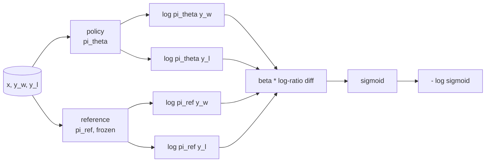
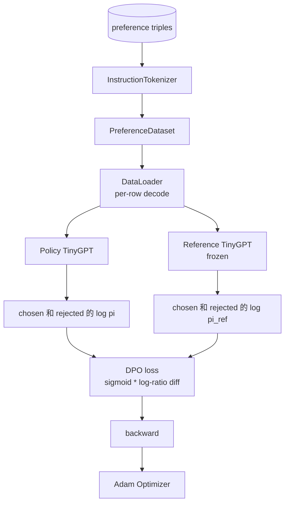

# Capstone  cours 40: à partir de zéro à réaliser l'optimisation directe des préférences

> Modèles de récompense et PPO sont classiques RLHF stack. Le DPO va réduire cette pile à une perte supervisée, directement avec des paires de préférences.

**Type:** Build
**Languages:** Python (torch, numpy)
**Prerequisites:** Phase 19 lessons 30-37 (NLP LLM track: tokenizer, embedding table, attention block, transformer body, pre-training loop, checkpointing, generation, perplexity)
**Time:** ~90 minutes

## Objectifs d'apprentissage

- La perte de DPO est estimée à l'échelle de la différence log-ratio du sigmoïde supérieur, et elle est reliée à la récompense implicite.
- construire un modèle de référence + une paire de modèles de politique, dont la référence est gelée, la politique peut être formée¬¬¬¬¬¬¬¬¬¬¬¬¬¬¬¬¬¬¬¬¬¬
- Dans les deux modèles, il est possible de calculer les probabilités de logs au niveau de la séquence et de masquer les jetons de prompt.
- Dans le`(prompt, chosen, rejected)`Triplez la politique de formation,并观察 choisit log-prob comparativement rejeté 上升──
- Utilisation des tests Fixed Loss math、Gradient sign 和 reference invariance

## Le problème

Vous avez un modèle SFT. Il suit les instructions, mais les sorties sont instables. Il y a des compléments 清晰,有些冗长或错误.

经典 RLHF 答案是两阶段管道――先用偏好――训练奖励模型――再用PPO 根据奖励政策――优化政策―― 这可行,但成本很高:PPO 期间内存中有两个模型,需要KL控制让政策 接近参考,且当奖励模型 脆弱时会出现奖励黑客――

Le DPO utilise une perte supervisée  pour remplacer ces deux phases  le modèle de récompense  de l'existence non apparente  de la politique  directement dans les paires de préférences  de formation,  de portée directe vers la référence SFT  de la pénalité KL évidente  du modèle de préférences Bradley-Terry  de la même solution optimale, mais le code est moins nombreux 

## Le concept

Le modèle Bradley-Terry commence.`x`Et deux compléments `y_w`(élu) avec `y_l`(réfuté), les humains préfèrent`y_w`La probabilité est

```text
P(y_w > y_l | x) = sigmoid( r(x, y_w) - r(x, y_l) )
```

Parmi eux `r`C'est une fonction de récompense latente.`r`, puis la politique de formation `pi`, avec l' ancre KL maximiser `r`- Le numéro de la liste:

```text
max_pi   E_{x, y~pi} [ r(x, y) ] - beta * KL(pi || pi_ref)
```

Le DPO a recommandé de faire observer, dans cet objectif, une politique optimale.`pi*`Ça peut être.`r`写成 sous forme fermée:

```text
pi*(y | x) = (1/Z(x)) * pi_ref(y | x) * exp( r(x, y) / beta )
```

Pour le`r`Je suis en train de vous dire:

```text
r(x, y) = beta * ( log pi*(y | x) - log pi_ref(y | x) ) + beta * log Z(x)
```

`log Z(x)`项对 `y_w`et `y_l`Ça dépend.`x`, au lieu de `y`), par conséquent, dans le calcul de la différence de préférence 时会抵消:

```text
r(x, y_w) - r(x, y_l) = beta * ( log pi_theta(y_w|x) - log pi_ref(y_w|x)
                                - log pi_theta(y_l|x) + log pi_ref(y_l|x) )
```

代入 Bradley-Terry sigmoid,并对偏好对取负记录概率:

```text
L_DPO(theta) = - E_{(x, y_w, y_l)} [
  log sigmoid( beta * ( log pi_theta(y_w|x) - log pi_ref(y_w|x)
                       - log pi_theta(y_l|x) + log pi_ref(y_l|x) ) )
]
```

Ceci est une perte. Il est chaque cas un sigmoïde de la valeur, cette valeur est calculée par quatre log-probabilités. Il n'y a pas de modèle de récompense unique. Il n'y a pas de PPO. La perte n'a pas de terme KL. La contrainte KL est transformée en dérivation de forme fermée.



## Le signe du gradient

Avant tout entraînement, il y a un contrôle de santé mentale utile.`log pi_theta(y_w | x)`求 Gradient:

```text
d L_DPO / d log pi_theta(y_w | x) = - beta * (1 - sigmoid(z))
```

Parmi eux `z`C'est l'argument de Sigmoid.`z`Les résultats de la recherche ont été positifs, ce qui signifie que l'amélioration de la politique de log-probabilité de l'achèvement choisi, réduira les pertes.`log pi_theta(y_l | x)`Le niveau de probabilité de logement rejeté augmentera la perte.

## Les données

Ce cours offre 12 triplés de préférence.`(prompt, chosen, rejected)` la réalisation choisie 短且精确── rejetée 冗长、偏题或错误── ces paires 覆盖与课39 相同的任务族(capital、arithmétique、list), donc à partir de la base de la SFT 开始的政策会有一个合理起点──

Le DPO en production utilisera des dizaines de milliers de paires; ici, le point de vue est de perdre des maths et de pouvoir fonctionner à un petit ensemble de données de haut en bas, et de choisir-contre-rejeté log-prob gap augmentera de manière évidente.

## Invariance de référence

La mise en œuvre du DPO doit traiter de manière minutieuse le modèle de référence.

- Les paramètres de référence ne recevront jamais de gradients.
- Les probabilités de référence des journaux ne changent jamais entre les époques.
- Les poids de référence sont similaires à ceux de référence.`theta`Il s'agit d'une référence et d'une mise à jour apprise; le texte de la politique init initiale pour référence est un début bien défini.

¢ réaliser ces qualités de la manière suivante:

- passe à l' avance 期间用 `torch.no_grad()`- Je vous en prie.
- Pour chaque paramètre de référence  définition `requires_grad=False`Il y a une autre.
- Dans la référence                                                                                                                                                                                                                                                                                                                                                                                                                                                                                                                           `policy.load_state_dict(reference.state_dict())`La politique de construction


```figure
cap-dpo-preference
```

## Architecture



模型与课39 中使用的TinyGPT 相同(décoeur-seulement、causal、byte tokeniser) ⋅ référence 和 politique 共享架构; train period policy weights From reference 发生 drift, while reference 保持 fixed。

## Ce que vous allez construire

                                                                                                                                                                                                                                                                                                                                                                                                                                                                                                                             `main.py`Les tests sont complétés.

1. `InstructionTokenizer`:带 `INST`et `RESP`Les spécialités de la partage de la marque.
2. `TinyGPT`Le format est identique à celui de la leçon 39, donc vous faites sauter au-delà de 39, et vous êtes aussi autonome.
3. `make_preferences`Retournez à 12 ans.`(prompt, chosen, rejected)`trois fois.
4. `sequence_log_prob`: given determin model、prompt préfixe 和 completion, retour à la fin 上 prochain log-probabilités de jetons
5. `dpo_loss`: Reçoit quatre log-probabilités et `beta`, retour par tensor de perte par exemple ainsi que delta de récompense implicite pour le logging.
6. `train_dpo`:par-epoque boucle, dans la politique 和 référence 下计算 choisi avec rejeté log-probs, appliquer Perte,并执行 Adam step。
7. `evaluate_margins`: dans une politique de retour à tout moment, la moyenne de marge de probabilité de logement rejetée choisie.
8. `run_demo`: de un petit réchauffement avant le train  Construire une référence 和 politique, copier des poids, entraîner trente étapes, imprimer par étape Perte 和 marge,并成功时以零 退出。

## Pourquoi le DPO fonctionne

Dans le modèle de préférence Bradley-Terry, le DPO est mathématiquement égal à RLHF, seulement différence de paramétration de la récompense.`r(x, y) = beta * (log pi(y|x) - log pi_ref(y|x))`On peut identifier les préférences, le plus différent.`x`La fonction, alors qu'elle sera dans la différence de valeur, est négligée.`pi`À la différence de`pi_ref`Toutes les déviations de la plateforme permettent de modifier le rapport de logement, et de le faire en fonction de la politique de la plateforme.

## Des objectifs

- dée la somme de la probabilité de logement ajouter la normalisation de la longueur: en dehors de la longueur de la réalisation.
- 添加 Loss of IPO variant: utilisé `(z - 1)^2`替代 sigmoid + log── comparer avec elle dans la convergence de la fixation.
- 添加一个标签-smoothing paramètre,在硬选择拒绝标签 和均 0.5 之间插值──
- Utilisation de la méthode de détection des connaissances

实现会给你 Loss 引用不变 和训练循环――math est le cœur du cours――code 让数学 具体化――
