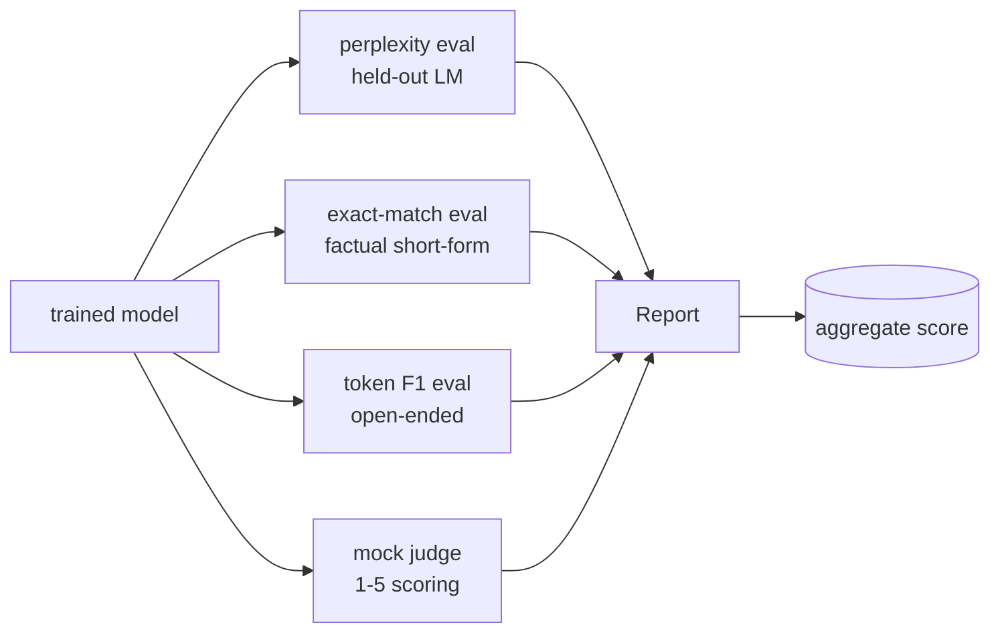
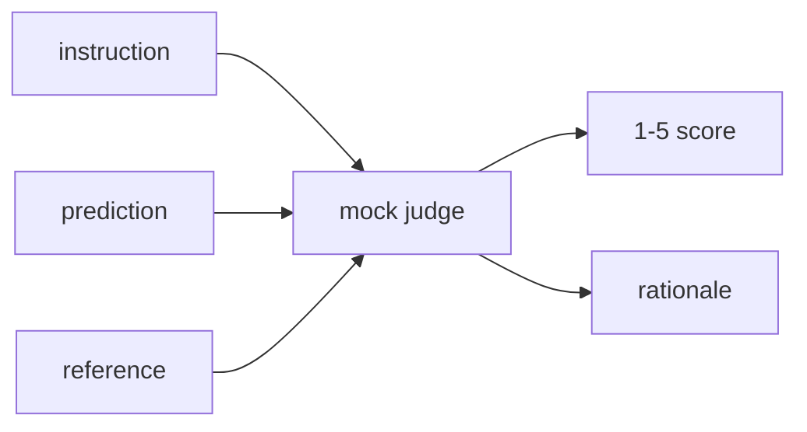
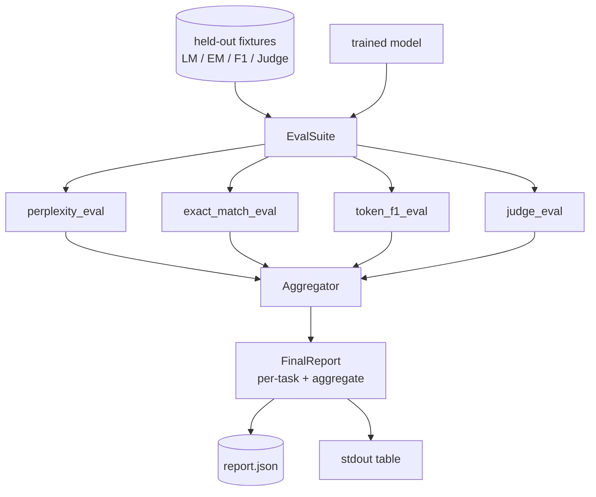

# Capstone Leçon 41: 完整 Pipeline d'évaluation

> La formation est une partie de la surveillance. L'évaluation est une partie de la conception. Cette classe construit un pipeline d'évaluation unifié: elle reçoit un modèle de langage bien entraîné, sur lequel elle exécute quatre évaluations différentes, et les résultats se regroupent en un rapport décomposé par tâche, et fournissent un rapport de décomposition LLM en tant que juge, permettant à toute la boucle de fonctionner. Ces quatre évaluations couvrent chaque modèle à fournir.

**Type:** Build
**Languages:** Python (torch, numpy)
**Prerequisites:** Phase 19 lessons 30-37 (NLP LLM track: tokenizer, embedding table, attention block, transformer body, pre-training loop, checkpointing, generation, perplexity)
**Time:** ~90 minutes

## Objectifs d'apprentissage

- Dans un petit transformateur, utilisez des jetons masqués pour calculer la perplexité.
- Dans un court moment, il est demandé de faire une évaluation exacte.
- 通过正常化 计算预测与参考 字符串之间的 F1 字符串级别的令牌 F1 字符串之间的 F1 字符串级别的令牌 F1 字符串之间的 F1 字符串级别的令牌 F1 字符串之间的 F1 字符串级别的令牌 F1 字符串之间的 F1 字符串级别的令牌 F1 字符串之间的 F1 字符串级别的令牌 F1 字符串之间的 字符串级别的令牌 F1 字符串
- Construire un imbécile de la loi comme juge, avec 1 à 5 parts pour donner des résultats modèles.
- Rassembler quatre évaluations et mettre en place un rapport unique de répartition des tâches.

## Le problème

单一指标 永远无法描述一个语言模型――Perplexité 解释模型对语言分布的适应程度,但不说明它是否能回答问题――Exact match 解释模型 是否产出金字符串,但会惩罚正确的改写――Token F1 会宽容表述,但可能被错误内容中的词汇重叠 欺骗――LLM-as-judge 能捕捉定性维度,但成本高且随机性――

Vous voulez vraiment du pipeline en même temps posséder ces quatre capacités. Chaque évaluation couvre les autres évaluations. Une dimension est manquée. Chaque évaluation fonctionne sur des données différentes de la métrique.

Ce cours sera dans un dossier de bout en bout pour construire ce pipeline.

## Le concept



Chaque évaluation est une simple.`(model, dataset) -> EvalResult`Les résultats contiennent une valeur métrique, des détails par exemple utilisés pour le contrôle, ainsi que le nom de l'agrégat.

## La perplexité, correctement comptée

La perplexité est`exp(mean negative log-likelihood per token)` réalisation de deux pièges:

- Le nombre de jetons de coupe doit être exclu du dénominateur, sinon la perplexité va paraître meilleure que la vraie.
- modèle 预测下一个 Token,所以位置 `i`预测位置 `i+1`Les étoiles sont toujours en train de se former, mais les métriques deviennent inutiles.

La évaluation sera effectuée par lot  calculer les positions non-paddées `-log p(token)`总和与Token count,最后再相除── This is compared to average per-batch perplexities 更数值安全(后者会低估短序列的权重),并且符合教科书的定义──

## Parallèle exacte, avec normalisation

Harness 会在比较前 normaliser la prédiction et la référence:

- 转为 petit caractère
- Pour le premier espace blanc.
- L'espace blanc se replie en un seul espace.
- Si les deux côtés ne sont pas les mêmes en raison de la ponctuation, alors la ponctuation est perdue.`.`- Je suis là.`!`- Je suis là.`?`)。

La normalisation 让 exact match  在实践中有用.`"Paris"`Oui, oui, oui, oui.`"Paris."`C'est aussi vrai.`"  paris  "`La métrique exige encore une normalisation. La réponse est la même.

## Le jeton F1, dans le bon sens.

Le jeton F1 est basé sur la précision de calcul et le rappel de la signification harmonieuse de la poche de jetons.

1. Normalité de la prédiction et de la référence avec correspondance exacte
2. Pour chaque symbole, il faut une liste de symboles.
3. 统计 multiset intersection。
4. La précision = `intersection_count / len(pred_tokens)`❖ Rappel = `intersection_count / len(ref_tokens)`◊ F1 = moyenne harmonieuse

Si la prédiction et la référence sont toutes en place, F1 est une correspondance vide)

## Loi sur la loi locale

Le vrai juge est le modèle de frontière de l'API 后面的法官──本课中的法官──必须离线运行──mock judge 是一个确定性分分分,它接收了指令、模型的预测和参考,并返回`{1, 2, 3, 4, 5}`Un score et une ligne de raisonnement.

- Si la prédiction normalisée ressemble à la référence normalisée, alors 5
- Si la prédiction et le jeton de référence entre F1 au moins 0,8, alors 4..
- Si le jeton F1 est situé`[0.5, 0.8)`, , pour 3 .
- Si le jeton F1 est situé`[0.2, 0.5)`, , pour 2 .
- 其他情况为 1──

Ce n'est pas un vrai juge, mais il a une interface correcte. Après cela, il suffit de remplacer une fonction qui peut être connectée au modèle réel.



## Aggrégation

L'ensemble est la moyenne pondérée des scores d'évaluation normalisés.`[0, 1]`Numéro de milieu:

- La perplexité: normaliser`1 / (1 + log(perplexity))`                                                                                                                                                                                                                                                              
- Le match exact: déjà en cours`[0, 1]`Dans le centre.
- F1: déjà là`[0, 1]`Dans le centre.
- Le juge:

Les poids peuvent être configurés. Le composé est de 0,2 perplexité, de 0,3 correspondance exacte, de 0,3 jetons F1 et de 0,2 juge.


```figure
cg-eval-quadrant
```

## Architecture



`EvalSuite`C'est un très petit orchestrateur. Chaque évaluation indépendante est une fonction libre.`(model, tokenizer, dataset, config)`Il n' est pas revenu`EvalResult`Il y a une autre.`Aggregator`收集结果并生成最终 report──demo 会打印表格,并写入一个JSON copy,供下游CI摄入──

## Ce que vous allez construire

                                                                                                                                                                                                                                                                                                                                                                                                                                                                                                                             `main.py`Les tests sont complets.

1. `TinyGPT`:lessions 38-40 En utilisant la même architecture de décodeur uniquement, intégré dans cette classe afin de fonctionner indépendamment
2. `InstructionTokenizer`:带 INST / RESP / PAD spéciaux de jetons en octets
3. 4 fixations: ensemble de LM, ensemble de EM, ensemble de F1 et ensemble de juges, chaque groupe de 20 exemples, déterministe,
4. `perplexity_eval`: retour contenant la valeur de perplexité 和 par-token de perte histogramme `EvalResult`Il y a une autre.
5. `exact_match_eval`: retour moyenne EM 和 enregistrements par exemple。
6. `token_f1_eval`: retour moyen des symboles F1 和 enregistrements par exemple。
7. `mock_judge`et `judge_eval`: par exemple, le score par rapport à la raison, ainsi qu'à la moyenne du score de l'ensemble de la valeur de l'échantillon.
8. `Aggregator.normalise`:règle de normalisation par échéance
9. `Aggregator.aggregate`: moyenne pondérée 和组装后的报告。
10. `run_demo`: entraînement temporaire un petit modèle, fonctionnement de toutes les quatre évaluations, imprimant la table de rapport et l'écriture en JSON, succès à zéro 退出。

## Lire le rapport

Le rapport a trois niveaux. Le niveau le plus élevé est le score agrégé. Le tableau ci-dessous est composé de quatre nombres par éval. Le tableau ci-dessous est composé de quatre fractions par exemple utilisées pour le diagnostic.

JSON dump Utilisez des clés stables, laissez le tableau de bord CI peut traverser des versions pour tracer les lignes de tendance.

## Des objectifs

- 添加校准评估:model's softmax probabilités 是否匹配其精度?
- 添加强度 eval: donner à chaque exemple 标注 perturbation(typo、paraphrase、distractor),并报告每类 perturbation 的米特里克下降──
- Utilisez le modèle réel de l'appel HTTP 后面的真实模型 替换假判事──函数签名 不变──
- 添加 per-task weight learning: pas utiliser des poids fixes, mais selon les modèles 拟合重量上的目标偏好顺序.

Dans ce cadre, il est possible de créer un système d'évaluation qui vous permet de réaliser des évaluations et des rapports.
