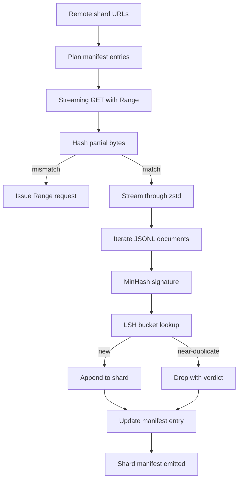

# Un téléchargement de corps

> 訓練語言模型 早在第一次前进通过 之前就开始了──corpus 必须落到磁盘上,完成解压缩,除复制,并且可地址;在网络 4% 处断掉之前,再录故事就已经要设计好──本课会构建一个流媒体下载器:它拉取压缩片,使用Zstandard 边下边解压缩,通过 MinHash加本地敏感哈希为近复制生成指纹,并写片表,让管道的其余部分可以信任──

**Type:** Build
**Languages:** Python
**Prerequisites:** Phase 19 lessons 30-37
**Time:** ~90 minutes

## Objectifs d'apprentissage

- Utilisation `urllib`flux de déchets à distance,并用 `zstandard`Décompresser, éviter de mettre le buffer du fichier dans la mémoire.
-  pour le décalage de octets vérifié 发起 HTTP `Range`Les demandes de représailles sont effectuées en partie.
- Pour chaque document, construire une signature MinHash, et utiliser LSH, pour que des doublons proches se heurtent.
- 输出包含内容哈希、字节大小、文件数 和 dedup verdict 的分片宣言──

## Le problème

Pour la première fois, pendant l'entraînement, le réseau était coupé à 41%.`urllib`Exception 退出──第二次它在百分百 78 处断掉──到了百分百 99,你已经重写了循环三次──你从第一分钟起就必须设计应对的两个失败点是部分下载简历和重复文件删除──两者都有成熟方案;两者也经常被跳过,因为管道一开始只是一个长出问题单行.`requests.get`Appelez-moi.

Résumé est un problème HTTP.`Range`, le client doit être enregistré sur disque, suivi de l'offset vérifié, et l'offset vérifié doit être conservé après la mort du processus. Si l'offset et le fichier sont supprimés d'un octet, le téléchargement reprend, le corps sera mis dans la poubelle, le corps sera détruit de manière à être exposé uniquement lors de la Tokenization.

La déduplication est une signature 问题──Exact-hash dedup 会漏掉近重复:同一篇维基百科文章带有三个不同脚脚表出现,同一代码文件带有不同许可标题,同一篇博客帖的每个链接都带跟踪参数──MinHash加 LSH 能以子线性成本 捕捉这些情况──成本是每个文件一个签名,以及每个签名一个桶查找──

## Le concept



### En streaming avec `urllib`

bibliothèque standard `urllib.request.urlopen`Retourner objet de type fichier `zstandard.ZstdDecompressor().stream_reader`En effet, les bits se retrouvent dans le décompresseur réseau, reentrent dans l'itérateur de documents, totalement pas besoin de matérialiser la partie compressée ou la partie décompressée en mémoire. Le seul coût de mémoire est le tampon de ligne, la signature MinHash du document actuel, ainsi que l'indice LSH.

### Résumé avec `Range`

télécharger pour chaque fragment  écrire deux fichiers:`.partial.json`Point de contrôle`verified_bytes`- Je suis là.`expected_size`- Je suis là.`sha256_prefix`(basé sur `verified_bytes`octets 计算) et URL source.`sha256_prefix`, et seulement dans le hash reconnu 匹配时才恢复──如果哈希 错误,partial会被丢弃,download从字节零重新开始──因为验证字节被检查而不是被假定,所以沉默腐败不可能发生──

### MinHash plus LSH

MinHash utilise l'estimation de l'espace fixe de deux ensembles de similitudes Jaccard. Pour le document, cet ensemble est le schiste de son texte.`k`个最小 de valeurs de hachage, chacune provenant d'une fonction de hachage indépendante.`s`Les documents, dans la signature de chaque composante, sont en conformité avec la probabilité de`s`Il y a une autre.

 Ensuite, le LSH `k`个 composants 分为 `b`Chaque groupe a une bande.`r`les rangées, parmi lesquelles `k = b * r`◊ Les probabilités de collision entre deux documents dans au moins une bande sont`1 - (1 - s^r)^b`Il vous sera utile.`(b, r)`调优的 `s`值附近形成尖门──典型 corpus dedup `s = 0.8`, LSH recherche de littérature utilisée`k = 128`- Je suis là.`b = 32`- Je suis là.`r = 4`Pour atteindre ce point.

### Manifeste de déchiffrement sous forme de contrat

Le seul produit durable du téléchargement est le manifeste. Manifest 按 shard 保存 URL、decompressed byte count、document count、dedup 后的独特 document count, ainsi que le dernier fichier de shard sha256。 downstream Tokenization 读取 manifest, et non une liste de répertoires。 Si un shard 缺失或其 sha256 错误, manifest 会告诉下一阶段拒绝启动──manifest 是 data 已下载与 data 已下载和可验证 之间的决定性边界──


```figure
cap-corpus-downloader
```

## Faites-le

`code/main.py`实现:

- `ShardPlanner`- 读取 URL de fragmentation 列表并生成 des entrées de manifeste prévues。
- `StreamingDownloader`- L' ouverture est facultative`Range``urllib`flux, écrire dans le fichier temporaire, dans chaque pièce  Update `.partial.json`point de contrôle, et reprendre 时验证 sha256 préfixe
- `ZstdDocIterator`- Va être comme un flux de fichiers 包在 `zstandard.ZstdDecompressor`En fait, il y a un document.
- `MinHasher`- Utilisation de graines de hachage fixe famille pour la production de chaînes`k`- signature de composant
- `LSHIndex`- 按带, signatures, répartition et rapport de collisions
- `Dedup`- 组合 hasher 和 index, chaque document sera marqué pour `keep`Ou `near_duplicate`,并附带相应的碎片ID──
- `ManifestWriter`-  collecter des statistiques par partage et écrire `manifest.json`Il y a une autre.

La démo de la base du dossier se trouve sur le disque et construit un petit corps synthétique, avec`zstandard`Il est en train de se faire sentir.`file://`URL, téléchargement, exécution déduplication,并打印 manifest。

Je vais le faire.

```bash
python3 code/main.py
```

écriture 以 zéro 退出并印印 manifest résumé。

## Modèles de production

Les quatre modèles peuvent être étendus à des corps réels.

**Checkpoint before write.** `.partial.json`必须在字节 添加到碎片 之前完成 `fsync`△否则 power loss 会颠倒顺序:shard bytes 在磁盘上,checkpoint 中没有它们,下一次再起 认为验证字节比实际更少,翻译后音字节会损坏文件──先检查点,再写──这与写前日记是同样的纪律──

**Sharded LSH index.**Dans une échelle de 200 Go, couvrant l'ensemble du corpus d'indices LSH uniques 放不进 RAM。 selon le premier index LSH de la bande hash, les partitions seront présentes sur le disque, et seulement pour obtenir une nouvelle signature 会落入的分区── le coût est pour chaque document une lecture sur disque supplémentaire; le bénéfice est LSH index 不再是硬存储限──

**Tombstone, not delete.**Les copies abandonnées seront jugées .`near_duplicate`Et les documents de collision sont enregistrés dans le manifeste. En supprimant, ils perdent le double du lien entre le propriétaire et le propriétaire.

**Per-shard sha256 in the manifest, plus a manifest sha256.**Manifeste 自身也会获得内容哈希──下游阶段 会在信任每分片条目 之前验证manifeste hash──没有这个机制,manifeste 就是沉默攻击表面:能编辑单个文件的攻击者 可以破坏整个管道──

## Utilisez-le

Modèles de production:

- **Resume on every CI run.**Les coureurs CI sont éphémères de la téléchargement 必須假设每次运行 都是新磁盘,并从缓存或远程恢复 `--cache-dir`C'est un drapeau de première classe.
- **Dedup before tokenization.**La tokenization est très coûteuse. On a fait deux opérations dans le même document, pour payer deux fois le coût de la même courbe de perte.
- **Manifest as merge gate.**La formation est effectuée à partir du code fixé et non pas du code.

## La faire partir

`outputs/skill-corpus-downloader.md`Dans un projet réel, décrivez les URL fournies par le téléchargeur, le répertoire de points de contrôle, la mise en page, la mise en page, la largeur de la barre et la taille de la barre.`(k, b, r)`triple, ainsi que manifestes dans le contrôle de version en position.

## Exercices

1. 添加 `--shingle-width`flag,并测量 dedup verdict 在宽度 3、5、9 下如何变化──为选择的默认值辩护──
2. 通过嗅探魔法字节,在 zstd 旁边添加 gzip 支持── downloader 不应要求调用者 指定代码──
3. 添加 `--resume-only`Mode: Si vous ne trouvez pas le point de contrôle, refusez de commencer un nouveau téléchargement.
4. Pour le dépôt de l'indice LSH, il est nécessaire de modifier le fichier de l'indice LSH en fonction de la différence entre le débit et la variante en mémoire.
5. Lors du démarrage, ajoutez le manifeste sha256 à vérifier.`manifest.lock`Le téléchargement doit être fermé.

## Les termes clés

| Term | What people say | What it actually means |
|------|-----------------|------------------------|
| Shard | “一个 file” | corpus 的一个自包含 slice，拥有自己的 sha256，并作为 resume 和 dedup 的单位 |
| MinHash signature | “Fingerprint” | 一个 set 的 `k`-component sketch，其中每个 component 是该 set 上一个 independent hash 的最小值 |
| LSH band | “Bucket” | 一组 `r` 个 signature components，用作 collision detection 的单个 bucket key |
| Verified bytes | “Resume offset” | disk 上 sha256 prefix 与 checkpoint 匹配的 bytes；唯一安全的 resume offset |
| Manifest | “The index” | downloader 产出的单一 durable record，包含 content hashes |

## Pour en savoir plus

- [RFC 7233](https://datatracker.ietf.org/doc/html/rfc7233)- Les requêtes HTTP Range, c'est-à-dire le protocole de rééducation
- [Zstandard format specification](https://datatracker.ietf.org/doc/html/rfc8478)- 让流 decompression format de cadre sûr
- [MinHash](https://en.wikipedia.org/wiki/MinHash)- 本课使用的 signes famille
- [Locality-sensitive hashing](https://en.wikipedia.org/wiki/Locality-sensitive_hashing)- déduction du seuil 背后的带宽方案
- Phase 19 · 43 - corpus de téléchargement  fournisseur de HDF5 jetonné
- Phase 19 · 44 - Le calendrier cosine de l'entraînement en haut du corps
- Phase 19 · 45 - 消耗该时间的 AMP loop
