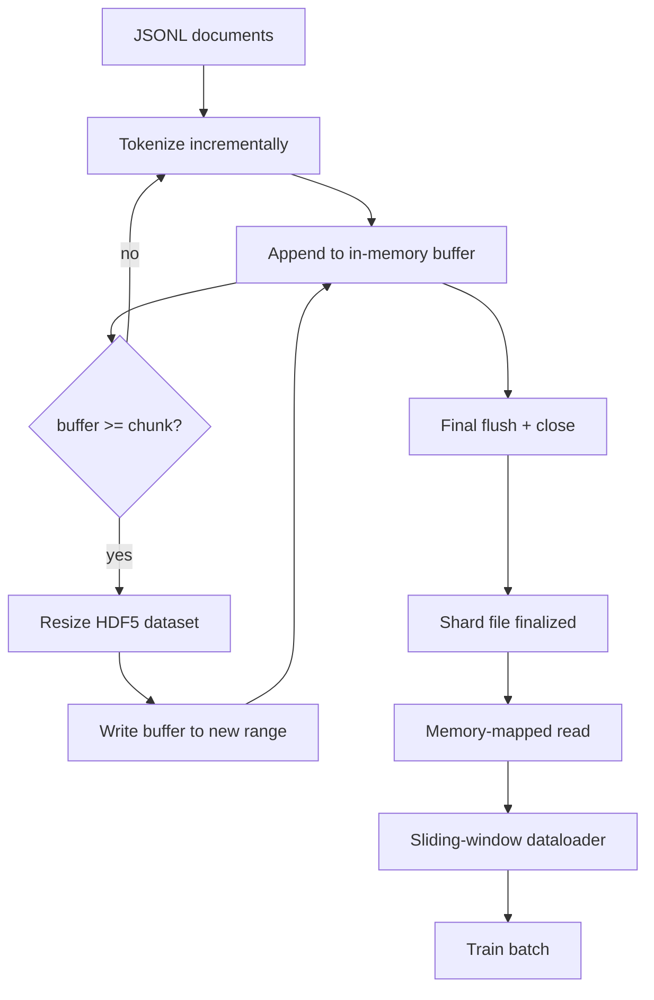

# HDF5 Tokenisé 语料库

> Un bon langage doit être mis en place par un formateur capable de lire et de lire en détail. Le JSONL sur le disque ne réside pas dans 16 chargateurs de données. Avec un chargateur de données à grande taille, un ensemble de données HDF5 à grande taille.

**Type:** Build
**Languages:** Python
**Prerequisites:** Phase 19 lessons 30-37
**Time:** ~90 分钟

## Objectifs d'apprentissage

- Pour les données de type HDF5, la taille de l'ensemble de données est déterministe.
- Il sera écrit en plusieurs fichiers HDF5, rendra la défaite contrôlable et rendra possible la mise en œuvre.
- 通过 HDF5 支的页面缓存 支的分布 读回代币,使数据加载器只在批次时间 复制到批次缓冲──
-  réaliser un chargement de données de fenêtre coulissante, avec un emballage explicite 规则发发出固定长度训练序列──

## Le problème

La première erreur de la page de cache froide sur le disque JSONL: JSON parseur  très lent, le document bordure impossible à trouver, alors que chercher à "échantillon 4,217,884"  besoin de fil de scan ⋅ Même si l'effet de compression est très bon Parquet, ne convient pas ici, parce que l'entraîneur ne veut pas de colonnes; il veut un flux aléatoire d'accès O1) ⋅ ⋅ ⋅ ⋅ ⋅ ⋅ ⋅ ⋅ ⋅ ⋅ ⋅ ⋅ ⋅ ⋅ ⋅ ⋅ ⋅ ⋅ ⋅ ⋅ ⋅ ⋅ ⋅ ⋅ ⋅ ⋅ ⋅ ⋅ ⋅ ⋅ ⋅ ⋅ ⋅ ⋅ ⋅ ⋅ ⋅ ⋅ ⋅ ⋅ ⋅ ⋅ ⋅ ⋅ ⋅ ⋅ ⋅ ⋅ ⋅ ⋅ ⋅ ⋅ ⋅ ⋅ ⋅ ⋅ ⋅ ⋅ ⋅ ⋅ ⋅ ⋅ ⋅ ⋅ ⋅ ⋅ ⋅ ⋅ ⋅ ⋅ ⋅ ⋅ ⋅ ⋅ ⋅ ⋅ ⋅ ⋅ ⋅ ⋅ ⋅ ⋅ ⋅ ⋅ ⋅ ⋅ ⋅ ⋅ ⋅ ⋅ ⋅ ⋅ ⋅ ⋅ ⋅ ⋅ ⋅ ⋅ ⋅ ⋅ ⋅ ⋅ ⋅ ⋅ ⋅ ⋅ ⋅ ⋅ ⋅ ⋅ ⋅ ⋅ ⋅ ⋅ ⋅ ⋅ ⋅ ⋅ ⋅ ⋅ ⋅ ⋅ ⋅ ⋅   ⋅                                                                                                                                                             

HDF5  Adapté, parce qu'il fournit un ensemble de données fragmenté                                                                                                                                                                                                                                                     `tokens[3,200,000 : 3,200,8192]`Le coût est pour chaque travailleur un poignet de fichier ouvert, ainsi qu'une pièce de grande taille de l'empreinte de cache de la page; par rapport au coût de JSONL, cela peut être négligé.

构建问题在让写入端诚实可靠――Datosets mesurables 易被误用: une fois écrire un document,HDF5 文件会碎碎化到不可用―― une fois mesurer 写入所有文档,进程死亡会丢失整个片段――true règle est que le buffer-then-extend, le buffer size 应匹配块大小,并使用碎片写把工作量拆分成多个文件,这样的崩,最后只会丢失一个片段――

## Le concept



### C' est une série de films de cinéma.

ensemble de données de jetons`maxshape=(None,)`Et déterminé`chunks=(chunk_size,)`创建──写入时,将代币 缓存在长度为 `chunk_size`De l'ensemble NumPy.`chunk_size`扩展,并把缓冲 写入新范围──在 shard 结束时, le reste du缓冲 会写入最后一个部分范围──除了最后一次写入外,每次写入都是连接的和分别的;lecteur 会根据 shard的 HDF5 attributs 中记录的`token_count`La dernière fois que j'ai écrit...

### Écriture en morceaux

单个 HDF5 文件是单点故障──管道 会并行写入片段:Phase 19 lesson 42`shards.json`Index 会按片 记录文件路径、代币计数、文件计数,以及代币的 sha256──trainer 读取 `shards.json`Pour calculer les compensations mondiales, il faut vérifier la valeur de la valeur.

### Lire en mémoire

En formation, chaque travailleur sera`swmr=True`mode 打开自己负责的 HDF5 fichiers,并请求 `tokens[start:stop]` une fois que la partie 变热, la disposition de la partie de l'HDF5 就会让它成为页面缓存支持的阅读──worker 永远不会实现 整个文件:slice 会被复制到数据库的批量缓冲,之后数据库在批量时间将其复制到固定内存训练 tensor──热路 在每次块转换时有一个系统调用;其余是RAM访问──

### Le chargeur de données de la fenêtre coulissante

Le chargement de données est le seul à savoir la longueur de la séquence de formation.`window_size + 1`个 Tokens, puis retour `(input, target) = (tokens[:-1], tokens[1:])` Pas obligatoire de respecter les limites du dossier: une fenêtre peut traverser deux documents, le milieu est évident `boundary_token_id`,让模型学会使用分隔器──这是标准包装规则; c'est aussi une règle facile à oublier pour les débutants, les derniers éléments de la bibliothèque se transforment en 8% de jetons de limite d'entraînement et 92% de texte naturel──


```figure
cc-hdf5-corpus
```

## Faites-le

`code/main.py`实现:

- `Tokenizer`- Un jeton déterministe de niveau octet, pour la démo 足足好──接口是 `encode(text) -> list[int]`et `vocab_size`Il y a une autre.
- `HDF5ShardWriter`- ouvrir un ensemble de données entières de taille ajustable, tamponner les jetons à la taille de la pièce, en fonction de fixer la taille de la petite étape et écrire, en clôture `token_count`et `sha256`记录为 HDF5 attributs。
- `ShardedTokenizationPipeline`- traverser les documents d'entrée, les router à l'écrivain,并输出 `shards.json`indice
- `MmapTokenStore`- 打开 shard files  effectuer des lectures cartographiées par mémoire, calculer les compensations globales, exposer un seul `get_slice(start, stop)`- Je suis désolé.
- `SlidingWindowDataloader`- du flux global 中 sélectionner des fenêtres aléatoires,并 yield `(input_ids, target_ids)`Les matrices numériques

La démo du fond du dossier va construire un très petit corpus de mémoire, jeter des jetons à deux morceaux, par la carte de mémoire, les ouvrir, faire fonctionner le chargement de données 10 lots, et imprimer la forme et la somme de chaque lot.

运行:

```bash
python3 code/main.py
```

脚本以 0 退出并印批发检查金──

## Modèles de production

Les quatre modèles peuvent s'étendre à la formation réelle.

**Chunk size 等于典型读取大小。**entraîneur Chaque échantillon 读取 `window_size + 1`个代币──把 HDF5 pièce 设置为 `window_size`Le nombre de fois, le nombre de pages-caches alignées, le nombre de pièces non correspondantes, le nombre de pièces, le nombre de pièces, le nombre de pièces, le nombre de pièces, le nombre de pièces, le nombre de pièces, le nombre de pièces, le nombre de pièces, le nombre de pièces, le nombre de pièces, le nombre de pièces, le nombre de pièces, le nombre de pièces, le nombre de pièces, le nombre de pièces, le nombre de pièces, le nombre de pièces, le nombre de pièces, le nombre de pièces, le nombre de pièces, le nombre de pièces, le nombre de pièces, le nombre de pièces, le nombre de pièces, le nombre de pièces, le nombre de pièces, le nombre de pièces, le nombre de pièces, le nombre de pièces, le nombre de pièces, le nombre de pièces, le nombre de pièces, le nombre de pièces, le nombre de pièces, le nombre de pièces, le nombre de pièces, le nombre de pièces, le nombre de pièces, le nombre de pièces, le nombre de pièces, le nombre, le nombre de pièces, le nombre de pièces, le nombre de pièces, le nombre, le nombre de la partie, le nombre de la partie, le nombre de la partie, le nombre de la partie, le nombre de la partie, le nombre de la partie, le nombre de la partie, le nombre de la partie, le nombre de la partie, le nombre de la partie, le nombre de la partie, le plus de la partie, le plus de la partie, le plus de la partie, le plus de la partie, le plus de la partie, le plus de la partie, le plus de la partie, le plus de la partie, le plus de la partie, le plus de la partie, le plus de la partie, le plus de la partie, le plus de la partie, le plus de la partie, le plus de la partie, le plus de la partie, le plus de la partie, le plus.

**Token count 放在 attributes 中，而不是 dataset 中。**La partie finale du ensemble de données peut ne pas être complètement remplie, car la taille du morceau n'est pas nécessairement la limite du document.`token_count`作为 HDF5 attribut 存在数据集 上,并让读者在该值处截断──否则读者 会越过真实末尾读到零填补的代币,模型也会学会预测零──

**带 parallel verification 的 sharded sha256。**Chaque fragment a ses propres octets symboliques Sha256― un entraîneur peut effectuer des tests avant le début de l'entraînement― un faux Sha256 va faire courir 提前失败, plutôt que la troisième ère 才失败十六小时后―

**两侧都使用 `swmr=True`，writer 使用 `libver="latest"`。**Mode écrivain unique-lecteur multiple  exigences écrivain 以 `libver="latest"`打开, pré-créer chaque ensemble de données, puis mettre en place `file.swmr_mode = True`                                                                                                                                                                                                                                                              `dataset.flush()`, ainsi utilisez `swmr=True`Les lecteurs ouvrent la porte pour voir les données cohérentes.`libver="latest"`, ou à nouveau activé SWMR après des changements de structure, est "fichier est verrouillé" 失败的常见来源──

## Utilisez-le

Modèles de production:

- **每个 source shard 一个 HDF5。**télécharger(leçon 42) chaque URL 输出一个片;tokenization(本课) chaque source 输出一个 HDF5──1:1 mapping 让恢复 和部分故障恢复 变得简单──
- **Boundary token id。**Le jeton de limite fait partie du vocabulaire du tokenizer, c'est aussi le seul jeton que le chargement de données insère. Si le modèle doit l'ignorer, la perte de formation le masquerait.
- **`shards.json` 是 source of truth。**添加新 shard Signification: écrire dans HDF5、 calculer sa sha256,并添加一条入──trainer 在启动时读取该文件一次,之后永远不碰目录列表──

## La faire partir

Dans le projet réel,`outputs/skill-hdf5-tokenized-corpus.md`Je vais décrire quel jeton d'entrée, quelle taille correspond à la fenêtre du coach.`shards.json`Dans le contrôle de version, les ouvriers du chargement de données peuvent-ils transférer des fichiers ?

## Exercices

1. 给 HDF5 écrivain 添加 `--compression gzip`Le débat est un sujet de discussion.
2. 给滑窗数据 load 添加确定性种子,并验证相同种子的两次运行 会生成相同批量──
3. 添加 `--validate`mode, lire chaque fragment, recalculer ses jetons de sha256,并与 `shards.json`Pour comparer, il faut commencer à le faire avant de commencer à l'entraîner.
4. Comparé aux tailles de pièces, la taille de la fenêtre, la taille de la fenêtre, le double de la taille de la fenêtre, le chargement de données est dégagé.
5. 添加 `--max-document-tokens`Le débat est un sujet de discussion qui a été évoqué dans le rapport de la Commission européenne.

## Les termes clés

| Term | What people say | What it actually means |
|------|-----------------|------------------------|
| Resizable dataset | "Append-only" | 一个带 `maxshape=(None,)` 的 HDF5 dataset，通过按 chunk 大小 stride 调用 `resize` 增长 |
| Chunked layout | "How HDF5 stores it" | 固定大小的 on-disk pages，kernel 可 memory-map，dataloader 可连续读取 |
| `swmr` mode | "Read-while-write" | Single-Writer-Multiple-Reader mode，使 dataloader workers 能安全共享文件 |
| Shard index | "shards.json" | 包含 offsets 和 content hashes 的所有 token shards 的 durable index |
| Sliding window | "Training sample" | global token stream 的固定长度 slice，trainer 会把它与 shift-by-one target 配对 |

## Pour en savoir plus

- [HDF5 chunking documentation](https://docs.hdfgroup.org/hdf5/v1_14/)- Le format de l'ensemble de données
- [h5py user guide](https://docs.h5py.org/en/stable/)- Les liaisons Python HDF5
- [NumPy memory mapping](https://numpy.org/doc/stable/reference/generated/numpy.memmap.html)- HDF5 通过 h5py 暴露的读侧原始
- Phase 19 · 42 - 输出由本课代币化 的 downloader
- Phase 19 · 44 - 消费这个数据包的 cosine scheduler
- Phase 19 · 45 - 包裹 training step of AMP loop
