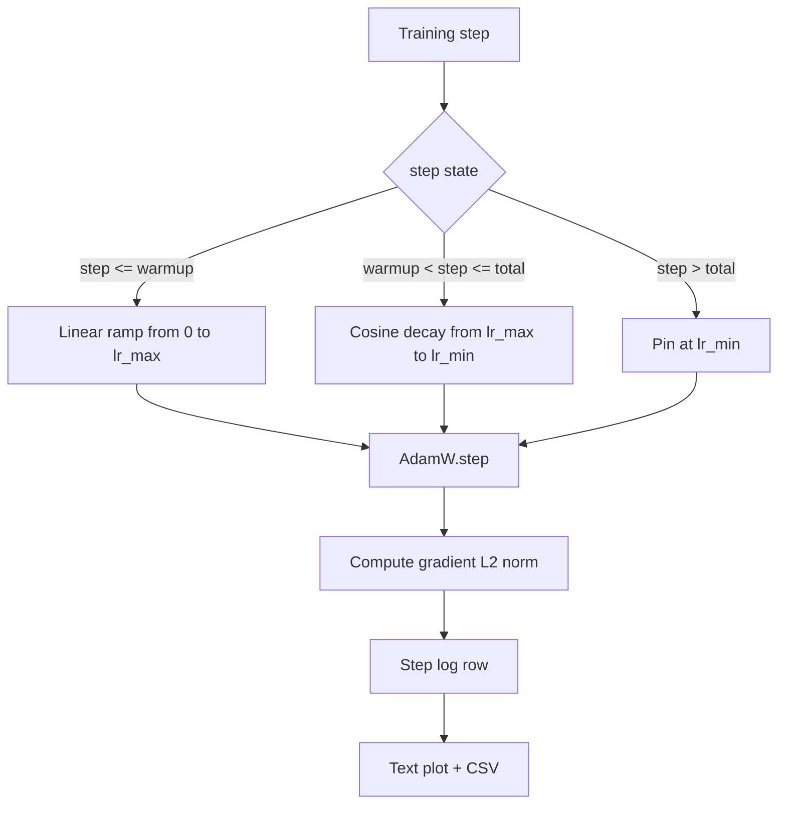

# 带 Linear Warmup 的 Cosine LR

> Le programme de taux d'apprentissage est simplement le second choix important de la fonction de perte. AdamW est la prémisse moderne de la formation du modèle de langage, car il permet au modèle de voir une taille plus petite et plus efficace des étapes dans les 1000 premières mises à jour fragiles, progressivement atteindre le pic de la configuration, puis de l'appliquer à la diminution vers le bas.

**Type:** Build
**Languages:** Python
**Prerequisites:** Phase 19 lessons 30-37
**Time:** ~90 分钟

## Objectifs d'apprentissage

- 实现 un AdamW Optimizer,并接入带线性变暖的共性学习率时间表──
- Dans l'étape de calcul de la valeur de l'horaire, éviter de transcender la course de la dérive de point flottant.
- La norme de gradient L2 et le taux d'apprentissage et la notation de la formation
- Le programme de l'affichage de texte à la vue humaine ainsi que tout outil utilisable pour la CSV

## Le problème

Avant de commencer, les modèles sont en train de se développer. Les poids du modèle sont encore proches de la mise en œuvre. L'estimation du second moment de fonctionnement de l'optimisateur n'est pas encore stable. La norme de gradient est également grande et bruyante. Si le taux d'apprentissage entre ces mises à jour est en plein essor, le modèle peut diverger directement, ou tomber dans un plateau de perte éternellement inépuisable.

Le calendrier cosine-avec-calme a trois zones.`warmup_steps`Le taux d'apprentissage est réduit de zéro à un pic de la configuration.`lr_max` depuis `warmup_steps`À la`total_steps`Le taux d'apprentissage suit la courbe cosine de la moitié supérieure, de`lr_max`La récession`lr_min`Dans le monde entier.`total_steps` après, le taux d'apprentissage   fixe `lr_min`Un entraîneur de configure aussi dépassé ne sortira pas du programme.

Les problèmes de construction sont dans les horaires  facilement éliminés par un seul  Off-by-one  Apprendre à apprendre à l'heure du début de l'excès de l'échantillon 

## Le concept



### Formule de réchauffement

Pour le`warmup_steps > 0`时位于 `[0, warmup_steps]``step`, le taux d'apprentissage est`lr_max * step / warmup_steps` Décentralisé `warmup_steps = 0`cas est considéré comme " pas de réchauffement ":l'horaire à l'étape zéro  directement depuis `lr_max`Il y a des essais qui vont entrer.`warmup_steps = 0`, pour le calendrier de contrôle  encore en mesure de générer une courbe utilisable。

### Formule de cosine

Pour le`(warmup_steps, total_steps]`Le centre`step`, le taux d'apprentissage est`lr_min + 0.5 * (lr_max - lr_min) * (1 + cos(pi * progress))`, parmi lesquels `progress = (step - warmup_steps) / max(1, total_steps - warmup_steps)`Dans le monde entier.`step = warmup_steps`,cosine 求值为 `cos(0) = 1`Je suis là .`lr_max`, avec le point de fin de chauffage  exact match `step = total_steps`,cosine 求值为 `cos(pi) = -1`Je suis là .`lr_min`, avec le point de déclin  exact match 

La continuité des deux points de fin n'est pas un hasard.`step`De la fonction unique, plutôt que de trois fonctions différentes 拼接在一起──拼接的时间表 在第一次改变 `lr_max`Tu as perdu une frontière.

### Planche après étapes totales

Pour le`step > total_steps`Le taux d'apprentissage`lr_min`Le contrat est évident: le calendrier ne s'écrase pas, ne s'extrapole pas, il est fixé au sol, et le formateur ne se laisse pas distraire.`total_steps`, au lieu de modifier la boucle.

### Récords de normalisation et de taux

Le programme est de l'état de santé de l'entraînement une moitié. La norme gradiente est l'autre moitié. La courbe de formation chaque étape.`step, lr, grad_l2_norm, loss` Le CSV est le seul enregistrement durable


```figure
cap-cosine-warmup
```

## Faites-le

`code/main.py`实现:

- `CosineWithWarmup`- Une fonction sans état, formée sur la base d'un calendrier de configuration `lr(step) -> float`Il y a une autre.
- `TrainState`- Je vais le faire.`AdamW`Optimisateur et calendrier 封装成单一步函数──
- `TrainState.step`- 运行一次前进过度一次后进过度,记录梯度 L2 norma,并把 `lr(step)`Appliquer à Optimiser.
- `plot_schedule_ascii`- Le calendrier de la lecture de l'intrigue
- `write_schedule_csv`- Pour chaque étape, le taux d'apprentissage est de 1°.

La démo du fond du dossier va construire une très petite .`nn.Linear`模型, dans un lot d'entrée fixe 上训练 20 étapes,并印每一步的学习速度、渐进规范 和损失──schedule will also be 染为文图,用于视觉智能检查──

运行:

```bash
python3 code/main.py
```

脚本以 0 退出,并印每步训练日和时间表图──

## Modèles de production

4 modèles peuvent être mis en place pour la production de l'artéfact

**Schedule 放在 config 中，而不是 code 中。**formateur de la configuration YAML ou JSON de la mise en ligne à la mise en ligne`warmup_steps`- Je suis là.`total_steps`- Je suis là.`lr_max`- Je suis là.`lr_min` le calendrier est réalisable, parce que la configuration est axée sur le contenu; le calendrier est auditable, parce que la configuration est une partie de la différence de relations publiques.

**Step counter 是 monotonic，并与 epochs 解耦。**Lorsque l'ensemble de données est fragmenté ou le chargement de données redémarré, certains cadres seront mis en place à l'étape et à l'époque.`global_step`, au lieu de partir du compteur local 读取──retourner la course 会在正确的时间表 位置继续,因为步数计器是持久轴──

**Schedule plot 放在 run directory 中。**Chaque séance d' entraînement est organisée .`outputs/lr_schedule.png`(ou plan de texte dans le cours) écrire dans son répertoire de fonctionnement.

**Log row schema 固定。** `step, lr, grad_l2_norm, loss`,顺序如此──下游 notebook 或仪表板 会读取这个方案;不弹版本就重新命名列,会让所有现有仪表板 失效──

## Utilisez-le

Modèles de production:

- **先 sweep peak，再 sweep 其他任何东西。** `lr_max`C'est le plus sensible. D'abord, le petit modèle, ensuite, le plus rapide.`lr_max`Avec modèle de taille de l'échelle  très faible, donc le petit modèle de balayage est un priorité forte ⋅
- **Warmup 是 total steps 的 fraction，不是绝对 count。**Une course de 200 millions d'étapes Si seulement 2000 étapes de réchauffement, presque atteint le pic; une course de 20 000 étapes avec le même nombre de étapes, il se réchauffera de 10%──把 warmup 配置为分数(典型:1-3%),让时间随训时长缩放──
- **`lr_min` 非零是有意的。**Une pour `lr_max`10% de l'étage, permettra à Optimiser de continuer à apprendre.`lr_min = 0`Le programme sera illustré par une courbe d'entraînement très bien vue, ainsi qu'un modèle d'entraînement pratiquement non terminé.

## La faire partir

Dans le projet réel,`outputs/skill-cosine-warmup.md`Décrire quel est le calendrier de configuration de charge, compteur mondial, quel est le niveau d'entraînement, et comment`lr_max`Le système de contrôle de la valeur de la machine de distribution de données

## Exercices

1. 添加时间表的逆方根变化, et dans 200 étapes de jeu de formation de course 上对比──哪条曲线 产生更低的最终损失?
2. 添加 `--restart`Le drapeau, dans`total_steps / 2`Pour le réchauffement, pour le rebours, pour le jeu, pour le remaniement, pour le remaniement.
3. 添加一个单位测试验证时间表是连续:对于 `[0, total_steps]`Chaque étape est différente.`|lr(step+1) - lr(step)|``lr_max / warmup_steps`Je suis un homme.
4. Va faire un calendrier`torch.optim.lr_scheduler.LambdaLR`, le rendant capable de travailler avec le code cadre 组合──本课使用简单步函数;包装 改变了什么?
5. 添加 `--plot-png`Le drapeau, par le biais `matplotlib`写出真实图片──为本课的文本图片 和 PNG 哪个更适合合作为CI runs 的默认做出辩护──

## Les termes clés

| Term | What people say | What it actually means |
|------|-----------------|------------------------|
| Warmup | "Slow start" | 在前 `warmup_steps` 次 updates 中，从 zero 到 `lr_max` 的 linear ramp |
| Cosine decay | "Smooth drop" | 在剩余 steps 中，从 `lr_max` 到 `lr_min` 的上半段 cosine curve |
| Floor | "After training" | schedule 在超过 `total_steps` 后固定的 `lr_min` 值 |
| Gradient norm | "L2 of grads" | 拼接后的 gradient vector 的 Euclidean norm，每 step 记录 |
| Global step | "Schedule axis" | 一个能跨 restart 保留的 monotonic step counter，用于驱动 schedule |

## Pour en savoir plus

- [Loshchilov and Hutter, SGDR: Stochastic Gradient Descent with Warm Restarts (arXiv 1608.03983)](https://arxiv.org/abs/1608.03983)- papier de référence du calendrier cossin
- [Loshchilov and Hutter, Decoupled Weight Decay Regularization (arXiv 1711.05101)](https://arxiv.org/abs/1711.05101)- Document de référence de AdamW
- [PyTorch torch.optim.lr_scheduler](https://docs.pytorch.org/docs/stable/optim.html#how-to-adjust-learning-rate)- les fonctions de phase 如何与框架时间表组合
- Phase 19 · 42 - 产出此表 所消费语料的下载器
- Phase 19 · 43 - Avec ce calendrier  co-développement du chargement de données
- Phase 19 · 45 - coupage de gradient et AMP, y'a lieu de la dernière couche de la boucle
