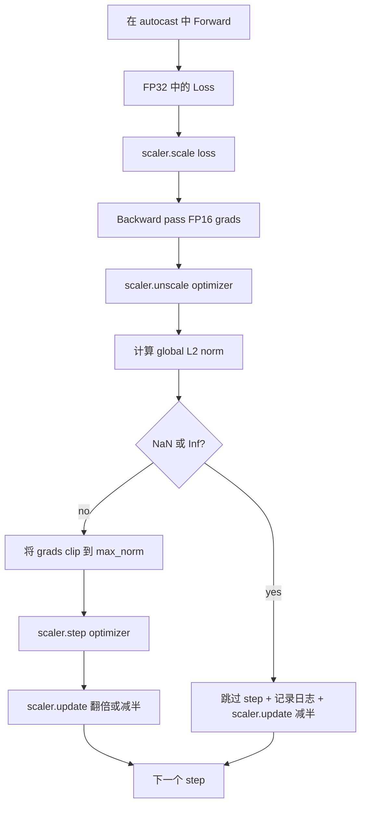

# Le découpage de la graisse et la précision mixte

> Le programme et l'optimisateur de la classe précédente  présume que le gradient est normal. Ils ne sont généralement pas normaux. Un mauvais lot permet de faire monter la norme de gradient  trois niveaux numériques. La formation de précision mixte sera menée à travers le côté de la perte.

**Type:** Build
**Languages:** Python
**Prerequisites:** Phase 19 lessons 30-37
**Time:** ~90 minutes

## Objectifs d'apprentissage

- 计算 toutes les gradients de paramètres de la norme globale L2, et dépasser la configuration 值时原地 clip。
- Avec un jet automatique, avec un grad-scaler, remplissez l'étape d'entraînement, faites passer le FP16 vers l'avant et vers l'arrière.
- 检测 Loss ou Gradient 中的 NaN 和 Inf, sautez l'optimisateur étape,并记录 this skip──
- Chaque étape  Rapporte le facteur d'échelle de GradScaler, laissez une grande quantité de sauter 能立刻可见──

## Le problème

Il y a eu une série de tests de l'optimisateur qui ont été effectués en une seule fois, en utilisant la norme 1.0 de l'optimisateur. Après avoir utilisé la norme 1.0 de l'optimisateur, le même lot ne contribue qu'à la mise à jour de l'unité-norme; la perte reste sur la ligne de tendance; l'optimisateur va refaire une seule étape.

Une formation de précision mixte  En utilisant FP16  calculant le passage vers l'avant et la plupart du passage vers l'arrière, le débit augmentera de 2-3 fois ⋅ prix est la plage d'exposants de FP16  très restreinte ⋅ Un gradient typique de débordement dans FP16 va devenir Inf, et se propager dans la phase suivante en NaN, conduisant à la prochaine étape d'optimisation ⋅ Place chaque poids dans NaN⋅ GradScaler de PyTorch ⋅ En utilisant le passage vers l'arrière ⋅ Facteur d'échelle énorme ⋅ Facteur de perte ⋅ Facteur d'optimisation ⋅ Facteur de décomposition ⋅ Facteur d'optimisation ⋅ Facteur de décomposition ⋅ Facteur de décomposition ⋅ Facteur de décomposition ⋅ Facteur de décomposition ⋅ Facteur de décomposition ⋅ Facteur de décomposition ⋅ Facteur de décomposition ⋅ Facteur de décomposition ⋅ Facteur de décomposition ⋅ Facteur de décomposition ⋅ Facteur de décomposition ⋅ Facteur de décomposition ⋅ Facteur ⋅ Facteur de décomposition ⋅ Facteur ⋅ Facteur de décomposition ⋅ Facteur ⋅ Facteur ⋅ Facteur de décomposition ⋅ Facteur ⋅ Facteur ⋅ Facteur ⋅ Facteur ⋅ Facteur ⋅ Facteur ⋅ Facteur ⋅ Facteur ⋅ Facteur ⋅ Facteur ⋅ Facteur ⋅ Facteur ⋅ Facteur ⋅ Facteur ⋅ Facteur ⋅ Facteur ⋅ Facteur ⋅ Facteur ⋅ Facteur ⋅ Facteur ⋅ Facteur ⋅ Facteur ⋅ Facteur ⋅ Facteur ⋅ Facteur ⋅ Facteur ⋅ Facteur ⋅ Facteur ⋅ Facteur ⋅ Factor ⋅ Factor ⋅

Le problème de construction réside dans le fait de connecter correctement. Le premier clip à nouveau non étalé, la valeur de l'échelle, fonctionne sur les gradients à échelle.`scaler.scale(loss).backward()`Alors ...`scaler.unscale_(optimizer)`Alors ...`clip_grad_norm_`Alors ...`scaler.step(optimizer)`, enfin `scaler.update()`Tout autre ordre entraîne une boucle de dégradation.

## Le concept



### Norme mondiale de l2

La norme globale de L2 est la norme euclidienne du vecteur de gradient suivant, et non la norme par paramètre. PyTorch la réalisera en tant que`torch.nn.utils.clip_grad_norm_(parameters, max_norm)` Cette fonction retourne à la norme pré-clips, donc cette classe peut enregistrer à la fois la valeur naturelle et la valeur clippée, ce qui est nécessaire pour le diagnostic nous sommes tous en clippage

### autocast et GradScaler

`torch.amp.autocast(device_type)`Il est un gestionnaire de contexte, qui choisit et utilise le P16 pour effectuer une opération conforme aux conditions requises (la plupart des opérations de type matmul)`torch.amp.GradScaler(device_type)`Il est un assistant, va être en arrière avant la perte d'échelle, et dans l'optimisateur étape avant la gradient à échelle inverse.

Cette classe utilise le processeur autocast, car c'est le contenu qui fonctionne dans le CI; le même schéma peut être passé par.`device_type="cpu"`改为 `device_type="cuda"`GradeScaler est un stub de l'autocast du CPU 默认已经运行以 BF16 运行,不需要损失扩展), mais ce cours contient ces sites d'appels, faire le câblage avec la boucle GPU 完全一致.

### Détection de NaN et d'inf

Le test se produit à deux endroits. Tout d'abord, la perte de personnalité est en arrière.`torch.isfinite`检查;Inf ou NaN Loss ne produira pas de Gradient utile, sera dans l'optimisateur`scaler.unscale_(optimizer)`后,本课会使用 `has_non_finite_grad(...)`扫描不扩展梯度,并把任何Inf或NaN视为跳转―― ces deux contrôles se combinent pour couvrir le passage avant et le passage arrière 两类失败模式――

### Diagnostics des facteurs de mise à l'échelle

Le facteur d'échelle est l'état interne de GradScaler.`scaler.get_scale()`, et le faire avec le taux d'apprentissage et la norme de gradient, un enregistrement.`2^17`Ou `2^18`附近和── comportement anormal de course 会显示因子在高值和低值之间振荡, qui explique le gradient du modèle parfois dans la gamme, parfois absent──不记录日志, ce signal de diagnostic est invisible──


```figure
grad-clip-monitor
```

## Faites-le

`code/main.py`实现:

- `clip_global_l2_norm`- Pour moi .`torch.nn.utils.clip_grad_norm_`De l'emballage, retournez la norme avant et après le clip.
- `has_non_finite_grad`- 扫描 Gradient 中 NaN 和 Inf de l'aide
- `AmpTrainState`- Un modèle.`AdamW`Un système d'optimisation, un GradScaler, ainsi qu'un dispositif de diffusion automatique.`step(inputs, targets)`,运行完整的剪裁,扩展和跳-on-NaN du tuyau
- `StepLog`et `SkipLog`- - enregistrement de la structuration par étape
- Une démo, une petite.`nn.Linear`Modèle 20 个步骤, dans l'étape 5 向 Gradient 注入 Inf 以触发跳路,并印得到的日志──

运行:

```bash
python3 code/main.py
```

脚本以 0 退出,并印每步日记,每行标记为 `STEP`Ou `SKIP`; au moins une ligne est `SKIP`Il y a une autre.

## Modèles de production

4 modèles peuvent être utilisés pour améliorer la formation en production.

**Skip counter 应该是 alert，而不是一行 log。**Chaque épisode de formation 跳过少量步骤是健康的──每时代出现百次跳是硬警报: le modèle est entré dans la région FP16 无法承担的区域, alors que la boucle est en train de perdre son éclat.

**Clip threshold 放在 config 中。** `max_norm = 1.0`Il s'agit d'une formation de modèle de langage moderne. Il faut passer par le petit modèle. Un plus grand seuil permet au modèle de se rétablir dans un lot de problèmes réels. Un plus petit seuil permet à l'ensemble de ses problèmes de se rétablir dans un ensemble de problèmes.

**Norm log 和 schedule 一起进入 CSV。**Colonne CSV est `step, lr, grad_l2_pre_clip, grad_l2_post_clip, loss, skipped, skip_reason, scaler_scale` Le réviseur 打开文件后, peut voir le même tableau  Gradient 的故事、规模因子, ainsi que le résultat 含原因 (含原因)  Le décomposition de ces colonnes  en plusieurs fichiers, est une méthode de fabrication d'erreurs de site.

**`scaler.update()` 每个 step 都运行，即使 skip 也一样。**Dans le cas d'un compteur sans inflation, il peut être multiplié par deux. Dans le cas d'un compteur sans inflation, il peut être multiplié par deux.`update()`, est de produire un facteur d'échelle de l'inconvénient de modifier.

## Utilisez-le

Modèles de production:

- **Autocast device 匹配 optimizer device。**Formation en GPU `torch.amp.autocast(device_type="cuda")`; utilisateur de la CPU `torch.amp.autocast(device_type="cpu")`◊ Le dispositif de compression entraînera une erreur de type silencieux, la courbe de perte semble normale, mais le modèle n'a pas appris.
- **Backward 前检查 Loss。** `torch.isfinite(loss).all()`C'est une réduction du tensor; le coût peut être ignoré, tandis que la perte de NaN est une étape de formation complète.
- **`zero_grad` 中使用 `set_to_none=True`。**将 Gradient 设为 `None`Au lieu de zéro, laissez Optimizer  sauter le calcul du groupe de paramètres non affectés.

## La faire partir

`outputs/skill-clip-amp.md`Dans un projet réel, une description de l'étape de formation utilisez quel seuil de clips et un dispositif de diffusion automatique, CSV par étape, position dans le contrôle de version, ainsi que le seuil d'alerte de production de saut de taux est quoi ?

## Exercices

1. Utilisez une vraie perte de pointe  remplacement synthétique Inf 注入(把某一批的目标 乘以1e8),并验证跳路 会触发。
2. - Je suis là.`--bf16`mode, va autocast 切到 BF16 plutôt que FP16;; la gamme d'exponents de BF16 est plus large que FP16; généralement très peu nécessite une mise à l'échelle de perte;
3. 添加一个单位测试,验证在没有剪辑发生时,渐变剪辑包装 会正确返回前剪辑和后剪辑规范──
4. 添加滚动窗口跳速计算,以及一个CLI flag: si le taux 连续 100 个步 超过配置值,就让运行 失败──
5. Va boucle 接到 canonique CSV(`step, lr, grad_l2_pre_clip, grad_l2_post_clip, loss, skipped, skip_reason, scaler_scale`) écrire, et passer par chaque ligne après le flush  confirmation du fichier peut être conservé en Ctrl-C    后下来

## Les termes clés

| Term | What people say | What it actually means |
|------|-----------------|------------------------|
| Global L2 norm | "Clip target" | 所有可训练 parameter 的拼接 gradient vector 的 Euclidean norm |
| autocast | "Mixed precision" | 在 `with` block 内，对符合条件的 operation 选择性执行 FP16（或 BF16） |
| GradScaler | "Loss scaler" | 在 backward 前乘以 Loss，并在 optimizer step 前 inverse-scale Gradient 的 helper |
| Skip | "Bad step" | 因为 Gradient 或 Loss 是 non-finite 而拒绝执行的 optimizer step；scaler 会将 factor 减半 |
| Scaling factor | "Scaler state" | GradScaler 当前的 multiplier；干净区间后翻倍，每次 skip 时减半 |

## Pour en savoir plus

- [Micikevicius et al., Mixed Precision Training (arXiv 1710.03740)](https://arxiv.org/abs/1710.03740)- proposition initiale de réduction des pertes
- [Pascanu, Mikolov, Bengio, On the difficulty of training recurrent neural networks (arXiv 1211.5063)](https://arxiv.org/abs/1211.5063)- Le découpage de la gradience
- [PyTorch torch.amp.GradScaler](https://docs.pytorch.org/docs/stable/amp.html)- Le programme de mise à l'échelle
- [PyTorch torch.nn.utils.clip_grad_norm_](https://docs.pytorch.org/docs/stable/generated/torch.nn.utils.clip_grad_norm_.html)- 本课使用的剪裁原始
- Phase 19 · 42 - Pour un boucle  fournir le téléchargeur de corpus
- Phase 19 · 43 - boucle consommation de charge de données
- Phase 19 · 44 - Schéma de la composition de la boucle
