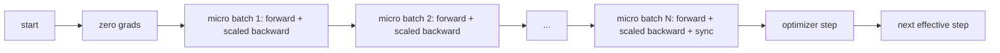
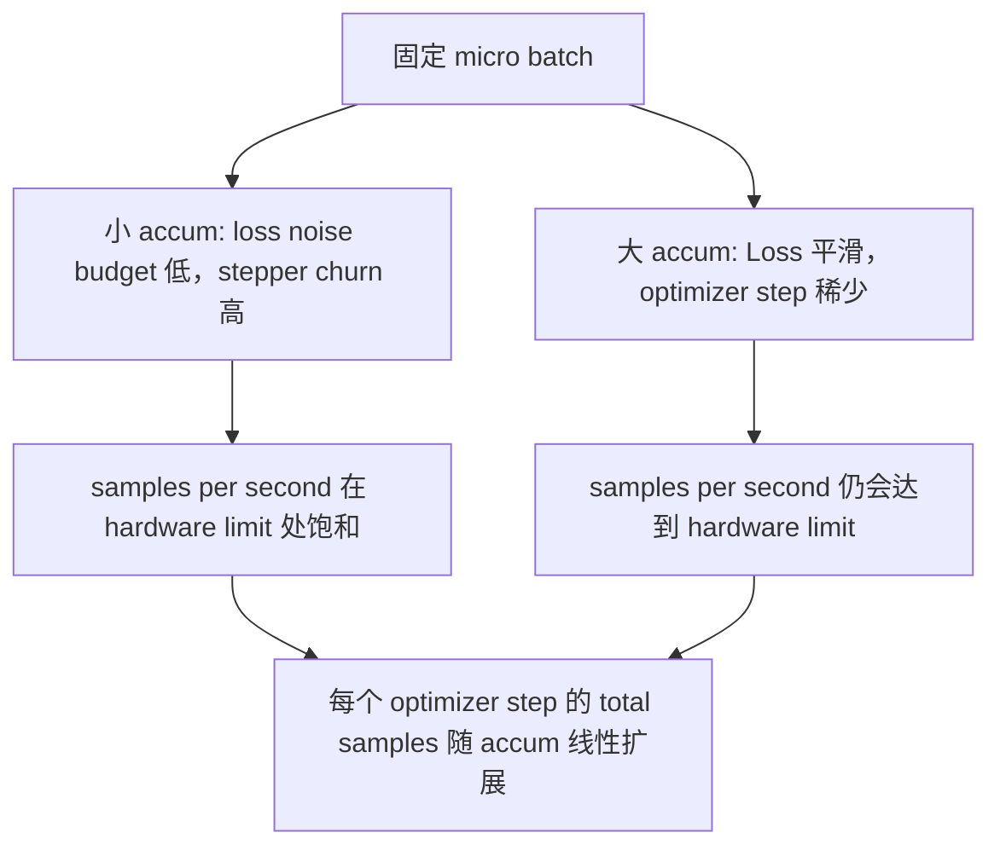

# Accumulation progressive

> Utilisez un micro-batch, entraînez-vous à prendre le charge de votre lot efficace. Perte de taille, ralentissement de l'optimisation, faites accumuler le gradient.

**Type:** Build
**Languages:** Python
**Prerequisites:** Phase 19 lessons 42 to 45
**Time:** ~90 minutes

## Objectifs d'apprentissage

- 推导 lot effectif 恒等式:`effective_batch = micro_batch * accum_steps`Il y a une autre.
- ¢ réaliser une mise à l'échelle de perte par micro-batch, faire accumuler Gradient ¢ correspondre une fois complet complet plein de lot en arrière¬¬¬¬¬¬¬¬¬¬¬¬¬¬¬¬¬¬¬¬¬¬¬¬¬¬¬¬¬¬¬¬¬¬¬¬¬¬¬¬¬¬¬¬¬¬¬¬¬¬¬¬¬¬¬¬¬¬¬¬¬¬¬¬¬¬¬¬¬¬¬¬¬¬¬¬¬¬¬¬¬¬¬¬¬¬¬¬¬¬¬¬¬¬¬¬¬¬¬¬¬¬¬¬¬¬¬¬¬¬¬¬¬¬¬¬¬¬¬¬¬¬¬¬¬¬¬¬¬¬¬¬¬¬¬¬¬¬¬¬¬¬¬¬¬¬¬¬¬¬¬¬¬¬¬¬¬¬¬¬¬¬¬¬¬¬¬¬¬¬¬¬¬¬¬¬¬¬¬¬¬¬¬¬¬¬¬¬¬¬¬¬¬¬¬¬¬¬¬¬¬¬¬¬¬¬¬¬¬¬¬¬¬¬¬¬¬¬¬¬¬¬¬¬¬¬¬¬¬¬¬¬¬¬¬¬¬¬¬¬¬¬¬¬¬¬¬¬¬¬¬¬¬¬¬¬¬¬¬¬¬¬¬¬¬¬¬¬¬¬¬¬¬¬¬¬¬¬¬¬¬¬¬¬¬¬¬¬¬¬¬¬¬¬¬¬¬¬¬¬¬¬¬¬¬¬¬¬¬¬¬¬¬¬¬¬¬¬¬¬¬¬¬¬¬¬¬¬¬¬¬¬¬¬¬¬¬¬¬¬¬¬¬¬¬¬¬¬¬¬¬¬¬¬¬¬¬¬¬¬¬¬¬¬¬¬¬¬¬¬¬¬¬¬¬¬¬¬¬¬¬¬¬¬¬¬¬¬¬¬¬¬¬¬¬¬¬¬¬¬¬¬¬¬¬¬¬¬¬¬¬¬¬¬¬¬¬¬¬¬¬¬¬¬¬¬¬¬¬¬¬¬¬¬¬¬¬¬¬¬¬¬¬¬¬¬¬¬¬¬¬¬¬¬¬¬¬¬¬¬¬¬¬¬¬¬¬¬¬
- Dans le dernier micro-batch  avant sautée synchronisation optimisateur  synchronisation sur la dernière étape)
- 读取 débit contre la courbe de lot efficace,并解释 diminution du rendement。

## Le problème

Vous voulez utiliser le lot 512  entraînement efficace, parce que la courbe de perte 更平滑, Optimiser step dans cette taille est plus raisonnable.

Le risque est de perdre non plus la même valeur que le grand lot. La phase transversale de 16 mini-parts est directement ajoutée, ce qui représente un total de 16 fois le lot.

## Le concept



Le contrat est très court:

- La perte de chaque micro-batch est`backward()`Avant de se séparer`accum_steps`La pyTorch a accepté de le faire.`param.grad`En effet, cette loi met en place une somme de la valeur de la valeur.
- Chaque lot efficace 触发一次, dans le dernier micro-batch 后──中途步骤 会扭曲后续整个运行 后──各参数所依赖的每参数──
- L'état de l'optimisateur (momentum buffer, Adam moments) chaque étape efficace avant avant avant avant avant avant avant avant avant avant avant avant avant avant avant avant avant avant avant avant avant avant avant avant avant avant avant avant avant avant avant avant avant avant avant avant avant avant avant avant avant avant avant avant avant avant avant avant avant avant avant avant avant avant avant avant avant avant avant avant avant avant avant avant avant avant avant avant avant avant avant avant avant avant avant avant avant avant avant avant avant avant avant avant avant avant avant avant avant avant avant avant avant avant avant avant avant avant avant avant avant avant avant avant avant avant avant avant avant avant avant avant avant avant avant avant avant avant avant avant avant avant avant avant avant avant avant avant avant avant avant avant avant avant avant avant avant avant avant avant avant avant avant avant avant avant avant avant avant avant avant avant avant avant avant avant avant avant avant avant avant avant avant avant avant avant avant avant avant avant avant avant avant avant avant avant avant avant avant avant avant avant avant avant avant avant avant avant avant avant avant avant avant avant avant avant avant avant avant avant avant avant avant avant avant avant avant avant avant avant avant avant avant avant avant avant avant avant avant avant avant avant avant avant avant avant avant avant avant avant avant avant avant avant avant avant avant avant avant avant avant avant avant avant avant avant avant avant avant avant avant avant avant avant avant avant avant avant avant avant avant avant avant avant avant avant avant avant avant avant avant avant avant avant avant avant avant avant avant avant avant avant avant avant avant avant avant avant avant avant avant avant avant avant avant avant avant avant avant avant avant avant avant avant avant avant avant avant avant avant avant avant avant avant avant avant avant avant avant avant avant avant avant avant avant avant avant avant avant avant avant avant avant avant avant avant avant avant avant avant avant avant avant avant avant avant avant avant avant avant avant avant avant avant avant avant avant avant avant avant avant avant avant avant avant avant avant avant avant avant avant avant avant avant avant avant avant avant avant avant avant avant avant avant avant avant avant avant avant avant avant avant avant avant avant avant avant avant avant avant avant avant avant avant avant avant avant avant avant avant avant avant avant avant avant avant avant avant avant avant avant avant avant avant avant avant avant avant avant avant avant avant avant avant avant avant avant avant avant avant avant avant avant avant avant avant avant avant avant avant avant avant avant avant avant avant avant avant avant avant avant avant avant avant avant avant avant avant avant avant avant avant avant avant avant avant avant avant avant avant avant avant avant avant avant avant
- Dans un seul appareil, c'est juste la comptabilité. Dans un groupe de rangs multiples, le même schéma sera utilisé dans un micro-batch.`no_sync`Dans le contexte, sautez le gradient tout-réduire; le dernier micro-batch 会一次性 réduire le gradient accumulé, plutôt que de payer N 次网络成本──

### La preuve d'équivalence dans le code

```python
loss = criterion(model(x_full), y_full)
loss.backward()
opt.step()
```

Et le prix

```python
for x, y in chunks(x_full, y_full, n):
    scaled = criterion(model(x), y) / n
    scaled.backward()
opt.step()
```

En plus de la différence de l'ordre de somme des points flottants, le buffer de gradient accumulé à la fin du cycle est comparable à un autre de l'ensemble total de l'arrière-plan.`equivalence_check`Le point de différence max-abs de 1e-4 est inférieur à 1e-4.

### Où vont les coûts

Chaque micro-batch a besoin d'une fois en avant et une fois en arrière.`outputs/accum-curve.json`La courbe de débit moyenne montre ce qui se passe dans le micro-batch fixe.



Il n'y a pas de déjeuner gratuit.`accum_steps`翻倍, va faire chaque étape d'optimisation du temps de mur 翻倍── variation est la variance de l'estimation du gradient: dans le même budget de mur 下, vous exécutez l'optimisation de l'étape 更少, mais chaque fois都在更多样本 上平均──文献把大批和小批视为不同的优化问题;本课关注的是机器,而不是统计──


```figure
cc-grad-accumulation
```

## Faites-le

`code/main.py`C'est un artéfact. Il fait trois choses.

### Étape 1: vérification de l'équivalence

`equivalence_check()`Utilisez le même grain  Construire deux copies du même réseau ∙ Un à une fois à l'avant passe voir 16 échantillons de lot ∙ Un autre voir quatre 4 échantillons de pièce, et faire une perte à quatre ∙ La fonction est dans l'optimisateur étape ∙ un tampon de gradient, ∙ un paramètre de comparaison ∙`max_abs_diff < 1e-4`Il y a une autre.

### Étape 2: modèle de synchronisation sur la dernière étape

`train_one_optimizer_step`À l'exception du dernier lot, chaque ville entre.`no_sync_context(model)`Dans le cadre d'un processus unique, ce contexte est non-op; dans le cadre du DDP, ici, il y aura une réduction progressive de tout.`sync_counter`记录我们离开 no_sync scope 的次数; pour N 个微批次, le nombre est de chaque étape efficace, une fois, plutôt que N 次。

### Étape 3: courbe de débit

`sweep_effective_batches`Utilisation de micro-batch fixe et un groupe d'étapes d'accumulation 运行同一个模型──每个设置都会记录:

- `samples_per_sec`: 看到的 échantillons totaux à l' exception du temps de mur
- `median_step_ms`: 50e percentile de chaque étape efficace
- `sync_calls`: Les points collectifs
- `avg_loss`: balayage des étapes d' optimisation  moyenne valeur

                                                                                                                                                                                                                                                                                                                                                                                                                                                                                                                             `outputs/accum-curve.json`,并可从笔记本 复用──

运行:

```bash
python3 code/main.py
```

脚本先打印等式差,再打印扫表,最后打印 JSON path──Exit code zéro──

## Utilisez-le

Dans la formation de production, l'accumulation de gradients est dans un bouton.`accumulation_steps = effective_batch // (micro_batch * world_size)`。 Ici ne permet pas d'utiliser le cadre 会包裹同一个循环,但步骤是一样的:

实践中有三个 schémas:

- La taille du micro-batch est choisie pour la mémoire de l'appareil.
- Les grands lots efficaces nécessitent des taux d'apprentissage à l'échelle et un réchauffement; c'est la règle de l'échelle linéaire qui a été discutée depuis 2017.
- Le nombre d'accumulations est le seul lien entre les deux, et vous êtes le seul à pouvoir utiliser le bouton de chargement de données en temps de chargement.

## La faire partir

`outputs/skill-gradient-accumulation.md`Prenez cette recette, laissez les autres la mettre dans un nouveau référentiel.`accum_steps`Perte de l'échelle, dans les micros non finaux 上跳过优化器同步, chaque lot efficace 只有步骤优化器 一次,把吞吐量对有效批 以 JSON 记录,让交易可见──

## Exercices

1. - Je veux le faire .`--num-steps 100`重新运行扫描,并绘制样本每秒对有效批量――曲线在哪里变平?
2. 添加一个错误扩展变异(不做除法),并展示步骤 1 时相对参考的参数差──
3. Pour remplacer SGD en AdamW, confirmez l'état de l'optimisateur chaque étape efficace avant avant avant avant avant avant avant avant avant avant avant avant avant avant avant avant avant avant avant avant avant avant avant avant avant avant avant avant avant avant avant avant avant avant avant avant avant avant avant avant avant avant avant avant avant avant avant avant avant avant avant avant avant avant avant avant avant avant avant avant avant avant avant avant avant avant avant avant avant avant avant avant avant avant avant avant avant avant avant avant avant avant avant avant avant avant avant avant avant avant avant avant avant avant avant avant avant avant avant avant avant avant avant avant avant avant avant avant avant avant avant avant avant avant avant avant avant avant avant avant avant avant avant avant avant avant avant avant avant avant avant avant avant avant avant avant avant avant avant avant avant avant avant avant avant avant avant avant avant avant avant avant avant avant avant avant avant avant avant avant avant avant avant avant avant avant avant avant avant avant avant avant avant avant avant avant avant avant avant avant avant avant avant avant avant avant avant avant avant avant avant avant avant avant avant avant avant avant avant avant avant avant avant avant avant avant avant avant avant avant avant avant avant avant avant avant avant avant avant avant avant avant avant avant avant avant avant avant avant avant avant avant avant avant avant avant avant avant avant avant avant avant avant avant avant avant avant avant avant avant avant avant avant avant avant avant avant avant avant avant avant avant avant avant avant avant avant avant avant avant avant avant avant avant avant avant avant avant avant avant avant avant avant avant avant avant avant avant avant avant avant avant avant avant avant avant avant avant avant avant avant avant avant avant avant avant avant avant avant avant avant avant avant avant avant avant avant avant avant avant avant avant avant avant avant avant avant avant avant avant avant avant avant avant avant avant avant avant avant avant avant avant avant avant avant avant avant avant avant avant avant avant avant avant avant avant avant avant avant avant avant avant avant avant avant avant avant avant avant avant avant avant avant avant avant avant avant avant avant avant avant avant avant avant avant avant avant avant avant avant avant avant avant avant avant avant avant avant avant avant avant avant avant avant avant avant avant avant avant avant avant avant avant avant avant avant avant avant avant avant avant avant avant avant avant avant avant avant avant avant avant avant avant avant avant avant avant avant avant avant avant avant avant avant avant avant avant avant avant avant avant avant avant avant avant avant avant avant avant avant avant avant avant avant avant avant avant avant avant avant avant avant avant avant avant avant avant avant avant avant avant avant avant avant avant
4. 引入真实的 `DistributedDataParallel`enveloppe,并把 `no_sync_context`路由到它的方法── Confirmer les synchronisations  减少N-1──
5. 修改等效检查,对比两种不同的微分分 ((2 x 8 vs 4 x 4),并解释你需要放宽任何宽容的任何宽容──

## Les termes clés

| Term | What people say | What it actually means |
|------|-----------------|------------------------|
| Micro batch | 你 forward 的 batch | 单次 forward pass 中能放进 memory 的 slice |
| Accum steps | 每个 step 的 backward pass 数 | 在一次 optimizer step 前累加的 backward 数量 |
| Effective batch | 这个 batch | Micro batch 乘以 accum steps，再乘以 data parallel world size |
| Loss scaling | 除以 N | Per-micro-batch division，使 summed gradients 匹配 full batch |
| Sync on last | 跳过其余部分 | 只在 window 中最后一次 backward 上运行 Gradient collective |

## Pour en savoir plus

- Les documents PyTorch sont disponibles sur la page d'accueil`DistributedDataParallel.no_sync`技巧的制作 版本── 介绍 Sync-on-last-step 技巧的制作 版本──
- Goyal et coll., 2017, concernant l'évolutivité linéaire de la formation de grands lots, est une des principales raisons de l'efficacité du lot.
- Tracker de la question PyTorch 中关于 Gradient Accumulation avec une précision mixte non étalée
- Les cours de phase 19 de 42 à 45 覆盖本课所假设的模型、数据 loader、优化器 和教练架架──
- La phase 19 leçon 47 couvre le point de contrôle et le CV, faire fonctionner l'accumulation de temps en temps long
