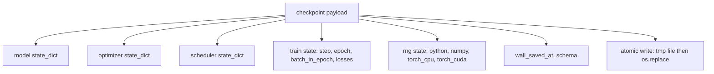
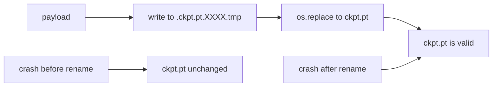
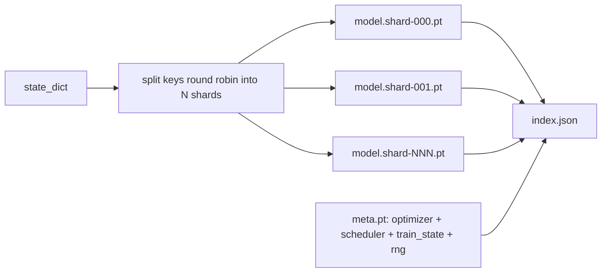

# Point de contrôle 保存与恢复

> 训练中断会杀死运行;checkpoint 让它们可以继续;; 原子化保存模型、优化、调度器、Loss history、step counter 和 RNG state,这样任何时刻都被终止时,磁盘都会留下一个有效文件──

**Type:** Build
**Languages:** Python
**Prerequisites:** Phase 19 lessons 42 to 45
**Time:** ~90 minutes

## Objectifs d'apprentissage

- La capacité d'un entraînement complet est de capturer une charge utile unique, pour qu'elle puisse être rechargée dans un nouveau processus.
- Utilisez la méthode de renommée de temps pour obtenir un sauvetage atomique, assurez-vous que le crash ne restera jamais écrit jusqu'à la moitié du fichier.
- Restituer l'état RNG de Python、NumPy 和 PyTorch, pour reprendre 后的损失 匹配未中断的基线──
- Pour ne plus pouvoir mettre dans un modèle de fichier unique, construire une mise en page de point de contrôle fragmenté, contenant des fragments de validation hash et un index JSON.

##  problématique

Vous avez mis en place une tâche de formation, prévue pour 18 heures. Le temps de fonctionnement est de 4 heures. Le cluster est redémarré, car un autre plus haut niveau de rémunération que vous a approuvé la mise à niveau du noyau.

L'artéfact exact est un seul document, dans lequel il est conservé tout ce dont vous avez besoin pour continuer à vous entraîner: paramètres de modèle, état optimisateur, état planificateur, utilisé pour tracer l'histoire de perte, étape actuelle et époque ainsi que les compteurs de lot-en-epoque, ainsi que chaque casualité source de l'état RNG.

Atomic save est l'autre moitié de ce contrat. L'écriture directe dans le fichier final signifie que le crash s'est produit en cours d'écriture; resume va être lu dans la poubelle.

## 概念



### 5 seins d' état

| Bucket | 为什么重要 |
|--------|------------|
| Model | Weights 和 buffers；也就是 model 本身。 |
| Optimizer | Momentum 和 adaptive moments；没有它们，下一步就是另一个 Optimization 问题。 |
| Scheduler | Learning rate 在 curve 上的位置；cosine schedules 尤其在意这一点。 |
| Train counters | Step、epoch、batch-in-epoch，以及绘制 dashboard 的 Loss history。 |
| RNG state | 为 dropout、data shuffling，以及 model 内部的任何 sampling 提供 determinism。 |

### Réservation atomique



两条规则──第一, le document provisoire doit être situé dans le même catalogue de la cible, de sorte que le renom 才会停留在同一个文件系统内; transversale renom 设备 不是原子的──第二, le nom provisoire doit être unique pour chaque tentative, éviter que deux écrivains 相互覆盖──

### Points de contrôle déchiquetés

Lorsque le modèle 变大时, la charge utile du seul fichier deviendra trop grande, le chargement ne sera pas assez rapide, la vérification ne sera pas facile, et le partage du réseau 读取中途动时非常痛苦── la solution est de décomposer les paramètres en fragments, d'écrire dans un petit index, de les connecter ensemble──



Index  enregistrer le nombre de fragments  chaque fragment de la forme 256, ainsi que la forme 256 du fichier méta ⋅ Lorsque tout hachage ne correspond pas, le chargement va clairement échouer ⋅ Les fragments peuvent être placés sur différents disques physiques ⋅ méta ⋅ très petit, ⋅ lire d'abord ⋅

### Résumé de l'époque Midway Continu

Pour commencer, il faudra perdre du temps de quelques minutes à une journée.`(epoch, batch_in_epoch)`Après, la boucle d'entraînement va générer des nombres aléatoires, rapidement, au cours de l'époque actuelle, des lots déjà consommés, puis de`batch_in_epoch`⇒ Continuer. ⇒ Le code de cours a bien accompli ce point; affirme que la trajectoire de perte de la suite de la reprise correspond à la ligne de base de l'interruption.


```figure
cc-atomic-checkpoint
```

## Faites-le

`code/main.py`Je vous propose quatre primitifs et un pilote de démonstration.

### Étape 1: 捕获并恢复 l' état du RNG

`capture_rng_state`Retour à un dicton, contenant Python `random.getstate`、NumPy de `np.random.get_state`, ainsi que des cycles de CPU PyTorch et CUDA RNG.`restore_rng_state`Le tensor du processeur est un tampon de 8 octets, le RNG de PyTorch sait comment le consommer.

### Étape 2: sauvegarde atomique

`atomic_save`Va charger dans le répertoire de la cible du fichier Temp, puis utiliser`os.replace`Le nom de la ville est le nom de la ville.`atomic_write_json`Pour l'index fragmenté  Exécuter la même opération 

### Étape 3: 完整检查站回程

`save_checkpoint`Pour le modèle, l'optimisateur, le planificateur, l'état du train, et le RNG,`load_checkpoint`Revenir à la vie, et revenir à la vie.`TrainState`◊ champ de schéma est le crochet de mise à niveau: futurformate变化会递增版本 string, tandis que le chargement 会进行发送──

### Étape 4: variante en morceaux

`save_sharded_checkpoint`À l'aide de la méthode de round-robin, les touches de paramètre sont réparties en N 个 shards, en utilisant leur propre save atomic 写入每个 shard,写入一个包含优化器,计划器和火车状态的地图文件,并写入包含 shard sha256的JSON索引.`load_sharded_checkpoint`Il va se fusionner.

### Étape 5: démo de résumé

`run_resume_demo`Il va être un petit modèle`total_steps`, dans le`interrupt_at`保存 point de contrôle, puis continuer à fonctionner。 Deuxième processus 会恢复点检查并运行剩余步骤──该函数 返回断点 之后两条损失轨迹最大绝对差──有RNG恢复,差异为零或浮点噪声──

Je vais le faire.

```bash
python3 code/main.py
```

Les démos et les documents fragmentés sont tous des conclusions maximales.`outputs/resume-demo.json`Il y a une autre.

## Utilisez-le

生产训练会把检查点 作为教练的一部分交付──形状相同:model + Optimizer + Scheduler + Counter + RNG,以原子方式写入,并按步名,便于找到最新文件──Sharded layouts 通过并行阅读 支持大型模型加载;`index.json`C'est une partie de la réussite.

Il faut exécuter trois modes:

- **Schema 是 payload 中的一个 string。**Les migrations sont basées sur la même structure. Sans elle, vous ne pouvez pas évoluer dans des conditions qui ne détruisent pas les anciennes opérations.
- **对每个 shard 计算 Sha256。**Le téléchargement est le pire bug; le téléchargement doit être rapide ou tard.
- **让 checkpoint cadence 保持诚实。**Chaque étape est sauvegardée une fois, et chaque minute de plusieurs heures de travail est sauvegardée une fois, et les autres sont réduites à un certain nombre de minutes.

## La faire partir

`outputs/skill-checkpoint-save-resume.md`Il s'agit d'un nouveau script de formation: forme de charge de paiement, écriture atomique, capture de RNG, index de stockage.`save_checkpoint`, au démarrage connexion `load_checkpoint`On peut tuer.

## Exercices

1. Uzz selon le groupe paramètre 分片 substituer la déchiquetage ronde-robin`.weight`结尾的层 vs `.bias`Quand est-ce que chaque plan est plus adapté ?
2.  Élargir la boucle de sauvegarde, conserver les derniers points de contrôle K 个, et nettoyer les plus anciens ⋅ lorsque le disque 很小时, adapté de K 个是多少?
3. - Je suis là.`--ckpt-every-seconds`flag, selon l'intervalle de l'horloge du mur 触发保存, et non seulement selon le nombre d'étapes.
4. Ajouter un chemin de vérification de la somme de contrôle, dans le démarrage de la mise en service, chaque point de contrôle dans le répertoire de la recherche, et rapporter ce qui a été corrompu.
5.  réaliser un `migrate_v1_to_v2`fonction, vers la charge utile 添加一个新字段,并递增图谱串──让载 同时兼容两个版本──

## Les termes clés

| Term | 人们常说 | 实际含义 |
|------|----------|----------|
| Atomic save | “写入然后祈祷” | 写入同一目录中的 temp file，然后用 os.replace 放入 target name |
| State dict | “Weights” | Model parameters 和 buffers，按 parameter name 作为 key |
| Sharded checkpoint | “大 model file” | 多个文件，每个 shard 一个，加上一个 meta file 和一个包含 sha256 的 JSON index |
| RNG state | “Random seed” | python random、numpy、torch CPU、torch CUDA 的捕获状态；不只是 seed |
| Mid-epoch resume | “Restart” | 快进 RNG，并从同一 epoch 中的下一个 batch 继续 |

## Pour en savoir plus

- POSIX `rename`La sémantique, pour le support`os.replace`La revendication d'atomisation dépendante
- PyTorch  À propos de `torch.save`et `torch.load`                                                                                                                                                                                                                                                                                                                                                                                                                                                                                                                             `map_location`Il y a une autre.
- La phase 19 de la leçon 46 couvre la charge utile des points de contrôle de cette classe qui peut être accumulée en gradients.
- La phase 19 de la leçon 48 couvre le format de dictée d'état de la compatibilité du présent programme avec les emballages distribués de la gestion.
- Le noyau Linux `fsync`documentation, pour expliquer le renom atomic 背后的耐久性保证──
