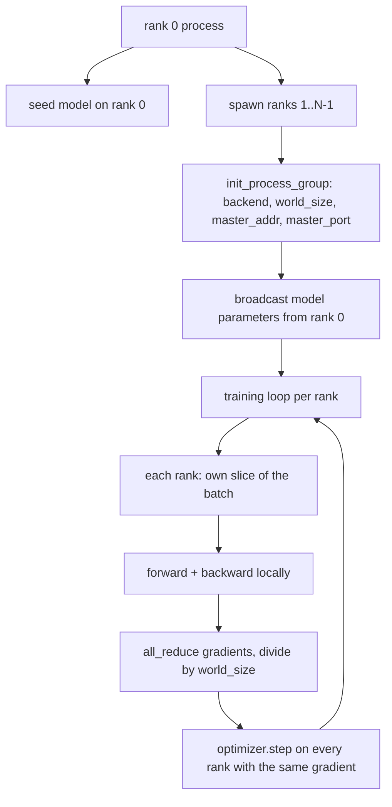
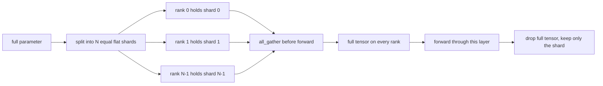

# De la conception de données parallèles distribuées et FSDP

> L'entraînement multi-ranks est deux règles collectives et un principe de base.

**Type:** Build
**Languages:** Python
**Prerequisites:** Phase 19 lessons 42 to 45
**Time:** ~90 minutes

## Objectifs d'apprentissage

- Utilisation `gloo`Backend 启动跨 N 个级的过程组,不需要特殊硬件──
- 实现 un minimum d'emballage DDP, en construisant des paramètres de diffusion, et en réduisant les gradients en arrière 后
- prova per-rank gradients  all-reduce 匹配 concatenated input  上的单进程梯度
- 勾勒 FSDP paramètre fragmentation: chaque rang 持有一个片,前进通过 时收集全 tensor,后落──

##  problématique

模型能放进一个设备──数据设置 放不下──优化预算 要求你在每秒钟内看N 倍样本──第一个杆是数据平行:每个级别在批次的不同片上运行同一个模型,然后在优化步骤前的平均梯度──第二个杆是FSDP:模型本身也放不进一个设备,所以每个级别都持有每个参数的一部分,并通过 期间逐层重建全子──

Si les paramètres dérivent entre les rangs, cette fois, la course sera silencieuse et corrompue. Si vous avez des gradients moyens mais pas de perte moyenne, le tableau de bord se trompe. Si le backend collectif ne peut pas s'entendre sur la topologie, la course sera toujours suspendue.

Le cours est en cours de mise en œuvre.`gloo`L'arrière-plan avec chaque PyTorch construit un déploiement,并接受 `torch.multiprocessing`travailleurs; la même partie de code est changée à plusieurs nœuds GPU`nccl`时, la structure n'a pas besoin de changer.

## 概念



###  Deux collectifs importants

| Collective | 做什么 | 何时使用 |
|------------|--------------|------|
| `broadcast` | 将一个 tensor 从一个 rank 复制到所有其他 rank | Parameter init、scheduler state、任何 one-to-all sync |
| `all_reduce` | 在所有 rank 间对一个 tensor 求和（或 mean、或 max），每个 rank 都得到结果 | Backward 后的 Gradient averaging |
| `all_gather` | 每个 rank 贡献一个 tensor，每个 rank 都得到 concatenation | Logits collection、FSDP parameter unshard |

Le contrat de DDP est de construction`broadcast`- Je suis en retard.`all_reduce`❖ L'ébauche du FSDP dans chaque étage avant passe 前加入 `all_gather`Il y a une autre.

### Gradient moyen 匹配 gradient de processus unique

Dans N 个级 上使用B 个样本的批量 训练模型,必须产生与单个过程在N*B的批量 上训练相同的梯度──是对每级梯度 求和并除以N,将得到平均损失梯度,这正是减少交叉 Entropy的平均减少在全批量 上会产生的结果──Lesson code 会在手动全减梯度和参考单进程梯度之间断定`max-abs-diff < 1e-3`Il y a une autre.

### Scénario du FSDP



La mémoire gagne est précise: par paramètre de rang mémoire réduit à 1/N。 le prix est de rassembler, chaque fois que le passage en avant doit être payé。 la production FSDP Réunion se rassemblera avec la superposition de calcul de la première couche, donc le coût du mur de comparaison avec le simple calcul de la prédiction de la petite part。

### CPU et arrière-plan sombre

CUDA est la cible de production, mais la CPU a également les mêmes chemins de code.`gloo`C'est le backend collectif du processeur.`nccl`Il y a quelques niveaux de quantité, mais la surface de l'API est complètement la même.`backend="gloo"`Initiation,并用 `torch.multiprocessing`rangs de reproduction, plutôt que `torchrun`Les deux sont finalement utilisés de la même façon.`torch.distributed` Dans le nœud multi-GPU, la seule variation est `backend="nccl"`、Tensors de l'appareil, ainsi que l'utilisation `torchrun`- Je suis en train de le faire.


```figure
cg-allreduce-ring
```

## Faites-le

`code/main.py`C'est un artefact qui peut être transporté.

### Étape 1: Groupe de processus d'initiation

```python
os.environ["MASTER_ADDR"] = "127.0.0.1"
os.environ["MASTER_PORT"] = str(port)
dist.init_process_group(backend="gloo", rank=rank, world_size=world_size)
```

`MASTER_ADDR`et `MASTER_PORT`C'est un rendez-vous: chaque rang est connecté au même hôte.

### Étape 2: construction 时 émission

`MinimalDDP.__init__`遍历每个参数 和缓冲,并调用 `dist.broadcast(tensor, src=0)`◊ La valeur du rang 0 devient init canonique. Pas cette étape, chaque rang utilisera sa propre semence, rangée de la première étape à la divergence.

### Étape 3: Retour en arrière 后 tout réduire les gradients

```python
def all_reduce_grads_(module, world_size):
    for p in module.parameters():
        if p.grad is None:
            p.grad = torch.zeros_like(p.data)
        dist.all_reduce(p.grad.data, op=dist.ReduceOp.SUM)
        p.grad.data.div_(world_size)
```

Chaque rangement obtient finalement le même gradient moyen. L'étape d'optimisation est maintenant basée sur la même entrée de fonction de chaque rangement, c'est la raison pour laquelle les paramètres restent synchronisés tout au long de la course.

### Étape 4: preuve d'équivalence

`manual_all_reduce_matches_single_process`Dans le rang 0 , construire un modèle, et comparer le gradient post-tout-réduire avec le gradient de processus unique dans les entrées concaténées.

### Étape 5: Voyage aller-retour du FSDP

`fsdp_round_trip_sketch`Applanifier chaque paramètre, accrocher jusqu'à`world_size`Le nombre de fois, la tranche, le tout-ensemble, la reconstitution de chaque rang est identique à l'original.

运行:

```bash
python3 code/main.py
```

默认 la taille du monde est de 2 ⋅ 2 CPU processus spawn, par`gloo`相互通信,并以零 退出──输出 `outputs/ddp-demo.json` capturer les sommes de paramètres de chaque rang ∞ tous réduire ∞ la norme de gradient ∞ le résultat de l'aller-retour de la FSDP, ainsi que la différence de gradient manuel versus référence ∞

## Utilisez-le

Les stacks de formation de production 调用相同原始人──PyTorch 的 `DistributedDataParallel`增加了: post-backward gradient hooks, utilisés pour réduire tout et recouvrir l'arrière; bucketed all-reduce, seront plusieurs petits gradients 合并为一次集体; ainsi que leçon 46 使用过的 `no_sync`le contexte

FSDP de PyTorch  augmenté: pour chaque niveau une vue de paramètre plat, permettez à chaque rang  détenir un tampon contigu; la couche inférieure non déchiffrée avec la couche actuelle de calcul; ainsi que la décharge de CPU déchiffrée optionnelle 

形状保持不变: démarrage de la diffusion, retrocédation 后降低, paramètres 放不下时进行分片──

## La faire partir

`outputs/skill-distributed-fsdp-ddp.md`携带新训练脚本 的配方: 用 `gloo`Initialement du groupe de processus du CPU, utilisez `nccl`Initier le groupe de processus de la GPU, le modèle 包 dans la coque DDP, pendant la construction 播放并在后退 后减少,按需使用FSDPsketch 中的全_gather pattern对参数 分片──

## Exercices

1. Utilisation `--world-size 4`运行,并确认整个运行 中参差 保持在 1e-3 以下。
2. Pour la moyenne manuelle 替换为 `dist.all_reduce(op=dist.ReduceOp.AVG)`Il y a une différence de temps.
3. Donnez à l'emballage DDP  Ajouter un crochet post-rétrograde, laissez tout-réduire avec le reste de l'arrière-plan de chevauchement; mesure du mur  amélioration。
4. 实现 FSDP re-shard step:forward pass 后, encore une fois avec local shard  substituer le tensor complet── confirmer par rang mémoire 下降──
5. Dans CUDA 机器上将后端 换为 `nccl` enregistrer les variables environnementales qui changent, celles qui restent inchangées.

## Les termes clés

| Term | 人们的说法 | 实际含义 |
|------|-----------------|------------------------|
| Backend | "gloo or nccl" | 实现 collective ops 的 library；gloo 是 CPU，nccl 是 GPU |
| World size | "Total ranks" | group 中的 process 数量；group 是 collectives 操作的 unit |
| Rank | "Worker id" | group 内的 process identifier，从零开始索引 |
| All-reduce | "Sum the grads" | 在所有 rank 间对一个 tensor 求和，每个 rank 最终得到相同结果 |
| Unshard | "Gather the params" | 通过 all_gather 从 per-rank slices 重建 full tensor |

## Pour en savoir plus

- PyTorch `torch.distributed`La documentation, la connaissance de la sémantique collective de cette classe
- `gloo`Liste collective de bibliothèques, sa forme et le soutien de la CUDA `nccl`Les primitifs sont les mêmes.
- L'étape 19 de la leçon 46 est de comprendre le DDP total`no_sync`Modèle d'accumulation de gradients
- Leur formation est basée sur la formation de la formation professionnelle.
- PyTorch FSDP documentation, connaître ici le schéma de la mise en œuvre de la production de la fragmentation des paramètres.
