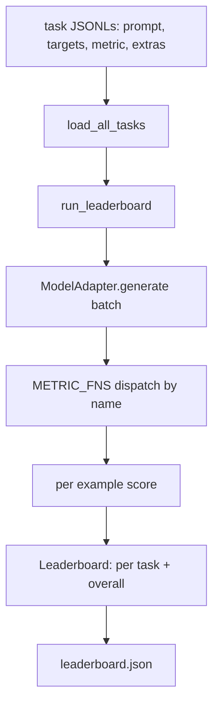
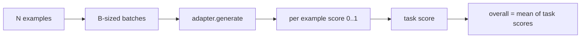

# 语言模型评测 Harness

> Si un modèle fonctionne bien sur une tâche que vous ne pouvez pas définir, il se produit bien par hasard.

**Type:** Build
**Languages:** Python
**Prerequisites:** Phase 19 lessons 42 to 45
**Time:** ~90 minutes

## Objectifs d'apprentissage

- Pour définir une tâche en JSONL 文件, chaque exemple contient `prompt`- Je suis là.`targets`- Je suis là.`metric`, ainsi que les options `extras`Il y a une autre.
- 实现五个指标:exact match、rouge-l F1、exécutable check、multiple choice 和 substring contient。
- Construire un coureur, par tâche  échantillons de traitement en série,并分发给可替换的模型适配器──
- 输出 leaderboard JSON, contenant le score de chaque tâche, la latence, ainsi que la moyenne globale de la tâche.

##  problématique

Chaque semaine, un nouveau modèle de langage apparaît. Le marketing dit qu'il fonctionne bien. La question est: dans quel domaine fonctionne-t-il bien ? La réponse est la liste de classement que vous écrivez vous-même, car la liste de classement des fournisseurs est celle qu'ils ont réussi à améliorer.

Si votre repo n'a pas de harnais, vous ne pouvez que comparer deux modèles avec un harnais. Si vous avez un harnais, vous pouvez comparer des tâches fixes avec des métriques fixes, et obtenir des résultats JSON différents.

陷是让harness 过适合单个模型──修复方式是反过来使用同一个陷:harness 小到十五分钟能读完,任务小到可以随随 repo 发布, métriques de zéro编写以便同事审计,而适配器是唯一放置模型特定代码的地方──替代适配器,leaderboard 会变;替代任务,leaderboard 会变――其他一切不应该变──

## 概念



### Spécifications des tâches

Chaque exemple est une ligne JSONL:

```json
{"id": "arith-00", "prompt": "compute: 2 + 2", "targets": ["4"], "metric": "exact_match"}
```

Pour les mesures de besoin de points d'assistants,`extras`携带旁路 payload:

```json
{
  "id": "code-00",
  "prompt": "python: write a function f that doubles its input",
  "targets": ["ok"],
  "metric": "code_exec",
  "extras": {"io_pairs": [[1, 2], [3, 6]]}
}
```

Une tâche est de`outputs/tasks/`Une de la dernière .`.jsonl`文件──文件名就是任务名── 一文件中的所有例子 共享同一个指标──

### 五个 tâches de fixation

| Task | Metric | 测试内容 |
|------|--------|---------------|
| arithmetic | exact_match | 对确定性答案的 Token 级正确性 |
| summary | rouge_l | 针对单行 reference summary 的 longest common subsequence F1 |
| code-exec | code_exec | 可执行测试：预测出的 function 必须满足一组 input-output pairs |
| multiple-choice | multiple_choice | prediction 的首字母必须匹配允许的 letter |
| generation | substring_contains | Free-form text 必须包含至少一个 target substring |

### Contrat métrique

Chaque métrique est une fonction:`(prediction, targets, extras) -> float in [0.0, 1.0]` L'utilisation de scores par exemple 取平均得到任务分,再对任务分 取平均得到总体── Les fonctions métriques sont très petites:

- `exact_match`:转小写、折叠 white space、判断 equality──
- `substring_contains`: la même normalisation, faire le test de sous-chaîne。
- `multiple_choice`Il a écrit son premier personnage.
- `rouge_l`: longueur de LCS à l'exclusion de la prédiction et de la longueur de référence, de la précision du calcul et du rappel de F1。
- `code_exec`: dans le espace de noms limité, exécuter la prédiction, pour chaque paire d'entrée-sortie 调用 `f(x)`, les statistiques correspondent à la même chose.

code_exec métrique 会在精简后的内置名字空间 中运行预测──本课的测试 断言 `import os`Ça va pas, parce que...`os`Vous ne pouvez pas accéder au système de fichiers à partir de la prédiction de code.

### Modèle d'adaptateur

```python
class ModelAdapter(Protocol):
    def generate(self, prompts: Sequence[str]) -> List[str]: ...
    @property
    def name(self) -> str: ...
```

L'adaptateur est 接点──本课提供 `ToyAdapter`, c'est un matcher de motifs de détermination, va être composé de cinq tâches fixes parmi chaque prompt 返回正确答案──真实适配器 会调用模型并返回输出──Harness 不关乎是哪个──

### Coureur

`run_task`Chaque lot de traitement`batch_size`个 prompts,并分发给 métrique fonction`run_leaderboard`遍历每一个任务并求平均──`write_leaderboard`输出带 schema string 的 JSON,这样未来格式 变化不会静默破坏仪表板──




```figure
eval-harness-matrix
```

## Faites-le

`code/main.py`C'est un artefact qui peut être transporté.

### Étape 1: tâches de fixation des graines

`seed_fixture_tasks(target_dir)`Je suis en train de vous écrire .`.jsonl`文件──第一次运行 `main.py`Si le dossier est vide, il semera ces documents.

### Étape 2: tâches de chargement

`load_all_tasks(task_dir)`读取每个 `.jsonl`,并返回 de la tâche nom à `Example`Les enregistrements de la liste`#`Les lignes de commentaires ouvertes et les lignes vides seront saisies, de sorte que les contributeurs peuvent commenter ces fichiers.

### Étape 3: mise en œuvre des mesures

Chaque métrique est une petite fonction, et comporte un test unitaire.

### Étape 4: écrire le coureur

`run_task`代 lots,并生成一个 `TaskResult`, qui contient le score, le nombre correct, le nombre total et la latence.`run_leaderboard`遍历所有任务,并生成带总平均 的 `Leaderboard`Il y a une autre.

### Étape 5: émettez JSON

`write_leaderboard`Conseil de la coordination`--include-per-example`flag 会导出每例记录, de sorte que lorsque les scores 变化, vous pouvez faire des prédictions différente de la première fois de la course.

Je vais le faire.

```bash
python3 code/main.py
```

脚本第一次运行时会种子装置,用玩具适配器(它会对每个装置进行反应)打分,并写入 `outputs/leaderboard.json` utilisation de l'adaptateur de jouets 时 score global est de 1,0;`test_main.py`Le test de l'adaptateur de boutons a montré que l'adaptateur ne pouvait pas répondre, alors le même harnais produirait 0,0

## Utilisez-le

Pour entrer dans le modèle réel, écrivez un adaptateur.

```python
class HttpAdapter:
    name = "vendor.v1"

    def __init__(self, endpoint, api_key):
        self.endpoint = endpoint
        self.api_key = api_key

    def generate(self, prompts):
        out = []
        for prompt in prompts:
            response = http_post(self.endpoint, prompt, self.api_key)
            out.append(response["text"])
        return out
```

Dans le`main()`Le top !`ToyAdapter`替换成 `HttpAdapter`Les emplois, les tâches, les mesures et le tableau de bord sont toujours les mêmes.

Lorsqu'un harnais est publié dans un projet réel, trois modes sont nécessaires:

- **Pin task files。**leaderboard.json Vous devez porter le contenu de la tâche hash-pinned, vous devez porter JSONLs; sinon le fichier de tâche un changement de score va changer, et vous ne pouvez pas juger lequel a changé.
- **Diff predictions，不只是 diff scores。** `--include-per-example`Le drapeau peut vous laisser voir le score.
- **限制 batch size。**Les adaptateurs ont des limites de tarifs.

## La faire partir

`outputs/skill-lm-eval-harness.md`携带食谱:JSONL task spec,5 métriques 可替换适配器 批发运行员 带方案字符串的排行榜 JSON。`outputs/tasks/`Les fichiers de tâches sont des fichiers; les copier dans un projet réel comme point de départ.

## 练习

1. 添加第六个任务,并使用您从零编写的自定义测量(类似Bleu的重叠、类似BleuT的参考分数,或任何合同的清晰的东西)
2. 扩展 `code_exec`, capture de la déficience,并 accepter un groupe de déficiences attendues 作为目标──
3. 添加一个排名单差命令:给定两个 `leaderboard.json`文件, imprimer quelles tâches ont changé et quelle est la taille des changements.
4. limitation de chaque exemple de latence― utiliser une appel d'adaptateur de temps d'arrêt  emballage; exposer un individu dans le tableau de leader `timeouts`Colonne:
5. Dans le tableau de classement, utilisez le contenu de tâches de sha256 afin que les lecteurs du futur puissent vérifier qu'ils évaluent les mêmes tâches.

## 关键术语

| Term | 人们的说法 | 实际含义 |
|------|-----------------|------------------------|
| Task spec | “eval format” | JSONL 文件，每个 example 包含 prompt、targets、metric 和可选 extras |
| Metric | “你怎么打分” | 从 (prediction, targets, extras) 到 [0, 1] 内 float 的函数 |
| Adapter | “model client” | 带有 generate(prompts) -> list[str] method 的对象；唯一的模型特定代码 |
| Leaderboard | “scoreboard” | 包含 per-task scores、total counts、latency 和 overall average 的 JSON |
| Code exec metric | “运行它并检查” | 在受限 namespace 中执行 prediction，并与 input-output pairs 比较 |

## 延伸阅读

- L'utilisation de l'im-évaluation-exploitation peut être considérée comme une référence de classe de production, de taille beaucoup plus grande, mais de forme identique.
- La lumière de HuggingFace est une autre réalisation du même contrat.
- La phase 19 de la leçon 46 couvre les modèles d'accumulation de gradients utilisés dans la pile d'entraînement de harnais 评测
- La phase 19 de la leçon 47 couvre le format de checkpoint ciblé par vos évaluations;
- La phase 19 de la leçon 48 couvre la formation distribuée de la génération de modèles testés.
