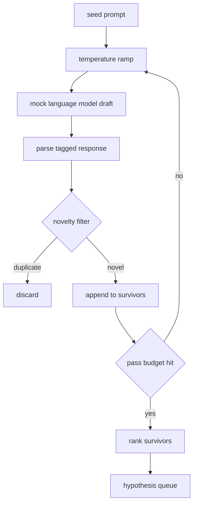

# Générateur d'hypothèses

> Un agent de recherche si il pose le même problème deux fois, c'est un jeton de gaspillage.

**Type:** Build
**Languages:** Python
**Prerequisites:** Phase 19 Track A lessons 20-29
**Time:** ~90 分钟

## Objectifs d'apprentissage
- De la semence prompt drive sample, il va transformer sa production 转成带类型的假设记录──
- En chaque passage, la température de l'échantillon augmente, la prochaine ébauche se déplace plus loin que la précédente.
- Utilisez un modèle de mise en place et un seuil de distance cosine.
- Utilisation de la fonction de notation de la nouveauté, de la spécificité et de la vérifiabilité mixte pour le classement des projets de réserve.
-  Que chaque étape reste déterminée, de sorte que la même graine  produit toujours la même queue

## Pourquoi m'as-tu fait ça ?

Un planificateur  convoque un modèle une fois, il n'obtient qu'une hypothèse― c'est un exemple travaillé pour ne pas poser de problème― mais pour le cycle de recherche, il faut une file d'attente de façon profonde, de sorte que lorsque la première hypothèse  échoue, le coureur  est prêt pour la prochaine, sans avoir à payer à nouveau le coût d'un échantillonnage complet pass―

Deux idées se combinent pour créer cette file d'attente. La première est une augmentation de la température: chaque fois que le échantillon passe, la température augmente de 1 point, laissez le projet suivant aller. La deuxième est une nouvelle filtration: chaque projet, le générateur mesure la distance de mise en place de chaque survivant précédent, et rejette tout contenu de l'intérieur du cluster.

Cette moque est destinée à une séquence de jetons de retour de scripting.

## Hypothèse 形状

```text
Hypothesis
  id             : int           (monotonic within a run)
  text           : str           (the claim)
  variables      : list[str]     (what changes between conditions)
  metric         : str           (what the runner will measure)
  baseline_ref   : str | None    (which paper or run the comparison cites)
  draft_pass     : int           (which sampler pass produced this)
  temperature    : float         (the sampler setting at draft time)
  novelty_score  : float         (distance from prior survivors, 0..1)
  rank_score     : float         (weighted sum used for ordering)
```

`variables`et `metric`Il est également possible de lire ces passages directement dans la configuration de l'expérience.

`baseline_ref`Il est possible, mais il est recommandé de fournir. Le évaluateur de la cinquantaine de cours a besoin d'une ligne de base pour effectuer une comparaison. Si l'hypothèse est omise, l'évaluateur reviendra à la même métrique de la première fois.


```figure
cg-novelty-ramp
```

## 架构



Cette boucle est très directe.

## Rampe de température

De `t_min`- Ça commence.`t_max`- Je suis en train de faire un pas.`(t_max - t_min) / (n_passes - 1)` chaque passage à la température actuelle `GeneratorConfig.schedule()` générer `n_passes`个均间隔的值──mock model 通过在一小组按 `(prompt, temp_bucket)`索引的脚本化反应 之间切换来遵守温度──桶是开区间,因此温度的小幅变化会选择不同桶,并产生不同的草案──在生产中,样品会是真实模型,并传入`temperature=t`Il y a une autre.

默认 schéma est de `0.2`À la`1.2`Il y a six passes à remplir la file d'attente, sans avoir à payer pour le filtre de nouveauté.`0.2`时,model 会复述种子──高于 `1.2`时,response 往往偏离主题并导致 parser 失败。

## Filtre de nouveauté

Chaque projet est analysé, le générateur va intégrer le texte,并与每个已接受的假设比较.`1 - dot(a, b)`Si le projet atteint un survivant, la distance minimale est supérieure à`novelty_threshold`Il est passé par là.`0.25`Il y a une autre.

L'intégration hashée n'est pas élevée. Elle est déterminante, dépendante, et suffit à capturer les situations évidentes: deux projets.

## Score de rang

```text
rank_score = w_novelty * novelty_score
           + w_specificity * specificity_score
           + w_testability * testability_score
```

Trois sous-notes.`novelty_score`C'est la distance de mise en place minimale du survivant précédent.`specificity_score`est l'hypothèse de la quantité de variable spécifique déduite du nombre de cibles.`testability_score`Dans l'hypothèse avec le temps spécifié métrique 和 baseline 时为一, seulement spécifié métrique 时为二分之一, sinon pour zéro.

默认权重是  réellement`0.4`- Je suis là.`0.3`- Je suis là.`0.3` Le pouvoir se trouve dans la configuration du générateur, donc les cours de sous-jeu peuvent les ajuster, sans avoir à forger le code 

## Modèle de langue de simulation

```python
class MockLLM:
    def sample(self, prompt: str, temperature: float, seed: int) -> str:
        ...
```

- Je suis sûr .`(prompt, temperature, seed)`Triple, l'échantillon est déterminant.`(prompt_signature, temperature_bucket)`Tableau de réponse scripturalisée de l'indexation. Si la table ne contient pas une entrée de clé, le échantillon reviendra à un qui permettra au parseur de faire un retour en arrière.

Les graines vont se mélanger à la réponse, donc avec un `(prompt, temperature)`Les semences sont réellement produites par des semences différentes.

## Cote de sortie

输出是按 `rank_score`降序排序 du`Hypothesis`record 列表──第五十二课中的跑者 弹出头,运行实验,第五十三课中的评价者 写回判决──如果判决说假设 错了, runner 就弹出下一个──

La file d'attente est limitée. Lorsque le temps est écoulé, l'orchestre peut augmenter le temps de semis et redémarrer le générateur, ou arrêter de signaler l'épuisement du budget.

## Comment lire la code

`code/main.py` définition `Hypothesis`- Je suis là.`MockLLM`- Je suis là.`HypothesisGenerator`Et une démonstration de certitude. Générateur de détection.`run(seed_prompt)`méthode, retour à la file d'attente; compte de passage de `GeneratorConfig.n_passes`读取,而不是作为一个论点 传入──embedding 是一个的代币. 读取,而不是作为一个论点. 传入──embedding 是一个的代币.`numpy`Le calcul est purement simple, donc le cours reste portable.

`code/tests/test_generator.py`覆盖 linear path、duplicate rejection path、parser failure path、temperature ramp boundary 和 ranking。

## Il est connecté où

第五十三课读取两者的成果并写出判决── 第五十一课取队列的头并运行文学搜索来确认或反驳它── 第五十二课取同一个头并运行实际实验── 第五十三课读取两者的成果并写出判决── 第五十一课组组组组合成一个没有人参与的研究循环;人可以在任何边界介入──
