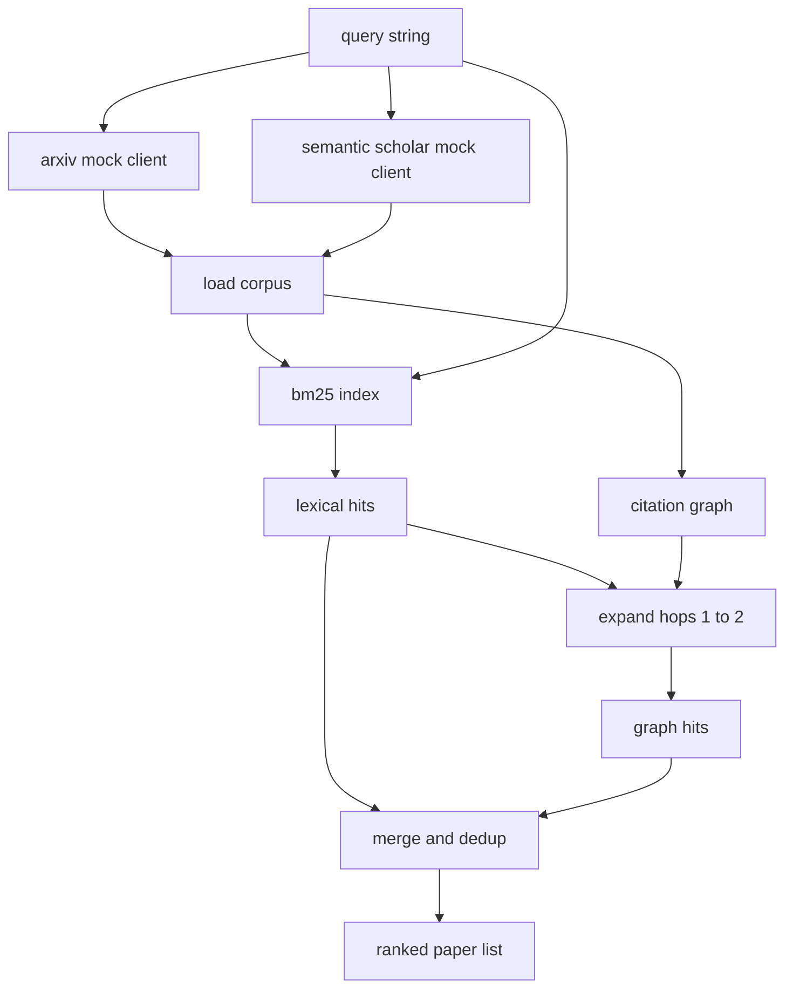

# 文献检索

> Une hypothèse  très bon marché  savoir si quelqu'un l'a déjà prouvée, c'est la partie la plus chère  construire une couche de récupération, avant que le coureur  lance la boîte à sable  répondre à cette question 

**Type:** Build
**Languages:** Python
**Prerequisites:** Phase 19 Track A lessons 20-29
**Time:** ~90 分钟

## Objectifs d'apprentissage
- Avec un petit dossier papier,
- Il suffit d'utiliser des statistiques de structure, en abstracts, de construire un indice BM25.
- 遍历引用图,浮现词典搜索 遗漏的论文──
- 通过稳定的纸 id,对词典和图 两轮命中结果去重──
- Deux faux API externes sont emballées dans un seul client, à l'arrière, de sorte que les points d'extrémité réels sont connectés.

## Pourquoi avoir besoin de deux roues de récupération

Pour les abstracts faire une recherche de mots clés, reviendra avec la requête. Ces documents couvrent la plupart des situations de surface. Mais il va manquer deux types de situations.

Le résumé de la première partie de la série est la rédaction de la série de séries de séries de séries de séries de séries de séries de séries de séries de séries de séries de séries de séries de séries de séries de séries de séries de séries de séries de séries de séries de séries de séries de séries de séries de séries de séries de séries de séries de séries de séries de séries de séries de séries de séries de séries de séries de séries de séries de séries de séries de séries de séries de séries de séries de séries de séries de séries de séries de séries de séries de séries de séries de séries de séries de séries de séries de séries de séries de séries de séries de séries de séries de séries de séries de séries de séries de séries de séries de séries de séries de séries de séries de séries de séries de séries de séries de séries de séries de séries de séries de séries de séries de séries de séries de séries de séries de séries de séries de séries de séries de séries de séries de séries de séries de séries de séries de séries de séries de séries de séries de séries de séries de séries de séries de séries de séries de séries de séries de séries de séries de séries de séries de séries de séries de séries de séries de séries de séries de séries de séries de séries de séries de séries de séries de séries de séries de séries de séries de séries de séries de séries de séries de séries de séries de séries de séries de séries de séries de séries de séries de séries de séries de séries de séries de séries de séries de séries de séries de séries de séries de séries de séries de séries de séries de séries de séries de séries de séries de séries de séries de séries de séries de séries de séries

## Papeur 形状

```text
Paper
  id          : str           (稳定 identifier，mock corpus 中为 "p001")
  title       : str
  abstract    : str
  year        : int
  authors     : list[str]
  references  : list[str]     (这篇 paper 引用的 paper ids)
  citations   : list[str]     (引用这篇 paper 的 paper ids)
  source      : str           (提供它的 mock api，"arxiv" 或 "s2")
```

Les références et les citations 字段形成有向引用图── deux faux API 返回的字段有重叠但不完全相同,因此 corpus loader 会按 `id`Pour les prendre et les rassembler.


```figure
cg-citation-hops
```

## Architecture



client de récupération 拥有这两轮和 merge──caller 传入一个查询,并拿回一个排名列表; dont chacun des条目都携带每纸分数 字段(`bm25_score`- Je suis là.`graph_distance`- Je suis là.`recency_score`- Je suis là.`final_score`), pour expliquer la répartition.

## De zéro réalisation BM25

实现使用标准 Okapi BM25,默认参数为 `k1=1.5`- Je suis là.`b=0.75`index est deux dictionnaires:`term -> doc_frequency`et `term -> list of (doc_id, term_count)`◊ longueur du document est abstrait ◊ longueur moyenne du document dans l'index  构建时计算一次──对查询 打分时,会对查询术语 求和:`idf * tf_norm`, parmi lesquels `tf_norm`La fréquence de la fréquence est la norme BM25 长度归一化术语.

Le tokeniser est le premier .`lower`, à nouveau selon les caractères numériques non-écrites divisés. Il n'y a pas de résultat.

```text
idf(t)      = log((N - df + 0.5) / (df + 0.5) + 1.0)
tf_norm(t)  = (f * (k1 + 1)) / (f + k1 * (1 - b + b * dl / avgdl))
score(d, q) = sum over t in q of idf(t) * tf_norm(t)
```

## Traversage du graphique de citation

Graph 会从 corpus 构建一次──Edges avant de l'article indique ses références──Edges arrière de l'article indique ses citations──transversal est la largeur de la première recherche, avec le top BM25 hits pour la semence, le maximum de deux sauts──

两跳是刻意设置的上限──一跳太浅;agent 常常需要直接祖先或后代──三跳会让连接图上的结果规模膨胀,并且很容易偏离主题──本课把跳限 暴露为一个配置键,这样下游循环可以紧紧紧紧它──

## Déduction et classement

两轮会回复重叠集合――merge Utilisez un id papier 作为键── chaque article du papier est un plus-value mix──

```text
final_score = w_bm25 * bm25_score_norm
            + w_graph * graph_score
            + w_recency * recency_score
```

`bm25_score_norm`Le score BM25 est le plus grand score BM25 du groupe combiné.`graph_score`Pour les hits directes léxicaux`0.6`, deux sauts pour `0.3`, sinon pour le zéro.`recency_score`Il est de la rampe de la ligne entre le corps, le plus petit et le plus grand.

默认 poids est `0.5`- Je suis là.`0.3`- Je suis là.`0.2`Les poids sont un paramètre; l'ancien sujet peut réduire la récente, tandis que le sujet qui change rapidement l'améliorera.

## Corpus de faux

Le corps a une centaine de papiers, par`build_corpus()`生成──每篇篇都有一篇手写标题和摘要,主题来自五类之一:attention sparsity、retrieval augmentation、low rank adapters、dataset distillation 和 evaluation harnesses──References 和 citations 已连线,让每个主题都形成一个连接的子图,并带有少量跨主题边缘──

两个 clients API faux`ArxivMockClient`- Je suis là.`SemanticScholarMockClient`)读取同一个 corpus,但暴露不同字段──Arxiv 返回 title、abstract、year、authors──Semantic Scholar 增加引用和引用──retrieval client 按 id 取并集;cross client field disagreement handling 留到后续课程──

## Les leçons 52 et 53 seront lues

Leçon 52 Le coureur du milieu`paper.id`- Je suis là.`paper.title`, ainsi que les trois premières phrases de l'abstrait, dans le contexte de l'expérience.`paper.year`et `paper.references`, la ligne de base sera attribuée à un article spécifique.

client de récupération  retourner à un `RetrievalResult`, qui contient également une liste de classement et par requête: le nombre de hits, la moyenne de scores, la note supérieure, le temps total de paroi, le coureur enregistrera ces contenus, de sorte que le passage d'observabilité peut être tracé au fil du temps.

## Comment lire la code

`code/main.py` définit `Paper`- Je suis là.`ArxivMockClient`- Je suis là.`SemanticScholarMockClient`- Je suis là.`BM25Index`- Je suis là.`CitationGraph`- Je suis là.`RetrievalClient`Et un démo déterministe, et un client moqueur, et un corpus, sont placés dans le même fichier, de sorte que le cours reste portable.

`code/tests/test_retrieval.py`覆盖 лексический path、graph path、merge、dedup 和 empty query──

## Il est en position

Leçon cinquante  générer une hypothèse―Leçon cinquante-une  rechercher la littérature, juger cette hypothèse si oui ou non déjà il y a un déterminé―Si non,Leçon cinquante-deux 运行实验―Leçon cinquante-trois 读取检查结果 和实验指标,写出判决―检查客户是四个阶段中最便宜的一个,并且会在乐队员中首先运行―
