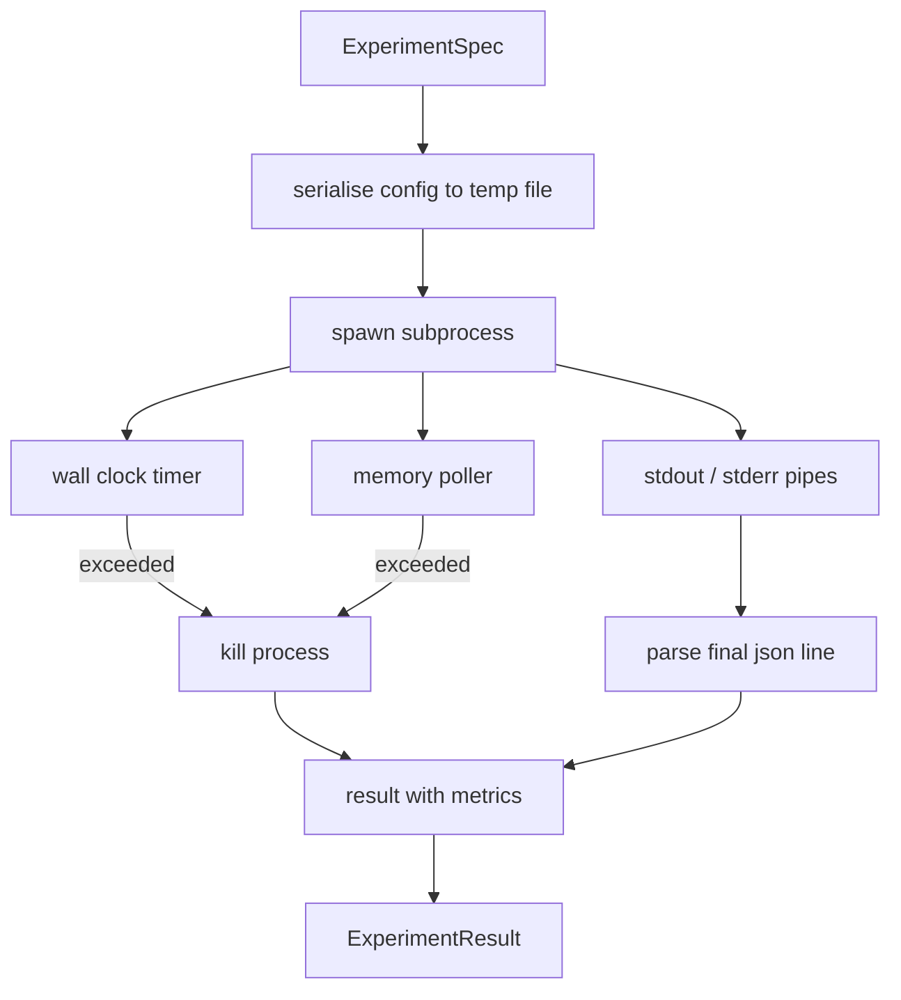

# Coureur expérimental

> Le degré d'intégrité de la boucle dépend de ses mesures.

**Type:** Build
**Languages:** Python
**Prerequisites:** Phase 19 Track A lessons 20-29
**Time:** ~90 分钟

## Objectifs d'apprentissage
- L'expérience est codée en un type spécifique, le coureur peut la sérialiser en un sous-processus.
- En cas de décalage de temps et de capsule de mémoire douce, vous serez exposé à des conditions terminales.
- Pour obtenir un résultat unique, il faut une analyse de la valeur de la valeur de l'échantillon.
- Construire une table d'ablation, dans la spécification de base fixe 上一次扫一个配置按
-  lorsque la semence est déterminée, que chaque résultat reste déterministe, de sorte que l'évaluateur voit le même nombre dans plusieurs opérations

## Pourquoi utiliser un sous-processus

La recherche loop 会运行 untrusted code──hypothèse provenant du modèle, du script de l'expérience provient également du même chemin;把任一任任任任一当作安全的过程中代码,都在等待一次会拖管弦乐器的崩──Subprocesses sont l'isolement le plus simple de la langue elle-même: un processus indépendant、un espace d'adresse indépendant, ainsi que la poignée de signal du côté parent──

Il n'y a pas de cgroup, pas de filtre de séquence, pas de réaménagement de l'espace de nom. Il possède un délai de temps de montres murales, utilisé pour vérifier la croissance de la mémoire, ainsi que le chemin de la mise à mort du processus de finition en haut de la limite.

## ExperimentSpec 形状

```text
ExperimentSpec
  spec_id        : str            (stable id，"exp_001")
  hypothesis_id  : int            (链接回 lesson 50 中的 queue)
  script_path    : str            (要运行的 python script 路径)
  config         : dict           (作为一个 json arg 传给 script)
  seed           : int            (experiment 的 deterministic seed)
  wall_timeout_s : float          (hard timeout，超出则 kill)
  memory_cap_mb  : int            (soft cap，轮询；超出则 kill)
  metric_keys    : list[str]      (evaluator 会读取的字段)
```

Le script est sur le disque; le coureur va le configurer, écrire dans un chemin de fichier temporaire, le script le lire à nouveau.`metric_keys`Le contenu de l'ensemble supérieur est capturé, mais le parseur de métriques l'ignore.


```figure
cg-runner-limits
```

## Architecture



runner est une classe, avec une méthode principale. poller est un petit fil, chaque intervalle de sondage se lève une fois, et est disponible à partir du système de fichiers proc.`psutil`équivalent; lorsque le platform ne le révèle pas, il est exclu.

## Pourquoi une capsule de mémoire douce ?

Caps de mémoire dure 需要 `resource.setrlimit`, et seulement dans POSIX 上工作。本课提供一种 approche portable: depuis la taille du groupe de résidents de la plateforme de la demande, si elle dépasse le cap, elle tue le sous-processus。cap est doux, car le sondage a un intervalle non-zéro; le processus peut augmenter jusqu'au cap entre les deux sessions de demande, puis revenir en arrière。runner 会记录 observé le maximum RSS, de sorte que l'évaluateur peut voir cette fois la course 离限 有多近──

Dans le système sans support d'inspection de processus, le polisseur enregistrera un avertissement unique et ne s'arrêtera pas à lui-même.

##  Capture stdout 和 stderr

courrier 会在完成时读取并排空两条管──Stdout 会逐行扫描; dernier capable de résoudre pour json 且包含所有必需的`metric_keys`Les lignes de json seront considérées comme des blocs métriques.`intermediate_metrics`L'évaluateur peut les utiliser pour tracer des courbes d'apprentissage.

Le code de sortie ne sera jamais augmenté en raison du code de sortie non-zero; il mettra le code en résultat enregistreur en résultat.`"crash"`Même si le script imprime des métriques, l'évaluateur accepte par défaut de fonctionner partiellement.

## Tableau d'ablation

```python
def ablate(base: ExperimentSpec, knob: str, values: list[Any]) -> list[ExperimentSpec]:
    ...
```

给定基特征 和按名称,该助手会返回每个值对应的一个特征,并覆盖 `config[knob]`Chaque espèce de ville obtiendra une émission.`spec_id`(le secteur de l'énergie)`f"{base.spec_id}_{knob}_{value}"`Un coureur`AblationRunner`, selon l'ordre de ces spécifications, et retourner une valeur de bouton comme clé de `AblationTable`Il y a une autre.

Pourquoi une fois seulement changer un bouton. Les balais factuels complets augmentent, et produisent un évaluateur.

## Déterminisme

Chaque spec porte une graine. Le coureur va passer par le dicton de configuration.`config["__seed"] = spec.seed`)。`code/experiments/`Les scripts d'expérience moqueuses de l'école moyenne seront classés en deux groupes de deux groupes de trois groupes de trois groupes de trois groupes de trois groupes de cinq groupes de cinq groupes de cinq groupes de cinq groupes de cinq groupes de cinq groupes de cinq groupes de cinq groupes de cinq groupes de cinq groupes de cinq groupes de cinq groupes de cinq groupes de cinq groupes de cinq groupes de cinq groupes de cinq groupes de cinq groupes de cinq groupes de cinq groupes de cinq groupes de cinq groupes de cinq groupes de cinq groupes de cinq groupes de cinq groupes de cinq groupes de cinq groupes de cinq groupes de cinq groupes de cinq groupes de cinq groupes de cinq groupes de cinq groupes de cinq groupes de cinq groupes de cinq groupes de cinq groupes de cinq groupes de cinq groupes de cinq groupes de cinq groupes de cinq groupes de cinq groupes de cinq groupes de cinq groupes de cinq groupes de cinq groupes de cinq groupes de cinq groupes de cinq groupes de cinq groupes de cinq groupes de cinq groupes de cinq groupes de cinq groupes de cinq groupes de cinq groupes de cinq groupes de cinq groupes de cinq groupes de cinq groupes de cinq groupes de cinq groupes de cinq groupes de cinq groupes de cinq groupes de cinq groupes de cinq groupes de cinq groupes de cinq groupes de cinq groupes de cinq groupes de cinq groupes de cinq groupes de cinq groupes de cinq groupes de cinq groupes de cinq groupes de cinq groupes de cinq groupes de cinq groupes de cinq groupes de cinq groupes de cinq groupes de cinq groupes de cinq groupes de cinq groupes de cinq groupes de cinq groupes de cinq groupes de cinq groupes de cinq groupes de cinq groupes de cinq groupes de cinq groupes de cinq groupes de cinq groupes de cinq groupes de cinq groupes de cinq groupes de cinq groupes de cinq groupes de cinq groupes de cinq groupes de groupes de cinq groupes de cinq groupes de groupes de groupes de cinq groupes de groupes de cinq groupes de groupes de groupes de cinq groupes de groupes de groupes de groupes de groupes de cinq groupes de groupes de groupes de groupes de groupes de groupes de groupes de cinq groupes de groupes de cinq groupes de groupes de groupes de groupes de groupes de groupes de groupes de groupes de groupes de groupes de groupes de groupes de groupes de groupes de groupes de groupes de groupes de groupes de groupes de groupes de groupes de groupes de groupes de groupes de groupes de groupes de groupes de groupes de groupes de groupes de groupes de groupes de groupes de groupes de groupes de groupes de groupes de groupes de groupes de groupes de groupes de groupes de groupes de groupes de groupes de groupes de groupes de groupes de groupes de groupes

## Scénario d'expérience de simulation

Le cours propose un script expérimental:`code/experiments/sparsity_experiment.py`▽It est un vrai script, va lire son propre fichier de configuration, utiliser un passe aléatoire numpy 模拟一个小型训练运行,并打印一个json metrics blob──script 支持 `sleep_s`Le bouton utilise des délais de test, également soutenu `allocate_mb`Le bouton utilise le polérateur de mémoire.

La simulation n'a pas vraiment entraîné quoi que ce soit. C'est un calcul numérique, simulé à la forme d'un boucle de formation: courbe de perte, perplexité finale, temps de paroi.

## Résultat 形状

```text
ExperimentResult
  spec_id              : str
  hypothesis_id        : int
  exit_code            : int
  terminal             : "ok" | "timeout" | "oom" | "crash"
  wall_time_s          : float
  peak_rss_mb          : float | None
  metrics              : dict
  intermediate_metrics : list[dict]
  stdout_tail          : str
  stderr_tail          : str
```

évaluateur 会先读取 `metrics`et `terminal`Si le terminal n'est pas`"ok"`,expérience comptabilité pour une course ratée,verdit de l'évaluateur,production automatique.

## Comment lire la code

`code/main.py` définit `ExperimentSpec`- Je suis là.`ExperimentResult`- Je suis là.`ExperimentRunner`- Je suis là.`AblationRunner`和一个决定性演示――子进程管理 是一个类――memory poller 是一个小线――ablation helper 是一个单独函数――

`code/experiments/sparsity_experiment.py`Il est utilisé pour tester une moqueuse. Il est utilisé pour lire le chemin du fichier de configuration et écrire une seule ligne de métriques.

`code/tests/test_runner.py`覆盖成功路、timeout路、crash path、ablation table, ainsi que vérifier le déterminisme des traversées de deux runs。

## Il est en position

Leçon cinquante 生成假设──L'enseignement cinquante-un 过掉文献 已解决的内容──L'enseignement cinquante-deux 针对剩余部分运行实验──L'enseignement cinquante-trois 读取结果,运行意义测试,并写出管家机 存储到假设 id 上的判决──
