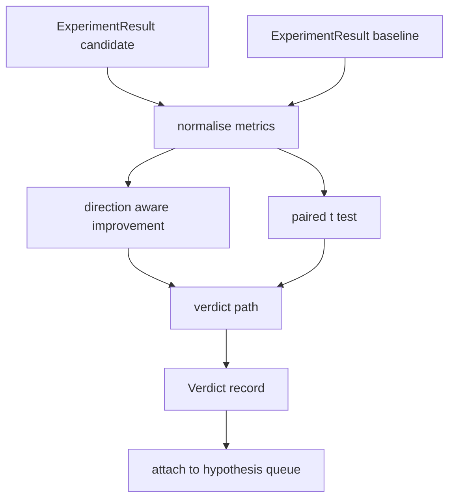

# 结果评估器

> Le coureur 产出数字──évaluateur 判断这些数字代表改进、退缩,还是噪音──构建一条判决 路径,把 metrics 转换成一句结论──

**Type:** Build
**Languages:** Python
**Prerequisites:** Phase 19 Track A lessons 20-29
**Time:** ~90 minutes

## Objectifs d'apprentissage
- Utilisation de la direction et de la mise en place du seuil, le candidat sera en cours de course avec la ligne de base  comparer 
- De la tête à chaque graine de métriques de l'essai de t parallèle,并读取得到的 p值──
- Pour les métriques à l'échelle de journaux, faites une normalisation, laissez-le faire, vous pouvez les mélanger avec les métriques linéaires.
- Pour chaque hypothèse, le juge peut ajouter la quarantaine.
- Que chaque pas reste pur, et que les mêmes entrées produisent toujours le même verdict.

## Pourquoi un test par paires

Le même nombre donné par le coureur ne peut pas indiquer si la variation est vraie. La même configuration pour changer une graine obtiendra une perplexité différente. La variation peut être simplement bruyante. La méthode de comparaison correcte est parallèle: les mêmes graines, les mêmes données, une fois avec le candidat, une fois avec la ligne de base. Chaque graine contribue à une différence.

Le cours est en cours de réalisation.`scipy.stats`Les mathématiques sont assez petites, une émission est terminée.

```text
diffs    = [a_i - b_i for i in seeds]
mean     = sum(diffs) / n
variance = sum((d - mean) ** 2 for d in diffs) / (n - 1)
t_stat   = mean / sqrt(variance / n)
df       = n - 1
p_value  = two_sided_p(t_stat, df)
```

La valeur de p de deux côtés Utilise la fonction bêta incomplète régulière.

## Amélioration de la direction

Certaines métriques 变大时表示改进( précision、roughput)  D'autres 变小时表示改进(perte、perplexité、 temps de paroi)  évaluateur dans chaque métrique 带带一个 `direction`Je suis en train de vous dire:

```text
if direction == "higher_is_better":
    improvement = (candidate - baseline) / abs(baseline)
elif direction == "lower_is_better":
    improvement = (baseline - candidate) / abs(baseline)
```

L'amélioration est une meilleure métrique pour les plus hauts, l'amélioration négative indique le candidat, plus différent, plus différent.

Un seuil fixe`improvement_threshold=0.02`, %s de 2) décide si la variation est suffisamment grande, on peut en juger.


```figure
cg-paired-verdict
```

## Architecture



l'évaluateur 运行三个独立计算, et le verdict 路径中把它们合并──每个计算都是没有共享状态的纯函数──

## Normalisation du journal

La perplexité par rapport aux pertes est une relation de l'indice. La perte est inférieure à 0,1 et la perplexité est très faible.

Le cours sera suivi`scale`字段为 `"log"`De toute métrique dans le calcul amélioration de la précédente prendre log. seuil.`log(28) - log(32) = -0.133`, bien au-dessus du seuil de deux pour cent.

```text
if scale == "log":
    a = log(candidate)
    b = log(baseline)
else:
    a = candidate
    b = baseline
```

`scale="linear"`(默认) des métriques vont sauter cette transformation.

## Test par semence par paires

Le coureur de la cinquante-deuxième classe va faire une mise en place de chaque course. Pour le test parallèle, l'évaluateur a besoin de candidats. Chaque semence, une mise en place, une mise en place. Chaque semence, une mise en place.`ExperimentResult`Les dossiers sont transmis à l'évaluateur.

évaluateur  selon les semences 配对                                                                                                                                                                                                                                                                                                                                                                                                                                                                                                                    `result.metrics["seed"]`), puis traverser la métrique de la demande. Si les deux groupes de la liste ne correspondent pas, l'évaluateur va se retirer.`PairingError`L'orchestre doit être réutilisé.

## La forme du verdict

```text
Verdict
  hypothesis_id          : int
  metric                 : str
  direction              : "higher_is_better" | "lower_is_better"
  scale                  : "linear" | "log"
  candidate_mean         : float
  baseline_mean          : float
  improvement            : float       (signed, fraction; see direction rules)
  p_value                : float | None  (None if n < 2)
  significance_threshold : float
  improvement_threshold  : float
  verdict                : "improved" | "regressed" | "noise" | "failed"
  rationale              : str
```

Le verdict 路径 est une petite table de décisions:

```text
1. If any candidate result has terminal != "ok": verdict = "failed"
2. else if |improvement| < improvement_threshold:  verdict = "noise"
3. else if p_value is None or p_value > significance: verdict = "noise"
4. else if improvement > 0:                          verdict = "improved"
5. else:                                             verdict = "regressed"
```

La raison est une phrase lisible par l'homme, l'orchestre peut la rendre selon l'hypothèse id 记录到log。

## Comment lire le code

`code/main.py` définit `MetricSpec`- Je suis là.`Verdict`- Je suis là.`Evaluator`、t statistique 和 incomplet beta helpers, ainsi qu'un test démographique déterministe ⋅t test utilisé purement stdlib math 实现;numpy seulement utilisé pour lire la liste des métriques 并计算 mean 和 variances。

`code/tests/test_evaluator.py`覆盖 verbeterd 路径、regressed 路径、noise 路径(小改善)、noise 路径(低 n)、failed terminal 路径、log normalized 路径、与已知参考值对比的 t test,以及对对错──

## Où cette fente dans

第五十二课产 出了假设队列──第五十一课过掉文献 已有定论的内容──第五十二课在多种种上用候选人和基线 配置运行实验──第五十三课读取这些运行并写出判决──乐队主持人 把四者合在一起:

```text
for hypothesis in queue:
    literature = retrieval.search(hypothesis.text)
    if literature_settles(hypothesis, literature):
        attach(hypothesis, verdict="settled")
        continue
    candidates = runner.run_all(specs_for(hypothesis))
    baselines  = runner.run_all(baseline_specs_for(hypothesis))
    metric_spec = MetricSpec("perplexity", direction=LOWER, scale=LOG)
    verdict = evaluator.evaluate(hypothesis.id, metric_spec, candidates, baselines)
    attach(hypothesis, verdict)
```

Cet orchestrateur n'est pas dans cette classe; cette classe passe par des classes de données définies individuellement, sans avoir besoin de collage supplémentaire.
